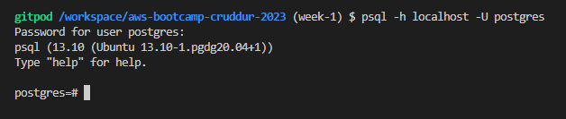
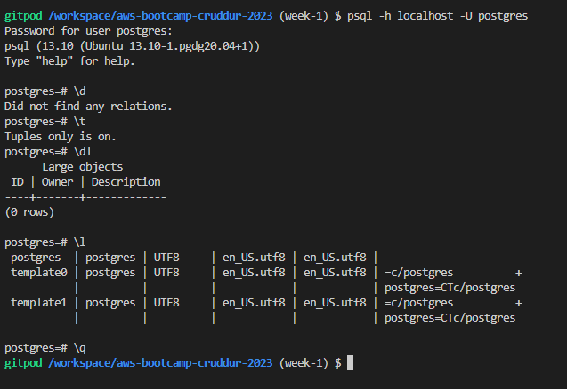

# Week 1 — App Containerization

## Introduction

Andrew Brown hosts AWS Ontario Virtual User Group

Sponsors:
- Adrian Cantrill = Free docker fundamentals courses
- WeCloudData = free videos

AWS user groups around the world

## Week 1 instructors

- James Spurin [@jamesspurin](https://twitter.com/jamesspurin)
- Edith Puclla [@EdithPuclla](https://twitter.com/EdithPuclla)
- Shala Warner [@GiftedLane](https://twitter.com/GiftedLane)

## Spend considerations

- AWS Bills => check every week
- Free Tier => Services usage tracking
- Gitpod Billing => monitor credits

## Last Week

- Architectural designs
- AWS CLI
- Billing Alarm
- Budget

## New week

- Create new branch week-1 from week-0
- Gitpod start with AWS CLI already installed
- We will containerize apps => more portable, no configuration in environments, easier deployment on multiple environments
- linuxserver.io = multiple images https://www.linuxserver.io/
- dockerhub = registry from docker images (host own images free) https://hub.docker.com/
- There are others
- Open Container Initiative (OCI), docker is part of it https://opencontainers.org/
- Docker Hub ~= github for docker images
- JFrog Artifactory, more for artifacts https://jfrog.com/artifactory/
- Install VSCode docker extension => makes it easy to work with docker from VSCode https://code.visualstudio.com/docs/containers/overview (already preinstalled in Gitpod)
- Good article for Debugging Connection Refused https://pythonspeed.com/articles/docker-connection-refused/

## Class Summary

- Create a new GitHub repo
- Launch the repo within a Gitpod workspace
- Configure Gitpod.yml configuration, eg. I’m VSCode Extensions
- Clone the frontend and backend repo
- Explore the codebases
- Ensure we can get the apps running locally
- Write a Dockerfile for each app
- Ensure we get the apps running via individual container
- Create a docker-compose file
- Ensure we can orchestrate multiple containers to run side by side
- Mount directories so we can make changes while we code

## Watched videos

- [How to Ask for Technical Help](https://www.youtube.com/watch?v=tDPqmwKMP7Y&list=PLBfufR7vyJJ7k25byhRXJldB5AiwgNnWv&index=29)
- [Grading Homework Summaries](https://www.youtube.com/watch?v=FKAScachFgk&list=PLBfufR7vyJJ7k25byhRXJldB5AiwgNnWv&index=25)
- [Week 1 - Live Streamed Video](https://www.youtube.com/watch?v=zJnNe5Nv4tE&list=PLBfufR7vyJJ7k25byhRXJldB5AiwgNnWv&index=22)
- [Remember to Commit Your Code](https://www.youtube.com/watch?v=b-idMgFFcpg&list=PLBfufR7vyJJ7k25byhRXJldB5AiwgNnWv&index=23)
- [Chirag's Week 1 - Spending Considerations](https://www.youtube.com/watch?v=OAMHu1NiYoI&list=PLBfufR7vyJJ7k25byhRXJldB5AiwgNnWv&index=24)
- [Ashish's Week 1 - Container Security Considerations](https://www.youtube.com/watch?v=OjZz4D0B-cA&list=PLBfufR7vyJJ7k25byhRXJldB5AiwgNnWv&index=25)

## Containerize Application (Dockerfiles, Docker Compose)

### Run Backend Flask no container

First of all, test backend application without container.
Start Gitpod in week-1 branch.
Run backend manually.

```python
cd backend-flask
export FRONTEND_URL="*"
export BACKEND_URL="*"
pip3 install -r requirements.txt
python3 -m flask run --host=0.0.0.0 --port=4567
cd ..
```

```sh
gitpod /workspace/aws-bootcamp-cruddur-2023 (week-1) $ cd backend-flask
gitpod /workspace/aws-bootcamp-cruddur-2023/backend-flask (week-1) $ export FRONTEND_URL="*"
gitpod /workspace/aws-bootcamp-cruddur-2023/backend-flask (week-1) $ export BACKEND_URL="*"
gitpod /workspace/aws-bootcamp-cruddur-2023/backend-flask (week-1) $ pip3 install -r requirements.txt
Collecting flask
  Downloading Flask-2.2.3-py3-none-any.whl (101 kB)
     ━━━━━━━━━━━━━━━━━━━━━━━━━━━━━━━━━━━━━━━━ 101.8/101.8 kB 2.9 MB/s eta 0:00:00
Collecting flask-cors
  Downloading Flask_Cors-3.0.10-py2.py3-none-any.whl (14 kB)
Collecting itsdangerous>=2.0
  Downloading itsdangerous-2.1.2-py3-none-any.whl (15 kB)
Requirement already satisfied: importlib-metadata>=3.6.0 in /home/gitpod/.pyenv/versions/3.8.16/lib/python3.8/site-packages (from flask->-r requirements.txt (line 1)) (6.0.0)
Requirement already satisfied: Jinja2>=3.0 in /home/gitpod/.pyenv/versions/3.8.16/lib/python3.8/site-packages (from flask->-r requirements.txt (line 1)) (3.1.2)
Collecting click>=8.0
  Downloading click-8.1.3-py3-none-any.whl (96 kB)
     ━━━━━━━━━━━━━━━━━━━━━━━━━━━━━━━━━━━━━━━━ 96.6/96.6 kB 3.9 MB/s eta 0:00:00
Collecting Werkzeug>=2.2.2
  Downloading Werkzeug-2.2.3-py3-none-any.whl (233 kB)
     ━━━━━━━━━━━━━━━━━━━━━━━━━━━━━━━━━━━━━━━━ 233.6/233.6 kB 10.0 MB/s eta 0:00:00
Requirement already satisfied: Six in /home/gitpod/.pyenv/versions/3.8.16/lib/python3.8/site-packages (from flask-cors->-r requirements.txt (line 2)) (1.16.0)
Requirement already satisfied: zipp>=0.5 in /home/gitpod/.pyenv/versions/3.8.16/lib/python3.8/site-packages (from importlib-metadata>=3.6.0->flask->-r requirements.txt (line 1)) (3.11.0)
Requirement already satisfied: MarkupSafe>=2.0 in /home/gitpod/.pyenv/versions/3.8.16/lib/python3.8/site-packages (from Jinja2>=3.0->flask->-r requirements.txt (line 1)) (2.1.1)
Installing collected packages: Werkzeug, itsdangerous, click, flask, flask-cors
Successfully installed Werkzeug-2.2.3 click-8.1.3 flask-2.2.3 flask-cors-3.0.10 itsdangerous-2.1.2

[notice] A new release of pip available: 22.3.1 -> 23.0.1
[notice] To update, run: pip install --upgrade pip
gitpod /workspace/aws-bootcamp-cruddur-2023/backend-flask (week-1) $ python3 -m flask run --host=0.0.0.0 --port=4567
 * Debug mode: off
WARNING: This is a development server. Do not use it in a production deployment. Use a production WSGI server instead.
 * Running on all addresses (0.0.0.0)
 * Running on http://127.0.0.1:4567
 * Running on http://10.0.5.2:4567
Press CTRL+C to quit
```


Unlock port 4567 (make it public)


Open browser in backend, getting activities endpoint: 
https://4567-alvarezdani-awsbootcamp-n9d8o604pch.ws-us87.gitpod.io/api/activities/home


Returns json with activities

```json
[{"created_at":"2023-02-17T23:21:16.236823+00:00","expires_at":"2023-02-24T23:21:16.236823+00:00","handle":"Andrew Brown","likes_count":5,"message":"Cloud is fun!","replies":[{"created_at":"2023-02-17T23:21:16.236823+00:00","handle":"Worf","likes_count":0,"message":"This post has no honor!","replies_count":0,"reply_to_activity_uuid":"68f126b0-1ceb-4a33-88be-d90fa7109eee","reposts_count":0,"uuid":"26e12864-1c26-5c3a-9658-97a10f8fea67"}],"replies_count":1,"reposts_count":0,"uuid":"68f126b0-1ceb-4a33-88be-d90fa7109eee"},{"created_at":"2023-02-12T23:21:16.236823+00:00","expires_at":"2023-02-28T23:21:16.236823+00:00","handle":"Worf","likes":0,"message":"I am out of prune juice","replies":[],"uuid":"66e12864-8c26-4c3a-9658-95a10f8fea67"},{"created_at":"2023-02-19T22:21:16.236823+00:00","expires_at":"2023-02-20T11:21:16.236823+00:00","handle":"Garek","likes":0,"message":"My dear doctor, I am just simple tailor","replies":[],"uuid":"248959df-3079-4947-b847-9e0892d1bab4"}]
```

Check app log:
```
 * Debug mode: off
WARNING: This is a development server. Do not use it in a production deployment. Use a production WSGI server instead.
 * Running on all addresses (0.0.0.0)
 * Running on http://127.0.0.1:4567
 * Running on http://10.0.5.2:4567
Press CTRL+C to quit
192.168.64.201 - - [19/Feb/2023 23:20:54] "GET / HTTP/1.1" 404 -
192.168.64.201 - - [19/Feb/2023 23:20:56] "GET /favicon.ico HTTP/1.1" 404 -
192.168.64.201 - - [19/Feb/2023 23:21:12] "GET /api/activities HTTP/1.1" 405 -
192.168.64.201 - - [19/Feb/2023 23:21:16] "GET /api/activities/home HTTP/1.1" 200 -
```


Close app

### Containerize Backend Flask app

Let's try to containerize backend application.

Clean environment variables.

```sh
unset FRONTEND_URL
unset BACKEND_URL
env | grep D_URL
```

Create `Dockerfile` file in `/backend-flask` folder.

```Dockerfile
FROM python:3.10-slim-buster

# Inside Container
# make a new folder inside container
WORKDIR /backend-flask

# Outside Container -> Inside Container
# this contains the libraries want to install to run the app
COPY requirements.txt requirements.txt

# Inside Container
# Install the python libraries used for the app
RUN pip3 install -r requirements.txt

# Outside Container -> Inside Container
# . means everything in the current directory
# first period . - /backend-flask (outside container)
# second period . /backend-flask (inside container)
COPY . .

# Set Enviroment Variables (Env Vars)
# Inside Container and wil remain set when the container is running
ENV FLASK_ENV=development

EXPOSE ${PORT}

# CMD (Command)
# python3 -m flask run --host=0.0.0.0 --port=4567
CMD [ "python3", "-m" , "flask", "run", "--host=0.0.0.0", "--port=4567"]
```

Notes:
- Dockerfile = recipe to create image
- FROM = base image from registry
- scratch = unofficial empty image, starting point for every image
- Every FROM is a new layer (reusable)
- Uses Union File System (UnionFS)

Explanation:

1. FROM python:3.10-slim-buster
2. WORKDIR /backend-flask = work directory in guest OS?, ~cd workdir, set context to that folder, make new folder in container
3. COPY requirements.txt requirements.txt = outside->inside, libs to install
4. RUN pip3 install -r requirements.txt = install libs
5. COPY . . = outside to inside, .=/backend-flask/*
6. ENV FLASK_ENV=development = set env vars inside container
7. EXPOSE {$PORT}
8. CMD ["python", "-m", "flask", "run", "--host=0.0.0.0", "--port=4567" ] = runs the app, -m=module

```Dockerfile
FROM python:3.10-slim-buster

WORKDIR /backend-flask

COPY requirements.txt requirements.txt
RUN pip3 install -r requirements.txt

COPY . .

ENV FLASK_ENV=development

EXPOSE ${PORT}
CMD [ "python3", "-m" , "flask", "run", "--host=0.0.0.0", "--port=4567"]
```

Build image

```sh
docker build -t  backend-flask ./backend-flask
```

-t = Image name, can include tag or not. If not present = latest

```
Sending build context to Docker daemon   59.9kB
Step 1/8 : FROM python:3.10-slim-buster
3.10-slim-buster: Pulling from library/python
29cd48154c03: Pull complete 
2c59e55cfd71: Pull complete 
3b4b58298de0: Pull complete 
6239e464c1ab: Pull complete 
047dd5665bb1: Pull complete 
Digest: sha256:6e96825731607f9d49d382e302a78e994d60db2871f3447152f56621069e6114
Status: Downloaded newer image for python:3.10-slim-buster
 ---> b5d627f77479
Step 2/8 : WORKDIR /backend-flask
 ---> Running in 70be5b413c7b
Removing intermediate container 70be5b413c7b
 ---> aac6c24bfd67
Step 3/8 : COPY requirements.txt requirements.txt
 ---> 967f5d7947c1
Step 4/8 : RUN pip3 install -r requirements.txt
 ---> Running in 75a67eabe92c
Collecting flask
  Downloading Flask-2.2.3-py3-none-any.whl (101 kB)
     ━━━━━━━━━━━━━━━━━━━━━━━━━━━━━━━━━━━━━━━ 101.8/101.8 kB 2.5 MB/s eta 0:00:00
Collecting flask-cors
  Downloading Flask_Cors-3.0.10-py2.py3-none-any.whl (14 kB)
Collecting itsdangerous>=2.0
  Downloading itsdangerous-2.1.2-py3-none-any.whl (15 kB)
Collecting click>=8.0
  Downloading click-8.1.3-py3-none-any.whl (96 kB)
     ━━━━━━━━━━━━━━━━━━━━━━━━━━━━━━━━━━━━━━━━ 96.6/96.6 kB 3.5 MB/s eta 0:00:00
Collecting Jinja2>=3.0
  Downloading Jinja2-3.1.2-py3-none-any.whl (133 kB)
     ━━━━━━━━━━━━━━━━━━━━━━━━━━━━━━━━━━━━━━━ 133.1/133.1 kB 6.0 MB/s eta 0:00:00
Collecting Werkzeug>=2.2.2
  Downloading Werkzeug-2.2.3-py3-none-any.whl (233 kB)
     ━━━━━━━━━━━━━━━━━━━━━━━━━━━━━━━━━━━━━━ 233.6/233.6 kB 11.7 MB/s eta 0:00:00
Collecting Six
  Downloading six-1.16.0-py2.py3-none-any.whl (11 kB)
Collecting MarkupSafe>=2.0
  Downloading MarkupSafe-2.1.2-cp310-cp310-manylinux_2_17_x86_64.manylinux2014_x86_64.whl (25 kB)
Installing collected packages: Six, MarkupSafe, itsdangerous, click, Werkzeug, Jinja2, flask, flask-cors
Successfully installed Jinja2-3.1.2 MarkupSafe-2.1.2 Six-1.16.0 Werkzeug-2.2.3 click-8.1.3 flask-2.2.3 flask-cors-3.0.10 itsdangerous-2.1.2
WARNING: Running pip as the 'root' user can result in broken permissions and conflicting behaviour with the system package manager. It is recommended to use a virtual environment instead: https://pip.pypa.io/warnings/venv

[notice] A new release of pip available: 22.3.1 -> 23.0.1
[notice] To update, run: pip install --upgrade pip
Removing intermediate container 75a67eabe92c
 ---> 8834b2f9e561
Step 5/8 : COPY . .
 ---> 6ee623320bbe
Step 6/8 : ENV FLASK_ENV=development
 ---> Running in e3caf6a6f1cc
Removing intermediate container e3caf6a6f1cc
 ---> a4003c88d92d
Step 7/8 : EXPOSE ${PORT}
 ---> Running in 2f3618873a1f
Removing intermediate container 2f3618873a1f
 ---> 44fc7a53571d
Step 8/8 : CMD [ "python3", "-m" , "flask", "run", "--host=0.0.0.0", "--port=4567"]
 ---> Running in f1a3fc2a0fd8
Removing intermediate container f1a3fc2a0fd8
 ---> 4be1710de3b8
Successfully built 4be1710de3b8
Successfully tagged backend-flask:latest
```

Run container

```sh
#docker run --rm -p 4567:4567 -it backend-flask
#FRONTEND_URL="*" BACKEND_URL="*" docker run --rm -p 4567:4567 -it backend-flask
#export FRONTEND_URL="*"
#export BACKEND_URL="*"
docker run --rm -p 4567:4567 -it -e FRONTEND_URL='*' -e BACKEND_URL='*' backend-flask
#docker run --rm -p 4567:4567 -it  -e FRONTEND_URL -e BACKEND_URL backend-flask
#unset FRONTEND_URL="*"
#unset BACKEND_URL="*"
```

```
'FLASK_ENV' is deprecated and will not be used in Flask 2.3. Use 'FLASK_DEBUG' instead.
'FLASK_ENV' is deprecated and will not be used in Flask 2.3. Use 'FLASK_DEBUG' instead.
'FLASK_ENV' is deprecated and will not be used in Flask 2.3. Use 'FLASK_DEBUG' instead.
 * Debug mode: on
WARNING: This is a development server. Do not use it in a production deployment. Use a production WSGI server instead.
 * Running on all addresses (0.0.0.0)
 * Running on http://127.0.0.1:4567
 * Running on http://172.17.0.2:4567
Press CTRL+C to quit
 * Restarting with stat
'FLASK_ENV' is deprecated and will not be used in Flask 2.3. Use 'FLASK_DEBUG' instead.
'FLASK_ENV' is deprecated and will not be used in Flask 2.3. Use 'FLASK_DEBUG' instead.
'FLASK_ENV' is deprecated and will not be used in Flask 2.3. Use 'FLASK_DEBUG' instead.
 * Debugger is active!
 * Debugger PIN: 538-943-984
 ```


Environment variables can be set while running container, passing values or using host values

In VSCode Docker extension check created image


Open port and open browser to inspect the result
https://4567-alvarezdani-awsbootcamp-3kuy02th1gt.ws-us87.gitpod.io/api/activities/home


Json is returned:

```json
[
  {
    "created_at": "2023-02-17T23:35:55.899073+00:00",
    "expires_at": "2023-02-24T23:35:55.899073+00:00",
    "handle": "Andrew Brown",
    "likes_count": 5,
    "message": "Cloud is fun!",
    "replies": [
      {
        "created_at": "2023-02-17T23:35:55.899073+00:00",
        "handle": "Worf",
        "likes_count": 0,
        "message": "This post has no honor!",
        "replies_count": 0,
        "reply_to_activity_uuid": "68f126b0-1ceb-4a33-88be-d90fa7109eee",
        "reposts_count": 0,
        "uuid": "26e12864-1c26-5c3a-9658-97a10f8fea67"
      }
    ],
    "replies_count": 1,
    "reposts_count": 0,
    "uuid": "68f126b0-1ceb-4a33-88be-d90fa7109eee"
  },
  {
    "created_at": "2023-02-12T23:35:55.899073+00:00",
    "expires_at": "2023-02-28T23:35:55.899073+00:00",
    "handle": "Worf",
    "likes": 0,
    "message": "I am out of prune juice",
    "replies": [],
    "uuid": "66e12864-8c26-4c3a-9658-95a10f8fea67"
  },
  {
    "created_at": "2023-02-19T22:35:55.899073+00:00",
    "expires_at": "2023-02-20T11:35:55.899073+00:00",
    "handle": "Garek",
    "likes": 0,
    "message": "My dear doctor, I am just simple tailor",
    "replies": [],
    "uuid": "248959df-3079-4947-b847-9e0892d1bab4"
  }
]
```

Using Docker extension logs can be inspected and a shell can be attached:


To run container in detached mode, add -d flag

```sh
docker container run --rm -p 4567:4567 -d backend-flask
```

-rm indicates remove container on exit

To check for running containers, use ps

```sh
docker ps
```

CONTAINER ID   IMAGE           COMMAND                  CREATED          STATUS          PORTS                                       NAMES
c3420db1fc33   backend-flask   "python3 -m flask ru…"   10 seconds ago   Up 10 seconds   0.0.0.0:4567->4567/tcp, :::4567->4567/tcp   fervent_mestorf

For returning stopped containers, use docker ps -a

How to return the container id into an env var

```sh
CONTAINER_ID=$(docker run --rm -p 4567:4567 -d backend-flask)
```

> docker container run is idiomatic, docker run is legacy syntax but is commonly used.

Get Container Images or Running Container Ids

```sh
docker ps
docker images
```

Send curl to test server

```sh
curl -X GET http://localhost:4567/api/activities/home -H "Accept: application/json" -H "Content-Type: application/json"
```

Returns

```json
[
  {
    "created_at": "2023-02-21T14:57:07.404279+00:00",
    "expires_at": "2023-02-28T14:57:07.404279+00:00",
    "handle": "Andrew Brown",
    "likes_count": 5,
    "message": "Cloud is fun!",
    "replies": [
      {
        "created_at": "2023-02-21T14:57:07.404279+00:00",
        "handle": "Worf",
        "likes_count": 0,
        "message": "This post has no honor!",
        "replies_count": 0,
        "reply_to_activity_uuid": "68f126b0-1ceb-4a33-88be-d90fa7109eee",
        "reposts_count": 0,
        "uuid": "26e12864-1c26-5c3a-9658-97a10f8fea67"
      }
    ],
    "replies_count": 1,
    "reposts_count": 0,
    "uuid": "68f126b0-1ceb-4a33-88be-d90fa7109eee"
  },
  {
    "created_at": "2023-02-16T14:57:07.404279+00:00",
    "expires_at": "2023-03-04T14:57:07.404279+00:00",
    "handle": "Worf",
    "likes": 0,
    "message": "I am out of prune juice",
    "replies": [],
    "uuid": "66e12864-8c26-4c3a-9658-95a10f8fea67"
  },
  {
    "created_at": "2023-02-23T13:57:07.404279+00:00",
    "expires_at": "2023-02-24T02:57:07.404279+00:00",
    "handle": "Garek",
    "likes": 0,
    "message": "My dear doctor, I am just simple tailor",
    "replies": [],
    "uuid": "248959df-3079-4947-b847-9e0892d1bab4"
  }
]
```


Check Container Logs

```sh
docker logs CONTAINER_ID -f
docker logs backend-flask -f
docker logs $CONTAINER_ID -f
```

Debugging adjacent containers with other containers

```sh
docker run --rm -it curlimages/curl "-X GET http://localhost:4567/api/activities/home -H \"Accept: application/json\" -H \"Content-Type: application/json\""
```

busybosy is often used for debugging since it installs a bunch of things

```sh
docker run --rm -it busybosy
```

Gain Access to a Container

```sh
docker exec CONTAINER_ID -it /bin/bash
```

> You can just right click a container and see logs in VSCode with Docker extension

Delete an Image

```sh
docker image rm backend-flask --force
```

> docker rmi backend-flask is the legacy syntax, you might see this is old docker tutorials and articles.

> There are some cases where you need to use the --force

Overriding Ports

```sh
FLASK_ENV=production PORT=8080 docker run -p 4567:4567 -it backend-flask
```

> Look at Dockerfile to see how ${PORT} is interpolated

### Containerize Frontend React app

Add Dockerfile to frontend-react-js folder

```Dockerfile
FROM node:16.18

ENV PORT=3000

COPY . /frontend-react-js
WORKDIR /frontend-react-js
RUN npm install
EXPOSE ${PORT}
CMD ["npm", "start"]
```

Build Image

```sh
docker build -t frontend-react-js ./frontend-react-js
```

```
Sending build context to Docker daemon  267.7MB
Step 1/7 : FROM node:16.18
16.18: Pulling from library/node
620af4e91dbf: Pull complete 
fae29f309a72: Pull complete 
28fca74d99b6: Pull complete 
0b5db87f5b42: Pull complete 
fa488706ea13: Pull complete 
0380b9b3282f: Pull complete 
383dfecd3687: Pull complete 
ca59981dc274: Pull complete 
4fa5c4b55a85: Pull complete 
Digest: sha256:7f404d09ceb780c51f4fac7592c46b8f21211474aacce25389eb0df06aaa7472
Status: Downloaded newer image for node:16.18
 ---> 993a4cf9c1e8
Step 2/7 : ENV PORT=3000
 ---> Running in 9058f4dac05b
Removing intermediate container 9058f4dac05b
 ---> 98f840170e87
Step 3/7 : COPY . /frontend-react-js
 ---> 72dfcb1178dc
Step 4/7 : WORKDIR /frontend-react-js
 ---> Running in c13ff6c61b92
Removing intermediate container c13ff6c61b92
 ---> 6055685d15fd
Step 5/7 : RUN npm install
 ---> Running in 5146b7d87263

up to date, audited 1472 packages in 4s

225 packages are looking for funding
  run `npm fund` for details

8 high severity vulnerabilities

To address issues that do not require attention, run:
  npm audit fix

To address all issues (including breaking changes), run:
  npm audit fix --force

Run `npm audit` for details.
npm notice 
npm notice New major version of npm available! 8.19.2 -> 9.5.1
npm notice Changelog: <https://github.com/npm/cli/releases/tag/v9.5.1>
npm notice Run `npm install -g npm@9.5.1` to update!
npm notice 
Removing intermediate container 5146b7d87263
 ---> 508731d669fa
Step 6/7 : EXPOSE ${PORT}
 ---> Running in 9b64037d77f8
Removing intermediate container 9b64037d77f8
 ---> cf3496e860bf
Step 7/7 : CMD ["npm", "start"]
 ---> Running in fbab96423b0a
Removing intermediate container fbab96423b0a
 ---> af97b8e6ad43
Successfully built af97b8e6ad43
Successfully tagged frontend-react-js:latest
```


Run Container

```sh
docker run -p 3000:3000 -d frontend-react-js
```

```
986128c25ef17d0abeca6b2171c80e83907b14251e66f21c35e53456acffb225
```


Unlock port 3000 and test it in browser:
https://3000-alvarezdani-awsbootcamp-3kuy02th1gt.ws-us87.gitpod.io/


### Multiple Containers using compose

Create `docker-compose.yml` in the root folder.

```yaml
version: "3.8"
services:
  backend-flask:
    environment:
      FRONTEND_URL: "https://3000-${GITPOD_WORKSPACE_ID}.${GITPOD_WORKSPACE_CLUSTER_HOST}"
      BACKEND_URL: "https://4567-${GITPOD_WORKSPACE_ID}.${GITPOD_WORKSPACE_CLUSTER_HOST}"
    build: ./backend-flask
    ports:
      - "4567:4567"
    volumes:
      - ./backend-flask:/backend-flask
  frontend-react-js:
    environment:
      REACT_APP_BACKEND_URL: "https://4567-${GITPOD_WORKSPACE_ID}.${GITPOD_WORKSPACE_CLUSTER_HOST}"
    build: ./frontend-react-js
    ports:
      - "3000:3000"
    volumes:
      - ./frontend-react-js:/frontend-react-js

# the name flag is a hack to change the default prepend folder
# name when outputting the image names
networks: 
  internal-network:
    driver: bridge
    name: cruddur
```

It includes 2 services and orchestrate multiple containers

Start compose by running

```sh
docker compose up
```

```
[+] Running 14/14
 ⠿ db Pulled                                                                                                                                                                                       13.8s
   ⠿ 63b65145d645 Pull complete                                                                                                                                                                     0.6s
   ⠿ c441836541d9 Pull complete                                                                                                                                                                     0.9s
   ⠿ d49de1a24361 Pull complete                                                                                                                                                                     1.3s
   ⠿ 6c609d08dc3c Pull complete                                                                                                                                                                    10.0s
   ⠿ e801cecfb07c Pull complete                                                                                                                                                                    11.0s
   ⠿ 98756d431840 Pull complete                                                                                                                                                                    11.4s
   ⠿ d991736c9c5a Pull complete                                                                                                                                                                    11.8s
   ⠿ c708ebe2e647 Pull complete                                                                                                                                                                    12.1s
 ⠿ dynamodb-local Pulled                                                                                                                                                                           15.1s
   ⠿ 1e78b99dd1fd Pull complete                                                                                                                                                                     6.9s
   ⠿ 6aabd9041a5c Pull complete                                                                                                                                                                    11.7s
   ⠿ 4f4fb700ef54 Pull complete                                                                                                                                                                    12.1s
   ⠿ 601cf5909367 Pull complete                                                                                                                                                                    13.3s
[+] Building 47.2s (18/18) FINISHED                                                                                                                                                                      
 => [aws-bootcamp-cruddur-2023-backend-flask internal] load build definition from Dockerfile                                                                                                        0.6s
 => => transferring dockerfile: 306B                                                                                                                                                                0.0s
 => [aws-bootcamp-cruddur-2023-frontend-react-js internal] load build definition from Dockerfile                                                                                                    0.9s
 => => transferring dockerfile: 183B                                                                                                                                                                0.0s
 => [aws-bootcamp-cruddur-2023-backend-flask internal] load .dockerignore                                                                                                                           0.7s
 => => transferring context: 2B                                                                                                                                                                     0.0s
 => [aws-bootcamp-cruddur-2023-frontend-react-js internal] load .dockerignore                                                                                                                       1.0s
 => => transferring context: 2B                                                                                                                                                                     0.0s
 => [aws-bootcamp-cruddur-2023-backend-flask internal] load metadata for docker.io/library/python:3.10-slim-buster                                                                                  1.2s
 => [aws-bootcamp-cruddur-2023-frontend-react-js internal] load metadata for docker.io/library/node:16.18                                                                                           1.6s
 => [aws-bootcamp-cruddur-2023-backend-flask 1/5] FROM docker.io/library/python:3.10-slim-buster@sha256:6e96825731607f9d49d382e302a78e994d60db2871f3447152f56621069e6114                           12.4s
 => => resolve docker.io/library/python:3.10-slim-buster@sha256:6e96825731607f9d49d382e302a78e994d60db2871f3447152f56621069e6114                                                                    0.3s
 => => sha256:b5d627f77479c9a736353483a055a40e32399f10e0485dcdd760611f66343b38 7.79kB / 7.79kB                                                                                                      0.0s
 => => sha256:6e96825731607f9d49d382e302a78e994d60db2871f3447152f56621069e6114 988B / 988B                                                                                                          0.0s
 => => sha256:46ad79f446eb9cca09dc5c231b75e13129b663815aedd3c9e622f7e05feab164 1.37kB / 1.37kB                                                                                                      0.0s
 => => sha256:29cd48154c03e9242f1ff4f9895cf886a344fb94c9b71029455e76e11214328f 27.14MB / 27.14MB                                                                                                    0.6s
 => => sha256:2c59e55cfd719490e5070eb007a3b0ffde33d3e36171a573a3224a050c1e341d 2.78MB / 2.78MB                                                                                                      0.5s
 => => sha256:3b4b58298de0d8fc8f69c675c463afab2beb87c60a81d13b5620c6b87ee42cbb 11.47MB / 11.47MB                                                                                                    0.6s
 => => extracting sha256:29cd48154c03e9242f1ff4f9895cf886a344fb94c9b71029455e76e11214328f                                                                                                           3.4s
 => => sha256:6239e464c1ab2cca0154db8e88c6b2eb8969c76dd4cdf8e67e03be54df84ac33 232B / 232B                                                                                                          0.9s
 => => sha256:047dd5665bb1efccfca5ee9b67835b9accb753c462f1d531d62ea0c78923420f 3.35MB / 3.35MB                                                                                                      1.0s
 => => extracting sha256:2c59e55cfd719490e5070eb007a3b0ffde33d3e36171a573a3224a050c1e341d                                                                                                           0.5s
 => => extracting sha256:3b4b58298de0d8fc8f69c675c463afab2beb87c60a81d13b5620c6b87ee42cbb                                                                                                           1.0s
 => => extracting sha256:6239e464c1ab2cca0154db8e88c6b2eb8969c76dd4cdf8e67e03be54df84ac33                                                                                                           0.0s
 => => extracting sha256:047dd5665bb1efccfca5ee9b67835b9accb753c462f1d531d62ea0c78923420f                                                                                                           0.2s
 => [aws-bootcamp-cruddur-2023-backend-flask internal] load build context                                                                                                                           0.3s
 => => transferring context: 21.39kB                                                                                                                                                                0.0s
 => [aws-bootcamp-cruddur-2023-frontend-react-js internal] load build context                                                                                                                       9.4s
 => => transferring context: 239.37MB                                                                                                                                                               9.0s
 => [aws-bootcamp-cruddur-2023-frontend-react-js 1/4] FROM docker.io/library/node:16.18@sha256:7f404d09ceb780c51f4fac7592c46b8f21211474aacce25389eb0df06aaa7472                                    26.0s
 => => resolve docker.io/library/node:16.18@sha256:7f404d09ceb780c51f4fac7592c46b8f21211474aacce25389eb0df06aaa7472                                                                                 0.2s
 => => sha256:7f404d09ceb780c51f4fac7592c46b8f21211474aacce25389eb0df06aaa7472 776B / 776B                                                                                                          0.0s
 => => sha256:46a10b2d8f2e9ae5c5e8ffedd5ae18a960d64b8c39c09e24fe2ee41d7148c249 2.21kB / 2.21kB                                                                                                      0.0s
 => => sha256:993a4cf9c1e80aa74567d3deea4dfa1488b94dcb024bfca9246f979845763509 7.51kB / 7.51kB                                                                                                      0.0s
 => => sha256:fae29f309a72482bf13fbb1a8f4889ab9107fcad0c9fda76586aa55445e93ded 7.86MB / 7.86MB                                                                                                      0.7s
 => => sha256:620af4e91dbf80032eee9f1ff66a8b04119d7a329b2a13e007d69c8a0b337bf0 50.45MB / 50.45MB                                                                                                    1.1s
 => => sha256:28fca74d99b6532401bfe63d36e1bafb1ac839564d48aa4e6e0a6aa2706a4d12 10.00MB / 10.00MB                                                                                                    1.2s
 => => sha256:0b5db87f5b42af9f258f14f367616814cb9b518ea0141f46bdd2706bb256d408 51.84MB / 51.84MB                                                                                                    1.9s
 => => extracting sha256:620af4e91dbf80032eee9f1ff66a8b04119d7a329b2a13e007d69c8a0b337bf0                                                                                                           5.2s
 => => sha256:0380b9b3282fe25f00e7d8191dacb0167d90b7b881f05ff9b1ca72bcd38b9a6b 4.20kB / 4.20kB                                                                                                      1.6s
 => => sha256:fa488706ea13a788b351252b655f6ccb88201c4bace57cf25408fda65758c518 191.89MB / 191.89MB                                                                                                  5.8s
 => => sha256:383dfecd36873ac6c0fc1feb73b2febfa30a5502bea0566c51cf170234248004 34.97MB / 34.97MB                                                                                                    2.6s
 => => sha256:ca59981dc274124ea3f9d421b039e54062b53aba0c04f536bbe2545a80bdba51 2.28MB / 2.28MB                                                                                                      2.4s
 => => sha256:4fa5c4b55a850ac871248b30c51c35c6c77adbc12258b823a725d84a6853dbc2 450B / 450B                                                                                                          2.9s
 => => extracting sha256:fae29f309a72482bf13fbb1a8f4889ab9107fcad0c9fda76586aa55445e93ded                                                                                                           0.6s
 => => extracting sha256:28fca74d99b6532401bfe63d36e1bafb1ac839564d48aa4e6e0a6aa2706a4d12                                                                                                           0.2s
 => => extracting sha256:0b5db87f5b42af9f258f14f367616814cb9b518ea0141f46bdd2706bb256d408                                                                                                           2.3s
 => => extracting sha256:fa488706ea13a788b351252b655f6ccb88201c4bace57cf25408fda65758c518                                                                                                           7.1s
 => => extracting sha256:0380b9b3282fe25f00e7d8191dacb0167d90b7b881f05ff9b1ca72bcd38b9a6b                                                                                                           0.1s
 => => extracting sha256:383dfecd36873ac6c0fc1feb73b2febfa30a5502bea0566c51cf170234248004                                                                                                           1.4s
 => => extracting sha256:ca59981dc274124ea3f9d421b039e54062b53aba0c04f536bbe2545a80bdba51                                                                                                           0.1s
 => => extracting sha256:4fa5c4b55a850ac871248b30c51c35c6c77adbc12258b823a725d84a6853dbc2                                                                                                           0.0s
 => [aws-bootcamp-cruddur-2023-backend-flask 2/5] WORKDIR /backend-flask                                                                                                                            0.6s
 => [aws-bootcamp-cruddur-2023-backend-flask 3/5] COPY requirements.txt requirements.txt                                                                                                            0.6s
 => [aws-bootcamp-cruddur-2023-backend-flask 4/5] RUN pip3 install -r requirements.txt                                                                                                              5.4s
 => [aws-bootcamp-cruddur-2023-backend-flask 5/5] COPY . .                                                                                                                                          0.9s
 => [aws-bootcamp-cruddur-2023-frontend-react-js] exporting to image                                                                                                                                9.2s
 => => exporting layers                                                                                                                                                                             7.3s
 => => writing image sha256:677ef7ac203970662f69d76bb57792fec393221178eb4a57e5d3cae06f31f78d                                                                                                        0.0s
 => => naming to docker.io/library/aws-bootcamp-cruddur-2023-backend-flask                                                                                                                          0.0s
 => => writing image sha256:66e7db21b9cda2226c41346d35102f0df6103d0f21345af3df532a8cb2727cdc                                                                                                        0.0s
 => => naming to docker.io/library/aws-bootcamp-cruddur-2023-frontend-react-js                                                                                                                      0.0s
 => [aws-bootcamp-cruddur-2023-frontend-react-js 2/4] COPY . /frontend-react-js                                                                                                                     5.9s
 => [aws-bootcamp-cruddur-2023-frontend-react-js 3/4] WORKDIR /frontend-react-js                                                                                                                    0.5s
 => [aws-bootcamp-cruddur-2023-frontend-react-js 4/4] RUN npm install                                                                                                                               4.4s
[+] Running 6/6
 ⠿ Network aws-bootcamp-cruddur-2023_default                Created                                                                                                                                 0.1s
 ⠿ Volume "aws-bootcamp-cruddur-2023_db"                    Created                                                                                                                                 0.0s
 ⠿ Container aws-bootcamp-cruddur-2023-backend-flask-1      Created                                                                                                                                 0.5s
 ⠿ Container dynamodb-local                                 Created                                                                                                                                 0.5s
 ⠿ Container aws-bootcamp-cruddur-2023-frontend-react-js-1  Created                                                                                                                                 0.6s
 ⠿ Container aws-bootcamp-cruddur-2023-db-1                 Created                                                                                                                                 0.5s
Attaching to aws-bootcamp-cruddur-2023-backend-flask-1, aws-bootcamp-cruddur-2023-db-1, aws-bootcamp-cruddur-2023-frontend-react-js-1, dynamodb-local
aws-bootcamp-cruddur-2023-frontend-react-js-1  | 
aws-bootcamp-cruddur-2023-frontend-react-js-1  | > frontend@0.1.0 start
aws-bootcamp-cruddur-2023-frontend-react-js-1  | > react-scripts start
aws-bootcamp-cruddur-2023-frontend-react-js-1  | 
aws-bootcamp-cruddur-2023-db-1                 | The files belonging to this database system will be owned by user "postgres".
aws-bootcamp-cruddur-2023-db-1                 | This user must also own the server process.
aws-bootcamp-cruddur-2023-db-1                 | 
aws-bootcamp-cruddur-2023-db-1                 | The database cluster will be initialized with locale "en_US.utf8".
aws-bootcamp-cruddur-2023-db-1                 | The default database encoding has accordingly been set to "UTF8".
aws-bootcamp-cruddur-2023-db-1                 | The default text search configuration will be set to "english".
aws-bootcamp-cruddur-2023-db-1                 | 
aws-bootcamp-cruddur-2023-db-1                 | Data page checksums are disabled.
aws-bootcamp-cruddur-2023-db-1                 | 
aws-bootcamp-cruddur-2023-db-1                 | fixing permissions on existing directory /var/lib/postgresql/data ... ok
aws-bootcamp-cruddur-2023-db-1                 | creating subdirectories ... ok
aws-bootcamp-cruddur-2023-db-1                 | selecting dynamic shared memory implementation ... posix
aws-bootcamp-cruddur-2023-db-1                 | selecting default max_connections ... 100
aws-bootcamp-cruddur-2023-db-1                 | selecting default shared_buffers ... 128MB
aws-bootcamp-cruddur-2023-db-1                 | selecting default time zone ... UTC
aws-bootcamp-cruddur-2023-db-1                 | creating configuration files ... ok
dynamodb-local                                 | Initializing DynamoDB Local with the following configuration:
dynamodb-local                                 | Port:  8000
dynamodb-local                                 | InMemory:      false
dynamodb-local                                 | DbPath:        ./data
dynamodb-local                                 | SharedDb:      true
dynamodb-local                                 | shouldDelayTransientStatuses:  false
dynamodb-local                                 | CorsParams:    null
dynamodb-local                                 | 
aws-bootcamp-cruddur-2023-db-1                 | running bootstrap script ... ok
aws-bootcamp-cruddur-2023-backend-flask-1      | 'FLASK_ENV' is deprecated and will not be used in Flask 2.3. Use 'FLASK_DEBUG' instead.
aws-bootcamp-cruddur-2023-backend-flask-1      | 'FLASK_ENV' is deprecated and will not be used in Flask 2.3. Use 'FLASK_DEBUG' instead.
aws-bootcamp-cruddur-2023-backend-flask-1      | 'FLASK_ENV' is deprecated and will not be used in Flask 2.3. Use 'FLASK_DEBUG' instead.
aws-bootcamp-cruddur-2023-backend-flask-1      |  * Debug mode: on
aws-bootcamp-cruddur-2023-backend-flask-1      | WARNING: This is a development server. Do not use it in a production deployment. Use a production WSGI server instead.
aws-bootcamp-cruddur-2023-backend-flask-1      |  * Running on all addresses (0.0.0.0)
aws-bootcamp-cruddur-2023-backend-flask-1      |  * Running on http://127.0.0.1:4567
aws-bootcamp-cruddur-2023-backend-flask-1      |  * Running on http://172.18.0.5:4567
aws-bootcamp-cruddur-2023-backend-flask-1      | Press CTRL+C to quit
aws-bootcamp-cruddur-2023-backend-flask-1      |  * Restarting with stat
aws-bootcamp-cruddur-2023-db-1                 | performing post-bootstrap initialization ... sh: locale: not found
aws-bootcamp-cruddur-2023-db-1                 | 2023-02-23 15:06:28.827 UTC [48] WARNING:  no usable system locales were found
aws-bootcamp-cruddur-2023-backend-flask-1      | 'FLASK_ENV' is deprecated and will not be used in Flask 2.3. Use 'FLASK_DEBUG' instead.
aws-bootcamp-cruddur-2023-backend-flask-1      | 'FLASK_ENV' is deprecated and will not be used in Flask 2.3. Use 'FLASK_DEBUG' instead.
aws-bootcamp-cruddur-2023-backend-flask-1      | 'FLASK_ENV' is deprecated and will not be used in Flask 2.3. Use 'FLASK_DEBUG' instead.
aws-bootcamp-cruddur-2023-backend-flask-1      |  * Debugger is active!
aws-bootcamp-cruddur-2023-backend-flask-1      |  * Debugger PIN: 703-487-883
aws-bootcamp-cruddur-2023-db-1                 | ok
aws-bootcamp-cruddur-2023-frontend-react-js-1  | (node:44) [DEP_WEBPACK_DEV_SERVER_ON_AFTER_SETUP_MIDDLEWARE] DeprecationWarning: 'onAfterSetupMiddleware' option is deprecated. Please use the 'setupMiddlewares' option.
aws-bootcamp-cruddur-2023-frontend-react-js-1  | (Use `node --trace-deprecation ...` to show where the warning was created)
aws-bootcamp-cruddur-2023-frontend-react-js-1  | (node:44) [DEP_WEBPACK_DEV_SERVER_ON_BEFORE_SETUP_MIDDLEWARE] DeprecationWarning: 'onBeforeSetupMiddleware' option is deprecated. Please use the 'setupMiddlewares' option.
aws-bootcamp-cruddur-2023-frontend-react-js-1  | Starting the development server...
aws-bootcamp-cruddur-2023-frontend-react-js-1  | 
aws-bootcamp-cruddur-2023-db-1                 | syncing data to disk ... initdb: warning: enabling "trust" authentication for local connections
aws-bootcamp-cruddur-2023-db-1                 | You can change this by editing pg_hba.conf or using the option -A, or
aws-bootcamp-cruddur-2023-db-1                 | --auth-local and --auth-host, the next time you run initdb.
aws-bootcamp-cruddur-2023-db-1                 | ok
aws-bootcamp-cruddur-2023-db-1                 | 
aws-bootcamp-cruddur-2023-db-1                 | 
aws-bootcamp-cruddur-2023-db-1                 | Success. You can now start the database server using:
aws-bootcamp-cruddur-2023-db-1                 | 
aws-bootcamp-cruddur-2023-db-1                 |     pg_ctl -D /var/lib/postgresql/data -l logfile start
aws-bootcamp-cruddur-2023-db-1                 | 
aws-bootcamp-cruddur-2023-db-1                 | waiting for server to start....2023-02-23 15:06:38.076 UTC [54] LOG:  starting PostgreSQL 13.10 on x86_64-pc-linux-musl, compiled by gcc (Alpine 12.2.1_git20220924-r4) 12.2.1 20220924, 64-bit
aws-bootcamp-cruddur-2023-db-1                 | 2023-02-23 15:06:38.095 UTC [54] LOG:  listening on Unix socket "/var/run/postgresql/.s.PGSQL.5432"
aws-bootcamp-cruddur-2023-db-1                 | 2023-02-23 15:06:38.152 UTC [55] LOG:  database system was shut down at 2023-02-23 15:06:29 UTC
aws-bootcamp-cruddur-2023-db-1                 | 2023-02-23 15:06:38.177 UTC [54] LOG:  database system is ready to accept connections
aws-bootcamp-cruddur-2023-frontend-react-js-1  | Compiled with warnings.
aws-bootcamp-cruddur-2023-frontend-react-js-1  | 
aws-bootcamp-cruddur-2023-frontend-react-js-1  | Warning
aws-bootcamp-cruddur-2023-frontend-react-js-1  | (4:3) autoprefixer: start value has mixed support, consider using flex-start instead
aws-bootcamp-cruddur-2023-frontend-react-js-1  | 
aws-bootcamp-cruddur-2023-frontend-react-js-1  | Warning
aws-bootcamp-cruddur-2023-frontend-react-js-1  | (3:3) autoprefixer: start value has mixed support, consider using flex-start instead
aws-bootcamp-cruddur-2023-frontend-react-js-1  | 
aws-bootcamp-cruddur-2023-frontend-react-js-1  | Warning
aws-bootcamp-cruddur-2023-frontend-react-js-1  | (3:3) autoprefixer: start value has mixed support, consider using flex-start instead
aws-bootcamp-cruddur-2023-frontend-react-js-1  | 
aws-bootcamp-cruddur-2023-frontend-react-js-1  | [eslint] 
aws-bootcamp-cruddur-2023-frontend-react-js-1  | src/App.js
aws-bootcamp-cruddur-2023-frontend-react-js-1  |   Line 13:8:  'process' is defined but never used  no-unused-vars
aws-bootcamp-cruddur-2023-frontend-react-js-1  | 
aws-bootcamp-cruddur-2023-frontend-react-js-1  | src/components/DesktopNavigationLink.js
aws-bootcamp-cruddur-2023-frontend-react-js-1  |   Line 18:5:  Expected a default case  default-case
aws-bootcamp-cruddur-2023-frontend-react-js-1  |   Line 21:9:  Unreachable code         no-unreachable
aws-bootcamp-cruddur-2023-frontend-react-js-1  |   Line 24:9:  Unreachable code         no-unreachable
aws-bootcamp-cruddur-2023-frontend-react-js-1  |   Line 27:9:  Unreachable code         no-unreachable
aws-bootcamp-cruddur-2023-frontend-react-js-1  |   Line 30:9:  Unreachable code         no-unreachable
aws-bootcamp-cruddur-2023-frontend-react-js-1  |   Line 33:9:  Unreachable code         no-unreachable
aws-bootcamp-cruddur-2023-frontend-react-js-1  | 
aws-bootcamp-cruddur-2023-frontend-react-js-1  | src/components/DesktopSidebar.js
aws-bootcamp-cruddur-2023-frontend-react-js-1  |   Line 41:9:  The href attribute requires a valid value to be accessible. Provide a valid, navigable address as the href value. If you cannot provide a valid href, but still need the element to resemble a link, use a button and change it with appropriate styles. Learn more: https://github.com/jsx-eslint/eslint-plugin-jsx-a11y/blob/HEAD/docs/rules/anchor-is-valid.md  jsx-a11y/anchor-is-valid
aws-bootcamp-cruddur-2023-frontend-react-js-1  |   Line 42:9:  The href attribute requires a valid value to be accessible. Provide a valid, navigable address as the href value. If you cannot provide a valid href, but still need the element to resemble a link, use a button and change it with appropriate styles. Learn more: https://github.com/jsx-eslint/eslint-plugin-jsx-a11y/blob/HEAD/docs/rules/anchor-is-valid.md  jsx-a11y/anchor-is-valid
aws-bootcamp-cruddur-2023-frontend-react-js-1  |   Line 43:9:  The href attribute requires a valid value to be accessible. Provide a valid, navigable address as the href value. If you cannot provide a valid href, but still need the element to resemble a link, use a button and change it with appropriate styles. Learn more: https://github.com/jsx-eslint/eslint-plugin-jsx-a11y/blob/HEAD/docs/rules/anchor-is-valid.md  jsx-a11y/anchor-is-valid
aws-bootcamp-cruddur-2023-frontend-react-js-1  | 
aws-bootcamp-cruddur-2023-frontend-react-js-1  | src/components/MessageGroupItem.js
aws-bootcamp-cruddur-2023-frontend-react-js-1  |   Line 27:23:  Expected '===' and instead saw '=='  eqeqeq
aws-bootcamp-cruddur-2023-frontend-react-js-1  | 
aws-bootcamp-cruddur-2023-frontend-react-js-1  | src/components/ProfileInfo.js
aws-bootcamp-cruddur-2023-frontend-react-js-1  |   Line 29:16:  Expected '===' and instead saw '=='  eqeqeq
aws-bootcamp-cruddur-2023-frontend-react-js-1  | 
aws-bootcamp-cruddur-2023-frontend-react-js-1  | src/components/ReplyForm.js
aws-bootcamp-cruddur-2023-frontend-react-js-1  |   Line 4:27:  'BombIcon' is defined but never used  no-unused-vars
aws-bootcamp-cruddur-2023-frontend-react-js-1  | 
aws-bootcamp-cruddur-2023-frontend-react-js-1  | src/components/TrendItem.js
aws-bootcamp-cruddur-2023-frontend-react-js-1  |   Line 13:5:  The href attribute requires a valid value to be accessible. Provide a valid, navigable address as the href value. If you cannot provide a valid href, but still need the element to resemble a link, use a button and change it with appropriate styles. Learn more: https://github.com/jsx-eslint/eslint-plugin-jsx-a11y/blob/HEAD/docs/rules/anchor-is-valid.md  jsx-a11y/anchor-is-valid
aws-bootcamp-cruddur-2023-frontend-react-js-1  | 
aws-bootcamp-cruddur-2023-frontend-react-js-1  | src/pages/ConfirmationPage.js
aws-bootcamp-cruddur-2023-frontend-react-js-1  |   Line 13:20:  'setCodeSent' is assigned a value but never used                                                                       no-unused-vars
aws-bootcamp-cruddur-2023-frontend-react-js-1  |   Line 67:6:   React Hook React.useEffect has a missing dependency: 'params.email'. Either include it or remove the dependency array  react-hooks/exhaustive-deps
aws-bootcamp-cruddur-2023-frontend-react-js-1  | 
aws-bootcamp-cruddur-2023-frontend-react-js-1  | src/pages/MessageGroupPage.js
aws-bootcamp-cruddur-2023-frontend-react-js-1  |   Line 16:10:  'popped' is assigned a value but never used                                                                                    no-unused-vars
aws-bootcamp-cruddur-2023-frontend-react-js-1  |   Line 75:6:   React Hook React.useEffect has a missing dependency: 'loadMessageGroupData'. Either include it or remove the dependency array  react-hooks/exhaustive-deps
aws-bootcamp-cruddur-2023-frontend-react-js-1  | 
aws-bootcamp-cruddur-2023-frontend-react-js-1  | src/pages/MessageGroupsPage.js
aws-bootcamp-cruddur-2023-frontend-react-js-1  |   Line 12:10:  'popped' is assigned a value but never used  no-unused-vars
aws-bootcamp-cruddur-2023-frontend-react-js-1  | 
aws-bootcamp-cruddur-2023-frontend-react-js-1  | src/pages/RecoverPage.js
aws-bootcamp-cruddur-2023-frontend-react-js-1  |   Line 12:18:   'setErrors' is assigned a value but never used     no-unused-vars
aws-bootcamp-cruddur-2023-frontend-react-js-1  |   Line 13:21:   'setFormState' is assigned a value but never used  no-unused-vars
aws-bootcamp-cruddur-2023-frontend-react-js-1  |   Line 118:17:  Expected '===' and instead saw '=='                eqeqeq
aws-bootcamp-cruddur-2023-frontend-react-js-1  |   Line 121:22:  Expected '===' and instead saw '=='                eqeqeq
aws-bootcamp-cruddur-2023-frontend-react-js-1  |   Line 124:22:  Expected '===' and instead saw '=='                eqeqeq
aws-bootcamp-cruddur-2023-frontend-react-js-1  | 
aws-bootcamp-cruddur-2023-frontend-react-js-1  | src/pages/SignupPage.js
aws-bootcamp-cruddur-2023-frontend-react-js-1  |   Line 16:18:  'setErrors' is assigned a value but never used  no-unused-vars
aws-bootcamp-cruddur-2023-frontend-react-js-1  | 
aws-bootcamp-cruddur-2023-frontend-react-js-1  | src/pages/UserFeedPage.js
aws-bootcamp-cruddur-2023-frontend-react-js-1  |   Line 57:6:  React Hook React.useEffect has a missing dependency: 'loadData'. Either include it or remove the dependency array  react-hooks/exhaustive-deps
aws-bootcamp-cruddur-2023-frontend-react-js-1  | 
aws-bootcamp-cruddur-2023-frontend-react-js-1  | Search for the keywords to learn more about each warning.
aws-bootcamp-cruddur-2023-frontend-react-js-1  | To ignore, add // eslint-disable-next-line to the line before.
aws-bootcamp-cruddur-2023-frontend-react-js-1  | 
aws-bootcamp-cruddur-2023-frontend-react-js-1  | WARNING in ./src/components/ActivityContent.css (./node_modules/css-loader/dist/cjs.js??ruleSet[1].rules[1].oneOf[5].use[1]!./node_modules/postcss-loader/dist/cjs.js??ruleSet[1].rules[1].oneOf[5].use[2]!./node_modules/source-map-loader/dist/cjs.js!./src/components/ActivityContent.css)
aws-bootcamp-cruddur-2023-frontend-react-js-1  | Module Warning (from ./node_modules/postcss-loader/dist/cjs.js):
aws-bootcamp-cruddur-2023-frontend-react-js-1  | Warning
aws-bootcamp-cruddur-2023-frontend-react-js-1  | 
aws-bootcamp-cruddur-2023-frontend-react-js-1  | (4:3) autoprefixer: start value has mixed support, consider using flex-start instead
aws-bootcamp-cruddur-2023-frontend-react-js-1  | 
aws-bootcamp-cruddur-2023-frontend-react-js-1  | WARNING in ./src/components/MessageGroupItem.css (./node_modules/css-loader/dist/cjs.js??ruleSet[1].rules[1].oneOf[5].use[1]!./node_modules/postcss-loader/dist/cjs.js??ruleSet[1].rules[1].oneOf[5].use[2]!./node_modules/source-map-loader/dist/cjs.js!./src/components/MessageGroupItem.css)
aws-bootcamp-cruddur-2023-frontend-react-js-1  | Module Warning (from ./node_modules/postcss-loader/dist/cjs.js):
aws-bootcamp-cruddur-2023-frontend-react-js-1  | Warning
aws-bootcamp-cruddur-2023-frontend-react-js-1  | 
aws-bootcamp-cruddur-2023-frontend-react-js-1  | (3:3) autoprefixer: start value has mixed support, consider using flex-start instead
aws-bootcamp-cruddur-2023-frontend-react-js-1  | 
aws-bootcamp-cruddur-2023-frontend-react-js-1  | WARNING in ./src/components/MessageItem.css (./node_modules/css-loader/dist/cjs.js??ruleSet[1].rules[1].oneOf[5].use[1]!./node_modules/postcss-loader/dist/cjs.js??ruleSet[1].rules[1].oneOf[5].use[2]!./node_modules/source-map-loader/dist/cjs.js!./src/components/MessageItem.css)
aws-bootcamp-cruddur-2023-frontend-react-js-1  | Module Warning (from ./node_modules/postcss-loader/dist/cjs.js):
aws-bootcamp-cruddur-2023-frontend-react-js-1  | Warning
aws-bootcamp-cruddur-2023-frontend-react-js-1  | 
aws-bootcamp-cruddur-2023-frontend-react-js-1  | (3:3) autoprefixer: start value has mixed support, consider using flex-start instead
aws-bootcamp-cruddur-2023-frontend-react-js-1  | 
aws-bootcamp-cruddur-2023-frontend-react-js-1  | WARNING in [eslint] 
aws-bootcamp-cruddur-2023-frontend-react-js-1  | src/App.js
aws-bootcamp-cruddur-2023-frontend-react-js-1  |   Line 13:8:  'process' is defined but never used  no-unused-vars
aws-bootcamp-cruddur-2023-frontend-react-js-1  | 
aws-bootcamp-cruddur-2023-frontend-react-js-1  | src/components/DesktopNavigationLink.js
aws-bootcamp-cruddur-2023-frontend-react-js-1  |   Line 18:5:  Expected a default case  default-case
aws-bootcamp-cruddur-2023-frontend-react-js-1  |   Line 21:9:  Unreachable code         no-unreachable
aws-bootcamp-cruddur-2023-frontend-react-js-1  |   Line 24:9:  Unreachable code         no-unreachable
aws-bootcamp-cruddur-2023-frontend-react-js-1  |   Line 27:9:  Unreachable code         no-unreachable
aws-bootcamp-cruddur-2023-frontend-react-js-1  |   Line 30:9:  Unreachable code         no-unreachable
aws-bootcamp-cruddur-2023-frontend-react-js-1  |   Line 33:9:  Unreachable code         no-unreachable
aws-bootcamp-cruddur-2023-frontend-react-js-1  | 
aws-bootcamp-cruddur-2023-frontend-react-js-1  | src/components/DesktopSidebar.js
aws-bootcamp-cruddur-2023-frontend-react-js-1  |   Line 41:9:  The href attribute requires a valid value to be accessible. Provide a valid, navigable address as the href value. If you cannot provide a valid href, but still need the element to resemble a link, use a button and change it with appropriate styles. Learn more: https://github.com/jsx-eslint/eslint-plugin-jsx-a11y/blob/HEAD/docs/rules/anchor-is-valid.md  jsx-a11y/anchor-is-valid
aws-bootcamp-cruddur-2023-frontend-react-js-1  |   Line 42:9:  The href attribute requires a valid value to be accessible. Provide a valid, navigable address as the href value. If you cannot provide a valid href, but still need the element to resemble a link, use a button and change it with appropriate styles. Learn more: https://github.com/jsx-eslint/eslint-plugin-jsx-a11y/blob/HEAD/docs/rules/anchor-is-valid.md  jsx-a11y/anchor-is-valid
aws-bootcamp-cruddur-2023-frontend-react-js-1  |   Line 43:9:  The href attribute requires a valid value to be accessible. Provide a valid, navigable address as the href value. If you cannot provide a valid href, but still need the element to resemble a link, use a button and change it with appropriate styles. Learn more: https://github.com/jsx-eslint/eslint-plugin-jsx-a11y/blob/HEAD/docs/rules/anchor-is-valid.md  jsx-a11y/anchor-is-valid
aws-bootcamp-cruddur-2023-frontend-react-js-1  | 
aws-bootcamp-cruddur-2023-frontend-react-js-1  | src/components/MessageGroupItem.js
aws-bootcamp-cruddur-2023-frontend-react-js-1  |   Line 27:23:  Expected '===' and instead saw '=='  eqeqeq
aws-bootcamp-cruddur-2023-frontend-react-js-1  | 
aws-bootcamp-cruddur-2023-frontend-react-js-1  | src/components/ProfileInfo.js
aws-bootcamp-cruddur-2023-frontend-react-js-1  |   Line 29:16:  Expected '===' and instead saw '=='  eqeqeq
aws-bootcamp-cruddur-2023-frontend-react-js-1  | 
aws-bootcamp-cruddur-2023-frontend-react-js-1  | src/components/ReplyForm.js
aws-bootcamp-cruddur-2023-frontend-react-js-1  |   Line 4:27:  'BombIcon' is defined but never used  no-unused-vars
aws-bootcamp-cruddur-2023-frontend-react-js-1  | 
aws-bootcamp-cruddur-2023-frontend-react-js-1  | src/components/TrendItem.js
aws-bootcamp-cruddur-2023-frontend-react-js-1  |   Line 13:5:  The href attribute requires a valid value to be accessible. Provide a valid, navigable address as the href value. If you cannot provide a valid href, but still need the element to resemble a link, use a button and change it with appropriate styles. Learn more: https://github.com/jsx-eslint/eslint-plugin-jsx-a11y/blob/HEAD/docs/rules/anchor-is-valid.md  jsx-a11y/anchor-is-valid
aws-bootcamp-cruddur-2023-frontend-react-js-1  | 
aws-bootcamp-cruddur-2023-frontend-react-js-1  | src/pages/ConfirmationPage.js
aws-bootcamp-cruddur-2023-frontend-react-js-1  |   Line 13:20:  'setCodeSent' is assigned a value but never used                                                                       no-unused-vars
aws-bootcamp-cruddur-2023-frontend-react-js-1  |   Line 67:6:   React Hook React.useEffect has a missing dependency: 'params.email'. Either include it or remove the dependency array  react-hooks/exhaustive-deps
aws-bootcamp-cruddur-2023-frontend-react-js-1  | 
aws-bootcamp-cruddur-2023-frontend-react-js-1  | src/pages/MessageGroupPage.js
aws-bootcamp-cruddur-2023-frontend-react-js-1  |   Line 16:10:  'popped' is assigned a value but never used                                                                                    no-unused-vars
aws-bootcamp-cruddur-2023-frontend-react-js-1  |   Line 75:6:   React Hook React.useEffect has a missing dependency: 'loadMessageGroupData'. Either include it or remove the dependency array  react-hooks/exhaustive-deps
aws-bootcamp-cruddur-2023-frontend-react-js-1  | 
aws-bootcamp-cruddur-2023-frontend-react-js-1  | src/pages/MessageGroupsPage.js
aws-bootcamp-cruddur-2023-frontend-react-js-1  |   Line 12:10:  'popped' is assigned a value but never used  no-unused-vars
aws-bootcamp-cruddur-2023-frontend-react-js-1  | 
aws-bootcamp-cruddur-2023-frontend-react-js-1  | src/pages/RecoverPage.js
aws-bootcamp-cruddur-2023-frontend-react-js-1  |   Line 12:18:   'setErrors' is assigned a value but never used     no-unused-vars
aws-bootcamp-cruddur-2023-frontend-react-js-1  |   Line 13:21:   'setFormState' is assigned a value but never used  no-unused-vars
aws-bootcamp-cruddur-2023-frontend-react-js-1  |   Line 118:17:  Expected '===' and instead saw '=='                eqeqeq
aws-bootcamp-cruddur-2023-frontend-react-js-1  |   Line 121:22:  Expected '===' and instead saw '=='                eqeqeq
aws-bootcamp-cruddur-2023-frontend-react-js-1  |   Line 124:22:  Expected '===' and instead saw '=='                eqeqeq
aws-bootcamp-cruddur-2023-frontend-react-js-1  | 
aws-bootcamp-cruddur-2023-frontend-react-js-1  | src/pages/SignupPage.js
aws-bootcamp-cruddur-2023-frontend-react-js-1  |   Line 16:18:  'setErrors' is assigned a value but never used  no-unused-vars
aws-bootcamp-cruddur-2023-frontend-react-js-1  | 
aws-bootcamp-cruddur-2023-frontend-react-js-1  | src/pages/UserFeedPage.js
aws-bootcamp-cruddur-2023-frontend-react-js-1  |   Line 57:6:  React Hook React.useEffect has a missing dependency: 'loadData'. Either include it or remove the dependency array  react-hooks/exhaustive-deps
aws-bootcamp-cruddur-2023-frontend-react-js-1  | 
aws-bootcamp-cruddur-2023-frontend-react-js-1  | webpack compiled with 4 warnings
aws-bootcamp-cruddur-2023-db-1                 |  done
aws-bootcamp-cruddur-2023-db-1                 | server started
aws-bootcamp-cruddur-2023-db-1                 | 
aws-bootcamp-cruddur-2023-db-1                 | /usr/local/bin/docker-entrypoint.sh: ignoring /docker-entrypoint-initdb.d/*
aws-bootcamp-cruddur-2023-db-1                 | 
aws-bootcamp-cruddur-2023-db-1                 | waiting for server to shut down....2023-02-23 15:06:38.238 UTC [54] LOG:  received fast shutdown request
aws-bootcamp-cruddur-2023-db-1                 | 2023-02-23 15:06:38.258 UTC [54] LOG:  aborting any active transactions
aws-bootcamp-cruddur-2023-db-1                 | 2023-02-23 15:06:38.260 UTC [54] LOG:  background worker "logical replication launcher" (PID 61) exited with exit code 1
aws-bootcamp-cruddur-2023-db-1                 | 2023-02-23 15:06:38.260 UTC [56] LOG:  shutting down
aws-bootcamp-cruddur-2023-db-1                 | 2023-02-23 15:06:38.390 UTC [54] LOG:  database system is shut down
aws-bootcamp-cruddur-2023-db-1                 |  done
aws-bootcamp-cruddur-2023-db-1                 | server stopped
aws-bootcamp-cruddur-2023-db-1                 | 
aws-bootcamp-cruddur-2023-db-1                 | PostgreSQL init process complete; ready for start up.
aws-bootcamp-cruddur-2023-db-1                 | 
aws-bootcamp-cruddur-2023-db-1                 | 2023-02-23 15:06:38.489 UTC [1] LOG:  starting PostgreSQL 13.10 on x86_64-pc-linux-musl, compiled by gcc (Alpine 12.2.1_git20220924-r4) 12.2.1 20220924, 64-bit
aws-bootcamp-cruddur-2023-db-1                 | 2023-02-23 15:06:38.490 UTC [1] LOG:  listening on IPv4 address "0.0.0.0", port 5432
aws-bootcamp-cruddur-2023-db-1                 | 2023-02-23 15:06:38.490 UTC [1] LOG:  listening on IPv6 address "::", port 5432
aws-bootcamp-cruddur-2023-db-1                 | 2023-02-23 15:06:38.527 UTC [1] LOG:  listening on Unix socket "/var/run/postgresql/.s.PGSQL.5432"
aws-bootcamp-cruddur-2023-db-1                 | 2023-02-23 15:06:38.569 UTC [67] LOG:  database system was shut down at 2023-02-23 15:06:38 UTC
aws-bootcamp-cruddur-2023-db-1                 | 2023-02-23 15:06:38.593 UTC [1] LOG:  database system is ready to accept connections
```


or by using VSCode extension, right click and Compose Up


Open browser to test it:
https://3000-alvarezdani-awsbootcamp-bpzo93rvx4h.ws-us87.gitpod.io/
Error, Port 3000 Not Found

Inspect logs in frontend container:

```sh
docker logs --tail 1000 -f 25093c1067d63ddbe707c0ad4b680429b25c59a2bff78f1f5243b827a465101b 
```

```
> frontend@0.1.0 start
> react-scripts start

sh: 1: react-scripts: not found

> frontend@0.1.0 start
> react-scripts start

sh: 1: react-scripts: not found
```

Test frontend again using docker build and run
https://3000-alvarezdani-awsbootcamp-bpzo93rvx4h.ws-us87.gitpod.io/

It works!


I could make it work by manually running npm install on frontend folder before starting compose file

https://3000-alvarezdani-awsbootcamp-bpzo93rvx4h.ws-us87.gitpod.io/


> Note on docker compose vs docker-compose, James explained docker plugins or extension works this way, same as kubectl in kubernetes


Test a change in FrontEnd code while compose is running, and it refreshes


## Document the Notification Endpoint for the OpenAPI Document

In backend-flask/openapi-3.0.yml file, add the definition for notification endpoint:

```yaml
  /api/activities/notifications:
    get:
      description: 'Return a feed of activity for all of those that I follow'
      tags:
        - activities
      parameters: []
      responses:
        '200':
          description: Returns an array of activities
          content:
            application/json:
              schema:
                type: array
                items:
                  $ref: '#/components/schemas/Activity'
```

Let's check the definition in OpenAPI VSCode extension.


## Write a Flask Backend Endpoint for Notifications

Change backend app, adding new endpoint for notifications.

In backend-flask/app.py, add route to new endpoint

```py
@app.route("/api/activities/notifications", methods=['GET'])
def data_notifications():
  data = NotificationsActivities.run()
  return data, 200
```

Add new service to backend-flask/services/notifications_activities.py

```py
from datetime import datetime, timedelta, timezone
class NotificationsActivities:
  def run():
    now = datetime.now(timezone.utc).astimezone()
    results = [{
      'uuid': '68f126b0-1ceb-4a33-88be-d90fa7109eee',
      'handle':  'coco',
      'message': 'I am white unicorn',
      'created_at': (now - timedelta(days=2)).isoformat(),
      'expires_at': (now + timedelta(days=5)).isoformat(),
      'likes_count': 5,
      'replies_count': 1,
      'reposts_count': 0,
      'replies': [{
        'uuid': '26e12864-1c26-5c3a-9658-97a10f8fea67',
        'reply_to_activity_uuid': '68f126b0-1ceb-4a33-88be-d90fa7109eee',
        'handle':  'worf',
        'message': 'this post has no honor!',
        'likes_count': 0,
        'replies_count': 0,
        'reposts_count': 0,
        'created_at': (now - timedelta(days=2)).isoformat()
      }],
    }
    ]
    return results
```

In backend-flask/app.py, add import to new service

```py
from services.notifications_activities import *
```

Launch Gitpod workspace and test new endpoint by starting compose:

GET https://4567-alvarezdani-awsbootcamp-ludvad7g3bm.ws-us87.gitpod.io/api/activities/notifications

```json
[
  {
    "created_at": "2023-02-18T23:45:09.638418+00:00",
    "expires_at": "2023-02-25T23:45:09.638418+00:00",
    "handle": "coco",
    "likes_count": 5,
    "message": "I am white unicorn",
    "replies": [
      {
        "created_at": "2023-02-18T23:45:09.638418+00:00",
        "handle": "worf",
        "likes_count": 0,
        "message": "this post has no honor!",
        "replies_count": 0,
        "reply_to_activity_uuid": "68f126b0-1ceb-4a33-88be-d90fa7109eee",
        "reposts_count": 0,
        "uuid": "26e12864-1c26-5c3a-9658-97a10f8fea67"
      }
    ],
    "replies_count": 1,
    "reposts_count": 0,
    "uuid": "68f126b0-1ceb-4a33-88be-d90fa7109eee"
  }
]
```


## Write a React Page for Notifications

In frontend-react-js/src/App.js, add route to new Notifications page:

```js
  {
    path: "/notifications",
    element: <NotificationsFeedPage />
  }
```

Add new page frontend-react-js/src/pages/NotificationsFeedPage.js to implement view for notifications:

```js
import './NotificationsFeedPage.css';
import React from "react";

import DesktopNavigation  from '../components/DesktopNavigation';
import DesktopSidebar     from '../components/DesktopSidebar';
import ActivityFeed from '../components/ActivityFeed';
import ActivityForm from '../components/ActivityForm';
import ReplyForm from '../components/ReplyForm';

// [TODO] Authenication
import Cookies from 'js-cookie'

export default function NotificationsFeedPage() {
  const [activities, setActivities] = React.useState([]);
  const [popped, setPopped] = React.useState(false);
  const [poppedReply, setPoppedReply] = React.useState(false);
  const [replyActivity, setReplyActivity] = React.useState({});
  const [user, setUser] = React.useState(null);
  const dataFetchedRef = React.useRef(false);

  const loadData = async () => {
    try {
      const backend_url = `${process.env.REACT_APP_BACKEND_URL}/api/activities/notifications`
      const res = await fetch(backend_url, {
        method: "GET"
      });
      let resJson = await res.json();
      if (res.status === 200) {
        setActivities(resJson)
      } else {
        console.log(res)
      }
    } catch (err) {
      console.log(err);
    }
  };

  const checkAuth = async () => {
    console.log('checkAuth')
    // [TODO] Authenication
    if (Cookies.get('user.logged_in')) {
      setUser({
        display_name: Cookies.get('user.name'),
        handle: Cookies.get('user.username')
      })
    }
  };

  React.useEffect(()=>{
    //prevents double call
    if (dataFetchedRef.current) return;
    dataFetchedRef.current = true;

    loadData();
    checkAuth();
  }, [])

  return (
    <article>
      <DesktopNavigation user={user} active={'notifications'} setPopped={setPopped} />
      <div className='content'>
        <ActivityForm  
          popped={popped}
          setPopped={setPopped} 
          setActivities={setActivities} 
        />
        <ReplyForm 
          activity={replyActivity} 
          popped={poppedReply} 
          setPopped={setPoppedReply} 
          setActivities={setActivities} 
          activities={activities} 
        />
        <ActivityFeed 
          title="Notifications" 
          setReplyActivity={setReplyActivity} 
          setPopped={setPoppedReply} 
          activities={activities} 
        />
      </div>
      <DesktopSidebar user={user} />
    </article>
  );
}
```

Add referenced css file in notifications page, frontend-react-js/src/pages/NotificationsFeedPage.css (empty content):

```css

```

Finally, in frontend-react-js/src/App.js, add import to new Notifications page:

```js
import NotificationsFeedPage from './pages/NotificationsFeedPage';
```

Test changes by starting Gitpod workspace and running compose file:

Browse https://3000-alvarezdani-awsbootcamp-ludvad7g3bm.ws-us87.gitpod.io/notifications

Returns correct information


or register a Cruddur account and click on notifications option


## Run DynamoDB Local Container and ensure it works

For checking how to run a local DynamoDB container, I've opened the following page as a reference:
https://docs.aws.amazon.com/amazondynamodb/latest/developerguide/DynamoDBLocal.DownloadingAndRunning.html

So in docker-compose.yml file, I've added the new service. Also, as shown by Andrew in his example, root user was used to get it working:

```yml
dynamodb-local:
    # https://stackoverflow.com/questions/67533058/persist-local-dynamodb-data-in-volumes-lack-permission-unable-to-open-databa
    # We needed to add user:root to get this working.
    user: root
    command: "-jar DynamoDBLocal.jar -sharedDb -dbPath ./data"
    image: "amazon/dynamodb-local:latest"
    container_name: dynamodb-local
    ports:
      - "8000:8000"
    volumes:
      - "./docker/dynamodb:/home/dynamodblocal/data"
    working_dir: /home/dynamodblocal
```

In this case the volume is used by directory volume mapping

```yml
    volumes:
      - "./docker/dynamodb:/home/dynamodblocal/data"
```

Start compose file, and unlock port 8000.


For ensuring it works, I've started the compose file and used some AWS CLI commands to check DynamoDB, extracted from the following repo:
https://github.com/100DaysOfCloud/challenge-dynamodb-local


Create a table

```sh
aws dynamodb create-table \
    --endpoint-url http://localhost:8000 \
    --table-name Music \
    --attribute-definitions \
        AttributeName=Artist,AttributeType=S \
        AttributeName=SongTitle,AttributeType=S \
    --key-schema AttributeName=Artist,KeyType=HASH AttributeName=SongTitle,KeyType=RANGE \
    --provisioned-throughput ReadCapacityUnits=1,WriteCapacityUnits=1 \
    --table-class STANDARD
```

returns

```json
{
    "TableDescription": {
        "AttributeDefinitions": [
            {
                "AttributeName": "Artist",
                "AttributeType": "S"
            },
            {
                "AttributeName": "SongTitle",
                "AttributeType": "S"
            }
        ],
        "TableName": "Music",
        "KeySchema": [
            {
                "AttributeName": "Artist",
                "KeyType": "HASH"
            },
            {
                "AttributeName": "SongTitle",
                "KeyType": "RANGE"
            }
        ],
        "TableStatus": "ACTIVE",
        "CreationDateTime": "2023-02-22T15:24:07.099000+00:00",
        "ProvisionedThroughput": {
            "LastIncreaseDateTime": "1970-01-01T00:00:00+00:00",
            "LastDecreaseDateTime": "1970-01-01T00:00:00+00:00",
            "NumberOfDecreasesToday": 0,
            "ReadCapacityUnits": 1,
            "WriteCapacityUnits": 1
        },
        "TableSizeBytes": 0,
        "ItemCount": 0,
        "TableArn": "arn:aws:dynamodb:ddblocal:000000000000:table/Music"
    }
}
```


Create an item

```sh
aws dynamodb put-item \
    --endpoint-url http://localhost:8000 \
    --table-name Music \
    --item \
        '{"Artist": {"S": "No One You Know"}, "SongTitle": {"S": "Call Me Today"}, "AlbumTitle": {"S": "Somewhat Famous"}}' \
    --return-consumed-capacity TOTAL 
```

return:

```json
{
    "ConsumedCapacity": {
        "TableName": "Music",
        "CapacityUnits": 1.0
    }
}
```


List tables

```sh
aws dynamodb list-tables --endpoint-url http://localhost:8000
```

return

```json
{
    "TableNames": [
        "Music"
    ]
}
```


Get Records

```sh
aws dynamodb scan --table-name Music --query "Items" --endpoint-url http://localhost:8000
```

return

```json
[
    {
        "Artist": {
            "S": "No One You Know"
        },
        "SongTitle": {
            "S": "Call Me Today"
        },
        "AlbumTitle": {
            "S": "Somewhat Famous"
        }
    }
]
```


References:
https://docs.aws.amazon.com/amazondynamodb/latest/developerguide/DynamoDBLocal.html 
https://docs.aws.amazon.com/amazondynamodb/latest/developerguide/Tools.CLI.html

## Run Postgres Container and ensure it works

For running a PostgreSQL image, I've added a new service to docker compose file,

```yml
  db:
    image: postgres:13-alpine
    restart: always
    environment:
      - POSTGRES_USER=postgres
      - POSTGRES_PASSWORD=password
    ports:
      - '5432:5432'
    volumes: 
      - db:/var/lib/postgresql/data
```

Also, as this image references a volume, it should be added as well (in this case using a named volume mapping):

```yml
volumes:
  db:
    driver: local
```


For insuring that the new image is working, a Postgresql driver must be installed, so I've used a Gitpod task to install it when environment starts.

.gitpod.yml
```yml
```

Then start compose file so Postgresql service is running, and check it:

```sh
psql -h localhost -U postgres
```



```
\d
```

Did not find any relations.


```
\t
```

Tuples only is on.


```
\dl
```

      Large objects
 ID | Owner | Description 
----+-------+-------------
(0 rows)


```
\l
```

 postgres  | postgres | UTF8     | en_US.utf8 | en_US.utf8 | 
 template0 | postgres | UTF8     | en_US.utf8 | en_US.utf8 | =c/postgres          +
           |          |          |            |            | postgres=CTc/postgres
 template1 | postgres | UTF8     | en_US.utf8 | en_US.utf8 | =c/postgres          +
           |          |          |            |            | postgres=CTc/postgres


```
\q
```
To exit

These commands indicate that Postgresql is up and running.



Another way to check it can be by installing a VSCode extension to browse the service. That extension is called PostgreSQL, and it can be added also to .gitpod.yaml file.

```yml
vscode:
  extensions:
    - 42Crunch.vscode-openapi
    - cweijan.vscode-postgresql-client2
```


## Homework Challenges 

### Push and tag a image to DockerHub (they have a free tier)
### Learn how to install Docker on your localmachine and get the same containers running outside of Gitpod / Codespaces

I have windows 10 system with WSL2 and docker already installed:

```sh
 developer@N059D5BBC  aws-bootcamp-cruddur-2023  bash  no config    docker --version
Docker version 20.10.23, build 7155243
```

So, first step is to try to build the image locally:

```sh
docker build -t  backend-flask ./backend-flask
Sending build context to Docker daemon  36.35kB
Step 1/8 : FROM python:3.10-slim-buster
 ---> b5d627f77479
Step 2/8 : WORKDIR /backend-flask
 ---> Using cache
 ---> dec27c3e2b93
Step 3/8 : COPY requirements.txt requirements.txt
 ---> Using cache
 ---> da85902f7ee8
Step 4/8 : RUN pip3 install -r requirements.txt
 ---> Using cache
 ---> c8ea9985ae09
Step 5/8 : COPY . .
 ---> Using cache
 ---> 7207314c405a
Step 6/8 : ENV FLASK_ENV=development
 ---> Using cache
 ---> 8a94974b5f9e
Step 7/8 : EXPOSE ${PORT}
 ---> Using cache
 ---> e0946a0add56
Step 8/8 : CMD [ "python3", "-m" , "flask", "run", "--host=0.0.0.0", "--port=4567"]
 ---> Using cache
 ---> bd8e097c7bfb
Successfully built bd8e097c7bfb
Successfully tagged backend-flask:latest
```


Then I can verify if the image is available:

```sh
docker images | grep flask
```


Then I'll log into Docker Hub and search for instruction to push a custom image to the repository:

- Create a Docker ID ==> done = alvarezdaniel
- Create a repository ==> done = alvarezdaniel/aws-bootcamp (https://hub.docker.com/repository/docker/alvarezdaniel/aws-bootcamp/general)


To be able to push the built image to the new created repository, it must be rebuilt using a different repository:

```sh
docker build -t  alvarezdaniel/aws-bootcamp/backend-flask:1.0.0 ./backend-flask
```

Then again, docker images can be called in order to check built image:

```sh
docker images | grep back
```


Finally, the image can be pushed to Docker Hub

```sh
docker push alvarezdaniel/aws-bootcamp/backend-flask:1.0.0
```


Searching for that error throwed that authentication is missing with Docker Hub:

```sh
docker login -u MY_USER -p MY_PASSWORD
```


I've found that after doing that, docker push still was failing, so I kept investigating, and discovered that repository name has to be the same as the image name locally, so I've run this command to create a new image locally:

```sh
docker build -t  alvarezdaniel/backend-flask:1.0.0 ./backend-flask
```


And after that, I could successfully pushed the image to Docker Hub:

```sh
docker push alvarezdaniel/backend-flask:1.0.0
```


Then I was able to see the pushed image in the online repository:


### Use multi-stage building for a Dockerfile build
### Research best practices of Dockerfiles and attempt to implement it in your Dockerfile

For implementing multi-stage building, I've been searching for Dockerfile optimizations that can be done on the provided one (I've used ChatGPT to optimize Dockerfile)

Here are some potential optimizations that you can consider:

1. Use a smaller base image: Instead of using the python:3.10-slim-buster image, consider using an even smaller base image like python:3.10-alpine or python:3.10-slim. This will reduce the size of your final Docker image.

2. Combine COPY and RUN commands: Instead of copying the requirements.txt file and then running the pip3 install command separately, you can combine these steps into a single COPY command with the --chown flag. This will help reduce the number of layers in your final Docker image and speed up the build process.

Here's an example of how you can combine these commands:

```Dockerfile
COPY --chown=root:root requirements.txt .
RUN pip3 install --no-cache-dir -r requirements.txt
```

3. Use multi-stage builds: If you have additional build dependencies that are only needed during the build process, you can use multi-stage builds to minimize the size of the final Docker image. This involves creating a separate build stage in your Dockerfile and copying only the necessary files into the final image.

4. Use pip3 install --no-cache-dir: The --no-cache-dir flag tells pip not to cache the downloaded packages, which can help reduce the size of your Docker image.

5. Specify a version for pip: You can specify a specific version of pip to use in your Dockerfile. This can help ensure that your builds are consistent and avoid issues with newer versions of pip.

Here's an example of how you can incorporate some of these optimizations into your Dockerfile:

```Dockerfile
# Use a smaller base image
FROM python:3.10-slim as base

# Set working directory
WORKDIR /backend-flask

# Install build dependencies
RUN apt-get update && apt-get install -y build-essential

# Install production dependencies
FROM base as dependencies
COPY --chown=root:root requirements.txt .
RUN pip3 install --no-cache-dir -r requirements.txt

# Copy source code
FROM dependencies as source
COPY . .

# Set environment variables
ENV FLASK_ENV=development
ENV PORT=4567

# Expose port
EXPOSE ${PORT}

# Run the app
CMD [ "python3", "-m" , "flask", "run", "--host=0.0.0.0", "--port=4567"]
```

> Note that this example Dockerfile uses multi-stage builds to separate the build dependencies (build-essential) from the production dependencies (requirements.txt), and it also includes the other optimizations mentioned above.

Docker build

```sh
docker build -t  backend-flask ./backend-flask
```

```
Sending build context to Docker daemon  36.86kB
Step 1/12 : FROM python:3.10-slim as base
3.10-slim: Pulling from library/python
bb263680fed1: Pull complete
43900b2bbd7f: Pull complete
8908eeab2475: Pull complete
70249886fd1d: Pull complete
2bd00ed57405: Pull complete
Digest: sha256:f3be7f3778b538bdaa97a5dbb09c7427bdb3ac85e40aaa32eb4d9b3d66320e47
Status: Downloaded newer image for python:3.10-slim
 ---> a101c542dbeb
Step 2/12 : WORKDIR /backend-flask
 ---> Running in 879ced8da11f
Removing intermediate container 879ced8da11f
 ---> eb65735c3857
Step 3/12 : RUN apt-get update && apt-get install -y build-essential
 ---> Running in bcab35f4f946
Get:1 http://deb.debian.org/debian bullseye InRelease [116 kB]
Get:2 http://deb.debian.org/debian-security bullseye-security InRelease [48.4 kB]
Get:3 http://deb.debian.org/debian bullseye-updates InRelease [44.1 kB]
Get:4 http://deb.debian.org/debian bullseye/main amd64 Packages [8183 kB]
Get:5 http://deb.debian.org/debian-security bullseye-security/main amd64 Packages [228 kB]
Get:6 http://deb.debian.org/debian bullseye-updates/main amd64 Packages [14.6 kB]
Fetched 8634 kB in 4s (2238 kB/s)
Reading package lists...
Reading package lists...
Building dependency tree...
Reading state information...
The following additional packages will be installed:
  binutils binutils-common binutils-x86-64-linux-gnu bzip2 cpp cpp-10 dirmngr
  dpkg-dev fakeroot fontconfig-config fonts-dejavu-core g++ g++-10 gcc gcc-10
  gnupg gnupg-l10n gnupg-utils gpg gpg-agent gpg-wks-client gpg-wks-server
  gpgconf gpgsm libalgorithm-diff-perl libalgorithm-diff-xs-perl
  libalgorithm-merge-perl libasan6 libassuan0 libatomic1 libbinutils
  libbrotli1 libbsd0 libc-dev-bin libc-devtools libc6-dev libcc1-0
  libcrypt-dev libctf-nobfd0 libctf0 libdeflate0 libdpkg-perl libfakeroot
  libfile-fcntllock-perl libfontconfig1 libfreetype6 libgcc-10-dev libgd3
  libgdbm-compat4 libgomp1 libisl23 libitm1 libjbig0 libjpeg62-turbo libksba8
  libldap-2.4-2 libldap-common liblocale-gettext-perl liblsan0 libmd0 libmpc3
  libmpfr6 libnpth0 libnsl-dev libperl5.32 libpng16-16 libquadmath0 libsasl2-2
  libsasl2-modules libsasl2-modules-db libstdc++-10-dev libtiff5 libtirpc-dev
  libtsan0 libubsan1 libwebp6 libx11-6 libx11-data libxau6 libxcb1 libxdmcp6
  libxpm4 linux-libc-dev make manpages manpages-dev patch perl
  perl-modules-5.32 pinentry-curses sensible-utils ucf xz-utils
Suggested packages:
  binutils-doc bzip2-doc cpp-doc gcc-10-locales dbus-user-session
  libpam-systemd pinentry-gnome3 tor debian-keyring g++-multilib
  g++-10-multilib gcc-10-doc gcc-multilib autoconf automake libtool flex bison
  gdb gcc-doc gcc-10-multilib parcimonie xloadimage scdaemon glibc-doc git bzr
  libgd-tools libsasl2-modules-gssapi-mit | libsasl2-modules-gssapi-heimdal
  libsasl2-modules-ldap libsasl2-modules-otp libsasl2-modules-sql
  libstdc++-10-doc make-doc man-browser ed diffutils-doc perl-doc
  libterm-readline-gnu-perl | libterm-readline-perl-perl
  libtap-harness-archive-perl pinentry-doc
The following NEW packages will be installed:
  binutils binutils-common binutils-x86-64-linux-gnu build-essential bzip2 cpp
  cpp-10 dirmngr dpkg-dev fakeroot fontconfig-config fonts-dejavu-core g++
  g++-10 gcc gcc-10 gnupg gnupg-l10n gnupg-utils gpg gpg-agent gpg-wks-client
  gpg-wks-server gpgconf gpgsm libalgorithm-diff-perl
  libalgorithm-diff-xs-perl libalgorithm-merge-perl libasan6 libassuan0
  libatomic1 libbinutils libbrotli1 libbsd0 libc-dev-bin libc-devtools
  libc6-dev libcc1-0 libcrypt-dev libctf-nobfd0 libctf0 libdeflate0
  libdpkg-perl libfakeroot libfile-fcntllock-perl libfontconfig1 libfreetype6
  libgcc-10-dev libgd3 libgdbm-compat4 libgomp1 libisl23 libitm1 libjbig0
  libjpeg62-turbo libksba8 libldap-2.4-2 libldap-common liblocale-gettext-perl
  liblsan0 libmd0 libmpc3 libmpfr6 libnpth0 libnsl-dev libperl5.32 libpng16-16
  libquadmath0 libsasl2-2 libsasl2-modules libsasl2-modules-db
  libstdc++-10-dev libtiff5 libtirpc-dev libtsan0 libubsan1 libwebp6 libx11-6
  libx11-data libxau6 libxcb1 libxdmcp6 libxpm4 linux-libc-dev make manpages
  manpages-dev patch perl perl-modules-5.32 pinentry-curses sensible-utils ucf
  xz-utils
0 upgraded, 94 newly installed, 0 to remove and 1 not upgraded.
Need to get 86.7 MB of archives.
After this operation, 312 MB of additional disk space will be used.
Get:1 http://deb.debian.org/debian bullseye/main amd64 perl-modules-5.32 all 5.32.1-4+deb11u2 [2823 kB]
Get:2 http://deb.debian.org/debian bullseye/main amd64 libgdbm-compat4 amd64 1.19-2 [44.7 kB]
Get:3 http://deb.debian.org/debian bullseye/main amd64 libperl5.32 amd64 5.32.1-4+deb11u2 [4106 kB]
Get:4 http://deb.debian.org/debian bullseye/main amd64 perl amd64 5.32.1-4+deb11u2 [293 kB]
Get:5 http://deb.debian.org/debian bullseye/main amd64 liblocale-gettext-perl amd64 1.07-4+b1 [19.0 kB]
Get:6 http://deb.debian.org/debian bullseye/main amd64 sensible-utils all 0.0.14 [14.8 kB]
Get:7 http://deb.debian.org/debian bullseye/main amd64 bzip2 amd64 1.0.8-4 [49.3 kB]
Get:8 http://deb.debian.org/debian bullseye/main amd64 manpages all 5.10-1 [1412 kB]
Get:9 http://deb.debian.org/debian bullseye/main amd64 ucf all 3.0043 [74.0 kB]
Get:10 http://deb.debian.org/debian bullseye/main amd64 xz-utils amd64 5.2.5-2.1~deb11u1 [220 kB]
Get:11 http://deb.debian.org/debian bullseye/main amd64 binutils-common amd64 2.35.2-2 [2220 kB]
Get:12 http://deb.debian.org/debian bullseye/main amd64 libbinutils amd64 2.35.2-2 [570 kB]
Get:13 http://deb.debian.org/debian bullseye/main amd64 libctf-nobfd0 amd64 2.35.2-2 [110 kB]
Get:14 http://deb.debian.org/debian bullseye/main amd64 libctf0 amd64 2.35.2-2 [53.2 kB]
Get:15 http://deb.debian.org/debian bullseye/main amd64 binutils-x86-64-linux-gnu amd64 2.35.2-2 [1809 kB]
Get:16 http://deb.debian.org/debian bullseye/main amd64 binutils amd64 2.35.2-2 [61.2 kB]
Get:17 http://deb.debian.org/debian bullseye/main amd64 libc-dev-bin amd64 2.31-13+deb11u5 [276 kB]
Get:18 http://deb.debian.org/debian-security bullseye-security/main amd64 linux-libc-dev amd64 5.10.162-1 [1576 kB]
Get:19 http://deb.debian.org/debian bullseye/main amd64 libcrypt-dev amd64 1:4.4.18-4 [104 kB]
Get:20 http://deb.debian.org/debian bullseye/main amd64 libtirpc-dev amd64 1.3.1-1+deb11u1 [191 kB]
Get:21 http://deb.debian.org/debian bullseye/main amd64 libnsl-dev amd64 1.3.0-2 [66.4 kB]
Get:22 http://deb.debian.org/debian bullseye/main amd64 libc6-dev amd64 2.31-13+deb11u5 [2359 kB]
Get:23 http://deb.debian.org/debian bullseye/main amd64 libisl23 amd64 0.23-1 [676 kB]
Get:24 http://deb.debian.org/debian bullseye/main amd64 libmpfr6 amd64 4.1.0-3 [2012 kB]
Get:25 http://deb.debian.org/debian bullseye/main amd64 libmpc3 amd64 1.2.0-1 [45.0 kB]
Get:26 http://deb.debian.org/debian bullseye/main amd64 cpp-10 amd64 10.2.1-6 [8528 kB]
Get:27 http://deb.debian.org/debian bullseye/main amd64 cpp amd64 4:10.2.1-1 [19.7 kB]
Get:28 http://deb.debian.org/debian bullseye/main amd64 libcc1-0 amd64 10.2.1-6 [47.0 kB]
Get:29 http://deb.debian.org/debian bullseye/main amd64 libgomp1 amd64 10.2.1-6 [99.9 kB]
Get:30 http://deb.debian.org/debian bullseye/main amd64 libitm1 amd64 10.2.1-6 [25.8 kB]
Get:31 http://deb.debian.org/debian bullseye/main amd64 libatomic1 amd64 10.2.1-6 [9008 B]
Get:32 http://deb.debian.org/debian bullseye/main amd64 libasan6 amd64 10.2.1-6 [2065 kB]
Get:33 http://deb.debian.org/debian bullseye/main amd64 liblsan0 amd64 10.2.1-6 [828 kB]
Get:34 http://deb.debian.org/debian bullseye/main amd64 libtsan0 amd64 10.2.1-6 [2000 kB]
Get:35 http://deb.debian.org/debian bullseye/main amd64 libubsan1 amd64 10.2.1-6 [777 kB]
Get:36 http://deb.debian.org/debian bullseye/main amd64 libquadmath0 amd64 10.2.1-6 [145 kB]
Get:37 http://deb.debian.org/debian bullseye/main amd64 libgcc-10-dev amd64 10.2.1-6 [2328 kB]
Get:38 http://deb.debian.org/debian bullseye/main amd64 gcc-10 amd64 10.2.1-6 [17.0 MB]
Get:39 http://deb.debian.org/debian bullseye/main amd64 gcc amd64 4:10.2.1-1 [5192 B]
Get:40 http://deb.debian.org/debian bullseye/main amd64 libstdc++-10-dev amd64 10.2.1-6 [1741 kB]
Get:41 http://deb.debian.org/debian bullseye/main amd64 g++-10 amd64 10.2.1-6 [9380 kB]
Get:42 http://deb.debian.org/debian bullseye/main amd64 g++ amd64 4:10.2.1-1 [1644 B]
Get:43 http://deb.debian.org/debian bullseye/main amd64 make amd64 4.3-4.1 [396 kB]
Get:44 http://deb.debian.org/debian bullseye/main amd64 libdpkg-perl all 1.20.12 [1551 kB]
Get:45 http://deb.debian.org/debian bullseye/main amd64 patch amd64 2.7.6-7 [128 kB]
Get:46 http://deb.debian.org/debian bullseye/main amd64 dpkg-dev all 1.20.12 [2312 kB]
Get:47 http://deb.debian.org/debian bullseye/main amd64 build-essential amd64 12.9 [7704 B]
Get:48 http://deb.debian.org/debian bullseye/main amd64 libassuan0 amd64 2.5.3-7.1 [50.5 kB]
Get:49 http://deb.debian.org/debian bullseye/main amd64 gpgconf amd64 2.2.27-2+deb11u2 [548 kB]
Get:50 http://deb.debian.org/debian-security bullseye-security/main amd64 libksba8 amd64 1.5.0-3+deb11u2 [123 kB]
Get:51 http://deb.debian.org/debian bullseye/main amd64 libsasl2-modules-db amd64 2.1.27+dfsg-2.1+deb11u1 [69.1 kB]
Get:52 http://deb.debian.org/debian bullseye/main amd64 libsasl2-2 amd64 2.1.27+dfsg-2.1+deb11u1 [106 kB]
Get:53 http://deb.debian.org/debian bullseye/main amd64 libldap-2.4-2 amd64 2.4.57+dfsg-3+deb11u1 [232 kB]
Get:54 http://deb.debian.org/debian bullseye/main amd64 libnpth0 amd64 1.6-3 [19.0 kB]
Get:55 http://deb.debian.org/debian bullseye/main amd64 dirmngr amd64 2.2.27-2+deb11u2 [763 kB]
Get:56 http://deb.debian.org/debian bullseye/main amd64 libfakeroot amd64 1.25.3-1.1 [47.0 kB]
Get:57 http://deb.debian.org/debian bullseye/main amd64 fakeroot amd64 1.25.3-1.1 [87.0 kB]
Get:58 http://deb.debian.org/debian bullseye/main amd64 fonts-dejavu-core all 2.37-2 [1069 kB]
Get:59 http://deb.debian.org/debian bullseye/main amd64 fontconfig-config all 2.13.1-4.2 [281 kB]
Get:60 http://deb.debian.org/debian bullseye/main amd64 gnupg-l10n all 2.2.27-2+deb11u2 [1086 kB]
Get:61 http://deb.debian.org/debian bullseye/main amd64 gnupg-utils amd64 2.2.27-2+deb11u2 [905 kB]
Get:62 http://deb.debian.org/debian bullseye/main amd64 gpg amd64 2.2.27-2+deb11u2 [928 kB]
Get:63 http://deb.debian.org/debian bullseye/main amd64 pinentry-curses amd64 1.1.0-4 [64.9 kB]
Get:64 http://deb.debian.org/debian bullseye/main amd64 gpg-agent amd64 2.2.27-2+deb11u2 [669 kB]
Get:65 http://deb.debian.org/debian bullseye/main amd64 gpg-wks-client amd64 2.2.27-2+deb11u2 [524 kB]
Get:66 http://deb.debian.org/debian bullseye/main amd64 gpg-wks-server amd64 2.2.27-2+deb11u2 [516 kB]
Get:67 http://deb.debian.org/debian bullseye/main amd64 gpgsm amd64 2.2.27-2+deb11u2 [645 kB]
Get:68 http://deb.debian.org/debian bullseye/main amd64 gnupg all 2.2.27-2+deb11u2 [825 kB]
Get:69 http://deb.debian.org/debian bullseye/main amd64 libalgorithm-diff-perl all 1.201-1 [43.3 kB]
Get:70 http://deb.debian.org/debian bullseye/main amd64 libalgorithm-diff-xs-perl amd64 0.04-6+b1 [12.0 kB]
Get:71 http://deb.debian.org/debian bullseye/main amd64 libalgorithm-merge-perl all 0.08-3 [12.7 kB]
Get:72 http://deb.debian.org/debian bullseye/main amd64 libbrotli1 amd64 1.0.9-2+b2 [279 kB]
Get:73 http://deb.debian.org/debian bullseye/main amd64 libmd0 amd64 1.0.3-3 [28.0 kB]
Get:74 http://deb.debian.org/debian bullseye/main amd64 libbsd0 amd64 0.11.3-1 [108 kB]
Get:75 http://deb.debian.org/debian bullseye/main amd64 libpng16-16 amd64 1.6.37-3 [294 kB]
Get:76 http://deb.debian.org/debian bullseye/main amd64 libfreetype6 amd64 2.10.4+dfsg-1+deb11u1 [418 kB]
Get:77 http://deb.debian.org/debian bullseye/main amd64 libfontconfig1 amd64 2.13.1-4.2 [347 kB]
Get:78 http://deb.debian.org/debian bullseye/main amd64 libjpeg62-turbo amd64 1:2.0.6-4 [151 kB]
Get:79 http://deb.debian.org/debian bullseye/main amd64 libdeflate0 amd64 1.7-1 [53.1 kB]
Get:80 http://deb.debian.org/debian bullseye/main amd64 libjbig0 amd64 2.1-3.1+b2 [31.0 kB]
Get:81 http://deb.debian.org/debian bullseye/main amd64 libwebp6 amd64 0.6.1-2.1 [258 kB]
Get:82 http://deb.debian.org/debian-security bullseye-security/main amd64 libtiff5 amd64 4.2.0-1+deb11u3 [290 kB]
Get:83 http://deb.debian.org/debian bullseye/main amd64 libxau6 amd64 1:1.0.9-1 [19.7 kB]
Get:84 http://deb.debian.org/debian bullseye/main amd64 libxdmcp6 amd64 1:1.1.2-3 [26.3 kB]
Get:85 http://deb.debian.org/debian bullseye/main amd64 libxcb1 amd64 1.14-3 [140 kB]
Get:86 http://deb.debian.org/debian bullseye/main amd64 libx11-data all 2:1.7.2-1 [311 kB]
Get:87 http://deb.debian.org/debian bullseye/main amd64 libx11-6 amd64 2:1.7.2-1 [772 kB]
Get:88 http://deb.debian.org/debian bullseye/main amd64 libxpm4 amd64 1:3.5.12-1 [49.1 kB]
Get:89 http://deb.debian.org/debian bullseye/main amd64 libgd3 amd64 2.3.0-2 [137 kB]
Get:90 http://deb.debian.org/debian bullseye/main amd64 libc-devtools amd64 2.31-13+deb11u5 [246 kB]
Get:91 http://deb.debian.org/debian bullseye/main amd64 libfile-fcntllock-perl amd64 0.22-3+b7 [35.5 kB]
Get:92 http://deb.debian.org/debian bullseye/main amd64 libldap-common all 2.4.57+dfsg-3+deb11u1 [95.8 kB]
Get:93 http://deb.debian.org/debian bullseye/main amd64 libsasl2-modules amd64 2.1.27+dfsg-2.1+deb11u1 [104 kB]
Get:94 http://deb.debian.org/debian bullseye/main amd64 manpages-dev all 5.10-1 [2309 kB]
debconf: delaying package configuration, since apt-utils is not installed
Fetched 86.7 MB in 30s (2912 kB/s)
Selecting previously unselected package perl-modules-5.32.
(Reading database ... 7031 files and directories currently installed.)
Preparing to unpack .../00-perl-modules-5.32_5.32.1-4+deb11u2_all.deb ...
Unpacking perl-modules-5.32 (5.32.1-4+deb11u2) ...
Selecting previously unselected package libgdbm-compat4:amd64.
Preparing to unpack .../01-libgdbm-compat4_1.19-2_amd64.deb ...
Unpacking libgdbm-compat4:amd64 (1.19-2) ...
Selecting previously unselected package libperl5.32:amd64.
Preparing to unpack .../02-libperl5.32_5.32.1-4+deb11u2_amd64.deb ...
Unpacking libperl5.32:amd64 (5.32.1-4+deb11u2) ...
Selecting previously unselected package perl.
Preparing to unpack .../03-perl_5.32.1-4+deb11u2_amd64.deb ...
Unpacking perl (5.32.1-4+deb11u2) ...
Selecting previously unselected package liblocale-gettext-perl.
Preparing to unpack .../04-liblocale-gettext-perl_1.07-4+b1_amd64.deb ...
Unpacking liblocale-gettext-perl (1.07-4+b1) ...
Selecting previously unselected package sensible-utils.
Preparing to unpack .../05-sensible-utils_0.0.14_all.deb ...
Unpacking sensible-utils (0.0.14) ...
Selecting previously unselected package bzip2.
Preparing to unpack .../06-bzip2_1.0.8-4_amd64.deb ...
Unpacking bzip2 (1.0.8-4) ...
Selecting previously unselected package manpages.
Preparing to unpack .../07-manpages_5.10-1_all.deb ...
Unpacking manpages (5.10-1) ...
Selecting previously unselected package ucf.
Preparing to unpack .../08-ucf_3.0043_all.deb ...
Moving old data out of the way
Unpacking ucf (3.0043) ...
Selecting previously unselected package xz-utils.
Preparing to unpack .../09-xz-utils_5.2.5-2.1~deb11u1_amd64.deb ...
Unpacking xz-utils (5.2.5-2.1~deb11u1) ...
Selecting previously unselected package binutils-common:amd64.
Preparing to unpack .../10-binutils-common_2.35.2-2_amd64.deb ...
Unpacking binutils-common:amd64 (2.35.2-2) ...
Selecting previously unselected package libbinutils:amd64.
Preparing to unpack .../11-libbinutils_2.35.2-2_amd64.deb ...
Unpacking libbinutils:amd64 (2.35.2-2) ...
Selecting previously unselected package libctf-nobfd0:amd64.
Preparing to unpack .../12-libctf-nobfd0_2.35.2-2_amd64.deb ...
Unpacking libctf-nobfd0:amd64 (2.35.2-2) ...
Selecting previously unselected package libctf0:amd64.
Preparing to unpack .../13-libctf0_2.35.2-2_amd64.deb ...
Unpacking libctf0:amd64 (2.35.2-2) ...
Selecting previously unselected package binutils-x86-64-linux-gnu.
Preparing to unpack .../14-binutils-x86-64-linux-gnu_2.35.2-2_amd64.deb ...
Unpacking binutils-x86-64-linux-gnu (2.35.2-2) ...
Selecting previously unselected package binutils.
Preparing to unpack .../15-binutils_2.35.2-2_amd64.deb ...
Unpacking binutils (2.35.2-2) ...
Selecting previously unselected package libc-dev-bin.
Preparing to unpack .../16-libc-dev-bin_2.31-13+deb11u5_amd64.deb ...
Unpacking libc-dev-bin (2.31-13+deb11u5) ...
Selecting previously unselected package linux-libc-dev:amd64.
Preparing to unpack .../17-linux-libc-dev_5.10.162-1_amd64.deb ...
Unpacking linux-libc-dev:amd64 (5.10.162-1) ...
Selecting previously unselected package libcrypt-dev:amd64.
Preparing to unpack .../18-libcrypt-dev_1%3a4.4.18-4_amd64.deb ...
Unpacking libcrypt-dev:amd64 (1:4.4.18-4) ...
Selecting previously unselected package libtirpc-dev:amd64.
Preparing to unpack .../19-libtirpc-dev_1.3.1-1+deb11u1_amd64.deb ...
Unpacking libtirpc-dev:amd64 (1.3.1-1+deb11u1) ...
Selecting previously unselected package libnsl-dev:amd64.
Preparing to unpack .../20-libnsl-dev_1.3.0-2_amd64.deb ...
Unpacking libnsl-dev:amd64 (1.3.0-2) ...
Selecting previously unselected package libc6-dev:amd64.
Preparing to unpack .../21-libc6-dev_2.31-13+deb11u5_amd64.deb ...
Unpacking libc6-dev:amd64 (2.31-13+deb11u5) ...
Selecting previously unselected package libisl23:amd64.
Preparing to unpack .../22-libisl23_0.23-1_amd64.deb ...
Unpacking libisl23:amd64 (0.23-1) ...
Selecting previously unselected package libmpfr6:amd64.
Preparing to unpack .../23-libmpfr6_4.1.0-3_amd64.deb ...
Unpacking libmpfr6:amd64 (4.1.0-3) ...
Selecting previously unselected package libmpc3:amd64.
Preparing to unpack .../24-libmpc3_1.2.0-1_amd64.deb ...
Unpacking libmpc3:amd64 (1.2.0-1) ...
Selecting previously unselected package cpp-10.
Preparing to unpack .../25-cpp-10_10.2.1-6_amd64.deb ...
Unpacking cpp-10 (10.2.1-6) ...
Selecting previously unselected package cpp.
Preparing to unpack .../26-cpp_4%3a10.2.1-1_amd64.deb ...
Unpacking cpp (4:10.2.1-1) ...
Selecting previously unselected package libcc1-0:amd64.
Preparing to unpack .../27-libcc1-0_10.2.1-6_amd64.deb ...
Unpacking libcc1-0:amd64 (10.2.1-6) ...
Selecting previously unselected package libgomp1:amd64.
Preparing to unpack .../28-libgomp1_10.2.1-6_amd64.deb ...
Unpacking libgomp1:amd64 (10.2.1-6) ...
Selecting previously unselected package libitm1:amd64.
Preparing to unpack .../29-libitm1_10.2.1-6_amd64.deb ...
Unpacking libitm1:amd64 (10.2.1-6) ...
Selecting previously unselected package libatomic1:amd64.
Preparing to unpack .../30-libatomic1_10.2.1-6_amd64.deb ...
Unpacking libatomic1:amd64 (10.2.1-6) ...
Selecting previously unselected package libasan6:amd64.
Preparing to unpack .../31-libasan6_10.2.1-6_amd64.deb ...
Unpacking libasan6:amd64 (10.2.1-6) ...
Selecting previously unselected package liblsan0:amd64.
Preparing to unpack .../32-liblsan0_10.2.1-6_amd64.deb ...
Unpacking liblsan0:amd64 (10.2.1-6) ...
Selecting previously unselected package libtsan0:amd64.
Preparing to unpack .../33-libtsan0_10.2.1-6_amd64.deb ...
Unpacking libtsan0:amd64 (10.2.1-6) ...
Selecting previously unselected package libubsan1:amd64.
Preparing to unpack .../34-libubsan1_10.2.1-6_amd64.deb ...
Unpacking libubsan1:amd64 (10.2.1-6) ...
Selecting previously unselected package libquadmath0:amd64.
Preparing to unpack .../35-libquadmath0_10.2.1-6_amd64.deb ...
Unpacking libquadmath0:amd64 (10.2.1-6) ...
Selecting previously unselected package libgcc-10-dev:amd64.
Preparing to unpack .../36-libgcc-10-dev_10.2.1-6_amd64.deb ...
Unpacking libgcc-10-dev:amd64 (10.2.1-6) ...
Selecting previously unselected package gcc-10.
Preparing to unpack .../37-gcc-10_10.2.1-6_amd64.deb ...
Unpacking gcc-10 (10.2.1-6) ...
Selecting previously unselected package gcc.
Preparing to unpack .../38-gcc_4%3a10.2.1-1_amd64.deb ...
Unpacking gcc (4:10.2.1-1) ...
Selecting previously unselected package libstdc++-10-dev:amd64.
Preparing to unpack .../39-libstdc++-10-dev_10.2.1-6_amd64.deb ...
Unpacking libstdc++-10-dev:amd64 (10.2.1-6) ...
Selecting previously unselected package g++-10.
Preparing to unpack .../40-g++-10_10.2.1-6_amd64.deb ...
Unpacking g++-10 (10.2.1-6) ...
Selecting previously unselected package g++.
Preparing to unpack .../41-g++_4%3a10.2.1-1_amd64.deb ...
Unpacking g++ (4:10.2.1-1) ...
Selecting previously unselected package make.
Preparing to unpack .../42-make_4.3-4.1_amd64.deb ...
Unpacking make (4.3-4.1) ...
Selecting previously unselected package libdpkg-perl.
Preparing to unpack .../43-libdpkg-perl_1.20.12_all.deb ...
Unpacking libdpkg-perl (1.20.12) ...
Selecting previously unselected package patch.
Preparing to unpack .../44-patch_2.7.6-7_amd64.deb ...
Unpacking patch (2.7.6-7) ...
Selecting previously unselected package dpkg-dev.
Preparing to unpack .../45-dpkg-dev_1.20.12_all.deb ...
Unpacking dpkg-dev (1.20.12) ...
Selecting previously unselected package build-essential.
Preparing to unpack .../46-build-essential_12.9_amd64.deb ...
Unpacking build-essential (12.9) ...
Selecting previously unselected package libassuan0:amd64.
Preparing to unpack .../47-libassuan0_2.5.3-7.1_amd64.deb ...
Unpacking libassuan0:amd64 (2.5.3-7.1) ...
Selecting previously unselected package gpgconf.
Preparing to unpack .../48-gpgconf_2.2.27-2+deb11u2_amd64.deb ...
Unpacking gpgconf (2.2.27-2+deb11u2) ...
Selecting previously unselected package libksba8:amd64.
Preparing to unpack .../49-libksba8_1.5.0-3+deb11u2_amd64.deb ...
Unpacking libksba8:amd64 (1.5.0-3+deb11u2) ...
Selecting previously unselected package libsasl2-modules-db:amd64.
Preparing to unpack .../50-libsasl2-modules-db_2.1.27+dfsg-2.1+deb11u1_amd64.deb ...
Unpacking libsasl2-modules-db:amd64 (2.1.27+dfsg-2.1+deb11u1) ...
Selecting previously unselected package libsasl2-2:amd64.
Preparing to unpack .../51-libsasl2-2_2.1.27+dfsg-2.1+deb11u1_amd64.deb ...
Unpacking libsasl2-2:amd64 (2.1.27+dfsg-2.1+deb11u1) ...
Selecting previously unselected package libldap-2.4-2:amd64.
Preparing to unpack .../52-libldap-2.4-2_2.4.57+dfsg-3+deb11u1_amd64.deb ...
Unpacking libldap-2.4-2:amd64 (2.4.57+dfsg-3+deb11u1) ...
Selecting previously unselected package libnpth0:amd64.
Preparing to unpack .../53-libnpth0_1.6-3_amd64.deb ...
Unpacking libnpth0:amd64 (1.6-3) ...
Selecting previously unselected package dirmngr.
Preparing to unpack .../54-dirmngr_2.2.27-2+deb11u2_amd64.deb ...
Unpacking dirmngr (2.2.27-2+deb11u2) ...
Selecting previously unselected package libfakeroot:amd64.
Preparing to unpack .../55-libfakeroot_1.25.3-1.1_amd64.deb ...
Unpacking libfakeroot:amd64 (1.25.3-1.1) ...
Selecting previously unselected package fakeroot.
Preparing to unpack .../56-fakeroot_1.25.3-1.1_amd64.deb ...
Unpacking fakeroot (1.25.3-1.1) ...
Selecting previously unselected package fonts-dejavu-core.
Preparing to unpack .../57-fonts-dejavu-core_2.37-2_all.deb ...
Unpacking fonts-dejavu-core (2.37-2) ...
Selecting previously unselected package fontconfig-config.
Preparing to unpack .../58-fontconfig-config_2.13.1-4.2_all.deb ...
Unpacking fontconfig-config (2.13.1-4.2) ...
Selecting previously unselected package gnupg-l10n.
Preparing to unpack .../59-gnupg-l10n_2.2.27-2+deb11u2_all.deb ...
Unpacking gnupg-l10n (2.2.27-2+deb11u2) ...
Selecting previously unselected package gnupg-utils.
Preparing to unpack .../60-gnupg-utils_2.2.27-2+deb11u2_amd64.deb ...
Unpacking gnupg-utils (2.2.27-2+deb11u2) ...
Selecting previously unselected package gpg.
Preparing to unpack .../61-gpg_2.2.27-2+deb11u2_amd64.deb ...
Unpacking gpg (2.2.27-2+deb11u2) ...
Selecting previously unselected package pinentry-curses.
Preparing to unpack .../62-pinentry-curses_1.1.0-4_amd64.deb ...
Unpacking pinentry-curses (1.1.0-4) ...
Selecting previously unselected package gpg-agent.
Preparing to unpack .../63-gpg-agent_2.2.27-2+deb11u2_amd64.deb ...
Unpacking gpg-agent (2.2.27-2+deb11u2) ...
Selecting previously unselected package gpg-wks-client.
Preparing to unpack .../64-gpg-wks-client_2.2.27-2+deb11u2_amd64.deb ...
Unpacking gpg-wks-client (2.2.27-2+deb11u2) ...
Selecting previously unselected package gpg-wks-server.
Preparing to unpack .../65-gpg-wks-server_2.2.27-2+deb11u2_amd64.deb ...
Unpacking gpg-wks-server (2.2.27-2+deb11u2) ...
Selecting previously unselected package gpgsm.
Preparing to unpack .../66-gpgsm_2.2.27-2+deb11u2_amd64.deb ...
Unpacking gpgsm (2.2.27-2+deb11u2) ...
Selecting previously unselected package gnupg.
Preparing to unpack .../67-gnupg_2.2.27-2+deb11u2_all.deb ...
Unpacking gnupg (2.2.27-2+deb11u2) ...
Selecting previously unselected package libalgorithm-diff-perl.
Preparing to unpack .../68-libalgorithm-diff-perl_1.201-1_all.deb ...
Unpacking libalgorithm-diff-perl (1.201-1) ...
Selecting previously unselected package libalgorithm-diff-xs-perl.
Preparing to unpack .../69-libalgorithm-diff-xs-perl_0.04-6+b1_amd64.deb ...
Unpacking libalgorithm-diff-xs-perl (0.04-6+b1) ...
Selecting previously unselected package libalgorithm-merge-perl.
Preparing to unpack .../70-libalgorithm-merge-perl_0.08-3_all.deb ...
Unpacking libalgorithm-merge-perl (0.08-3) ...
Selecting previously unselected package libbrotli1:amd64.
Preparing to unpack .../71-libbrotli1_1.0.9-2+b2_amd64.deb ...
Unpacking libbrotli1:amd64 (1.0.9-2+b2) ...
Selecting previously unselected package libmd0:amd64.
Preparing to unpack .../72-libmd0_1.0.3-3_amd64.deb ...
Unpacking libmd0:amd64 (1.0.3-3) ...
Selecting previously unselected package libbsd0:amd64.
Preparing to unpack .../73-libbsd0_0.11.3-1_amd64.deb ...
Unpacking libbsd0:amd64 (0.11.3-1) ...
Selecting previously unselected package libpng16-16:amd64.
Preparing to unpack .../74-libpng16-16_1.6.37-3_amd64.deb ...
Unpacking libpng16-16:amd64 (1.6.37-3) ...
Selecting previously unselected package libfreetype6:amd64.
Preparing to unpack .../75-libfreetype6_2.10.4+dfsg-1+deb11u1_amd64.deb ...
Unpacking libfreetype6:amd64 (2.10.4+dfsg-1+deb11u1) ...
Selecting previously unselected package libfontconfig1:amd64.
Preparing to unpack .../76-libfontconfig1_2.13.1-4.2_amd64.deb ...
Unpacking libfontconfig1:amd64 (2.13.1-4.2) ...
Selecting previously unselected package libjpeg62-turbo:amd64.
Preparing to unpack .../77-libjpeg62-turbo_1%3a2.0.6-4_amd64.deb ...
Unpacking libjpeg62-turbo:amd64 (1:2.0.6-4) ...
Selecting previously unselected package libdeflate0:amd64.
Preparing to unpack .../78-libdeflate0_1.7-1_amd64.deb ...
Unpacking libdeflate0:amd64 (1.7-1) ...
Selecting previously unselected package libjbig0:amd64.
Preparing to unpack .../79-libjbig0_2.1-3.1+b2_amd64.deb ...
Unpacking libjbig0:amd64 (2.1-3.1+b2) ...
Selecting previously unselected package libwebp6:amd64.
Preparing to unpack .../80-libwebp6_0.6.1-2.1_amd64.deb ...
Unpacking libwebp6:amd64 (0.6.1-2.1) ...
Selecting previously unselected package libtiff5:amd64.
Preparing to unpack .../81-libtiff5_4.2.0-1+deb11u3_amd64.deb ...
Unpacking libtiff5:amd64 (4.2.0-1+deb11u3) ...
Selecting previously unselected package libxau6:amd64.
Preparing to unpack .../82-libxau6_1%3a1.0.9-1_amd64.deb ...
Unpacking libxau6:amd64 (1:1.0.9-1) ...
Selecting previously unselected package libxdmcp6:amd64.
Preparing to unpack .../83-libxdmcp6_1%3a1.1.2-3_amd64.deb ...
Unpacking libxdmcp6:amd64 (1:1.1.2-3) ...
Selecting previously unselected package libxcb1:amd64.
Preparing to unpack .../84-libxcb1_1.14-3_amd64.deb ...
Unpacking libxcb1:amd64 (1.14-3) ...
Selecting previously unselected package libx11-data.
Preparing to unpack .../85-libx11-data_2%3a1.7.2-1_all.deb ...
Unpacking libx11-data (2:1.7.2-1) ...
Selecting previously unselected package libx11-6:amd64.
Preparing to unpack .../86-libx11-6_2%3a1.7.2-1_amd64.deb ...
Unpacking libx11-6:amd64 (2:1.7.2-1) ...
Selecting previously unselected package libxpm4:amd64.
Preparing to unpack .../87-libxpm4_1%3a3.5.12-1_amd64.deb ...
Unpacking libxpm4:amd64 (1:3.5.12-1) ...
Selecting previously unselected package libgd3:amd64.
Preparing to unpack .../88-libgd3_2.3.0-2_amd64.deb ...
Unpacking libgd3:amd64 (2.3.0-2) ...
Selecting previously unselected package libc-devtools.
Preparing to unpack .../89-libc-devtools_2.31-13+deb11u5_amd64.deb ...
Unpacking libc-devtools (2.31-13+deb11u5) ...
Selecting previously unselected package libfile-fcntllock-perl.
Preparing to unpack .../90-libfile-fcntllock-perl_0.22-3+b7_amd64.deb ...
Unpacking libfile-fcntllock-perl (0.22-3+b7) ...
Selecting previously unselected package libldap-common.
Preparing to unpack .../91-libldap-common_2.4.57+dfsg-3+deb11u1_all.deb ...
Unpacking libldap-common (2.4.57+dfsg-3+deb11u1) ...
Selecting previously unselected package libsasl2-modules:amd64.
Preparing to unpack .../92-libsasl2-modules_2.1.27+dfsg-2.1+deb11u1_amd64.deb ...
Unpacking libsasl2-modules:amd64 (2.1.27+dfsg-2.1+deb11u1) ...
Selecting previously unselected package manpages-dev.
Preparing to unpack .../93-manpages-dev_5.10-1_all.deb ...
Unpacking manpages-dev (5.10-1) ...
Setting up libksba8:amd64 (1.5.0-3+deb11u2) ...
Setting up libxau6:amd64 (1:1.0.9-1) ...
Setting up manpages (5.10-1) ...
Setting up perl-modules-5.32 (5.32.1-4+deb11u2) ...
Setting up libbrotli1:amd64 (1.0.9-2+b2) ...
Setting up libsasl2-modules:amd64 (2.1.27+dfsg-2.1+deb11u1) ...
Setting up binutils-common:amd64 (2.35.2-2) ...
Setting up libdeflate0:amd64 (1.7-1) ...
Setting up linux-libc-dev:amd64 (5.10.162-1) ...
Setting up libctf-nobfd0:amd64 (2.35.2-2) ...
Setting up libnpth0:amd64 (1.6-3) ...
Setting up libassuan0:amd64 (2.5.3-7.1) ...
Setting up libgomp1:amd64 (10.2.1-6) ...
Setting up bzip2 (1.0.8-4) ...
Setting up libldap-common (2.4.57+dfsg-3+deb11u1) ...
Setting up libjbig0:amd64 (2.1-3.1+b2) ...
Setting up libfakeroot:amd64 (1.25.3-1.1) ...
Setting up libasan6:amd64 (10.2.1-6) ...
Setting up libsasl2-modules-db:amd64 (2.1.27+dfsg-2.1+deb11u1) ...
Setting up fakeroot (1.25.3-1.1) ...
update-alternatives: using /usr/bin/fakeroot-sysv to provide /usr/bin/fakeroot (fakeroot) in auto mode
update-alternatives: warning: skip creation of /usr/share/man/man1/fakeroot.1.gz because associated file /usr/share/man/man1/fakeroot-sysv.1.gz (of link group fakeroot) doesn't exist
update-alternatives: warning: skip creation of /usr/share/man/man1/faked.1.gz because associated file /usr/share/man/man1/faked-sysv.1.gz (of link group fakeroot) doesn't exist
update-alternatives: warning: skip creation of /usr/share/man/es/man1/fakeroot.1.gz because associated file /usr/share/man/es/man1/fakeroot-sysv.1.gz (of link group fakeroot) doesn't exist
update-alternatives: warning: skip creation of /usr/share/man/es/man1/faked.1.gz because associated file /usr/share/man/es/man1/faked-sysv.1.gz (of link group fakeroot) doesn't exist
update-alternatives: warning: skip creation of /usr/share/man/fr/man1/fakeroot.1.gz because associated file /usr/share/man/fr/man1/fakeroot-sysv.1.gz (of link group fakeroot) doesn't exist
update-alternatives: warning: skip creation of /usr/share/man/fr/man1/faked.1.gz because associated file /usr/share/man/fr/man1/faked-sysv.1.gz (of link group fakeroot) doesn't exist
update-alternatives: warning: skip creation of /usr/share/man/sv/man1/fakeroot.1.gz because associated file /usr/share/man/sv/man1/fakeroot-sysv.1.gz (of link group fakeroot) doesn't exist
update-alternatives: warning: skip creation of /usr/share/man/sv/man1/faked.1.gz because associated file /usr/share/man/sv/man1/faked-sysv.1.gz (of link group fakeroot) doesn't exist
Setting up libtirpc-dev:amd64 (1.3.1-1+deb11u1) ...
Setting up libjpeg62-turbo:amd64 (1:2.0.6-4) ...
Setting up libx11-data (2:1.7.2-1) ...
Setting up make (4.3-4.1) ...
Setting up libmpfr6:amd64 (4.1.0-3) ...
Setting up gnupg-l10n (2.2.27-2+deb11u2) ...
Setting up xz-utils (5.2.5-2.1~deb11u1) ...
update-alternatives: using /usr/bin/xz to provide /usr/bin/lzma (lzma) in auto mode
update-alternatives: warning: skip creation of /usr/share/man/man1/lzma.1.gz because associated file /usr/share/man/man1/xz.1.gz (of link group lzma) doesn't exist
update-alternatives: warning: skip creation of /usr/share/man/man1/unlzma.1.gz because associated file /usr/share/man/man1/unxz.1.gz (of link group lzma) doesn't exist
update-alternatives: warning: skip creation of /usr/share/man/man1/lzcat.1.gz because associated file /usr/share/man/man1/xzcat.1.gz (of link group lzma) doesn't exist
update-alternatives: warning: skip creation of /usr/share/man/man1/lzmore.1.gz because associated file /usr/share/man/man1/xzmore.1.gz (of link group lzma) doesn't exist
update-alternatives: warning: skip creation of /usr/share/man/man1/lzless.1.gz because associated file /usr/share/man/man1/xzless.1.gz (of link group lzma) doesn't exist
update-alternatives: warning: skip creation of /usr/share/man/man1/lzdiff.1.gz because associated file /usr/share/man/man1/xzdiff.1.gz (of link group lzma) doesn't exist
update-alternatives: warning: skip creation of /usr/share/man/man1/lzcmp.1.gz because associated file /usr/share/man/man1/xzcmp.1.gz (of link group lzma) doesn't exist
update-alternatives: warning: skip creation of /usr/share/man/man1/lzgrep.1.gz because associated file /usr/share/man/man1/xzgrep.1.gz (of link group lzma) doesn't exist
update-alternatives: warning: skip creation of /usr/share/man/man1/lzegrep.1.gz because associated file /usr/share/man/man1/xzegrep.1.gz (of link group lzma) doesn't exist
update-alternatives: warning: skip creation of /usr/share/man/man1/lzfgrep.1.gz because associated file /usr/share/man/man1/xzfgrep.1.gz (of link group lzma) doesn't exist
Setting up libquadmath0:amd64 (10.2.1-6) ...
Setting up libpng16-16:amd64 (1.6.37-3) ...
Setting up libmpc3:amd64 (1.2.0-1) ...
Setting up libatomic1:amd64 (10.2.1-6) ...
Setting up patch (2.7.6-7) ...
Setting up libwebp6:amd64 (0.6.1-2.1) ...
Setting up fonts-dejavu-core (2.37-2) ...
Setting up libgdbm-compat4:amd64 (1.19-2) ...
Setting up libperl5.32:amd64 (5.32.1-4+deb11u2) ...
Setting up libsasl2-2:amd64 (2.1.27+dfsg-2.1+deb11u1) ...
Setting up libubsan1:amd64 (10.2.1-6) ...
Setting up libmd0:amd64 (1.0.3-3) ...
Setting up libnsl-dev:amd64 (1.3.0-2) ...
Setting up sensible-utils (0.0.14) ...
Setting up libcrypt-dev:amd64 (1:4.4.18-4) ...
Setting up gpgconf (2.2.27-2+deb11u2) ...
Setting up libtiff5:amd64 (4.2.0-1+deb11u3) ...
Setting up libbinutils:amd64 (2.35.2-2) ...
Setting up libisl23:amd64 (0.23-1) ...
Setting up libc-dev-bin (2.31-13+deb11u5) ...
Setting up libbsd0:amd64 (0.11.3-1) ...
Setting up libcc1-0:amd64 (10.2.1-6) ...
Setting up liblocale-gettext-perl (1.07-4+b1) ...
Setting up gpg (2.2.27-2+deb11u2) ...
Setting up liblsan0:amd64 (10.2.1-6) ...
Setting up cpp-10 (10.2.1-6) ...
Setting up libitm1:amd64 (10.2.1-6) ...
Setting up gnupg-utils (2.2.27-2+deb11u2) ...
Setting up libtsan0:amd64 (10.2.1-6) ...
Setting up libctf0:amd64 (2.35.2-2) ...
Setting up pinentry-curses (1.1.0-4) ...
Setting up manpages-dev (5.10-1) ...
Setting up libxdmcp6:amd64 (1:1.1.2-3) ...
Setting up libxcb1:amd64 (1.14-3) ...
Setting up gpg-agent (2.2.27-2+deb11u2) ...
Setting up libgcc-10-dev:amd64 (10.2.1-6) ...
Setting up gpgsm (2.2.27-2+deb11u2) ...
Setting up libldap-2.4-2:amd64 (2.4.57+dfsg-3+deb11u1) ...
Setting up dirmngr (2.2.27-2+deb11u2) ...
Setting up perl (5.32.1-4+deb11u2) ...
Setting up libfreetype6:amd64 (2.10.4+dfsg-1+deb11u1) ...
Setting up ucf (3.0043) ...
debconf: unable to initialize frontend: Dialog
debconf: (TERM is not set, so the dialog frontend is not usable.)
debconf: falling back to frontend: Readline
Setting up libdpkg-perl (1.20.12) ...
Setting up gpg-wks-server (2.2.27-2+deb11u2) ...
Setting up cpp (4:10.2.1-1) ...
Setting up libc6-dev:amd64 (2.31-13+deb11u5) ...
Setting up libx11-6:amd64 (2:1.7.2-1) ...
Setting up binutils-x86-64-linux-gnu (2.35.2-2) ...
Setting up libstdc++-10-dev:amd64 (10.2.1-6) ...
Setting up libxpm4:amd64 (1:3.5.12-1) ...
Setting up gpg-wks-client (2.2.27-2+deb11u2) ...
Setting up libfile-fcntllock-perl (0.22-3+b7) ...
Setting up libalgorithm-diff-perl (1.201-1) ...
Setting up fontconfig-config (2.13.1-4.2) ...
debconf: unable to initialize frontend: Dialog
debconf: (TERM is not set, so the dialog frontend is not usable.)
debconf: falling back to frontend: Readline
Setting up binutils (2.35.2-2) ...
Setting up dpkg-dev (1.20.12) ...
Setting up gcc-10 (10.2.1-6) ...
Setting up gnupg (2.2.27-2+deb11u2) ...
Setting up libfontconfig1:amd64 (2.13.1-4.2) ...
Setting up libalgorithm-diff-xs-perl (0.04-6+b1) ...
Setting up libalgorithm-merge-perl (0.08-3) ...
Setting up g++-10 (10.2.1-6) ...
Setting up gcc (4:10.2.1-1) ...
Setting up libgd3:amd64 (2.3.0-2) ...
Setting up g++ (4:10.2.1-1) ...
update-alternatives: using /usr/bin/g++ to provide /usr/bin/c++ (c++) in auto mode
Setting up build-essential (12.9) ...
Setting up libc-devtools (2.31-13+deb11u5) ...
Processing triggers for libc-bin (2.31-13+deb11u5) ...
Removing intermediate container bcab35f4f946
 ---> 60ad32802ae0
Step 4/12 : FROM base as dependencies
 ---> 60ad32802ae0
Step 5/12 : COPY --chown=root:root requirements.txt .
 ---> 120f8fd00801
Step 6/12 : RUN pip3 install --no-cache-dir -r requirements.txt
 ---> Running in 0a8618f6383f
Collecting flask
  Downloading Flask-2.2.3-py3-none-any.whl (101 kB)
     ━━━━━━━━━━━━━━━━━━━━━━━━━━━━━━━━━━━━━━━ 101.8/101.8 kB 2.6 MB/s eta 0:00:00
Collecting flask-cors
  Downloading Flask_Cors-3.0.10-py2.py3-none-any.whl (14 kB)
Collecting Werkzeug>=2.2.2
  Downloading Werkzeug-2.2.3-py3-none-any.whl (233 kB)
     ━━━━━━━━━━━━━━━━━━━━━━━━━━━━━━━━━━━━━━━ 233.6/233.6 kB 7.6 MB/s eta 0:00:00
Collecting Jinja2>=3.0
  Downloading Jinja2-3.1.2-py3-none-any.whl (133 kB)
     ━━━━━━━━━━━━━━━━━━━━━━━━━━━━━━━━━━━━━━ 133.1/133.1 kB 30.4 MB/s eta 0:00:00
Collecting itsdangerous>=2.0
  Downloading itsdangerous-2.1.2-py3-none-any.whl (15 kB)
Collecting click>=8.0
  Downloading click-8.1.3-py3-none-any.whl (96 kB)
     ━━━━━━━━━━━━━━━━━━━━━━━━━━━━━━━━━━━━━━━━ 96.6/96.6 kB 20.4 MB/s eta 0:00:00
Collecting Six
  Downloading six-1.16.0-py2.py3-none-any.whl (11 kB)
Collecting MarkupSafe>=2.0
  Downloading MarkupSafe-2.1.2-cp310-cp310-manylinux_2_17_x86_64.manylinux2014_x86_64.whl (25 kB)
Installing collected packages: Six, MarkupSafe, itsdangerous, click, Werkzeug, Jinja2, flask, flask-cors
Successfully installed Jinja2-3.1.2 MarkupSafe-2.1.2 Six-1.16.0 Werkzeug-2.2.3 click-8.1.3 flask-2.2.3 flask-cors-3.0.10 itsdangerous-2.1.2
WARNING: Running pip as the 'root' user can result in broken permissions and conflicting behaviour with the system package manager. It is recommended to use a virtual environment instead: https://pip.pypa.io/warnings/venv

[notice] A new release of pip available: 22.3.1 -> 23.0.1
[notice] To update, run: pip install --upgrade pip
Removing intermediate container 0a8618f6383f
 ---> 31a344af0013
Step 7/12 : FROM dependencies as source
 ---> 31a344af0013
Step 8/12 : COPY . .
 ---> ab249c75039a
Step 9/12 : ENV FLASK_ENV=development
 ---> Running in db778fc62ed5
Removing intermediate container db778fc62ed5
 ---> 618fd841ef9d
Step 10/12 : ENV PORT=4567
 ---> Running in f82a0aa01f33
Removing intermediate container f82a0aa01f33
 ---> 6c72e6881fbb
Step 11/12 : EXPOSE ${PORT}
 ---> Running in 4f204a5cf7be
Removing intermediate container 4f204a5cf7be
 ---> 617611364272
Step 12/12 : CMD [ "python3", "-m" , "flask", "run", "--host=0.0.0.0", "--port=$PORT"]
 ---> Running in a80d49f70fde
Removing intermediate container a80d49f70fde
 ---> 0229d9b029d0
Successfully built 0229d9b029d0
Successfully tagged backend-flask:latest
```

Docker run

```sh
docker run --rm -p 4567:4567 -it -e FRONTEND_URL='*' -e BACKEND_URL='*' backend-flask
```

```
'FLASK_ENV' is deprecated and will not be used in Flask 2.3. Use 'FLASK_DEBUG' instead.
'FLASK_ENV' is deprecated and will not be used in Flask 2.3. Use 'FLASK_DEBUG' instead.
'FLASK_ENV' is deprecated and will not be used in Flask 2.3. Use 'FLASK_DEBUG' instead.
 * Debug mode: on
WARNING: This is a development server. Do not use it in a production deployment. Use a production WSGI server instead.
 * Running on all addresses (0.0.0.0)
 * Running on http://127.0.0.1:4567
 * Running on http://172.16.0.2:4567
Press CTRL+C to quit
 * Restarting with stat
'FLASK_ENV' is deprecated and will not be used in Flask 2.3. Use 'FLASK_DEBUG' instead.
'FLASK_ENV' is deprecated and will not be used in Flask 2.3. Use 'FLASK_DEBUG' instead.
'FLASK_ENV' is deprecated and will not be used in Flask 2.3. Use 'FLASK_DEBUG' instead.
 * Debugger is active!
 * Debugger PIN: 113-107-407
172.16.0.1 - - [23/Feb/2023 18:41:34] "GET /api/activities/home HTTP/1.1" 200 -
```

I've tested using browser and works as expected:

GET http://127.0.0.1:4567/api/activities/home


