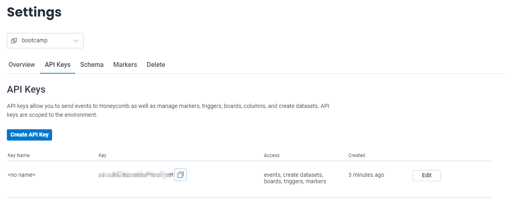
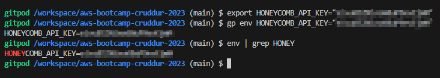
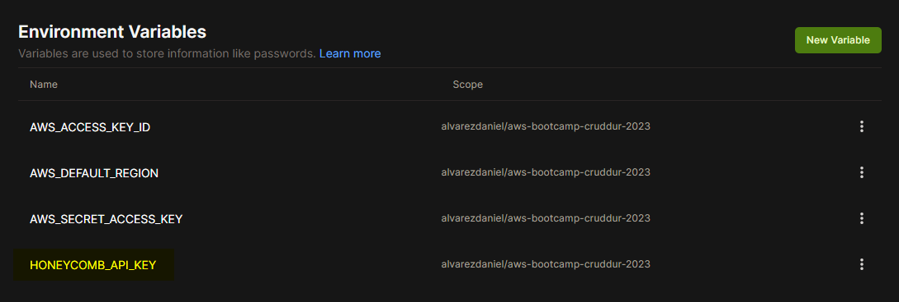
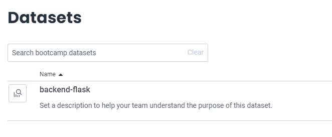
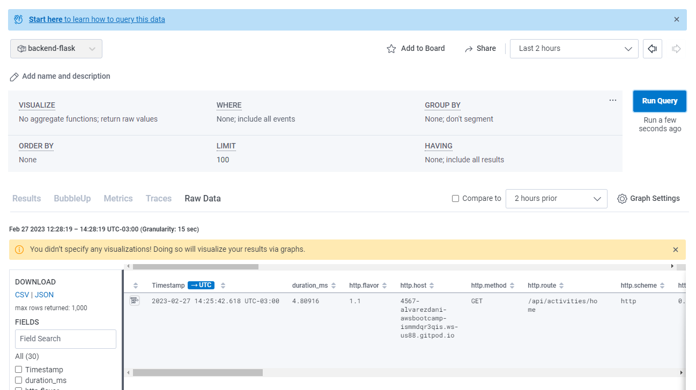
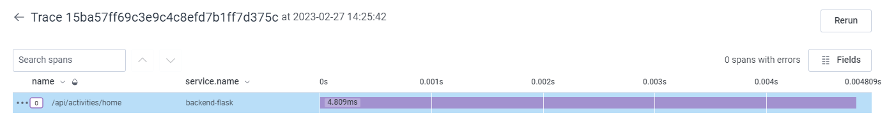
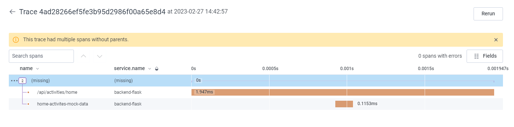
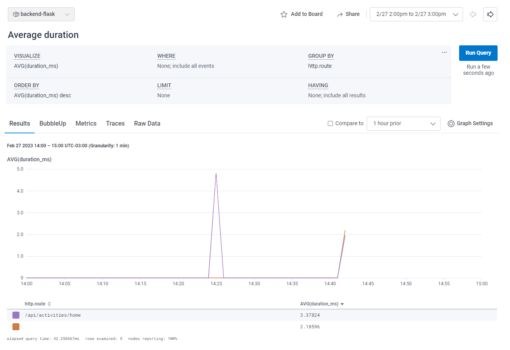

# Week 2 — Distributed Tracing

## Introduction

Andrew Brown hosts AWS Ontario Virtual User Group

Sponsors:
- Adrian Cantrill = Free docker fundamentals courses
- WeCloudData = free videos

AWS user groups around the world

## Week 2 instructors

- Andrew Brown [@andrebrown](https://twitter.com/andrebrown)
- Shala Warner [@GiftedLane](https://twitter.com/GiftedLane)
- Jessica Joy Kerr [@jessitron](https://twitter.com/jessitron)

## New week

- Program = instructions (in the past, programs log history of what happened in text files, now they use distributed tracing)

## Class Summary

- Instrument our backend flask application to use Open Telemetry (OTEL) with Honeycomb.io as the provider
- Run queries to explore traces within Honeycomb.io
- Instrument AWS X-Ray into backend flask application
- Configure and provision X-Ray daemon within docker-compose and send data back to X-Ray API
- Observe X-Ray traces within the AWS Console
- Integrate Rollbar for Error Logging
- Trigger an error an observe an error with Rollbar
- Install WatchTower and write a custom logger to send application log data to - CloudWatch Log group

## Watched videos

- [Week 2 Live-Stream Video](https://www.youtube.com/watch?v=2GD9xCzRId4&list=PLBfufR7vyJJ7k25byhRXJldB5AiwgNnWv&index=30)

### Instrument Honeycomb with OTEL

- Implement tracing using honeycomb: https://www.honeycomb.io/
- Each row in honeycomb is a span (single unit of work, has a duration)
- Traces = what happened and when
- Useful for detecting places to optimize
- Modern Standard
- Instrumentation

#### Instrument backend app

- Create honeycomb account and set it up
- Create honeycomb environment called "bootcamp"


- Copy bootcamp environment api key for setting it as an environment variable



- Add api key to environment and gitpod



- Add requirements to pip for adding honeycomb support

```
opentelemetry-api 
opentelemetry-sdk 
opentelemetry-exporter-otlp-proto-http 
opentelemetry-instrumentation-flask 
opentelemetry-instrumentation-requests
```

- Install requirements

```sh
pip install -r requirements.txt
```

```
Collecting flask
  Downloading Flask-2.2.3-py3-none-any.whl (101 kB)
     ━━━━━━━━━━━━━━━━━━━━━━━━━━━━━━━━━━━━━━━━ 101.8/101.8 kB 3.0 MB/s eta 0:00:00
Collecting flask-cors
  Downloading Flask_Cors-3.0.10-py2.py3-none-any.whl (14 kB)
Collecting opentelemetry-api
  Downloading opentelemetry_api-1.16.0-py3-none-any.whl (57 kB)
     ━━━━━━━━━━━━━━━━━━━━━━━━━━━━━━━━━━━━━━━━ 57.3/57.3 kB 2.1 MB/s eta 0:00:00
Collecting opentelemetry-sdk
  Downloading opentelemetry_sdk-1.16.0-py3-none-any.whl (94 kB)
     ━━━━━━━━━━━━━━━━━━━━━━━━━━━━━━━━━━━━━━━━ 94.6/94.6 kB 4.4 MB/s eta 0:00:00
Collecting opentelemetry-exporter-otlp-proto-http
  Downloading opentelemetry_exporter_otlp_proto_http-1.16.0-py3-none-any.whl (21 kB)
Collecting opentelemetry-instrumentation-flask
  Downloading opentelemetry_instrumentation_flask-0.37b0-py3-none-any.whl (13 kB)
Collecting opentelemetry-instrumentation-requests
  Downloading opentelemetry_instrumentation_requests-0.37b0-py3-none-any.whl (11 kB)
Collecting itsdangerous>=2.0
  Downloading itsdangerous-2.1.2-py3-none-any.whl (15 kB)
Collecting click>=8.0
  Downloading click-8.1.3-py3-none-any.whl (96 kB)
     ━━━━━━━━━━━━━━━━━━━━━━━━━━━━━━━━━━━━━━━━ 96.6/96.6 kB 4.0 MB/s eta 0:00:00
Requirement already satisfied: Jinja2>=3.0 in /home/gitpod/.pyenv/versions/3.8.16/lib/python3.8/site-packages (from flask->-r requirements.txt (line 1)) (3.1.2)
Collecting Werkzeug>=2.2.2
  Downloading Werkzeug-2.2.3-py3-none-any.whl (233 kB)
     ━━━━━━━━━━━━━━━━━━━━━━━━━━━━━━━━━━━━━━━━ 233.6/233.6 kB 9.2 MB/s eta 0:00:00
Requirement already satisfied: importlib-metadata>=3.6.0 in /home/gitpod/.pyenv/versions/3.8.16/lib/python3.8/site-packages (from flask->-r requirements.txt (line 1)) (6.0.0)
Requirement already satisfied: Six in /home/gitpod/.pyenv/versions/3.8.16/lib/python3.8/site-packages (from flask-cors->-r requirements.txt (line 2)) (1.16.0)
Requirement already satisfied: setuptools>=16.0 in /home/gitpod/.pyenv/versions/3.8.16/lib/python3.8/site-packages (from opentelemetry-api->-r requirements.txt (line 4)) (65.6.3)
Collecting deprecated>=1.2.6
  Downloading Deprecated-1.2.13-py2.py3-none-any.whl (9.6 kB)
Requirement already satisfied: typing-extensions>=3.7.4 in /home/gitpod/.pyenv/versions/3.8.16/lib/python3.8/site-packages (from opentelemetry-sdk->-r requirements.txt (line 5)) (4.4.0)
Collecting opentelemetry-semantic-conventions==0.37b0
  Downloading opentelemetry_semantic_conventions-0.37b0-py3-none-any.whl (26 kB)
Collecting opentelemetry-proto==1.16.0
  Downloading opentelemetry_proto-1.16.0-py3-none-any.whl (52 kB)
     ━━━━━━━━━━━━━━━━━━━━━━━━━━━━━━━━━━━━━━━━ 52.6/52.6 kB 2.4 MB/s eta 0:00:00
Collecting googleapis-common-protos~=1.52
  Downloading googleapis_common_protos-1.58.0-py2.py3-none-any.whl (223 kB)
     ━━━━━━━━━━━━━━━━━━━━━━━━━━━━━━━━━━━━━━━━ 223.0/223.0 kB 10.0 MB/s eta 0:00:00
Requirement already satisfied: requests~=2.7 in /home/gitpod/.pyenv/versions/3.8.16/lib/python3.8/site-packages (from opentelemetry-exporter-otlp-proto-http->-r requirements.txt (line 6)) (2.28.1)
Collecting backoff<3.0.0,>=1.10.0
  Downloading backoff-2.2.1-py3-none-any.whl (15 kB)
Collecting protobuf<5.0,>=3.19
  Downloading protobuf-4.22.0-cp37-abi3-manylinux2014_x86_64.whl (302 kB)
     ━━━━━━━━━━━━━━━━━━━━━━━━━━━━━━━━━━━━━━━━ 302.4/302.4 kB 14.3 MB/s eta 0:00:00
Collecting opentelemetry-util-http==0.37b0
  Downloading opentelemetry_util_http-0.37b0-py3-none-any.whl (6.7 kB)
Collecting opentelemetry-instrumentation-wsgi==0.37b0
  Downloading opentelemetry_instrumentation_wsgi-0.37b0-py3-none-any.whl (12 kB)
Collecting opentelemetry-instrumentation==0.37b0
  Downloading opentelemetry_instrumentation-0.37b0-py3-none-any.whl (24 kB)
Requirement already satisfied: wrapt<2.0.0,>=1.0.0 in /home/gitpod/.pyenv/versions/3.8.16/lib/python3.8/site-packages (from opentelemetry-instrumentation==0.37b0->opentelemetry-instrumentation-flask->-r requirements.txt (line 7)) (1.14.1)
Requirement already satisfied: zipp>=0.5 in /home/gitpod/.pyenv/versions/3.8.16/lib/python3.8/site-packages (from importlib-metadata>=3.6.0->flask->-r requirements.txt (line 1)) (3.11.0)
Requirement already satisfied: MarkupSafe>=2.0 in /home/gitpod/.pyenv/versions/3.8.16/lib/python3.8/site-packages (from Jinja2>=3.0->flask->-r requirements.txt (line 1)) (2.1.1)
Requirement already satisfied: charset-normalizer<3,>=2 in /home/gitpod/.pyenv/versions/3.8.16/lib/python3.8/site-packages (from requests~=2.7->opentelemetry-exporter-otlp-proto-http->-r requirements.txt (line 6)) (2.1.1)
Requirement already satisfied: urllib3<1.27,>=1.21.1 in /home/gitpod/.pyenv/versions/3.8.16/lib/python3.8/site-packages (from requests~=2.7->opentelemetry-exporter-otlp-proto-http->-r requirements.txt (line 6)) (1.26.13)
Requirement already satisfied: certifi>=2017.4.17 in /home/gitpod/.pyenv/versions/3.8.16/lib/python3.8/site-packages (from requests~=2.7->opentelemetry-exporter-otlp-proto-http->-r requirements.txt (line 6)) (2022.12.7)
Requirement already satisfied: idna<4,>=2.5 in /home/gitpod/.pyenv/versions/3.8.16/lib/python3.8/site-packages (from requests~=2.7->opentelemetry-exporter-otlp-proto-http->-r requirements.txt (line 6)) (3.4)
Installing collected packages: Werkzeug, protobuf, opentelemetry-util-http, opentelemetry-semantic-conventions, itsdangerous, deprecated, click, backoff, opentelemetry-proto, opentelemetry-api, googleapis-common-protos, flask, opentelemetry-sdk, opentelemetry-instrumentation, flask-cors, opentelemetry-instrumentation-wsgi, opentelemetry-instrumentation-requests, opentelemetry-exporter-otlp-proto-http, opentelemetry-instrumentation-flask
Successfully installed Werkzeug-2.2.3 backoff-2.2.1 click-8.1.3 deprecated-1.2.13 flask-2.2.3 flask-cors-3.0.10 googleapis-common-protos-1.58.0 itsdangerous-2.1.2 opentelemetry-api-1.16.0 opentelemetry-exporter-otlp-proto-http-1.16.0 opentelemetry-instrumentation-0.37b0 opentelemetry-instrumentation-flask-0.37b0 opentelemetry-instrumentation-requests-0.37b0 opentelemetry-instrumentation-wsgi-0.37b0 opentelemetry-proto-1.16.0 opentelemetry-sdk-1.16.0 opentelemetry-semantic-conventions-0.37b0 opentelemetry-util-http-0.37b0 protobuf-4.22.0

[notice] A new release of pip available: 22.3.1 -> 23.0.1
[notice] To update, run: pip install --upgrade pip
```

- Add honeycomb imports to app.py

```py
# HoneyComb imports
from opentelemetry import trace
from opentelemetry.instrumentation.flask import FlaskInstrumentor
from opentelemetry.instrumentation.requests import RequestsInstrumentor
from opentelemetry.exporter.otlp.proto.http.trace_exporter import OTLPSpanExporter
from opentelemetry.sdk.trace import TracerProvider
from opentelemetry.sdk.trace.export import BatchSpanProcessor
```

- Add honeycomb initialization to app.py

```py
# HoneyComb initialization: initialize tracer and an exporter for sending data to Honeycomb
provider = TracerProvider()
processor = BatchSpanProcessor(OTLPSpanExporter())
provider.add_span_processor(processor)
trace.set_tracer_provider(provider)
tracer = trace.get_tracer(__name__)
```

- Add automatic instrumentation (after app initialization)

```py
# HoneyComb automatic instrumentation for flask
FlaskInstrumentor().instrument_app(app)
RequestsInstrumentor().instrument()
```

- Add environment variables to compose file

```yaml
services:
  backend-flask:
    environment:
      OTEL_SERVICE_NAME: 'backend-flask'
      OTEL_EXPORTER_OTLP_ENDPOINT: "https://api.honeycomb.io"
      OTEL_EXPORTER_OTLP_HEADERS: "x-honeycomb-team=${HONEYCOMB_API_KEY}"
```



- OTEL_SERVICE_NAME: Sets the value of the service.name resource attribute (https://opentelemetry.io/docs/concepts/sdk-configuration/otlp-exporter-configuration/#otel_exporter_otlp_headers)
- OTEL_EXPORTER_OTLP_ENDPOINT: A base endpoint URL for any signal type, with an optionally-specified port number. Helpful for when you’re sending more than one signal to the same endpoint and want one environment variable to control the endpoint (https://opentelemetry.io/docs/concepts/sdk-configuration/otlp-exporter-configuration/#otel_exporter_otlp_headers)
- OTEL_EXPORTER_OTLP_HEADERS: A list of headers to apply to all outgoing data (traces, metrics, and logs) (https://opentelemetry.io/docs/concepts/sdk-configuration/otlp-exporter-configuration/#otel_exporter_otlp_headers)

- Run compose file to test it

```sh
docker compose  -f "docker-compose.yml" up -d
```

- Browse activities endpoint so as to generate tracing activity: 
https://4567-alvarezdani-awsbootcamp-ismmdqr3qis.ws-us88.gitpod.io/api/activities/home

```
[
  {
    "created_at": "2023-02-25T17:23:30.969884+00:00",
    "expires_at": "2023-03-04T17:23:30.969884+00:00",
    "handle": "Andrew Brown",
    "likes_count": 5,
    "message": "Cloud is fun!",
    "replies": [
      {
        "created_at": "2023-02-25T17:23:30.969884+00:00",
        "handle": "Worf",
        "likes_count": 0,
        "message": "This post has no honor!",
        "replies_count": 0,
        "reply_to_activity_uuid": "68f126b0-1ceb-4a33-88be-d90fa7109eee",
        "reposts_count": 0,
        "uuid": "26e12864-1c26-5c3a-9658-97a10f8fea67"
      }
    ],
    "replies_count": 1,
    "reposts_count": 0,
    "uuid": "68f126b0-1ceb-4a33-88be-d90fa7109eee"
  },
  {
    "created_at": "2023-02-20T17:23:30.969884+00:00",
    "expires_at": "2023-03-08T17:23:30.969884+00:00",
    "handle": "Worf",
    "likes": 0,
    "message": "I am out of prune juice",
    "replies": [],
    "uuid": "66e12864-8c26-4c3a-9658-95a10f8fea67"
  },
  {
    "created_at": "2023-02-27T16:23:30.969884+00:00",
    "expires_at": "2023-02-28T05:23:30.969884+00:00",
    "handle": "Garek",
    "likes": 0,
    "message": "My dear doctor, I am just simple tailor",
    "replies": [],
    "uuid": "248959df-3079-4947-b847-9e0892d1bab4"
  }
]
```

- Browse in Honeycomb Datasets page for bootcamp environment: https://ui.honeycomb.io/alvarez.daniel/environments/bootcamp/datasets



- Create a new query to check information in this dataset: https://ui.honeycomb.io/alvarez.daniel/environments/bootcamp/datasets/backend-flask



- And view the generated trace:



- For required ports to be opened on workspace start, add this code to .gitpod.yml file:

```yml
ports:
  - name: frontend
    port: 3000
    onOpen: open-browser
    visibility: public
  - name: backend
    port: 4567
    visibility: public
  - name: xray-daemon
    port: 2000
    visibility: public
```

- If any issue while sending data to honeycomb, there is the possibility to add console tracing as well:

```py
# HoneyComb imports
from opentelemetry.sdk.trace.export import ConsoleSpanExporter, SimpleSpanProcessor

# HoneyComb: show this in the logs within the backend-flask app (STDOUT)
simple_processor = SimpleSpanProcessor(ConsoleSpanExporter())
provider.add_span_processor(simple_processor)
```

- Also, spans and attributes can be added by modifying home_activities.py

```py
from datetime import datetime, timedelta, timezone
from opentelemetry import trace

tracer = trace.get_tracer("home.activities")

class HomeActivities:
  def run():
    with tracer.start_as_current_span("home-activites-mock-data"):
      span = trace.get_current_span()
      now = datetime.now(timezone.utc).astimezone()
      span.set_attribute("app.now", now.isoformat())
      
      results = [{
        'uuid': '68f126b0-1ceb-4a33-88be-d90fa7109eee',
        'handle':  'Andrew Brown',
        'message': 'Cloud is very fun!',
        'created_at': (now - timedelta(days=2)).isoformat(),
        'expires_at': (now + timedelta(days=5)).isoformat(),
        'likes_count': 5,
        'replies_count': 1,
        'reposts_count': 0,
        'replies': [{
          'uuid': '26e12864-1c26-5c3a-9658-97a10f8fea67',
          'reply_to_activity_uuid': '68f126b0-1ceb-4a33-88be-d90fa7109eee',
          'handle':  'Worf',
          'message': 'This post has no honor!',
          'likes_count': 0,
          'replies_count': 0,
          'reposts_count': 0,
          'created_at': (now - timedelta(days=2)).isoformat()
        }],
      },
      {
        'uuid': '66e12864-8c26-4c3a-9658-95a10f8fea67',
        'handle':  'Worf',
        'message': 'I am out of prune juice',
        'created_at': (now - timedelta(days=7)).isoformat(),
        'expires_at': (now + timedelta(days=9)).isoformat(),
        'likes': 0,
        'replies': []
      },
      {
        'uuid': '248959df-3079-4947-b847-9e0892d1bab4',
        'handle':  'Garek',
        'message': 'My dear doctor, I am just simple tailor',
        'created_at': (now - timedelta(hours=1)).isoformat(),
        'expires_at': (now + timedelta(hours=12)).isoformat(),
        'likes': 0,
        'replies': []
      }
      ]
      
      span.set_attribute("app.result_length", len(results))
      
      return results
```

- When opening activities endpoint: https://4567-alvarezdani-awsbootcamp-rsrf37dsuxv.ws-us88.gitpod.io/api/activities/home, and executing honeycomb query, now this is the result:



- And the new span contains the defined attributes:


- Honeycomb is useful for implementing different visualizations that can give a visual indication of application behavior, such as average response time grouped by http route:



- Useful Honeycomb links:

1. Direct Honeycomb.io Login to bypass the main website = https://ui.honeycomb.io/
2. Honeycomb.io Docs on Python OpenTelemetry = https://docs.honeycomb.io/getting-data-in/opentelemetry/python/
3. Honeycomb.io Docs on Getting Data In – Best Practices = https://docs.honeycomb.io/getting-data-in/data-best-practices/
4. Honeycomb.io Glitch.me page – What Honeycomb.io team is this? = https://honeycomb-whoami.glitch.me/


