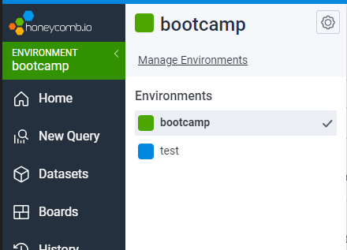
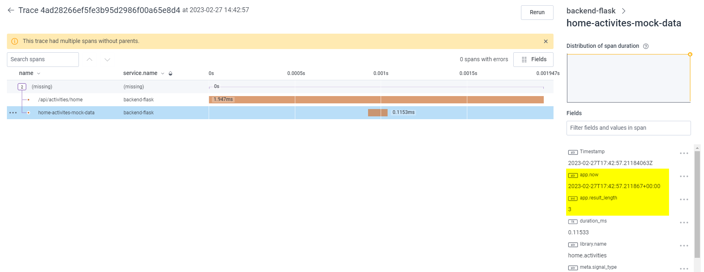
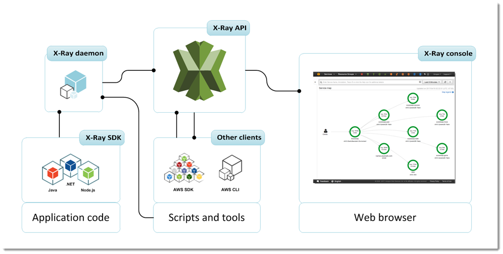

# Week 2 — Distributed Tracing

## Introduction

Andrew Brown hosts AWS Ontario Virtual User Group

Sponsors:
- Adrian Cantrill = Free docker fundamentals courses
- WeCloudData = free videos

AWS user groups around the world

## Week 2 instructors

- Andrew Brown [@andrebrown](https://twitter.com/andrebrown)
- Shala Warner [@GiftedLane](https://twitter.com/GiftedLane)
- Jessica Joy Kerr [@jessitron](https://twitter.com/jessitron)

## New week

- Program = instructions (in the past, programs log history of what happened in text files, now they use distributed tracing)

## Class Summary

- Instrument our backend flask application to use Open Telemetry (OTEL) with Honeycomb.io as the provider
- Run queries to explore traces within Honeycomb.io
- Instrument AWS X-Ray into backend flask application
- Configure and provision X-Ray daemon within docker-compose and send data back to X-Ray API
- Observe X-Ray traces within the AWS Console
- Integrate Rollbar for Error Logging
- Trigger an error an observe an error with Rollbar
- Install WatchTower and write a custom logger to send application log data to CloudWatch Log group

## Watched videos

- [Week 2 Live-Stream Video](https://www.youtube.com/watch?v=2GD9xCzRId4&list=PLBfufR7vyJJ7k25byhRXJldB5AiwgNnWv&index=30)

### Instrument Honeycomb with OTEL

- Implement tracing using honeycomb: https://www.honeycomb.io/
- Each row in honeycomb is a span (single unit of work, has a duration)
- Traces = what happened and when
- Useful for detecting places to optimize
- Modern Standard
- Instrumentation

#### Instrument backend app

- Create honeycomb account and set it up
- Create honeycomb environment called "bootcamp"



- Copy bootcamp environment api key for setting it as an environment variable


- Add api key to environment and gitpod


- Add requirements to pip for adding honeycomb support

```
opentelemetry-api 
opentelemetry-sdk 
opentelemetry-exporter-otlp-proto-http 
opentelemetry-instrumentation-flask 
opentelemetry-instrumentation-requests
```

- Install requirements

```sh
pip install -r requirements.txt
```

```
Collecting flask
  Downloading Flask-2.2.3-py3-none-any.whl (101 kB)
     ━━━━━━━━━━━━━━━━━━━━━━━━━━━━━━━━━━━━━━━━ 101.8/101.8 kB 3.0 MB/s eta 0:00:00
Collecting flask-cors
  Downloading Flask_Cors-3.0.10-py2.py3-none-any.whl (14 kB)
Collecting opentelemetry-api
  Downloading opentelemetry_api-1.16.0-py3-none-any.whl (57 kB)
     ━━━━━━━━━━━━━━━━━━━━━━━━━━━━━━━━━━━━━━━━ 57.3/57.3 kB 2.1 MB/s eta 0:00:00
Collecting opentelemetry-sdk
  Downloading opentelemetry_sdk-1.16.0-py3-none-any.whl (94 kB)
     ━━━━━━━━━━━━━━━━━━━━━━━━━━━━━━━━━━━━━━━━ 94.6/94.6 kB 4.4 MB/s eta 0:00:00
Collecting opentelemetry-exporter-otlp-proto-http
  Downloading opentelemetry_exporter_otlp_proto_http-1.16.0-py3-none-any.whl (21 kB)
Collecting opentelemetry-instrumentation-flask
  Downloading opentelemetry_instrumentation_flask-0.37b0-py3-none-any.whl (13 kB)
Collecting opentelemetry-instrumentation-requests
  Downloading opentelemetry_instrumentation_requests-0.37b0-py3-none-any.whl (11 kB)
Collecting itsdangerous>=2.0
  Downloading itsdangerous-2.1.2-py3-none-any.whl (15 kB)
Collecting click>=8.0
  Downloading click-8.1.3-py3-none-any.whl (96 kB)
     ━━━━━━━━━━━━━━━━━━━━━━━━━━━━━━━━━━━━━━━━ 96.6/96.6 kB 4.0 MB/s eta 0:00:00
Requirement already satisfied: Jinja2>=3.0 in /home/gitpod/.pyenv/versions/3.8.16/lib/python3.8/site-packages (from flask->-r requirements.txt (line 1)) (3.1.2)
Collecting Werkzeug>=2.2.2
  Downloading Werkzeug-2.2.3-py3-none-any.whl (233 kB)
     ━━━━━━━━━━━━━━━━━━━━━━━━━━━━━━━━━━━━━━━━ 233.6/233.6 kB 9.2 MB/s eta 0:00:00
Requirement already satisfied: importlib-metadata>=3.6.0 in /home/gitpod/.pyenv/versions/3.8.16/lib/python3.8/site-packages (from flask->-r requirements.txt (line 1)) (6.0.0)
Requirement already satisfied: Six in /home/gitpod/.pyenv/versions/3.8.16/lib/python3.8/site-packages (from flask-cors->-r requirements.txt (line 2)) (1.16.0)
Requirement already satisfied: setuptools>=16.0 in /home/gitpod/.pyenv/versions/3.8.16/lib/python3.8/site-packages (from opentelemetry-api->-r requirements.txt (line 4)) (65.6.3)
Collecting deprecated>=1.2.6
  Downloading Deprecated-1.2.13-py2.py3-none-any.whl (9.6 kB)
Requirement already satisfied: typing-extensions>=3.7.4 in /home/gitpod/.pyenv/versions/3.8.16/lib/python3.8/site-packages (from opentelemetry-sdk->-r requirements.txt (line 5)) (4.4.0)
Collecting opentelemetry-semantic-conventions==0.37b0
  Downloading opentelemetry_semantic_conventions-0.37b0-py3-none-any.whl (26 kB)
Collecting opentelemetry-proto==1.16.0
  Downloading opentelemetry_proto-1.16.0-py3-none-any.whl (52 kB)
     ━━━━━━━━━━━━━━━━━━━━━━━━━━━━━━━━━━━━━━━━ 52.6/52.6 kB 2.4 MB/s eta 0:00:00
Collecting googleapis-common-protos~=1.52
  Downloading googleapis_common_protos-1.58.0-py2.py3-none-any.whl (223 kB)
     ━━━━━━━━━━━━━━━━━━━━━━━━━━━━━━━━━━━━━━━━ 223.0/223.0 kB 10.0 MB/s eta 0:00:00
Requirement already satisfied: requests~=2.7 in /home/gitpod/.pyenv/versions/3.8.16/lib/python3.8/site-packages (from opentelemetry-exporter-otlp-proto-http->-r requirements.txt (line 6)) (2.28.1)
Collecting backoff<3.0.0,>=1.10.0
  Downloading backoff-2.2.1-py3-none-any.whl (15 kB)
Collecting protobuf<5.0,>=3.19
  Downloading protobuf-4.22.0-cp37-abi3-manylinux2014_x86_64.whl (302 kB)
     ━━━━━━━━━━━━━━━━━━━━━━━━━━━━━━━━━━━━━━━━ 302.4/302.4 kB 14.3 MB/s eta 0:00:00
Collecting opentelemetry-util-http==0.37b0
  Downloading opentelemetry_util_http-0.37b0-py3-none-any.whl (6.7 kB)
Collecting opentelemetry-instrumentation-wsgi==0.37b0
  Downloading opentelemetry_instrumentation_wsgi-0.37b0-py3-none-any.whl (12 kB)
Collecting opentelemetry-instrumentation==0.37b0
  Downloading opentelemetry_instrumentation-0.37b0-py3-none-any.whl (24 kB)
Requirement already satisfied: wrapt<2.0.0,>=1.0.0 in /home/gitpod/.pyenv/versions/3.8.16/lib/python3.8/site-packages (from opentelemetry-instrumentation==0.37b0->opentelemetry-instrumentation-flask->-r requirements.txt (line 7)) (1.14.1)
Requirement already satisfied: zipp>=0.5 in /home/gitpod/.pyenv/versions/3.8.16/lib/python3.8/site-packages (from importlib-metadata>=3.6.0->flask->-r requirements.txt (line 1)) (3.11.0)
Requirement already satisfied: MarkupSafe>=2.0 in /home/gitpod/.pyenv/versions/3.8.16/lib/python3.8/site-packages (from Jinja2>=3.0->flask->-r requirements.txt (line 1)) (2.1.1)
Requirement already satisfied: charset-normalizer<3,>=2 in /home/gitpod/.pyenv/versions/3.8.16/lib/python3.8/site-packages (from requests~=2.7->opentelemetry-exporter-otlp-proto-http->-r requirements.txt (line 6)) (2.1.1)
Requirement already satisfied: urllib3<1.27,>=1.21.1 in /home/gitpod/.pyenv/versions/3.8.16/lib/python3.8/site-packages (from requests~=2.7->opentelemetry-exporter-otlp-proto-http->-r requirements.txt (line 6)) (1.26.13)
Requirement already satisfied: certifi>=2017.4.17 in /home/gitpod/.pyenv/versions/3.8.16/lib/python3.8/site-packages (from requests~=2.7->opentelemetry-exporter-otlp-proto-http->-r requirements.txt (line 6)) (2022.12.7)
Requirement already satisfied: idna<4,>=2.5 in /home/gitpod/.pyenv/versions/3.8.16/lib/python3.8/site-packages (from requests~=2.7->opentelemetry-exporter-otlp-proto-http->-r requirements.txt (line 6)) (3.4)
Installing collected packages: Werkzeug, protobuf, opentelemetry-util-http, opentelemetry-semantic-conventions, itsdangerous, deprecated, click, backoff, opentelemetry-proto, opentelemetry-api, googleapis-common-protos, flask, opentelemetry-sdk, opentelemetry-instrumentation, flask-cors, opentelemetry-instrumentation-wsgi, opentelemetry-instrumentation-requests, opentelemetry-exporter-otlp-proto-http, opentelemetry-instrumentation-flask
Successfully installed Werkzeug-2.2.3 backoff-2.2.1 click-8.1.3 deprecated-1.2.13 flask-2.2.3 flask-cors-3.0.10 googleapis-common-protos-1.58.0 itsdangerous-2.1.2 opentelemetry-api-1.16.0 opentelemetry-exporter-otlp-proto-http-1.16.0 opentelemetry-instrumentation-0.37b0 opentelemetry-instrumentation-flask-0.37b0 opentelemetry-instrumentation-requests-0.37b0 opentelemetry-instrumentation-wsgi-0.37b0 opentelemetry-proto-1.16.0 opentelemetry-sdk-1.16.0 opentelemetry-semantic-conventions-0.37b0 opentelemetry-util-http-0.37b0 protobuf-4.22.0

[notice] A new release of pip available: 22.3.1 -> 23.0.1
[notice] To update, run: pip install --upgrade pip
```

- Add honeycomb imports to app.py

```py
# HoneyComb imports
from opentelemetry import trace
from opentelemetry.instrumentation.flask import FlaskInstrumentor
from opentelemetry.instrumentation.requests import RequestsInstrumentor
from opentelemetry.exporter.otlp.proto.http.trace_exporter import OTLPSpanExporter
from opentelemetry.sdk.trace import TracerProvider
from opentelemetry.sdk.trace.export import BatchSpanProcessor
```

- Add honeycomb initialization to app.py

```py
# HoneyComb initialization: initialize tracer and an exporter for sending data to Honeycomb
provider = TracerProvider()
processor = BatchSpanProcessor(OTLPSpanExporter())
provider.add_span_processor(processor)
trace.set_tracer_provider(provider)
tracer = trace.get_tracer(__name__)
```

- Add automatic instrumentation (after app initialization)

```py
# HoneyComb automatic instrumentation for flask
FlaskInstrumentor().instrument_app(app)
RequestsInstrumentor().instrument()
```

- Add environment variables to compose file

```yaml
services:
  backend-flask:
    environment:
      OTEL_SERVICE_NAME: 'backend-flask'
      OTEL_EXPORTER_OTLP_ENDPOINT: "https://api.honeycomb.io"
      OTEL_EXPORTER_OTLP_HEADERS: "x-honeycomb-team=${HONEYCOMB_API_KEY}"
```


- OTEL_SERVICE_NAME: Sets the value of the service.name resource attribute (https://opentelemetry.io/docs/concepts/sdk-configuration/otlp-exporter-configuration/#otel_exporter_otlp_headers)
- OTEL_EXPORTER_OTLP_ENDPOINT: A base endpoint URL for any signal type, with an optionally-specified port number. Helpful for when you’re sending more than one signal to the same endpoint and want one environment variable to control the endpoint (https://opentelemetry.io/docs/concepts/sdk-configuration/otlp-exporter-configuration/#otel_exporter_otlp_headers)
- OTEL_EXPORTER_OTLP_HEADERS: A list of headers to apply to all outgoing data (traces, metrics, and logs) (https://opentelemetry.io/docs/concepts/sdk-configuration/otlp-exporter-configuration/#otel_exporter_otlp_headers)

- Run compose file to test it

```sh
docker compose  -f "docker-compose.yml" up -d
```

- Browse activities endpoint so as to generate tracing activity: 
https://4567-alvarezdani-awsbootcamp-ismmdqr3qis.ws-us88.gitpod.io/api/activities/home

```
[
  {
    "created_at": "2023-02-25T17:23:30.969884+00:00",
    "expires_at": "2023-03-04T17:23:30.969884+00:00",
    "handle": "Andrew Brown",
    "likes_count": 5,
    "message": "Cloud is fun!",
    "replies": [
      {
        "created_at": "2023-02-25T17:23:30.969884+00:00",
        "handle": "Worf",
        "likes_count": 0,
        "message": "This post has no honor!",
        "replies_count": 0,
        "reply_to_activity_uuid": "68f126b0-1ceb-4a33-88be-d90fa7109eee",
        "reposts_count": 0,
        "uuid": "26e12864-1c26-5c3a-9658-97a10f8fea67"
      }
    ],
    "replies_count": 1,
    "reposts_count": 0,
    "uuid": "68f126b0-1ceb-4a33-88be-d90fa7109eee"
  },
  {
    "created_at": "2023-02-20T17:23:30.969884+00:00",
    "expires_at": "2023-03-08T17:23:30.969884+00:00",
    "handle": "Worf",
    "likes": 0,
    "message": "I am out of prune juice",
    "replies": [],
    "uuid": "66e12864-8c26-4c3a-9658-95a10f8fea67"
  },
  {
    "created_at": "2023-02-27T16:23:30.969884+00:00",
    "expires_at": "2023-02-28T05:23:30.969884+00:00",
    "handle": "Garek",
    "likes": 0,
    "message": "My dear doctor, I am just simple tailor",
    "replies": [],
    "uuid": "248959df-3079-4947-b847-9e0892d1bab4"
  }
]
```

- Browse in Honeycomb Datasets page for bootcamp environment: https://ui.honeycomb.io/alvarez.daniel/environments/bootcamp/datasets


- Create a new query to check information in this dataset: https://ui.honeycomb.io/alvarez.daniel/environments/bootcamp/datasets/backend-flask


- And view the generated trace:


- For required ports to be opened on workspace start, add this code to .gitpod.yml file:

```yml
ports:
  - name: frontend
    port: 3000
    onOpen: open-browser
    visibility: public
  - name: backend
    port: 4567
    visibility: public
  - name: xray-daemon
    port: 2000
    visibility: public
```

- If any issue while sending data to honeycomb, there is the possibility to add console tracing as well:

```py
# HoneyComb imports
from opentelemetry.sdk.trace.export import ConsoleSpanExporter, SimpleSpanProcessor

# HoneyComb: show this in the logs within the backend-flask app (STDOUT)
simple_processor = SimpleSpanProcessor(ConsoleSpanExporter())
provider.add_span_processor(simple_processor)
```

- Also, spans and attributes can be added by modifying home_activities.py

```py
from datetime import datetime, timedelta, timezone
from opentelemetry import trace

tracer = trace.get_tracer("home.activities")

class HomeActivities:
  def run():
    with tracer.start_as_current_span("home-activites-mock-data"):
      span = trace.get_current_span()
      now = datetime.now(timezone.utc).astimezone()
      span.set_attribute("app.now", now.isoformat())
      
      results = [{
        'uuid': '68f126b0-1ceb-4a33-88be-d90fa7109eee',
        'handle':  'Andrew Brown',
        'message': 'Cloud is very fun!',
        'created_at': (now - timedelta(days=2)).isoformat(),
        'expires_at': (now + timedelta(days=5)).isoformat(),
        'likes_count': 5,
        'replies_count': 1,
        'reposts_count': 0,
        'replies': [{
          'uuid': '26e12864-1c26-5c3a-9658-97a10f8fea67',
          'reply_to_activity_uuid': '68f126b0-1ceb-4a33-88be-d90fa7109eee',
          'handle':  'Worf',
          'message': 'This post has no honor!',
          'likes_count': 0,
          'replies_count': 0,
          'reposts_count': 0,
          'created_at': (now - timedelta(days=2)).isoformat()
        }],
      },
      {
        'uuid': '66e12864-8c26-4c3a-9658-95a10f8fea67',
        'handle':  'Worf',
        'message': 'I am out of prune juice',
        'created_at': (now - timedelta(days=7)).isoformat(),
        'expires_at': (now + timedelta(days=9)).isoformat(),
        'likes': 0,
        'replies': []
      },
      {
        'uuid': '248959df-3079-4947-b847-9e0892d1bab4',
        'handle':  'Garek',
        'message': 'My dear doctor, I am just simple tailor',
        'created_at': (now - timedelta(hours=1)).isoformat(),
        'expires_at': (now + timedelta(hours=12)).isoformat(),
        'likes': 0,
        'replies': []
      }
      ]
      
      span.set_attribute("app.result_length", len(results))
      
      return results
```

- When opening activities endpoint: https://4567-alvarezdani-awsbootcamp-rsrf37dsuxv.ws-us88.gitpod.io/api/activities/home, and executing honeycomb query, now this is the result:


- And the new span contains the defined attributes:



- Honeycomb is useful for implementing different visualizations that can give a visual indication of application behavior, such as average response time grouped by http route:


- Useful Honeycomb links:

1. Direct Honeycomb.io Login to bypass the main website = https://ui.honeycomb.io/
2. Honeycomb.io Docs on Python OpenTelemetry = https://docs.honeycomb.io/getting-data-in/opentelemetry/python/
3. Honeycomb.io Docs on Getting Data In – Best Practices = https://docs.honeycomb.io/getting-data-in/data-best-practices/
4. Honeycomb.io Glitch.me page – What Honeycomb.io team is this? = https://honeycomb-whoami.glitch.me/

### Instrument AWS X-Ray

AWS X-Ray info: https://aws.amazon.com/xray/

AWS X-Ray provides a complete view of requests as they travel through your application and filters visual data across payloads, functions, traces, services, APIs, and more with no-code and low-code motions.


What are the best practises for setting up x-ray daemon? https://stackoverflow.com/questions/54236375/what-are-the-best-practises-for-setting-up-x-ray-daemon

To x-ray to work a daemon must be installed and running for collecting and sending traces in batches to x-ray api.



The first thing to do for add x-ray instrumentation is adding python module to 'requirements.txt' file:

```
aws-xray-sdk
```

> AWS Documentation - SDKs and Toolkits: https://docs.aws.amazon.com/index.html#sdks
> According to Andrew, Ruby docs are the best documented ones
> AWS SDK for Python (Boto3) https://aws.amazon.com/sdk-for-python/
> API Reference: https://boto3.amazonaws.com/v1/documentation/api/latest/reference/services/index.html
> XRay: https://boto3.amazonaws.com/v1/documentation/api/latest/reference/services/xray.html
> boto3 Github: https://github.com/boto/boto3
> OpenTelemetry Python with AWS X-Ray: https://github.com/aws/aws-xray-sdk-python

Then the new requirement module has to be installed:

```sh
pip install -r requirements.txt
```

Info about how to add xray middleware to flask app: https://docs.aws.amazon.com/xray/latest/devguide/xray-sdk-python-middleware.html#xray-sdk-python-adding-middleware-flask

Add imports to `app.py`

```py
from aws_xray_sdk.core import xray_recorder
from aws_xray_sdk.ext.flask.middleware import XRayMiddleware
```

Add also x-ray initialization to `app.py` 

```py
xray_url = os.getenv("AWS_XRAY_URL")
xray_recorder.configure(service='backend-flask', dynamic_naming=xray_url)
```

> https://docs.aws.amazon.com/xray-sdk-for-python/latest/reference/configurations.html#segment-dynamic-naming

And then x-ray middleware (after app initialization)
```py
XRayMiddleware(app, xray_recorder)
```

AWS resources must be created in order to capture traces in AWS X-RAY (sampling rule and xray group)

Create `xray.json` file with this content:

```json
{
  "SamplingRule": {
      "RuleName": "Cruddur",
      "ResourceARN": "*",
      "Priority": 9000,
      "FixedRate": 0.1,
      "ReservoirSize": 5,
      "ServiceName": "backend-flask",
      "ServiceType": "*",
      "Host": "*",
      "HTTPMethod": "*",
      "URLPath": "*",
      "Version": 1
  }
}
```

Execute this aws cli command to create an xray group:

```sh
FLASK_ADDRESS="https://4567-${GITPOD_WORKSPACE_ID}.${GITPOD_WORKSPACE_CLUSTER_HOST}"
aws xray create-group \
   --group-name "Cruddur" \
   --filter-expression "service(\"backend-flask\")"
```

And then this one to create the sampling rule:

```sh
aws xray create-sampling-rule --cli-input-json file://journal/aws/json/xray.json
```

We can check the AWS resources in AWS console (Cloudwatch):


> Some info about AWS sampling rules and xray  groups:
> - https://docs.aws.amazon.com/xray/latest/devguide/xray-console-sampling.html
> - https://docs.aws.amazon.com/xray/latest/devguide/xray-api-sampling.html
> - https://aws.amazon.com/blogs/developer/deep-dive-into-aws-x-ray-groups-and-use-cases/

> Andrew mentioned why he implements AWS resources creation using api instead of using AWS console, and it's because AWS console UI changes constantly

> My opinion is that using api, resources creation can be documented and it can be automated using scripts

Next, install X-ray daemon

- Install X-ray Daemon https://docs.aws.amazon.com/xray/latest/devguide/xray-daemon.html
- Github aws-xray-daemon https://github.com/aws/aws-xray-daemon
- X-Ray Docker Compose example https://github.com/marjamis/xray/blob/master/docker-compose.yml

This script is used to install x-ray daemon, but we are not using it because we need it to run in a container

```sh
wget https://s3.us-east-2.amazonaws.com/aws-xray-assets.us-east-2/xray-daemon/aws-xray-daemon-3.x.deb
sudo dpkg -i **.deb
```

So, we are adding a new service to the `docker-compose.yml` file:

```yml
 xray-daemon:
    image: "amazon/aws-xray-daemon"
    environment:
      AWS_ACCESS_KEY_ID: "${AWS_ACCESS_KEY_ID}"
      AWS_SECRET_ACCESS_KEY: "${AWS_SECRET_ACCESS_KEY}"
      AWS_REGION: "${AWS_DEFAULT_REGION}"
    command:
      - "xray -o -b xray-daemon:2000"
    ports:
      - 2000:2000/udp
```

The image this container is using is `amazon/aws-xray-daemon` (managed by Amazon)
https://hub.docker.com/r/amazon/aws-xray-daemon/#!

The environment variables used in this container are already configured in Gitpod settings.

The variables that should be added to compose file are the ones used in backend-flask:

```yml
  backend-flask:
    environment:
      AWS_XRAY_URL: "*4567-${GITPOD_WORKSPACE_ID}.${GITPOD_WORKSPACE_CLUSTER_HOST}*"
      AWS_XRAY_DAEMON_ADDRESS: "xray-daemon:2000"
```

Now the application can be started, do some requests to backend and check the results:

By using this script, service data for the last 10 minutes can be checked:

```sh
EPOCH=$(date +%s)
aws xray get-service-graph --start-time $(($EPOCH-600)) --end-time $EPOCH
```

Also, AWS console can be used to check it


Now let's check how to add custom segments/subsegments

> https://github.com/aws/aws-xray-sdk-python#start-a-custom-segmentsubsegment

Add custom segment and subsegment in another endpoint (UserActivities `backend-flask\services\user_activities.py`)

```py
from datetime import datetime, timedelta, timezone

# XRAY import
from aws_xray_sdk.core import xray_recorder

class UserActivities:
  def run(user_handle):

    # XRAY segment
    segment = xray_recorder.begin_segment('user_activities')
    
    model = {
      'errors': None,
      'data': None
    }

    now = datetime.now(timezone.utc).astimezone()

    if user_handle == None or len(user_handle) < 1:
      model['errors'] = ['blank_user_handle']
    else:
      now = datetime.now()
      results = [{
        'uuid': '248959df-3079-4947-b847-9e0892d1bab4',
        'handle':  'Andrew Brown',
        'message': 'Cloud is fun!',
        'created_at': (now - timedelta(days=1)).isoformat(),
        'expires_at': (now + timedelta(days=31)).isoformat()
      }]
      model['data'] = results

    # XRAY subsegment
    subsegment = xray_recorder.begin_subsegment('mock-data')
    dict = {
      "now": now.isoformat(),
      "results-size": len(model['data'])
    }
    subsegment.put_metadata('key', dict, 'namespace')

    return model
```

Test again using script, by executing the endpoint to generate traces: /api/activities/@andrewbrown

```sh
EPOCH=$(date +%s)
aws xray get-service-graph --start-time $(($EPOCH-600)) --end-time $EPOCH
```

And using AWS console (Cloudwatch)


Finally, for not paying X-RAY use in case it is sending too much data, disable x-ray middleware in `app.py`

```py
# X-RAY middleware
#XRayMiddleware(app, xray_recorder)
```

> https://aws.amazon.com/xray/pricing/

### Configure custom logger to send to CloudWatch Logs

For adding CloudWatch logs implementation to backend service, first of all we need to add required python module to `requirements.txt` file:

```txt
watchtower
```

> https://pypi.org/project/watchtower/

Then we need to install it:

```sh
pip install -r requirements.txt
```

Required imports must be added to `app.py` file

```py
import watchtower
import logging
from time import strftime
```

Then CloudWatch Logger must be initialized, again in `app.py` file

```py
LOGGER = logging.getLogger(__name__)
LOGGER.setLevel(logging.DEBUG)
console_handler = logging.StreamHandler()
cw_handler = watchtower.CloudWatchLogHandler(log_group='cruddur')
LOGGER.addHandler(console_handler)
LOGGER.addHandler(cw_handler)
```

Add code to handle errors to log them, also to `app.py` file

```py
@app.after_request
def after_request(response):
    timestamp = strftime('[%Y-%b-%d %H:%M]')
    LOGGER.error('%s %s %s %s %s %s', timestamp, request.remote_addr, request.method, request.scheme, request.full_path, response.status)
    return response
```

Then, in the service we need to log something, we add a call to the already configured logger

In this case, we'll add logging to `home_activities.py` file

```py
class HomeActivities:
  def run(logger):
    logger.info('Hello Cloudwatch! from  /api/activities/home')
```

And also pass the logger from `app.py`

```py
@app.route("/api/activities/home", methods=['GET'])
def data_home():
  data = HomeActivities.run(logger=LOGGER)
  return data, 200
```

Finally, we need to add the required env vars to docker compose, in backend-flask service

```yml
version: "3.8"
services:
  backend-flask:
    environment:
      AWS_DEFAULT_REGION: "${AWS_DEFAULT_REGION}"
      AWS_ACCESS_KEY_ID: "${AWS_ACCESS_KEY_ID}"
      AWS_SECRET_ACCESS_KEY: "${AWS_SECRET_ACCESS_KEY}"
```

For testing it, we start the compose file


And then make a request browsing the endpoint /api/activities/home

For checking the created logs, get into AWS console, in CloudWatch, Logs, Log groups, and click on cruddur log group, and the generated log stream should be there


By clicking on one of them, details can be inspected


For not worrying about spending in AWS, logging can be left disabled

```py
class HomeActivities:
  def run(logger):
    #logger.info('Hello Cloudwatch! from  /api/activities/home')
```

### Integrate Rollbar and capture and error

To integrate Rollbar into the application, first of all, a Rollback account must be opened

https://app.rollbar.com/onboarding


Search for flask SDK to obtain the instructions to integrate it


https://github.com/rollbar/pyrollbar

First of all, we need to add the python modules to `requirements.txt`

```txt
blinker
rollbar
```

And install them

```sh
pip install -r requirements.txt
```

Then we need to generate a Rollback access token and add it as an environment variable to docker compose file


```sh
export ROLLBAR_ACCESS_TOKEN=""
gp env ROLLBAR_ACCESS_TOKEN=""
```

```yml
version: "3.8"
services:
  backend-flask:
    environment:
      ROLLBAR_ACCESS_TOKEN: "${ROLLBAR_ACCESS_TOKEN}"
```

For instrumenting the backend application, we need to add first the python imports to `app.py` file

```py
import os
import rollbar
import rollbar.contrib.flask
from flask import got_request_exception
```

Then we need to add Rollbar initialization, also in `app.py` file (after app declaration)

```py
rollbar_access_token = os.getenv('ROLLBAR_ACCESS_TOKEN')
@app.before_first_request
def init_rollbar():
    """init rollbar module"""
    rollbar.init(
        # access token
        rollbar_access_token,
        # environment name
        'production',
        # server root directory, makes tracebacks prettier
        root=os.path.dirname(os.path.realpath(__file__)),
        # flask already sets up logging
        allow_logging_basic_config=False)

    # send exceptions from `app` to rollbar, using flask's signal system.
    got_request_exception.connect(rollbar.contrib.flask.report_exception, app)
```

For testing Rollbar implementation, we are adding a new endpoint

```py
@app.route('/rollbar/test')
def rollbar_test():
    rollbar.report_message('Hello World!', 'warning')
    return "Hello World!"
``` 

So, by starting the application with docker compose up, we can test if it's working


We need to use the new endpoint defined to test it, so let's open it: /rollbar/test


And check the data in Rollbar (remember to check on all log levels to see the warning message)


For an error to occur, we will change some code that should raise an error message in Rollbar

home_activities.py

```py
#return results
results
```

When refreshing the endpoint request, an error is shown in Rollbar


> Rollbar flask example: https://github.com/rollbar/rollbar-flask-example/blob/master/hello.py

