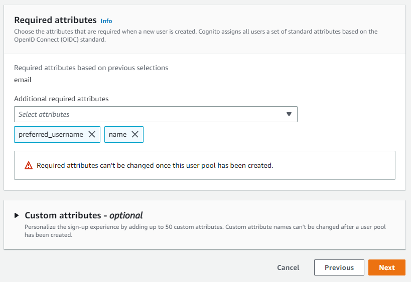
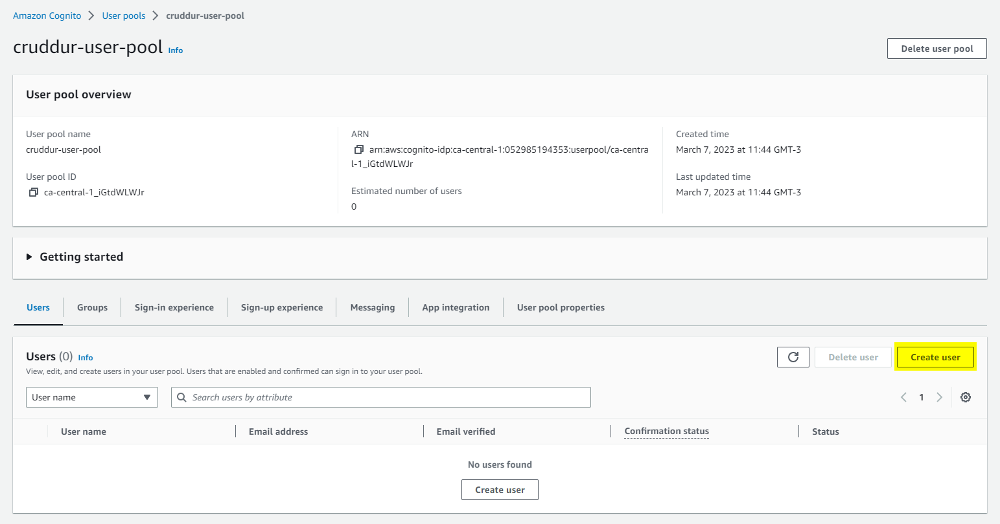
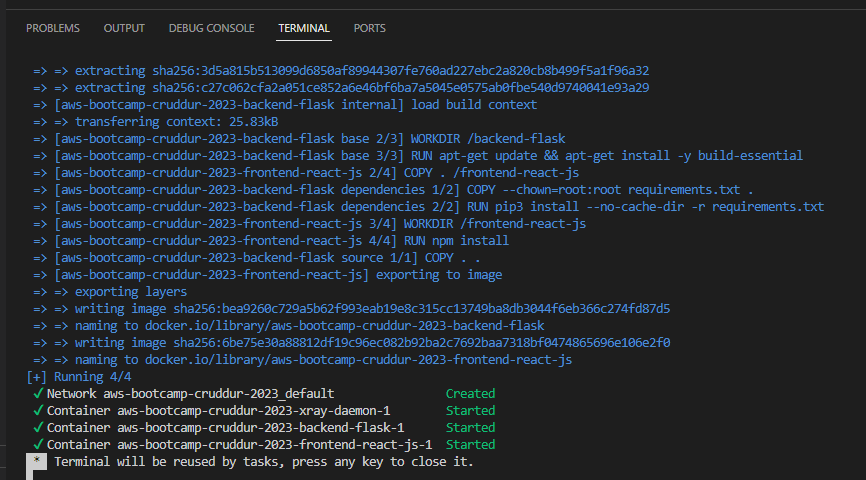

# Week 3 — Decentralized Authentication

## Week 3 instructors

- Andrew Brown [@andrewbrown](https://twitter.com/andrewbrown)
- Shala Warner [@GiftedLane](https://twitter.com/GiftedLane)

## Class Summary

- Provision via ClickOps a Amazon Cognito User Pool
- Install and configure Amplify client-side library for Amazon Congito
- Implement API calls to Amazon Coginto for custom login, signup, recovery and forgot password page
- Show conditional elements and data based on logged in or logged out
- Verify JWT Token server side to serve authenticated API endpoints in Flask Application

## Todo Checklist

### Watch Ashish's Week 3 - Decenteralized Authentication

https://www.youtube.com/watch?v=tEJIeII66pY&list=PLBfufR7vyJJ7k25byhRXJldB5AiwgNnWv&index=39

### Watch Chirag Week 3 - Spending Considerations


### Setup Cognito User Pool

https://www.youtube.com/watch?v=9obl7rVgzJw&list=PLBfufR7vyJJ7k25byhRXJldB5AiwgNnWv&index=41

For creating the cognito user pool, go to AWS console and open Amazon Cognito, selecting the corresponding region (in this case ca-central-1)

https://ca-central-1.console.aws.amazon.com/cognito/v2/home?region=ca-central-1#

And then click on "Create user pool" button


Step 1: Configure sign-in experience


Step 2: Configure security requirements


Step 3: Configure sign-up experience




Step 4: Configure message delivery


Step 5: Integrate your app


Step 6: Review and create


### Implement Custom Signin Page

For implementing cognito in frontend app we are going to use AWS Amplify:

https://aws.amazon.com/amplify/

AWS Amplify is a complete solution that lets frontend web and mobile developers easily build, ship, and host full-stack applications on AWS, with the flexibility to leverage the breadth of AWS services as use cases evolve. No cloud expertise needed.

There is also a js library for cognito:

https://www.npmjs.com/package/amazon-cognito-identity-js

Amplify Dev Center
https://docs.amplify.aws/lib/auth/getting-started/q/platform/js/

The first thing to do is install amplify, inside `frontend-react-js` directory:

```sh
npm i aws-amplify --save
```

> --save: Saves dependency for development and runtime
> --save-dev: Saves dependency only for development

```
npm WARN deprecated resolve-url@0.2.1: https://github.com/lydell/resolve-url#deprecated
npm WARN deprecated source-map-url@0.4.1: See https://github.com/lydell/source-map-url#deprecated
npm WARN deprecated urix@0.1.0: Please see https://github.com/lydell/urix#deprecated
npm WARN deprecated source-map-resolve@0.5.3: See https://github.com/lydell/source-map-resolve#deprecated
npm WARN deprecated querystring@0.2.0: The querystring API is considered Legacy. new code should use the URLSearchParams API instead.
npm WARN deprecated uglify-es@3.3.9: support for ECMAScript is superseded by `uglify-js` as of v3.13.0
npm WARN deprecated uuid@3.4.0: Please upgrade  to version 7 or higher.  Older versions may use Math.random() in certain circumstances, which is known to be problematic.  See https://v8.dev/blog/math-random for details.
npm WARN deprecated uuid@3.4.0: Please upgrade  to version 7 or higher.  Older versions may use Math.random() in certain circumstances, which is known to be problematic.  See https://v8.dev/blog/math-random for details.
npm WARN deprecated uuid@3.4.0: Please upgrade  to version 7 or higher.  Older versions may use Math.random() in certain circumstances, which is known to be problematic.  See https://v8.dev/blog/math-random for details.
npm WARN deprecated @aws-amplify/xr@4.0.15: The Amazon Sumerian service is no longer accepting new customers. Existing customer scenes will not be available after February 21, 2023. The AWS Amplify XR features depend on the Amazon Sumerian service to function and as a result, will no longer be available.
npm WARN deprecated uuid@3.4.0: Please upgrade  to version 7 or higher.  Older versions may use Math.random() in certain circumstances, which is known to be problematic.  See https://v8.dev/blog/math-random for details.
npm WARN deprecated uuid@3.4.0: Please upgrade  to version 7 or higher.  Older versions may use Math.random() in certain circumstances, which is known to be problematic.  See https://v8.dev/blog/math-random for details.
npm WARN deprecated uuid@3.4.0: Please upgrade  to version 7 or higher.  Older versions may use Math.random() in certain circumstances, which is known to be problematic.  See https://v8.dev/blog/math-random for details.
npm WARN deprecated uuid@3.4.0: Please upgrade  to version 7 or higher.  Older versions may use Math.random() in certain circumstances, which is known to be problematic.  See https://v8.dev/blog/math-random for details.
npm WARN deprecated uuid@3.4.0: Please upgrade  to version 7 or higher.  Older versions may use Math.random() in certain circumstances, which is known to be problematic.  See https://v8.dev/blog/math-random for details.
npm WARN deprecated uuid@3.4.0: Please upgrade  to version 7 or higher.  Older versions may use Math.random() in certain circumstances, which is known to be problematic.  See https://v8.dev/blog/math-random for details.

added 1178 packages, and audited 2650 packages in 24s

243 packages are looking for funding
  run `npm fund` for details

8 high severity vulnerabilities

To address issues that do not require attention, run:
  npm audit fix

To address all issues (including breaking changes), run:
  npm audit fix --force

Run `npm audit` for details.
```

After doing this, a new dependency will be added to `package.json` file


> AWS Amplify is the equivalent of gcp Firebase: https://firebase.google.com/firebase-and-gcp/

Next step is configuring Amplify (We need to hook up our cognito pool to our code in the `App.js`)

> We are not using Amplify UI: https://ui.docs.amplify.aws/, https://docs.aws.amazon.com/cognito/latest/developerguide/cognito-user-pools-app-integration.html

app.js

```js
import { Amplify } from 'aws-amplify';
```

The next step is configuring it (below import)

```js
Amplify.configure({
  "AWS_PROJECT_REGION": process.env.REACT_APP_AWS_PROJECT_REGION,
  "aws_cognito_region": process.env.REACT_APP_AWS_COGNITO_REGION,
  "aws_user_pools_id": process.env.REACT_APP_AWS_USER_POOLS_ID,
  "aws_user_pools_web_client_id": process.env.REACT_APP_CLIENT_ID,
  "oauth": {},
  Auth: {
    // We are not using an Identity Pool
    // identityPoolId: process.env.REACT_APP_IDENTITY_POOL_ID, // REQUIRED - Amazon Cognito Identity Pool ID
    region: process.env.REACT_APP_AWS_PROJECT_REGION,           // REQUIRED - Amazon Cognito Region
    userPoolId: process.env.REACT_APP_AWS_USER_POOLS_ID,         // OPTIONAL - Amazon Cognito User Pool ID
    userPoolWebClientId: process.env.REACT_APP_CLIENT_ID,   // OPTIONAL - Amazon Cognito Web Client ID (26-char alphanumeric string)
  }
});
```

The references variables should be added also to `docker-compose.yml` file, using the User Pool ID and Client ID set in Cognito User Pool (using env variables set in Gitpod, Andrew give me a plus 25 as you've mentioned in the video ;)

```sh
export REACT_APP_AWS_USER_POOLS_ID="MY_USER_POOL_ID"
gp env REACT_APP_AWS_USER_POOLS_ID="MY_USER_POOL_ID"

export REACT_APP_CLIENT_ID="MY_CLIENT_ID"
gp env REACT_APP_CLIENT_ID="MY_CLIENT_ID"
```

```yml
version: "3.8"
services:
  frontend-react-js:
    environment:
      REACT_APP_AWS_PROJECT_REGION: "${AWS_DEFAULT_REGION}"
      REACT_APP_AWS_COGNITO_REGION: "${AWS_DEFAULT_REGION}"
      REACT_APP_AWS_USER_POOLS_ID: "${REACT_APP_AWS_USER_POOLS_ID}"
      REACT_APP_CLIENT_ID: "${REACT_APP_CLIENT_ID}"
```

After configuring Amplify, we are going to conditionally show components based on login status (logged in or logget out)

`HomeFeedPage.js`

Change from:

```js
// Authentication
//import Cookies from 'js-cookie'
import { Auth } from 'aws-amplify';
```

Set a state

```js
const [user, setUser] = React.useState(null);
```

It's already set, so no change in here

```js
export default function HomeFeedPage() {
  const [activities, setActivities] = React.useState([]);
  const [popped, setPopped] = React.useState(false);
  const [poppedReply, setPoppedReply] = React.useState(false);
  const [replyActivity, setReplyActivity] = React.useState({});
  const [user, setUser] = React.useState(null);
  const dataFetchedRef = React.useRef(false);
```

Change checkAuth function, from the current implementation using cookies to a new one using cognito

```js
  // Authentication: check if we are authenticated
  /*
  const checkAuth = async () => {
    console.log('checkAuth')
    // [TODO] Authenication
    if (Cookies.get('user.logged_in')) {
      setUser({
        display_name: Cookies.get('user.name'),
        handle: Cookies.get('user.username')
      })
    }
  };
  */
  const checkAuth = async () => {
    Auth.currentAuthenticatedUser({
      // Optional, By default is false. 
      // If set to true, this call will send a 
      // request to Cognito to get the latest user data
      bypassCache: false 
    })
    .then((user) => {
      console.log('user',user);
      return Auth.currentAuthenticatedUser()
    }).then((cognito_user) => {
        setUser({
          display_name: cognito_user.attributes.name,
          handle: cognito_user.attributes.preferred_username
        })
    })
    .catch((err) => console.log(err));
  };
```

Finally, check when the page loads if we are authenticated (already implemented)

```js
React.useEffect(()=>{
  loadData();
  checkAuth();
}, [])
```

As user information is in Home page, it must be passed to other components (DesktopNavigation and DesktopSideBar) (these changes are already implemented)

```js
<DesktopNavigation user={user} active={'home'} setPopped={setPopped} />
<DesktopSidebar user={user} />
```

In `DesktopNavigation.js` we need to conditionally show or hide the links in the left hand column according to user login status (this is already implemented)

```js
import './DesktopNavigation.css';
import {ReactComponent as Logo} from './svg/logo.svg';
import DesktopNavigationLink from '../components/DesktopNavigationLink';
import CrudButton from '../components/CrudButton';
import ProfileInfo from '../components/ProfileInfo';

export default function DesktopNavigation(props) {

  let button;
  let profile;
  let notificationsLink;
  let messagesLink;
  let profileLink;
  if (props.user) {
    button = <CrudButton setPopped={props.setPopped} />;
    profile = <ProfileInfo user={props.user} />;
    notificationsLink = <DesktopNavigationLink 
      url="/notifications" 
      name="Notifications" 
      handle="notifications" 
      active={props.active} />;
    messagesLink = <DesktopNavigationLink 
      url="/messages"
      name="Messages"
      handle="messages" 
      active={props.active} />
    profileLink = <DesktopNavigationLink 
      url="/@andrewbrown" 
      name="Profile"
      handle="profile"
      active={props.active} />
  }

  return (
    <nav>
      <Logo className='logo' />
      <DesktopNavigationLink url="/" 
        name="Home"
        handle="home"
        active={props.active} />
      {notificationsLink}
      {messagesLink}
      {profileLink}
      <DesktopNavigationLink url="/#" 
        name="More" 
        handle="more"
        active={props.active} />
      {button}
      {profile}
    </nav>
  );
}
```

The same must be implemented in 'DesktopSidebar.js` (also already implemented, just a small change in if conditions)

```js
import './DesktopSidebar.css';
import Search from '../components/Search';
import TrendingSection from '../components/TrendingsSection'
import SuggestedUsersSection from '../components/SuggestedUsersSection'
import JoinSection from '../components/JoinSection'

export default function DesktopSidebar(props) {
  const trendings = [
    {"hashtag": "100DaysOfCloud", "count": 2053 },
    {"hashtag": "CloudProject", "count": 8253 },
    {"hashtag": "AWS", "count": 9053 },
    {"hashtag": "FreeWillyReboot", "count": 7753 }
  ]

  const users = [
    {"display_name": "Andrew Brown", "handle": "andrewbrown"}
  ]

  let trending;
  let suggested;
  let join;
  if (props.user) {
    trending = <TrendingSection trendings={trendings} />
    suggested = <SuggestedUsersSection users={users} />
  } else {
    join = <JoinSection />
  }

  return (
    <section>
      <Search />
      {trending}
      {suggested}
      {join}
      <footer>
        <a href="#">About</a>
        <a href="#">Terms of Service</a>
        <a href="#">Privacy Policy</a>
      </footer>
    </section>
  );
}
```

We need to implement a change in `ProfileInfo.js`

```js
// Authentication
//import Cookies from 'js-cookie'
import { Auth } from 'aws-amplify';

/*
const signOut = async () => {
console.log('signOut')
// [TODO] Authenication
Cookies.remove('user.logged_in')
//Cookies.remove('user.name')
//Cookies.remove('user.username')
//Cookies.remove('user.email')
//Cookies.remove('user.password')
//Cookies.remove('user.confirmation_code')
window.location.href = "/"
}
*/
const signOut = async () => {
try {
    await Auth.signOut({ global: true });
    window.location.href = "/"
} catch (error) {
    console.log('error signing out: ', error);
}
}  
```

> global: true indicates logout from all sessions


The next thing to do is the sign in page, for changing current cookies implementation with the one with cognito

`SigninPage.js`

```js
import { Auth } from 'aws-amplify';

const [cognitoErrors, setCognitoErrors] = React.useState('');

const onsubmit = async (event) => {
  setCognitoErrors('')
  event.preventDefault();
  try {
    Auth.signIn(username, password)
      .then(user => {
        localStorage.setItem("access_token", user.signInUserSession.accessToken.jwtToken)
        window.location.href = "/"
      })
      .catch(err => { console.log('Error!', err) });
  } catch (error) {
    if (error.code == 'UserNotConfirmedException') {
      window.location.href = "/confirm"
    }
    setCognitoErrors(error.message)
  }
  return false
}

let errors;
if (cognitoErrors){
  errors = <div className='errors'>{cognitoErrors}</div>;
}

// just before submit component
{errors}
```

```js
// Authentication
//import Cookies from 'js-cookie'
import { Auth } from 'aws-amplify';

  // Authentication
  /*
  const onsubmit = async (event) => {
    event.preventDefault();
    setErrors('')
    console.log('onsubmit')
    if (Cookies.get('user.email') === email && Cookies.get('user.password') === password){
      Cookies.set('user.logged_in', true)
      window.location.href = "/"
    } else {
      setErrors("Email and password is incorrect or account doesn't exist")
    }
    return false
  }
  */
  const onsubmit = async (event) => {
    setErrors('')
    event.preventDefault();
    Auth.signIn(email, password)
    .then(user => {
      console.log('user', user) // added for debug
      localStorage.setItem("access_token", user.signInUserSession.accessToken.jwtToken)
      window.location.href = "/"
    })
    .catch(error => { 
      if (error.code == 'UserNotConfirmedException') {
        window.location.href = "/confirm"
      }
      setErrors(error.message)
    });
    return false
  }
```

> console.log('user', user) is useful for debugging purposes

For testing the changes, we are going to create manually a user inside the user pool




The user is created, verified, but requires a password change in the first login. To avoid that, we need to execute the following command:

```sh
aws cognito-idp admin-set-user-password --user-pool-id <value> --username <email-address> --password <value> --permanent
```

```sh
aws cognito-idp admin-set-user-password --user-pool-id ca-central-1_iGtdWLWJr --username alvarez.daniel@gmail.com --password Password123! --permanent
```

> https://stackoverflow.com/questions/64720348/create-new-users-in-aws-cognito-without-a-temp-password-email

> https://docs.aws.amazon.com/cli/latest/reference/cognito-idp/admin-set-user-password.html#description

Now the user is verified and confirmed


It's time to test the changes. Let's start Gitpod workspace and launch compose file to start the required services



If I try to sign-in using the created user with the correct password, the page is refreshed and shown as logged-in:


Also, as the user is logged into the console, the information can be shown there:


Signout button is also available in home page


If I try to log in using a non existing user, an error message is shown


I have the same message if I try to use the valid user but with an invalid password


Now, with the page loaded with a valid login, information for that user should be shown in screen, but it's not


So we need to edit the user in AWS console and add the required attributes


By signing out and in again, now this information is shown in 


### Implement Custom Signup Page / Custom Confirmation Page

For implementing user signup, first of all we are going to get rid of the manually created user, so delete it from AWS Cognito console


We'll begin implementing changes for SignUp in `SignupPage.js`, replacing cookies auth with cognito

```js
// Authentication
//import Cookies from 'js-cookie'
import { Auth } from 'aws-amplify';
```

```js
  // Authentication
  /*
  const onsubmit = async (event) => {
    event.preventDefault();
    console.log('SignupPage.onsubmit')
    
    Cookies.set('user.name', name)
    Cookies.set('user.username', username)
    Cookies.set('user.email', email)
    Cookies.set('user.password', password)
    Cookies.set('user.confirmation_code',1234)
    window.location.href = `/confirm?email=${email}`
    return false
  }
  */
  const onsubmit = async (event) => {
    event.preventDefault();
    setErrors('')

    console.log('SignupPage.onsubmit')
    console.log('username',username)
    console.log('email',email)
    console.log('name',name)

    try {
      const { user } = await Auth.signUp({
        username: email,
        password: password,
        attributes: {
          name: name,
          email: email,
          preferred_username: username,
        },
        autoSignIn: { // optional - enables auto sign in after user is confirmed
          enabled: true,
        }
      });
      console.log(user);
      window.location.href = `/confirm?email=${email}`
    } catch (error) {
        console.log(error);
        setErrors(error.message)
    }

    return false
  }
```

```js
  let el_errors;
  if (errors){
    el_errors = <div className='errors'>{errors}</div>;
  }
```

Also we need to change confirmation page `ConfirmationPage.js`

```js
// Authentication
//import Cookies from 'js-cookie'
import { Auth } from 'aws-amplify';
```

```js
  // Authentication
  /*
  const resend_code = async (event) => {
    console.log('resend_code')
  }
  */
  const resend_code = async (event) => {
    console.log('resend_code')
    setErrors('')
    try {
      await Auth.resendSignUp(email);
      console.log('code resent successfully');
      setCodeSent(true)
    } catch (err) {
      // does not return a code
      // does cognito always return english
      // for this to be an okay match?
      console.log(err)
      if (err.message == 'Username cannot be empty'){
        setErrors("You need to provide an email in order to send Resend Activiation Code")   
      } else if (err.message == "Username/client id combination not found."){
        setErrors("Email is invalid or cannot be found.")   
      }
    }    
  }

  // Authentication
  /*
  const onsubmit = async (event) => {
    event.preventDefault();
    console.log('ConfirmationPage.onsubmit')
    if (Cookies.get('user.email') === undefined || Cookies.get('user.email') === '' || Cookies.get('user.email') === null){
      setErrors("You need to provide an email in order to send Resend Activiation Code")   
    } else {
      if (Cookies.get('user.email') === email){
        if (Cookies.get('user.confirmation_code') === code){
          Cookies.set('user.logged_in',true)
          window.location.href = "/"
        } else {
          setErrors("Code is not valid")
        }
      } else {
        setErrors("Email is invalid or cannot be found.")   
      }
    }
    return false
  }
  */
  const onsubmit = async (event) => {
    event.preventDefault();
    console.log('ConfirmationPage.onsubmit')
    setErrors('')
    try {
      await Auth.confirmSignUp(email, code);
      window.location.href = "/"
    } catch (error) {
      setErrors(error.message)
    }
  }

  let el_errors;
  if (errors){
    el_errors = <div className='errors'>{errors}</div>;
  }
```

To test it, I'll run compose file and open frontend app, and then signup creating a new user with the same information that I created before manually


After completing the new user registration, this user will appear in AWS Cognito console, but it will be Unconfirmed and Not verified.


An email should be received with the verification code to type in confirmation page


After confirming with the received code, the user will be Confirmed and Verified in AWS Cognito console


And now it can be possible to log in to the app using the new created user


### Implement Custom Recovery Page

The last page to implement is the recovery page, used to generate a new password in case it is forgotten

`RecoverPage.js`

```js
// Authentication
import { Auth } from 'aws-amplify';
```

```js
  // Authentication
  /*
  const onsubmit_send_code = async (event) => {
    event.preventDefault();
    console.log('onsubmit_send_code')
    return false
  }
  */
  const onsubmit_send_code = async (event) => {
    event.preventDefault();
    setErrors('')
    Auth.forgotPassword(username)
    .then((data) => setFormState('confirm_code') )
    .catch((err) => setErrors(err.message) );
    return false
  }

  /*
  const onsubmit_confirm_code = async (event) => {
    event.preventDefault();
    console.log('onsubmit_confirm_code')
    return false
  }
  */
  const onsubmit_confirm_code = async (event) => {
    event.preventDefault();
    setErrors('')
    if (password == passwordAgain){
      Auth.forgotPasswordSubmit(username, code, password)
      .then((data) => setFormState('success'))
      .catch((err) => setErrors(err.message) );
    } else {
      setErrors('Passwords do not match')
    }
    return false
  }
```

For testing the change, we need to use the Forgot Password link in the signin page


When doing that, an email should be received with a code for generating a new password


On successful operation, a message should indicate that the password has been reset and it is ready to be used to log in


