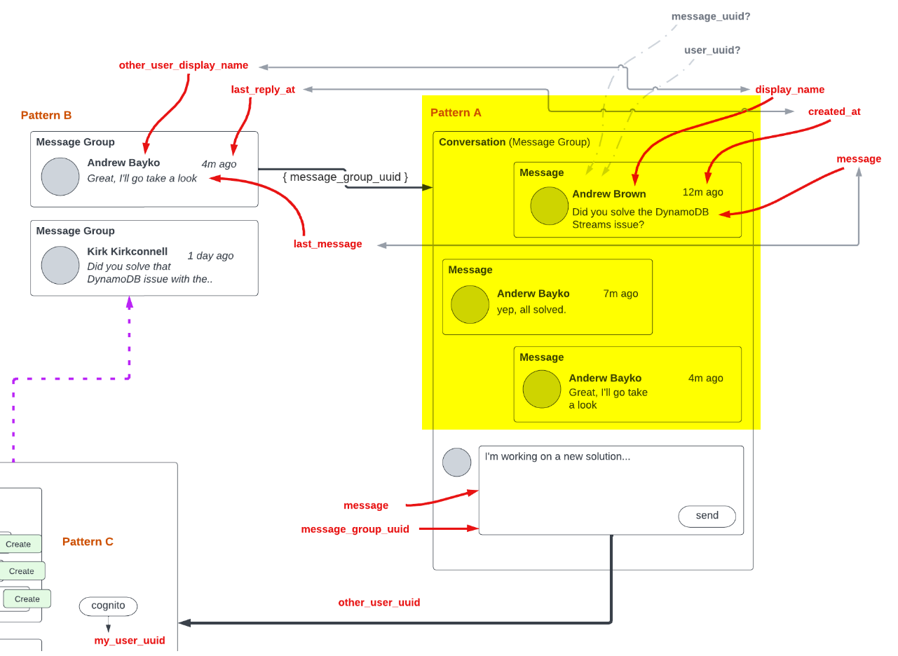

# Week 5 — DynamoDB and Serverless Caching

## Week 5 instructors

- Andrew Brown [@andrewbrown](https://twitter.com/andrewbrown)
- Shala Warner [@GiftedLane](https://twitter.com/GiftedLane) (Student Advocate)
- Kirk Kirkconnell [@NoSQLKnowHow](https://twitter.com/NoSQLKnowHow) (DynamoDB and Serverless caching)

## Class Summary

- Data Modelling a Direct Messaging System using Single Table Design
- Implementing DynamoDB query using Single Table Design
- Provisioning DynamoDB tables with Provisioned Capacity
- Utilizing a Global Secondary Index (GSI) with DynamoDB
- Rapid data modelling and implementation of DynamoDB with DynamoDB Local
- Writing utility scripts to easily setup and teardown and debug DynamoDB data

## Required tasks

- Learn about Data Modelling (Single Table Design) for NoSQL.
- Implement Schema Load Script
- Implement Seed Script
- Implement Scan Script
- Implement Pattern Scripts for Read and List Conversations
- Implement Update Cognito ID Script for Postgres Database
- Implement (Pattern A) Listing Messages in Message Group into Application
- Implement (Pattern B) Listing Messages Group into Application
- Implement (Pattern C) Creating a Message for an existing Message Group into Application
- Implement (Pattern D) Creating a Message for a new Message Group into Application
- Implement (Pattern E) Updating a Message Group using DynamoDB Streams

## Todo Checklist

### Watched Week 5 - Data Modelling (Live Stream)

https://www.youtube.com/watch?v=5oZHNOaL8Og&list=PLBfufR7vyJJ7k25byhRXJldB5AiwgNnWv&index=50

[DynamoDB Modeling](https://lucid.app/lucidchart/8f58a19d-3821-4529-920f-5bb802d6c6a3/edit?invitationId=inv_e47bc316-9caa-4aee-940f-161e01e22715#)

[Copy of DynamoDB Modelling](https://lucid.app/lucidchart/6a02b607-cf6f-45e6-85da-f48b6108d0b3/edit?viewport_loc=1796%2C544%2C2776%2C1306%2C0_0&invitationId=inv_f0655a4c-c2f2-4dc5-82ec-2d024d14d295)


Notes

> No joins in DynamoDB (in NoSQL)
> The quantity of tables depends on the design (in this case is a single table design)
> Design = what data do we need, when do we need it, what's the velocity that we need it
> Message groups = conversations
> Identify use patterns
> PartiQL: https://docs.aws.amazon.com/amazondynamodb/latest/developerguide/ql-reference.html
> DynamoDB primary keys = simple primary key o composite primary key

Livestream DynamoDB Data Modelling Excel File
https://docs.google.com/spreadsheets/d/1LrTC_y2X_YBEthFNlnwbo8TgxGlpHV3TCpM6XeVyiGg/edit#gid=0


> DynamoDB — Introduction (AWS Developer Associate 2020) https://www.youtube.com/watch?v=Ih8Bxtt5Ekw&list=PLBfufR7vyJJ5WuCNg2em7SgdAfjduqnNq&index=75

> GSI = Global Secondary Index

The Boundaries of DynamoDB

> When you write a query you have provide a Primary Key (equality) eg. pk = 'andrew'
> Are you allowed to "update" the Hash and Range?
> No, whenever you change a key (simple or composite) eg. pk or sk you have to create a new item.
> you have to delete the old one
> Key condition expressions for query only for RANGE, HASH is only equality
> Don't create UUID for entity if you don't have an access pattern for it


### Watched Ashish's Week 5 - DynamoDB Considerations

https://www.youtube.com/watch?v=gFPljPNnK2Q&list=PLBfufR7vyJJ7k25byhRXJldB5AiwgNnWv&index=52


### Implement Schema Load Script

https://www.youtube.com/watch?v=pIGi_9E_GwA&list=PLBfufR7vyJJ7k25byhRXJldB5AiwgNnWv&index=52

#### Enable local DynamoDB container

This week we will be working on DynamoDB, so we need to reenable DynamoDB container in `docker-compose.yml` file

```yml
version: "3.8"
services:
  dynamodb-local:
      # https://stackoverflow.com/questions/67533058/persist-local-dynamodb-data-in-volumes-lack-permission-unable-to-open-databa
      # We needed to add user:root to get this working.
      user: root
      command: "-jar DynamoDBLocal.jar -sharedDb -dbPath ./data"
      image: "amazon/dynamodb-local:latest"
      container_name: dynamodb-local
      ports:
        - "8000:8000"
      volumes:
        - "./docker/dynamodb:/home/dynamodblocal/data"
      working_dir: /home/dynamodblocal
```

#### Restructure db bash scripts

We will be adding scripts for DynamoDB, so for separating them from the ones already built for postgres, we will be adding a new folder. So we will restructure current scripts, moving the ones starting with db to a `db` folder, and the one starting with rds to a `rds` folder

> In `db/setup` script we need to change the referenced scripts making the same change


> We also need to change `.gitpod.yml` file, for changing the postgres initial task when starting the workspace, fixing the right script folder and name

```
  - name: postgres
    init: |
      curl -fsSL https://www.postgresql.org/media/keys/ACCC4CF8.asc|sudo gpg --dearmor -o /etc/apt/trusted.gpg.d/postgresql.gpg
      echo "deb http://apt.postgresql.org/pub/repos/apt/ `lsb_release -cs`-pgdg main" |sudo tee  /etc/apt/sources.list.d/pgdg.list
      sudo apt update
      sudo apt install -y postgresql-client-13 libpq-dev      
    command: |
      export GITPOD_IP=$(curl ifconfig.me)
      source  "$THEIA_WORKSPACE_ROOT/backend-flask/bin/rds/update-sg-rule"
```

#### Add DynamoDB bash scripts

We will add a new folder as a container for DynamoDB bash scripts

`./backend-flask/bin/ddb`

For interfacing with DynamoDB, in some scripts we will be using AWS SDK for python (Boto3), so we will need to add it to `requirements.txt` and install it

https://boto3.amazonaws.com/v1/documentation/api/latest/index.html

```txt
boto3
```

```sh
pip install -r requirements.txt
```

Also, we will add a init task for Gitpod to execute pip install on workspace initialization

`.gitpod.yml`

```yml
  - name: pip-install
    command: |
      cd backend-flask
      pip install -r requirements.txt
      exit
```


In db drop script, we will need to check first if database exists before trying to drop it

`./backend-flask/bin/db/drop`

```sh
psql $NO_DB_CONNECTION_URL -c "drop database IF EXISTS cruddur;"
```


We need to run DynamoDB container and Postgres container for using these scripts

```sh
docker compose  -f "docker-compose.yml" up -d --build db dynamodb-local
```

```
 ✔ Network aws-bootcamp-cruddur-2023_default  Created                                                                                    0.0s 
 ✔ Volume "aws-bootcamp-cruddur-2023_db"      Created                                                                                    0.0s 
 ✔ Container aws-bootcamp-cruddur-2023-db-1   Started                                                                                    0.5s 
 ✔ Container dynamodb-local                   Started 
```

Also, we need to initialize postgres database, running these scripts

```sh
./bin/db/setup
```

Result
```
==== db-setup
== db-drop
ERROR:  database "cruddur" does not exist
== db-create
CREATE DATABASE
== db-schema-load
/workspace/aws-bootcamp-cruddur-2023/backend-flask/db/schema.sql
CREATE EXTENSION
NOTICE:  table "users" does not exist, skipping
DROP TABLE
NOTICE:  table "activities" does not exist, skipping
DROP TABLE
CREATE TABLE
CREATE TABLE
== db-seed
/workspace/aws-bootcamp-cruddur-2023/backend-flask/db/seed.sql
INSERT 0 2
INSERT 0 1
```

Check that data is inserted in users table

```
== db-connect
psql (13.10 (Ubuntu 13.10-1.pgdg20.04+1))
Type "help" for help.

postgres=# \c cruddur
You are now connected to database "cruddur" as user "postgres".
cruddur=# select * from public.users;
                 uuid                 | display_name |   handle    |         email          | cognito_user_id |         created_at         
--------------------------------------+--------------+-------------+------------------------+-----------------+----------------------------
 3a28a20f-964f-42fe-8356-79804e4f753d | Andrew Brown | andrewbrown | andrewbrown@exampro.co | MOCK            | 2023-03-22 22:50:05.723748
 59e8e5e9-288b-4422-80d1-66eadd0fa162 | Andrew Bayko | bayko       | bayko@exampro.co       | MOCK            | 2023-03-22 22:50:05.723748
(2 rows)

cruddur=# \q
```


#### schema-load

The first script we will be adding is the one for creating the table with the corresponding schema, for storing cruddur messages

`./backend-flask/bin/ddb/schema-load`

```py
#!/usr/bin/env python3

import boto3
import sys

attrs = {
  'endpoint_url': 'http://localhost:8000'
}

if len(sys.argv) == 2:
  if "prod" in sys.argv[1]:
    attrs = {}

ddb = boto3.client('dynamodb',**attrs)

table_name = 'cruddur-messages'

response = ddb.create_table(
  TableName=table_name,
  AttributeDefinitions=[
    {
      'AttributeName': 'pk',
      'AttributeType': 'S'
    },
    {
      'AttributeName': 'sk',
      'AttributeType': 'S'
    },
  ],
  KeySchema=[
    {
      'AttributeName': 'pk',
      'KeyType': 'HASH'
    },
    {
      'AttributeName': 'sk',
      'KeyType': 'RANGE'
    },
  ],
  #GlobalSecondaryIndexes=[
  #],
  BillingMode='PROVISIONED',
  ProvisionedThroughput={
      'ReadCapacityUnits': 5,
      'WriteCapacityUnits': 5
  }
)

print(response)
```

> Execute permissions should be added to the new script by executing `chmod u+x ./bin/ddb/schema_load` 

> The script will be executed by python, so it should start with `#!/usr/bin/env python3`

> The default endpoint will be a localhost service

> A new table will be created in DynamoDB, using the name `cruddur-message` and with the required characteristics (attributes definitions, key schema, billing mode and provisioned throughput)

> https://docs.aws.amazon.com/amazondynamodb/latest/developerguide/GettingStarted.CreateTable.html

When executing the script, it will return information about the created table

```sh
./bin/ddb/schema-load
```

Result
```
{'TableDescription': {'AttributeDefinitions': [{'AttributeName': 'pk', 'AttributeType': 'S'}, {'AttributeName': 'sk', 'AttributeType': 'S'}], 'TableName': 'cruddur-message', 'KeySchema': [{'AttributeName': 'pk', 'KeyType': 'HASH'}, {'AttributeName': 'sk', 'KeyType': 'RANGE'}], 'TableStatus': 'ACTIVE', 'CreationDateTime': datetime.datetime(2023, 3, 21, 23, 36, 34, 261000, tzinfo=tzlocal()), 'ProvisionedThroughput': {'LastIncreaseDateTime': datetime.datetime(1970, 1, 1, 0, 0, tzinfo=tzlocal()), 'LastDecreaseDateTime': datetime.datetime(1970, 1, 1, 0, 0, tzinfo=tzlocal()), 'NumberOfDecreasesToday': 0, 'ReadCapacityUnits': 5, 'WriteCapacityUnits': 5}, 'TableSizeBytes': 0, 'ItemCount': 0, 'TableArn': 'arn:aws:dynamodb:ddblocal:000000000000:table/cruddur-message'}, 'ResponseMetadata': {'RequestId': '84448b1c-7840-4998-911e-4347f2b0c3c8', 'HTTPStatusCode': 200, 'HTTPHeaders': {'date': 'Tue, 21 Mar 2023 23:36:33 GMT', 'x-amzn-requestid': '84448b1c-7840-4998-911e-4347f2b0c3c8', 'content-type': 'application/x-amz-json-1.0', 'x-amz-crc32': '2280689091', 'content-length': '578', 'server': 'Jetty(9.4.48.v20220622)'}, 'RetryAttempts': 0}}
```


#### list-tables

Now that we have the table created in DynamoDB, we will be building a script for listing the current tables

For this script we will be using AWS CLI directly, using bash interpreter instead of python SDK

`./backend-flask/bin/ddb/list-tables`

```sh
#! /usr/bin/bash
set -e # stop if it fails at any point

if [ "$1" = "prod" ]; then
  ENDPOINT_URL=""
else
  ENDPOINT_URL="--endpoint-url=http://localhost:8000"
fi

aws dynamodb list-tables $ENDPOINT_URL \
--query TableNames \
--output table
```

> https://docs.aws.amazon.com/cli/latest/reference/dynamodb/list-tables.html

> Execute permissions should be added to the new script by executing `chmod u+x ./bin/ddb/list-tables`

```sh
./bin/ddb/list-tables
```

Result
```
----------------------
|     ListTables     |
+--------------------+
|  cruddur-messages  |
+--------------------+
```


#### drop

Another script we will be adding is the one for dropping the created table, so we can recreate it again

`./backend-flask/bin/ddb/drop`

```sh
#! /usr/bin/bash

set -e # stop if it fails at any point

if [ -z "$1" ]; then
  echo "No TABLE_NAME argument supplied eg ./bin/ddb/drop cruddur-messages prod "
  exit 1
fi
TABLE_NAME=$1

if [ "$2" = "prod" ]; then
  ENDPOINT_URL=""
else
  ENDPOINT_URL="--endpoint-url=http://localhost:8000"
fi

echo "deleting table: $TABLE_NAME"

aws dynamodb delete-table $ENDPOINT_URL \
  --table-name $TABLE_NAME
```

> In this case we are using a bash script using AWS CLI commands to delete the DynamoDB table

> https://docs.aws.amazon.com/cli/latest/reference/dynamodb/delete-table.html

> set -e allows to stop executing the script if it fails at any point

> We need to give execute permissions also to this script by executing `chmod u+x ./bin/ddb/drop`

```sh
./bin/ddb/drop cruddur-messages
```

Result
```
deleting table: cruddur-messages
{
    "TableDescription": {
        "AttributeDefinitions": [
            {
                "AttributeName": "pk",
                "AttributeType": "S"
            },
            {
                "AttributeName": "sk",
                "AttributeType": "S"
            }
        ],
        "TableName": "cruddur-messages",
        "KeySchema": [
            {
                "AttributeName": "pk",
                "KeyType": "HASH"
            },
            {
                "AttributeName": "sk",
                "KeyType": "RANGE"
            }
        ],
        "TableStatus": "ACTIVE",
        "CreationDateTime": "2023-03-22T17:14:33.241000+00:00",
        "ProvisionedThroughput": {
            "LastIncreaseDateTime": "1970-01-01T00:00:00+00:00",
            "LastDecreaseDateTime": "1970-01-01T00:00:00+00:00",
            "NumberOfDecreasesToday": 0,
            "ReadCapacityUnits": 5,
            "WriteCapacityUnits": 5
        },
        "TableSizeBytes": 0,
        "ItemCount": 0,
        "TableArn": "arn:aws:dynamodb:ddblocal:000000000000:table/cruddur-messages"
    }
}
```


### Implement Seed Script

https://www.youtube.com/watch?v=pIGi_9E_GwA&list=PLBfufR7vyJJ7k25byhRXJldB5AiwgNnWv&index=52

This script will be used for inserting initial data into DynamoDB table (cruddur-messages)

`./backend-flask/bin/ddb/seed`

```py
#!/usr/bin/env python3

import boto3
import os
import sys
from datetime import datetime, timedelta, timezone
import uuid

current_path = os.path.dirname(os.path.abspath(__file__))
parent_path = os.path.abspath(os.path.join(current_path, '..', '..'))
sys.path.append(parent_path)
from lib.db import db

attrs = {
  'endpoint_url': 'http://localhost:8000'
}

# unset endpoint url for use with production database
if len(sys.argv) == 2:
  if "prod" in sys.argv[1]:
    attrs = {}
ddb = boto3.client('dynamodb',**attrs)

def get_user_uuids():
  sql = """
    SELECT 
      users.uuid,
      users.display_name,
      users.handle
    FROM users
    WHERE
      users.handle IN(
        %(my_handle)s,
        %(other_handle)s
        )
  """
  users = db.query_array_json(sql,{
    'my_handle':  'dalvarez',
    'other_handle': 'andrewbrown'
  })
  my_user    = next((item for item in users if item["handle"] == 'dalvarez'), None)
  other_user = next((item for item in users if item["handle"] == 'andrewbrown'), None)
  results = {
    'my_user': my_user,
    'other_user': other_user
  }
  print('get_user_uuids')
  print(results)
  return results

def create_message_group(client,message_group_uuid, my_user_uuid, last_message_at=None, message=None, other_user_uuid=None, other_user_display_name=None, other_user_handle=None):
  table_name = 'cruddur-messages'
  record = {
    'pk':   {'S': f"GRP#{my_user_uuid}"},
    'sk':   {'S': last_message_at},
    'message_group_uuid': {'S': message_group_uuid},
    'message':  {'S': message},
    'user_uuid': {'S': other_user_uuid},
    'user_display_name': {'S': other_user_display_name},
    'user_handle': {'S': other_user_handle}
  }

  response = client.put_item(
    TableName=table_name,
    Item=record
  )
  print(response)

def create_message(client,message_group_uuid, created_at, message, my_user_uuid, my_user_display_name, my_user_handle):
  table_name = 'cruddur-messages'
  record = {
    'pk':   {'S': f"MSG#{message_group_uuid}"},
    'sk':   {'S': created_at },
    'message_uuid': { 'S': str(uuid.uuid4()) },
    'message': {'S': message},
    'user_uuid': {'S': my_user_uuid},
    'user_display_name': {'S': my_user_display_name},
    'user_handle': {'S': my_user_handle}
  }
  # insert the record into the table
  response = client.put_item(
    TableName=table_name,
    Item=record
  )
  # print the response
  print(response)

message_group_uuid = "5ae290ed-55d1-47a0-bc6d-fe2bc2700399" 
now = datetime.now(timezone.utc).astimezone()
users = get_user_uuids()

create_message_group(
  client=ddb,
  message_group_uuid=message_group_uuid,
  my_user_uuid=users['my_user']['uuid'],
  other_user_uuid=users['other_user']['uuid'],
  other_user_handle=users['other_user']['handle'],
  other_user_display_name=users['other_user']['display_name'],
  last_message_at=now.isoformat(),
  message="this is a filler message"
)

create_message_group(
  client=ddb,
  message_group_uuid=message_group_uuid,
  my_user_uuid=users['other_user']['uuid'],
  other_user_uuid=users['my_user']['uuid'],
  other_user_handle=users['my_user']['handle'],
  other_user_display_name=users['my_user']['display_name'],
  last_message_at=now.isoformat(),
  message="this is a filler message"
)

conversation = """
Person 1: Have you ever watched Babylon 5? It's one of my favorite TV shows!
Person 2: Yes, I have! I love it too. What's your favorite season?
Person 1: I think my favorite season has to be season 3. So many great episodes, like "Severed Dreams" and "War Without End."
Person 2: Yeah, season 3 was amazing! I also loved season 4, especially with the Shadow War heating up and the introduction of the White Star.
Person 1: Agreed, season 4 was really great as well. I was so glad they got to wrap up the storylines with the Shadows and the Vorlons in that season.
Person 2: Definitely. What about your favorite character? Mine is probably Londo Mollari.
Person 1: Londo is great! My favorite character is probably G'Kar. I loved his character development throughout the series.
Person 2: G'Kar was definitely a standout character. I also really liked Delenn's character arc and how she grew throughout the series.
Person 1: Delenn was amazing too, especially with her role in the Minbari Civil War and her relationship with Sheridan. Speaking of which, what did you think of the Sheridan character?
Person 2: I thought Sheridan was a great protagonist. He was a strong leader and had a lot of integrity. And his relationship with Delenn was so well-done.
Person 1: I totally agree! I also really liked the dynamic between Garibaldi and Bester. Those two had some great scenes together.
Person 2: Yes! Their interactions were always so intense and intriguing. And speaking of intense scenes, what did you think of the episode "Intersections in Real Time"?
Person 1: Oh man, that episode was intense. It was so well-done, but I could barely watch it. It was just too much.
Person 2: Yeah, it was definitely hard to watch. But it was also one of the best episodes of the series in my opinion.
Person 1: Absolutely. Babylon 5 had so many great episodes like that. Do you have a favorite standalone episode?
Person 2: Hmm, that's a tough one. I really loved "The Coming of Shadows" in season 2, but "A Voice in the Wilderness" in season 1 was also great. What about you?
Person 1: I think my favorite standalone episode might be "The Long Twilight Struggle" in season 2. It had some great moments with G'Kar and Londo.
Person 2: Yes, "The Long Twilight Struggle" was definitely a standout episode. Babylon 5 really had so many great episodes and moments throughout its run.
Person 1: Definitely. It's a shame it ended after only five seasons, but I'm glad we got the closure we did with the series finale.
Person 2: Yeah, the series finale was really well-done. It tied up a lot of loose ends and left us with a great sense of closure.
Person 1: It really did. Overall, Babylon 5 is just such a great show with fantastic characters, writing, and world-building.
Person 2: Agreed. It's one of my favorite sci-fi shows of all time and I'm always happy to revisit it.
Person 1: Same here. I think one of the things that makes Babylon 5 so special is its emphasis on politics and diplomacy. It's not just a show about space battles and aliens, but about the complex relationships between different species and their political maneuvering.
Person 2: Yes, that's definitely one of the show's strengths. And it's not just about big-picture politics, but also about personal relationships and the choices characters make.
Person 1: Exactly. I love how Babylon 5 explores themes of redemption, forgiveness, and sacrifice. Characters like G'Kar and Londo have such compelling arcs that are driven by their choices and actions.
Person 2: Yes, the character development in Babylon 5 is really top-notch. Even minor characters like Vir and Franklin get their moments to shine and grow over the course of the series.
Person 1: I couldn't agree more. And the way the show handles its themes is so nuanced and thought-provoking. For example, the idea of "the one" and how it's used by different characters in different ways.
Person 2: Yes, that's a really interesting theme to explore. And it's not just a one-dimensional concept, but something that's explored in different contexts and with different characters.
Person 1: And the show also does a great job of balancing humor and drama. There are so many funny moments in the show, but it never detracts from the serious themes and the high stakes.
Person 2: Absolutely. The humor is always organic and never feels forced. And the show isn't afraid to go dark when it needs to, like in "Intersections in Real Time" or the episode "Sleeping in Light."
Person 1: Yeah, those episodes are definitely tough to watch, but they're also some of the most powerful and memorable episodes of the series. And it's not just the writing that's great, but also the acting and the production values.
Person 2: Yes, the acting is fantastic across the board. From Bruce Boxleitner's performance as Sheridan to Peter Jurasik's portrayal of Londo, every actor brings their A-game. And the production design and special effects are really impressive for a TV show from the 90s.
Person 1: Definitely. Babylon 5 was really ahead of its time in terms of its visuals and special effects. And the fact that it was all done on a TV budget makes it even more impressive.
Person 2: Yeah, it's amazing what they were able to accomplish with the limited resources they had. It just goes to show how talented the people behind the show were.
Person 1: Agreed. It's no wonder that Babylon 5 has such a devoted fanbase, even all these years later. It's just such a well-crafted and timeless show.
Person 2: Absolutely. I'm glad we can still appreciate it and talk about it all these years later. It really is a show that stands the test of time.
Person 1: One thing I really appreciate about Babylon 5 is how it handles diversity and representation. It has a really diverse cast of characters from different species and backgrounds, and it doesn't shy away from exploring issues of prejudice and discrimination.
Person 2: Yes, that's a great point. The show was really ahead of its time in terms of its diverse cast and the way it tackled issues of race, gender, and sexuality. And it did so in a way that felt natural and integrated into the story.
Person 1: Definitely. It's great to see a show that's not afraid to tackle these issues head-on and address them in a thoughtful and nuanced way. And it's not just about representation, but also about exploring different cultures and ways of life.
Person 2: Yes, the show does a great job of world-building and creating distinct cultures for each of the species. And it's not just about their physical appearance, but also about their customs, beliefs, and values.
Person 1: Absolutely. It's one of the things that sets Babylon 5 apart from other sci-fi shows. The attention to detail and the thought that went into creating this universe is really impressive.
Person 2: And it's not just the aliens that are well-developed, but also the human characters. The show explores the different factions and political ideologies within EarthGov, as well as the different cultures and traditions on Earth.
Person 1: Yes, that's another great aspect of the show. It's not just about the conflicts between different species, but also about the internal struggles within humanity. And it's all tied together by the overarching plot of the Shadow War and the fate of the galaxy.
Person 2: Definitely. The show does a great job of balancing the episodic stories with the larger arc, so that every episode feels important and contributes to the overall narrative.
Person 1: And the show is also great at building up tension and suspense. The slow burn of the Shadow War and the mystery of the Vorlons and the Shadows kept me on the edge of my seat throughout the series.
Person 2: Yes, the show is really good at building up anticipation and delivering satisfying payoffs. Whether it's the resolution of a character arc or the climax of a season-long plotline, Babylon 5 always delivers.
Person 1: Agreed. It's just such a well-crafted and satisfying show, with so many memorable moments and characters. I'm really glad we got to talk about it today.
Person 2: Me too. It's always great to geek out about Babylon 5 with someone who appreciates it as much as I do!
Person 1: Yeah, it's always fun to discuss our favorite moments and characters from the show. And there are so many great moments to choose from!
Person 2: Definitely. I think one of the most memorable moments for me was the "goodbye" scene between G'Kar and Londo in the episode "Objects at Rest." It was such a poignant and emotional moment, and it really showed how far their characters had come.
Person 1: Yes, that was a really powerful scene. It was great to see these two former enemies come together and find common ground. And it was a great way to wrap up their character arcs.
Person 2: Another memorable moment for me was the speech that Sheridan gives in "Severed Dreams." It's such an iconic moment in the show, and it really encapsulates the themes of the series.
Person 1: Yes, that speech is definitely one of the highlights of the series. It's so well-written and well-delivered, and it really captures the sense of hope and defiance that the show is all about.
Person 2: And speaking of great speeches, what did you think of the "Ivanova is always right" speech from "Moments of Transition"?
Person 1: Oh man, that speech gives me chills every time I watch it. It's such a powerful moment for Ivanova, and it really shows her strength and determination as a leader.
Person 2: Yes, that speech is definitely a standout moment for Ivanova's character. And it's just one example of the great writing and character development in the show.
Person 1: Absolutely. It's a testament to the talent of the writers and actors that they were able to create such rich and complex characters with so much depth and nuance.
Person 2: And it's not just the main characters that are well-developed, but also the supporting characters like Marcus, Zack, and Lyta. They all have their own stories and struggles, and they all contribute to the larger narrative in meaningful ways.
Person 1: Definitely. Babylon 5 is just such a well-rounded and satisfying show in every way. It's no wonder that it's still beloved by fans all these years later.
Person 2: Agreed. It's a show that has stood the test of time, and it will always hold a special place in my heart as one of my favorite TV shows of all time.
Person 1: One of the most interesting ethical dilemmas presented in Babylon 5 is the treatment of the Narn by the Centauri. What do you think about that storyline?
Person 2: Yeah, it's definitely a difficult issue to grapple with. On the one hand, the Centauri were portrayed as the aggressors, and their treatment of the Narn was brutal and unjust. But on the other hand, the show also presented some nuance to the situation, with characters like Londo and Vir struggling with their own complicity in the conflict.
Person 1: Exactly. I think one of the strengths of the show is its willingness to explore complex ethical issues like this. It's not just about good guys versus bad guys, but about the shades of grey in between.
Person 2: Yeah, and it raises interesting questions about power and oppression. The Centauri had more advanced technology and military might than the Narn, which allowed them to dominate and subjugate the Narn people. But at the same time, there were also political and economic factors at play that contributed to the conflict.
Person 1: And it's not just about the actions of the Centauri government, but also about the actions of individual characters. Londo, for example, was initially portrayed as a somewhat sympathetic character, but as the series progressed, we saw how his choices and actions contributed to the suffering of the Narn people.
Person 2: Yes, and that raises interesting questions about personal responsibility and accountability. Can an individual be held responsible for the actions of their government or their society? And if so, to what extent?
Person 1: That's a really good point. And it's also interesting to consider the role of empathy and compassion in situations like this. Characters like G'Kar and Delenn showed compassion towards the Narn people and fought against their oppression, while others like Londo and Cartagia were more indifferent or even sadistic in their treatment of the Narn.
Person 2: Yeah, and that raises the question of whether empathy and compassion are innate traits, or whether they can be cultivated through education and exposure to different cultures and perspectives.
Person 1: Definitely. And it's also worth considering the role of forgiveness and reconciliation. The Narn and Centauri eventually came to a sort of reconciliation in the aftermath of the Shadow War, but it was a difficult and painful process that required a lot of sacrifice and forgiveness on both sides.
Person 2: Yes, and that raises the question of whether forgiveness is always possible or appropriate in situations of oppression and injustice. Can the victims of such oppression ever truly forgive their oppressors, or is that too much to ask?
Person 1: It's a tough question to answer. I think the show presents a hopeful message in the end, with characters like G'Kar and Londo finding a measure of redemption and reconciliation. But it's also clear that the scars of the conflict run deep and that healing takes time and effort.
Person 2: Yeah, that's a good point. Ultimately, I think the show's treatment of the Narn-Centauri conflict raises more questions than it answers, which is a testament to its complexity and nuance. It's a difficult issue to grapple with, but one that's worth exploring and discussing.
Person 1: Let's switch gears a bit and talk about the character of Natasha Alexander. What did you think about her role in the series?
Person 2: I thought Natasha Alexander was a really interesting character. She was a tough and competent security officer, but she also had a vulnerable side and a complicated past.
Person 1: Yeah, I agree. I think she added a lot of depth to the show and was a great foil to characters like Garibaldi and Zack.
Person 2: And I also appreciated the way the show handled her relationship with Garibaldi. It was clear that they had a history and a lot of unresolved tension, but the show never made it too melodramatic or over-the-top.
Person 1: That's a good point. I think the show did a good job of balancing the personal drama with the larger political and sci-fi elements. And it was refreshing to see a female character who was just as tough and competent as the male characters.
Person 2: Definitely. I think Natasha Alexander was a great example of a well-written and well-rounded female character. She wasn't just there to be eye candy or a love interest, but had her own story and agency.
Person 1: However, I did feel like the show could have done more with her character. She was introduced fairly late in the series, and didn't have as much screen time as some of the other characters.
Person 2: That's true. I think the show had a lot of characters to juggle, and sometimes that meant some characters got sidelined or didn't get as much development as they deserved.
Person 1: And I also thought that her storyline with Garibaldi could have been developed a bit more. They had a lot of history and tension between them, but it felt like it was resolved too quickly and neatly.
Person 2: I can see where you're coming from, but I also appreciated the way the show didn't drag out the drama unnecessarily. It was clear that they both had feelings for each other, but they also had to focus on their jobs and the larger conflicts at play.
Person 1: I can see that perspective as well. Overall, I think Natasha Alexander was a great addition to the show and added a lot of value to the series. It's a shame we didn't get to see more of her.
Person 2: Agreed. But at least the show was able to give her a satisfying arc and resolution in the end. And that's a testament to the show's strength as a whole.
Person 1: One thing that really stands out about Babylon 5 is the quality of the special effects. What did you think about the show's use of CGI and other visual effects?
Person 2: I thought the special effects in Babylon 5 were really impressive, especially for a show that aired in the 90s. The use of CGI to create the spaceships and other sci-fi elements was really innovative for its time.
Person 1: Yes, I was really blown away by the level of detail and realism in the effects. The ships looked so sleek and futuristic, and the space battles were really intense and exciting.
Person 2: And I also appreciated the way the show integrated the visual effects with the live-action footage. It never felt like the effects were taking over or overshadowing the characters or the story.
Person 1: Absolutely. The show had a great balance of practical effects and CGI, which helped to ground the sci-fi elements in a more tangible and realistic world.
Person 2: And it's also worth noting the way the show's use of visual effects evolved over the course of the series. The effects in the first season were a bit rough around the edges, but by the end of the series, they had really refined and perfected the look and feel of the show.
Person 1: Yes, I agree. And it's impressive how they were able to accomplish all of this on a TV budget. The fact that the show was able to create such a rich and immersive sci-fi universe with limited resources is a testament to the talent and creativity of the production team.
Person 2: Definitely. And it's one of the reasons why the show has aged so well. Even today, the visual effects still hold up and look impressive, which is a rarity for a show that's almost 30 years old.
Person 1: Agreed. And it's also worth noting the way the show's use of visual effects influenced other sci-fi shows that came after it. Babylon 5 really set the bar for what was possible in terms of sci-fi visuals on TV.
Person 2: Yes, it definitely had a big impact on the genre as a whole. And it's a great example of how innovative and groundbreaking sci-fi can be when it's done right.
Person 1: Another character I wanted to discuss is Zathras. What did you think of his character?
Person 2: Zathras was a really unique and memorable character. He was quirky and eccentric, but also had a lot of heart and sincerity.
Person 1: Yes, I thought he was a great addition to the show. He added some much-needed comic relief, but also had some important moments of character development.
Person 2: And I appreciated the way the show used him as a sort of plot device, with his knowledge of time and space being instrumental in the resolution of some of the show's major storylines.
Person 1: Definitely. It was a great way to integrate a seemingly minor character into the larger narrative. And it was also interesting to see the different versions of Zathras from different points in time.
Person 2: Yeah, that was a clever storytelling device that really added to the sci-fi elements of the show. And it was also a great showcase for actor Tim Choate, who played the character with so much charm and energy.
Person 1: I also thought that Zathras was a great example of the show's commitment to creating memorable and unique characters. Even characters that only appeared in a few episodes, like Zathras or Bester, were given distinct personalities and backstories.
Person 2: Yes, that's a good point. Babylon 5 was really great at creating a diverse and interesting cast of characters, with each one feeling like a fully-realized and distinct individual.
Person 1: And Zathras was just one example of that. He was a small but important part of the show's legacy, and he's still remembered fondly by fans today.
Person 2: Definitely. I think his character is a great example of the show's ability to balance humor and heart, and to create memorable and beloved characters that fans will cherish for years to come.
"""


lines = conversation.lstrip('\n').rstrip('\n').split('\n')
for i in range(len(lines)):
  if lines[i].startswith('Person 1: '):
    key = 'my_user'
    message = lines[i].replace('Person 1: ', '')
  elif lines[i].startswith('Person 2: '):
    key = 'other_user'
    message = lines[i].replace('Person 2: ', '')
  else:
    print(lines[i])
    raise 'invalid line'

  created_at = (now + timedelta(minutes=i)).isoformat()
  create_message(
    client=ddb,
    message_group_uuid=message_group_uuid,
    created_at=created_at,
    message=message,
    my_user_uuid=users[key]['uuid'],
    my_user_display_name=users[key]['display_name'],
    my_user_handle=users[key]['handle']
  )
```

> This script will use a predefined conversation, retrieve already configured users in postgres and create the corresponding messages in DynamoDB

> postgres container should be running because it retrieves the users from db

> It uses AWS SDK for python

> https://boto3.amazonaws.com/v1/documentation/api/latest/reference/services/dynamodb/client/put_item.html

> We need to give execute permissions also to this script by executing `chmod u+x ./bin/ddb/seed`

```sh
./bin/ddb/seed
```

Result
```
 SQL STATEMENT-[array]------

    SELECT 
      users.uuid,
      users.display_name,
      users.handle
    FROM users
    WHERE
      users.handle IN(
        %(my_handle)s,
        %(other_handle)s
        )
   {'my_handle': 'dalvarez', 'other_handle': 'andrewbrown'}
get_user_uuids
{'my_user': {'uuid': '30c03753-7a8e-4662-ac47-eaa07d79fe8a', 'display_name': 'Daniel Alvarez', 'handle': 'dalvarez'}, 'other_user': {'uuid': '541f237b-79bc-4a29-af21-34161c832270', 'display_name': 'Andrew Brown', 'handle': 'andrewbrown'}}
{'ResponseMetadata': {'RequestId': '20fec70c-2152-476c-9aba-44bd9a735b14', 'HTTPStatusCode': 200, 'HTTPHeaders': {'date': 'Mon, 27 Mar 2023 19:50:10 GMT', 'x-amzn-requestid': '20fec70c-2152-476c-9aba-44bd9a735b14', 'content-type': 'application/x-amz-json-1.0', 'x-amz-crc32': '2745614147', 'content-length': '2', 'server': 'Jetty(9.4.48.v20220622)'}, 'RetryAttempts': 0}}
{'ResponseMetadata': {'RequestId': '64a4ec5d-d59d-4efd-becb-f6ff8b066c1e', 'HTTPStatusCode': 200, 'HTTPHeaders': {'date': 'Mon, 27 Mar 2023 19:50:10 GMT', 'x-amzn-requestid': '64a4ec5d-d59d-4efd-becb-f6ff8b066c1e', 'content-type': 'application/x-amz-json-1.0', 'x-amz-crc32': '2745614147', 'content-length': '2', 'server': 'Jetty(9.4.48.v20220622)'}, 'RetryAttempts': 0}}
{'ResponseMetadata': {'RequestId': '539b86b0-2943-4584-94d5-dc188c2f5fc9', 'HTTPStatusCode': 200, 'HTTPHeaders': {'date': 'Mon, 27 Mar 2023 19:50:10 GMT', 'x-amzn-requestid': '539b86b0-2943-4584-94d5-dc188c2f5fc9', 'content-type': 'application/x-amz-json-1.0', 'x-amz-crc32': '2745614147', 'content-length': '2', 'server': 'Jetty(9.4.48.v20220622)'}, 'RetryAttempts': 0}}
{'ResponseMetadata': {'RequestId': '95c1422c-43aa-4ad1-8932-946d30aa704c', 'HTTPStatusCode': 200, 'HTTPHeaders': {'date': 'Mon, 27 Mar 2023 19:50:10 GMT', 'x-amzn-requestid': '95c1422c-43aa-4ad1-8932-946d30aa704c', 'content-type': 'application/x-amz-json-1.0', 'x-amz-crc32': '2745614147', 'content-length': '2', 'server': 'Jetty(9.4.48.v20220622)'}, 'RetryAttempts': 0}}
{'ResponseMetadata': {'RequestId': '40b60365-5b02-4e56-9e4e-6644c7002df4', 'HTTPStatusCode': 200, 'HTTPHeaders': {'date': 'Mon, 27 Mar 2023 19:50:10 GMT', 'x-amzn-requestid': '40b60365-5b02-4e56-9e4e-6644c7002df4', 'content-type': 'application/x-amz-json-1.0', 'x-amz-crc32': '2745614147', 'content-length': '2', 'server': 'Jetty(9.4.48.v20220622)'}, 'RetryAttempts': 0}}
{'ResponseMetadata': {'RequestId': 'ae9e3992-b64f-45af-999a-39d012018f79', 'HTTPStatusCode': 200, 'HTTPHeaders': {'date': 'Mon, 27 Mar 2023 19:50:10 GMT', 'x-amzn-requestid': 'ae9e3992-b64f-45af-999a-39d012018f79', 'content-type': 'application/x-amz-json-1.0', 'x-amz-crc32': '2745614147', 'content-length': '2', 'server': 'Jetty(9.4.48.v20220622)'}, 'RetryAttempts': 0}}
{'ResponseMetadata': {'RequestId': 'c015381a-e9cf-4d48-85c5-3a6c6c40bfa9', 'HTTPStatusCode': 200, 'HTTPHeaders': {'date': 'Mon, 27 Mar 2023 19:50:10 GMT', 'x-amzn-requestid': 'c015381a-e9cf-4d48-85c5-3a6c6c40bfa9', 'content-type': 'application/x-amz-json-1.0', 'x-amz-crc32': '2745614147', 'content-length': '2', 'server': 'Jetty(9.4.48.v20220622)'}, 'RetryAttempts': 0}}
{'ResponseMetadata': {'RequestId': '3f33b2ba-c5fa-48b9-9941-6d6da5355645', 'HTTPStatusCode': 200, 'HTTPHeaders': {'date': 'Mon, 27 Mar 2023 19:50:10 GMT', 'x-amzn-requestid': '3f33b2ba-c5fa-48b9-9941-6d6da5355645', 'content-type': 'application/x-amz-json-1.0', 'x-amz-crc32': '2745614147', 'content-length': '2', 'server': 'Jetty(9.4.48.v20220622)'}, 'RetryAttempts': 0}}
{'ResponseMetadata': {'RequestId': 'aeb07be2-9451-4115-9f6f-3c8bc5dfff1d', 'HTTPStatusCode': 200, 'HTTPHeaders': {'date': 'Mon, 27 Mar 2023 19:50:10 GMT', 'x-amzn-requestid': 'aeb07be2-9451-4115-9f6f-3c8bc5dfff1d', 'content-type': 'application/x-amz-json-1.0', 'x-amz-crc32': '2745614147', 'content-length': '2', 'server': 'Jetty(9.4.48.v20220622)'}, 'RetryAttempts': 0}}
{'ResponseMetadata': {'RequestId': 'ba7ec058-483a-45b5-8b1e-98cd94166ddc', 'HTTPStatusCode': 200, 'HTTPHeaders': {'date': 'Mon, 27 Mar 2023 19:50:10 GMT', 'x-amzn-requestid': 'ba7ec058-483a-45b5-8b1e-98cd94166ddc', 'content-type': 'application/x-amz-json-1.0', 'x-amz-crc32': '2745614147', 'content-length': '2', 'server': 'Jetty(9.4.48.v20220622)'}, 'RetryAttempts': 0}}
{'ResponseMetadata': {'RequestId': 'd06e64d8-47ac-42f1-aec6-ae1e545e742b', 'HTTPStatusCode': 200, 'HTTPHeaders': {'date': 'Mon, 27 Mar 2023 19:50:10 GMT', 'x-amzn-requestid': 'd06e64d8-47ac-42f1-aec6-ae1e545e742b', 'content-type': 'application/x-amz-json-1.0', 'x-amz-crc32': '2745614147', 'content-length': '2', 'server': 'Jetty(9.4.48.v20220622)'}, 'RetryAttempts': 0}}
{'ResponseMetadata': {'RequestId': 'd2d59074-3b49-4301-a5f4-018f920d3b45', 'HTTPStatusCode': 200, 'HTTPHeaders': {'date': 'Mon, 27 Mar 2023 19:50:10 GMT', 'x-amzn-requestid': 'd2d59074-3b49-4301-a5f4-018f920d3b45', 'content-type': 'application/x-amz-json-1.0', 'x-amz-crc32': '2745614147', 'content-length': '2', 'server': 'Jetty(9.4.48.v20220622)'}, 'RetryAttempts': 0}}
{'ResponseMetadata': {'RequestId': 'a03c3c9b-596a-4124-b37b-50e98b462b2e', 'HTTPStatusCode': 200, 'HTTPHeaders': {'date': 'Mon, 27 Mar 2023 19:50:10 GMT', 'x-amzn-requestid': 'a03c3c9b-596a-4124-b37b-50e98b462b2e', 'content-type': 'application/x-amz-json-1.0', 'x-amz-crc32': '2745614147', 'content-length': '2', 'server': 'Jetty(9.4.48.v20220622)'}, 'RetryAttempts': 0}}
{'ResponseMetadata': {'RequestId': '6c8154d7-3d78-45aa-948b-ca53e92e85ac', 'HTTPStatusCode': 200, 'HTTPHeaders': {'date': 'Mon, 27 Mar 2023 19:50:10 GMT', 'x-amzn-requestid': '6c8154d7-3d78-45aa-948b-ca53e92e85ac', 'content-type': 'application/x-amz-json-1.0', 'x-amz-crc32': '2745614147', 'content-length': '2', 'server': 'Jetty(9.4.48.v20220622)'}, 'RetryAttempts': 0}}
{'ResponseMetadata': {'RequestId': '477917e9-d658-4d44-9262-619d5e7e3793', 'HTTPStatusCode': 200, 'HTTPHeaders': {'date': 'Mon, 27 Mar 2023 19:50:10 GMT', 'x-amzn-requestid': '477917e9-d658-4d44-9262-619d5e7e3793', 'content-type': 'application/x-amz-json-1.0', 'x-amz-crc32': '2745614147', 'content-length': '2', 'server': 'Jetty(9.4.48.v20220622)'}, 'RetryAttempts': 0}}
{'ResponseMetadata': {'RequestId': 'd16bc32c-fb72-496b-9e5c-c1c8aeede61f', 'HTTPStatusCode': 200, 'HTTPHeaders': {'date': 'Mon, 27 Mar 2023 19:50:10 GMT', 'x-amzn-requestid': 'd16bc32c-fb72-496b-9e5c-c1c8aeede61f', 'content-type': 'application/x-amz-json-1.0', 'x-amz-crc32': '2745614147', 'content-length': '2', 'server': 'Jetty(9.4.48.v20220622)'}, 'RetryAttempts': 0}}
{'ResponseMetadata': {'RequestId': 'd82c5dcc-8cfa-4061-b8c7-31d394b882ae', 'HTTPStatusCode': 200, 'HTTPHeaders': {'date': 'Mon, 27 Mar 2023 19:50:10 GMT', 'x-amzn-requestid': 'd82c5dcc-8cfa-4061-b8c7-31d394b882ae', 'content-type': 'application/x-amz-json-1.0', 'x-amz-crc32': '2745614147', 'content-length': '2', 'server': 'Jetty(9.4.48.v20220622)'}, 'RetryAttempts': 0}}
{'ResponseMetadata': {'RequestId': '94c3c84f-298f-46fd-ad6f-8a6575e2c844', 'HTTPStatusCode': 200, 'HTTPHeaders': {'date': 'Mon, 27 Mar 2023 19:50:10 GMT', 'x-amzn-requestid': '94c3c84f-298f-46fd-ad6f-8a6575e2c844', 'content-type': 'application/x-amz-json-1.0', 'x-amz-crc32': '2745614147', 'content-length': '2', 'server': 'Jetty(9.4.48.v20220622)'}, 'RetryAttempts': 0}}
{'ResponseMetadata': {'RequestId': '1d81ac16-2b8f-4db4-9565-1abcc8bd3d7b', 'HTTPStatusCode': 200, 'HTTPHeaders': {'date': 'Mon, 27 Mar 2023 19:50:10 GMT', 'x-amzn-requestid': '1d81ac16-2b8f-4db4-9565-1abcc8bd3d7b', 'content-type': 'application/x-amz-json-1.0', 'x-amz-crc32': '2745614147', 'content-length': '2', 'server': 'Jetty(9.4.48.v20220622)'}, 'RetryAttempts': 0}}
{'ResponseMetadata': {'RequestId': 'ebf4924c-fc75-4613-8174-abcdc578015f', 'HTTPStatusCode': 200, 'HTTPHeaders': {'date': 'Mon, 27 Mar 2023 19:50:10 GMT', 'x-amzn-requestid': 'ebf4924c-fc75-4613-8174-abcdc578015f', 'content-type': 'application/x-amz-json-1.0', 'x-amz-crc32': '2745614147', 'content-length': '2', 'server': 'Jetty(9.4.48.v20220622)'}, 'RetryAttempts': 0}}
{'ResponseMetadata': {'RequestId': '045f2eca-db33-463c-9b20-cac7487f1949', 'HTTPStatusCode': 200, 'HTTPHeaders': {'date': 'Mon, 27 Mar 2023 19:50:10 GMT', 'x-amzn-requestid': '045f2eca-db33-463c-9b20-cac7487f1949', 'content-type': 'application/x-amz-json-1.0', 'x-amz-crc32': '2745614147', 'content-length': '2', 'server': 'Jetty(9.4.48.v20220622)'}, 'RetryAttempts': 0}}
{'ResponseMetadata': {'RequestId': '94d5f881-947f-433c-9751-e3f543b0ad42', 'HTTPStatusCode': 200, 'HTTPHeaders': {'date': 'Mon, 27 Mar 2023 19:50:10 GMT', 'x-amzn-requestid': '94d5f881-947f-433c-9751-e3f543b0ad42', 'content-type': 'application/x-amz-json-1.0', 'x-amz-crc32': '2745614147', 'content-length': '2', 'server': 'Jetty(9.4.48.v20220622)'}, 'RetryAttempts': 0}}
{'ResponseMetadata': {'RequestId': '648575e4-46e7-4bdd-a684-a3275793b224', 'HTTPStatusCode': 200, 'HTTPHeaders': {'date': 'Mon, 27 Mar 2023 19:50:10 GMT', 'x-amzn-requestid': '648575e4-46e7-4bdd-a684-a3275793b224', 'content-type': 'application/x-amz-json-1.0', 'x-amz-crc32': '2745614147', 'content-length': '2', 'server': 'Jetty(9.4.48.v20220622)'}, 'RetryAttempts': 0}}
{'ResponseMetadata': {'RequestId': '35e60981-55ad-49a6-902f-998dfc148b01', 'HTTPStatusCode': 200, 'HTTPHeaders': {'date': 'Mon, 27 Mar 2023 19:50:10 GMT', 'x-amzn-requestid': '35e60981-55ad-49a6-902f-998dfc148b01', 'content-type': 'application/x-amz-json-1.0', 'x-amz-crc32': '2745614147', 'content-length': '2', 'server': 'Jetty(9.4.48.v20220622)'}, 'RetryAttempts': 0}}
{'ResponseMetadata': {'RequestId': '1c0d8330-a953-4917-848e-779b281e2b86', 'HTTPStatusCode': 200, 'HTTPHeaders': {'date': 'Mon, 27 Mar 2023 19:50:10 GMT', 'x-amzn-requestid': '1c0d8330-a953-4917-848e-779b281e2b86', 'content-type': 'application/x-amz-json-1.0', 'x-amz-crc32': '2745614147', 'content-length': '2', 'server': 'Jetty(9.4.48.v20220622)'}, 'RetryAttempts': 0}}
{'ResponseMetadata': {'RequestId': '862b3d86-fa6b-4aac-ac1f-c7d047699665', 'HTTPStatusCode': 200, 'HTTPHeaders': {'date': 'Mon, 27 Mar 2023 19:50:10 GMT', 'x-amzn-requestid': '862b3d86-fa6b-4aac-ac1f-c7d047699665', 'content-type': 'application/x-amz-json-1.0', 'x-amz-crc32': '2745614147', 'content-length': '2', 'server': 'Jetty(9.4.48.v20220622)'}, 'RetryAttempts': 0}}
{'ResponseMetadata': {'RequestId': 'ffa8facc-954a-46a7-b23e-733ba8d50817', 'HTTPStatusCode': 200, 'HTTPHeaders': {'date': 'Mon, 27 Mar 2023 19:50:10 GMT', 'x-amzn-requestid': 'ffa8facc-954a-46a7-b23e-733ba8d50817', 'content-type': 'application/x-amz-json-1.0', 'x-amz-crc32': '2745614147', 'content-length': '2', 'server': 'Jetty(9.4.48.v20220622)'}, 'RetryAttempts': 0}}
{'ResponseMetadata': {'RequestId': 'bce56485-6e6a-499e-8d5f-d3dd749269cd', 'HTTPStatusCode': 200, 'HTTPHeaders': {'date': 'Mon, 27 Mar 2023 19:50:10 GMT', 'x-amzn-requestid': 'bce56485-6e6a-499e-8d5f-d3dd749269cd', 'content-type': 'application/x-amz-json-1.0', 'x-amz-crc32': '2745614147', 'content-length': '2', 'server': 'Jetty(9.4.48.v20220622)'}, 'RetryAttempts': 0}}
{'ResponseMetadata': {'RequestId': '48d1b364-f83c-4fb5-babd-13ad6c0c253a', 'HTTPStatusCode': 200, 'HTTPHeaders': {'date': 'Mon, 27 Mar 2023 19:50:10 GMT', 'x-amzn-requestid': '48d1b364-f83c-4fb5-babd-13ad6c0c253a', 'content-type': 'application/x-amz-json-1.0', 'x-amz-crc32': '2745614147', 'content-length': '2', 'server': 'Jetty(9.4.48.v20220622)'}, 'RetryAttempts': 0}}
{'ResponseMetadata': {'RequestId': '687ddb1f-698d-4fd6-b73e-cbc9b197e00a', 'HTTPStatusCode': 200, 'HTTPHeaders': {'date': 'Mon, 27 Mar 2023 19:50:10 GMT', 'x-amzn-requestid': '687ddb1f-698d-4fd6-b73e-cbc9b197e00a', 'content-type': 'application/x-amz-json-1.0', 'x-amz-crc32': '2745614147', 'content-length': '2', 'server': 'Jetty(9.4.48.v20220622)'}, 'RetryAttempts': 0}}
{'ResponseMetadata': {'RequestId': '4525ca70-e883-4853-bcd4-e30a679ed8dd', 'HTTPStatusCode': 200, 'HTTPHeaders': {'date': 'Mon, 27 Mar 2023 19:50:10 GMT', 'x-amzn-requestid': '4525ca70-e883-4853-bcd4-e30a679ed8dd', 'content-type': 'application/x-amz-json-1.0', 'x-amz-crc32': '2745614147', 'content-length': '2', 'server': 'Jetty(9.4.48.v20220622)'}, 'RetryAttempts': 0}}
{'ResponseMetadata': {'RequestId': '3d164e3a-c4f4-4356-ab13-b42debc15405', 'HTTPStatusCode': 200, 'HTTPHeaders': {'date': 'Mon, 27 Mar 2023 19:50:10 GMT', 'x-amzn-requestid': '3d164e3a-c4f4-4356-ab13-b42debc15405', 'content-type': 'application/x-amz-json-1.0', 'x-amz-crc32': '2745614147', 'content-length': '2', 'server': 'Jetty(9.4.48.v20220622)'}, 'RetryAttempts': 0}}
{'ResponseMetadata': {'RequestId': '15def589-6990-42ac-9c12-49f7985bb0e9', 'HTTPStatusCode': 200, 'HTTPHeaders': {'date': 'Mon, 27 Mar 2023 19:50:10 GMT', 'x-amzn-requestid': '15def589-6990-42ac-9c12-49f7985bb0e9', 'content-type': 'application/x-amz-json-1.0', 'x-amz-crc32': '2745614147', 'content-length': '2', 'server': 'Jetty(9.4.48.v20220622)'}, 'RetryAttempts': 0}}
{'ResponseMetadata': {'RequestId': '316610ad-a1b0-4c4a-b60b-0f572042e70b', 'HTTPStatusCode': 200, 'HTTPHeaders': {'date': 'Mon, 27 Mar 2023 19:50:10 GMT', 'x-amzn-requestid': '316610ad-a1b0-4c4a-b60b-0f572042e70b', 'content-type': 'application/x-amz-json-1.0', 'x-amz-crc32': '2745614147', 'content-length': '2', 'server': 'Jetty(9.4.48.v20220622)'}, 'RetryAttempts': 0}}
{'ResponseMetadata': {'RequestId': '90e425ea-ff16-4fd4-88c3-35810a14678d', 'HTTPStatusCode': 200, 'HTTPHeaders': {'date': 'Mon, 27 Mar 2023 19:50:10 GMT', 'x-amzn-requestid': '90e425ea-ff16-4fd4-88c3-35810a14678d', 'content-type': 'application/x-amz-json-1.0', 'x-amz-crc32': '2745614147', 'content-length': '2', 'server': 'Jetty(9.4.48.v20220622)'}, 'RetryAttempts': 0}}
{'ResponseMetadata': {'RequestId': '041afdaa-773b-4054-8bb0-99c160e53f86', 'HTTPStatusCode': 200, 'HTTPHeaders': {'date': 'Mon, 27 Mar 2023 19:50:10 GMT', 'x-amzn-requestid': '041afdaa-773b-4054-8bb0-99c160e53f86', 'content-type': 'application/x-amz-json-1.0', 'x-amz-crc32': '2745614147', 'content-length': '2', 'server': 'Jetty(9.4.48.v20220622)'}, 'RetryAttempts': 0}}
{'ResponseMetadata': {'RequestId': '9b5e3d92-4195-4bcd-9fd8-31ce5834be85', 'HTTPStatusCode': 200, 'HTTPHeaders': {'date': 'Mon, 27 Mar 2023 19:50:10 GMT', 'x-amzn-requestid': '9b5e3d92-4195-4bcd-9fd8-31ce5834be85', 'content-type': 'application/x-amz-json-1.0', 'x-amz-crc32': '2745614147', 'content-length': '2', 'server': 'Jetty(9.4.48.v20220622)'}, 'RetryAttempts': 0}}
{'ResponseMetadata': {'RequestId': '0c8108ca-45a0-468e-909a-883e46c3bd48', 'HTTPStatusCode': 200, 'HTTPHeaders': {'date': 'Mon, 27 Mar 2023 19:50:10 GMT', 'x-amzn-requestid': '0c8108ca-45a0-468e-909a-883e46c3bd48', 'content-type': 'application/x-amz-json-1.0', 'x-amz-crc32': '2745614147', 'content-length': '2', 'server': 'Jetty(9.4.48.v20220622)'}, 'RetryAttempts': 0}}
{'ResponseMetadata': {'RequestId': '70992421-0206-4786-aa83-a60700364c63', 'HTTPStatusCode': 200, 'HTTPHeaders': {'date': 'Mon, 27 Mar 2023 19:50:10 GMT', 'x-amzn-requestid': '70992421-0206-4786-aa83-a60700364c63', 'content-type': 'application/x-amz-json-1.0', 'x-amz-crc32': '2745614147', 'content-length': '2', 'server': 'Jetty(9.4.48.v20220622)'}, 'RetryAttempts': 0}}
{'ResponseMetadata': {'RequestId': 'ff3ad5b0-be81-4093-931f-4f1e899bae7f', 'HTTPStatusCode': 200, 'HTTPHeaders': {'date': 'Mon, 27 Mar 2023 19:50:10 GMT', 'x-amzn-requestid': 'ff3ad5b0-be81-4093-931f-4f1e899bae7f', 'content-type': 'application/x-amz-json-1.0', 'x-amz-crc32': '2745614147', 'content-length': '2', 'server': 'Jetty(9.4.48.v20220622)'}, 'RetryAttempts': 0}}
{'ResponseMetadata': {'RequestId': 'c8796f34-f3c8-49b2-afe6-a9f30409c953', 'HTTPStatusCode': 200, 'HTTPHeaders': {'date': 'Mon, 27 Mar 2023 19:50:10 GMT', 'x-amzn-requestid': 'c8796f34-f3c8-49b2-afe6-a9f30409c953', 'content-type': 'application/x-amz-json-1.0', 'x-amz-crc32': '2745614147', 'content-length': '2', 'server': 'Jetty(9.4.48.v20220622)'}, 'RetryAttempts': 0}}
{'ResponseMetadata': {'RequestId': '7099d23f-2d46-4516-82df-8cbdfc4b891e', 'HTTPStatusCode': 200, 'HTTPHeaders': {'date': 'Mon, 27 Mar 2023 19:50:10 GMT', 'x-amzn-requestid': '7099d23f-2d46-4516-82df-8cbdfc4b891e', 'content-type': 'application/x-amz-json-1.0', 'x-amz-crc32': '2745614147', 'content-length': '2', 'server': 'Jetty(9.4.48.v20220622)'}, 'RetryAttempts': 0}}
{'ResponseMetadata': {'RequestId': '3539ecfe-e58b-4c85-85ea-842d1572580d', 'HTTPStatusCode': 200, 'HTTPHeaders': {'date': 'Mon, 27 Mar 2023 19:50:10 GMT', 'x-amzn-requestid': '3539ecfe-e58b-4c85-85ea-842d1572580d', 'content-type': 'application/x-amz-json-1.0', 'x-amz-crc32': '2745614147', 'content-length': '2', 'server': 'Jetty(9.4.48.v20220622)'}, 'RetryAttempts': 0}}
{'ResponseMetadata': {'RequestId': 'b3e9a88e-c8c9-4915-89ed-ddb08b88c1f2', 'HTTPStatusCode': 200, 'HTTPHeaders': {'date': 'Mon, 27 Mar 2023 19:50:10 GMT', 'x-amzn-requestid': 'b3e9a88e-c8c9-4915-89ed-ddb08b88c1f2', 'content-type': 'application/x-amz-json-1.0', 'x-amz-crc32': '2745614147', 'content-length': '2', 'server': 'Jetty(9.4.48.v20220622)'}, 'RetryAttempts': 0}}
{'ResponseMetadata': {'RequestId': 'a75cae6f-e033-4cd5-a7f9-6eed3da66ba1', 'HTTPStatusCode': 200, 'HTTPHeaders': {'date': 'Mon, 27 Mar 2023 19:50:10 GMT', 'x-amzn-requestid': 'a75cae6f-e033-4cd5-a7f9-6eed3da66ba1', 'content-type': 'application/x-amz-json-1.0', 'x-amz-crc32': '2745614147', 'content-length': '2', 'server': 'Jetty(9.4.48.v20220622)'}, 'RetryAttempts': 0}}
{'ResponseMetadata': {'RequestId': '13828e35-c403-4105-a2ee-94716ef7b3f5', 'HTTPStatusCode': 200, 'HTTPHeaders': {'date': 'Mon, 27 Mar 2023 19:50:10 GMT', 'x-amzn-requestid': '13828e35-c403-4105-a2ee-94716ef7b3f5', 'content-type': 'application/x-amz-json-1.0', 'x-amz-crc32': '2745614147', 'content-length': '2', 'server': 'Jetty(9.4.48.v20220622)'}, 'RetryAttempts': 0}}
{'ResponseMetadata': {'RequestId': 'adb1c32f-80dc-470a-894f-3b3d200589ec', 'HTTPStatusCode': 200, 'HTTPHeaders': {'date': 'Mon, 27 Mar 2023 19:50:10 GMT', 'x-amzn-requestid': 'adb1c32f-80dc-470a-894f-3b3d200589ec', 'content-type': 'application/x-amz-json-1.0', 'x-amz-crc32': '2745614147', 'content-length': '2', 'server': 'Jetty(9.4.48.v20220622)'}, 'RetryAttempts': 0}}
{'ResponseMetadata': {'RequestId': '82aac733-4e76-4832-8566-acc3d220a8c5', 'HTTPStatusCode': 200, 'HTTPHeaders': {'date': 'Mon, 27 Mar 2023 19:50:10 GMT', 'x-amzn-requestid': '82aac733-4e76-4832-8566-acc3d220a8c5', 'content-type': 'application/x-amz-json-1.0', 'x-amz-crc32': '2745614147', 'content-length': '2', 'server': 'Jetty(9.4.48.v20220622)'}, 'RetryAttempts': 0}}
{'ResponseMetadata': {'RequestId': '1aff8ddd-3c2f-451e-b982-1d823500f3ba', 'HTTPStatusCode': 200, 'HTTPHeaders': {'date': 'Mon, 27 Mar 2023 19:50:10 GMT', 'x-amzn-requestid': '1aff8ddd-3c2f-451e-b982-1d823500f3ba', 'content-type': 'application/x-amz-json-1.0', 'x-amz-crc32': '2745614147', 'content-length': '2', 'server': 'Jetty(9.4.48.v20220622)'}, 'RetryAttempts': 0}}
{'ResponseMetadata': {'RequestId': 'e2ec737e-dbd5-4679-a882-bde2075c2cec', 'HTTPStatusCode': 200, 'HTTPHeaders': {'date': 'Mon, 27 Mar 2023 19:50:10 GMT', 'x-amzn-requestid': 'e2ec737e-dbd5-4679-a882-bde2075c2cec', 'content-type': 'application/x-amz-json-1.0', 'x-amz-crc32': '2745614147', 'content-length': '2', 'server': 'Jetty(9.4.48.v20220622)'}, 'RetryAttempts': 0}}
{'ResponseMetadata': {'RequestId': '3c1df306-3bde-4e85-96ad-6fd16d65fac0', 'HTTPStatusCode': 200, 'HTTPHeaders': {'date': 'Mon, 27 Mar 2023 19:50:10 GMT', 'x-amzn-requestid': '3c1df306-3bde-4e85-96ad-6fd16d65fac0', 'content-type': 'application/x-amz-json-1.0', 'x-amz-crc32': '2745614147', 'content-length': '2', 'server': 'Jetty(9.4.48.v20220622)'}, 'RetryAttempts': 0}}
{'ResponseMetadata': {'RequestId': 'f92b8564-74b3-4a12-9169-08a43ba248ee', 'HTTPStatusCode': 200, 'HTTPHeaders': {'date': 'Mon, 27 Mar 2023 19:50:10 GMT', 'x-amzn-requestid': 'f92b8564-74b3-4a12-9169-08a43ba248ee', 'content-type': 'application/x-amz-json-1.0', 'x-amz-crc32': '2745614147', 'content-length': '2', 'server': 'Jetty(9.4.48.v20220622)'}, 'RetryAttempts': 0}}
{'ResponseMetadata': {'RequestId': '3a94610f-4837-4399-b593-2a73e2580917', 'HTTPStatusCode': 200, 'HTTPHeaders': {'date': 'Mon, 27 Mar 2023 19:50:10 GMT', 'x-amzn-requestid': '3a94610f-4837-4399-b593-2a73e2580917', 'content-type': 'application/x-amz-json-1.0', 'x-amz-crc32': '2745614147', 'content-length': '2', 'server': 'Jetty(9.4.48.v20220622)'}, 'RetryAttempts': 0}}
{'ResponseMetadata': {'RequestId': 'f8374eb4-dab4-4bbf-8b4b-9127e0bd06cf', 'HTTPStatusCode': 200, 'HTTPHeaders': {'date': 'Mon, 27 Mar 2023 19:50:10 GMT', 'x-amzn-requestid': 'f8374eb4-dab4-4bbf-8b4b-9127e0bd06cf', 'content-type': 'application/x-amz-json-1.0', 'x-amz-crc32': '2745614147', 'content-length': '2', 'server': 'Jetty(9.4.48.v20220622)'}, 'RetryAttempts': 0}}
{'ResponseMetadata': {'RequestId': 'a5e42fae-f368-4b05-a67b-ee122f4ca4c6', 'HTTPStatusCode': 200, 'HTTPHeaders': {'date': 'Mon, 27 Mar 2023 19:50:10 GMT', 'x-amzn-requestid': 'a5e42fae-f368-4b05-a67b-ee122f4ca4c6', 'content-type': 'application/x-amz-json-1.0', 'x-amz-crc32': '2745614147', 'content-length': '2', 'server': 'Jetty(9.4.48.v20220622)'}, 'RetryAttempts': 0}}
{'ResponseMetadata': {'RequestId': 'd52c6fdd-bd73-48c9-bde9-89183ec54e46', 'HTTPStatusCode': 200, 'HTTPHeaders': {'date': 'Mon, 27 Mar 2023 19:50:10 GMT', 'x-amzn-requestid': 'd52c6fdd-bd73-48c9-bde9-89183ec54e46', 'content-type': 'application/x-amz-json-1.0', 'x-amz-crc32': '2745614147', 'content-length': '2', 'server': 'Jetty(9.4.48.v20220622)'}, 'RetryAttempts': 0}}
{'ResponseMetadata': {'RequestId': '26731b34-ed87-47c8-9276-b6425e013c43', 'HTTPStatusCode': 200, 'HTTPHeaders': {'date': 'Mon, 27 Mar 2023 19:50:10 GMT', 'x-amzn-requestid': '26731b34-ed87-47c8-9276-b6425e013c43', 'content-type': 'application/x-amz-json-1.0', 'x-amz-crc32': '2745614147', 'content-length': '2', 'server': 'Jetty(9.4.48.v20220622)'}, 'RetryAttempts': 0}}
{'ResponseMetadata': {'RequestId': '2c4be018-ab8e-474e-9247-390d5c83fd79', 'HTTPStatusCode': 200, 'HTTPHeaders': {'date': 'Mon, 27 Mar 2023 19:50:10 GMT', 'x-amzn-requestid': '2c4be018-ab8e-474e-9247-390d5c83fd79', 'content-type': 'application/x-amz-json-1.0', 'x-amz-crc32': '2745614147', 'content-length': '2', 'server': 'Jetty(9.4.48.v20220622)'}, 'RetryAttempts': 0}}
{'ResponseMetadata': {'RequestId': 'e9fa2216-011e-4b96-bc05-728fe7199b51', 'HTTPStatusCode': 200, 'HTTPHeaders': {'date': 'Mon, 27 Mar 2023 19:50:10 GMT', 'x-amzn-requestid': 'e9fa2216-011e-4b96-bc05-728fe7199b51', 'content-type': 'application/x-amz-json-1.0', 'x-amz-crc32': '2745614147', 'content-length': '2', 'server': 'Jetty(9.4.48.v20220622)'}, 'RetryAttempts': 0}}
{'ResponseMetadata': {'RequestId': '982a762a-6b40-4c84-a687-8627c7f90a7d', 'HTTPStatusCode': 200, 'HTTPHeaders': {'date': 'Mon, 27 Mar 2023 19:50:10 GMT', 'x-amzn-requestid': '982a762a-6b40-4c84-a687-8627c7f90a7d', 'content-type': 'application/x-amz-json-1.0', 'x-amz-crc32': '2745614147', 'content-length': '2', 'server': 'Jetty(9.4.48.v20220622)'}, 'RetryAttempts': 0}}
{'ResponseMetadata': {'RequestId': 'ae8f8d17-264b-4394-a09d-c62f02f59663', 'HTTPStatusCode': 200, 'HTTPHeaders': {'date': 'Mon, 27 Mar 2023 19:50:10 GMT', 'x-amzn-requestid': 'ae8f8d17-264b-4394-a09d-c62f02f59663', 'content-type': 'application/x-amz-json-1.0', 'x-amz-crc32': '2745614147', 'content-length': '2', 'server': 'Jetty(9.4.48.v20220622)'}, 'RetryAttempts': 0}}
{'ResponseMetadata': {'RequestId': '78a68ab6-d52c-402a-bd0c-b554b68eae37', 'HTTPStatusCode': 200, 'HTTPHeaders': {'date': 'Mon, 27 Mar 2023 19:50:10 GMT', 'x-amzn-requestid': '78a68ab6-d52c-402a-bd0c-b554b68eae37', 'content-type': 'application/x-amz-json-1.0', 'x-amz-crc32': '2745614147', 'content-length': '2', 'server': 'Jetty(9.4.48.v20220622)'}, 'RetryAttempts': 0}}
{'ResponseMetadata': {'RequestId': '8a9500f6-9b69-43f6-88e7-a43c7bf5154a', 'HTTPStatusCode': 200, 'HTTPHeaders': {'date': 'Mon, 27 Mar 2023 19:50:10 GMT', 'x-amzn-requestid': '8a9500f6-9b69-43f6-88e7-a43c7bf5154a', 'content-type': 'application/x-amz-json-1.0', 'x-amz-crc32': '2745614147', 'content-length': '2', 'server': 'Jetty(9.4.48.v20220622)'}, 'RetryAttempts': 0}}
{'ResponseMetadata': {'RequestId': '9cf3f6d1-bfff-4fd9-8d25-93e54ecd22e6', 'HTTPStatusCode': 200, 'HTTPHeaders': {'date': 'Mon, 27 Mar 2023 19:50:10 GMT', 'x-amzn-requestid': '9cf3f6d1-bfff-4fd9-8d25-93e54ecd22e6', 'content-type': 'application/x-amz-json-1.0', 'x-amz-crc32': '2745614147', 'content-length': '2', 'server': 'Jetty(9.4.48.v20220622)'}, 'RetryAttempts': 0}}
{'ResponseMetadata': {'RequestId': 'dfacc0c3-26f0-412d-981f-541b1d1e5d4e', 'HTTPStatusCode': 200, 'HTTPHeaders': {'date': 'Mon, 27 Mar 2023 19:50:11 GMT', 'x-amzn-requestid': 'dfacc0c3-26f0-412d-981f-541b1d1e5d4e', 'content-type': 'application/x-amz-json-1.0', 'x-amz-crc32': '2745614147', 'content-length': '2', 'server': 'Jetty(9.4.48.v20220622)'}, 'RetryAttempts': 0}}
{'ResponseMetadata': {'RequestId': '24ce3f13-80c8-49fd-97f6-e552a9be94ac', 'HTTPStatusCode': 200, 'HTTPHeaders': {'date': 'Mon, 27 Mar 2023 19:50:11 GMT', 'x-amzn-requestid': '24ce3f13-80c8-49fd-97f6-e552a9be94ac', 'content-type': 'application/x-amz-json-1.0', 'x-amz-crc32': '2745614147', 'content-length': '2', 'server': 'Jetty(9.4.48.v20220622)'}, 'RetryAttempts': 0}}
{'ResponseMetadata': {'RequestId': '9dd6b336-bc91-494f-867e-d6cf0a2b02c6', 'HTTPStatusCode': 200, 'HTTPHeaders': {'date': 'Mon, 27 Mar 2023 19:50:11 GMT', 'x-amzn-requestid': '9dd6b336-bc91-494f-867e-d6cf0a2b02c6', 'content-type': 'application/x-amz-json-1.0', 'x-amz-crc32': '2745614147', 'content-length': '2', 'server': 'Jetty(9.4.48.v20220622)'}, 'RetryAttempts': 0}}
{'ResponseMetadata': {'RequestId': 'deaba28b-06df-4975-bc97-a51b3e5106e4', 'HTTPStatusCode': 200, 'HTTPHeaders': {'date': 'Mon, 27 Mar 2023 19:50:11 GMT', 'x-amzn-requestid': 'deaba28b-06df-4975-bc97-a51b3e5106e4', 'content-type': 'application/x-amz-json-1.0', 'x-amz-crc32': '2745614147', 'content-length': '2', 'server': 'Jetty(9.4.48.v20220622)'}, 'RetryAttempts': 0}}
{'ResponseMetadata': {'RequestId': '2064de47-ebe3-416e-b86a-656df34b42d3', 'HTTPStatusCode': 200, 'HTTPHeaders': {'date': 'Mon, 27 Mar 2023 19:50:11 GMT', 'x-amzn-requestid': '2064de47-ebe3-416e-b86a-656df34b42d3', 'content-type': 'application/x-amz-json-1.0', 'x-amz-crc32': '2745614147', 'content-length': '2', 'server': 'Jetty(9.4.48.v20220622)'}, 'RetryAttempts': 0}}
{'ResponseMetadata': {'RequestId': 'c0080585-b946-425c-89b7-ca843e7bc5a5', 'HTTPStatusCode': 200, 'HTTPHeaders': {'date': 'Mon, 27 Mar 2023 19:50:11 GMT', 'x-amzn-requestid': 'c0080585-b946-425c-89b7-ca843e7bc5a5', 'content-type': 'application/x-amz-json-1.0', 'x-amz-crc32': '2745614147', 'content-length': '2', 'server': 'Jetty(9.4.48.v20220622)'}, 'RetryAttempts': 0}}
{'ResponseMetadata': {'RequestId': '2fff94d9-66b5-4361-96f0-67ac6744ace0', 'HTTPStatusCode': 200, 'HTTPHeaders': {'date': 'Mon, 27 Mar 2023 19:50:11 GMT', 'x-amzn-requestid': '2fff94d9-66b5-4361-96f0-67ac6744ace0', 'content-type': 'application/x-amz-json-1.0', 'x-amz-crc32': '2745614147', 'content-length': '2', 'server': 'Jetty(9.4.48.v20220622)'}, 'RetryAttempts': 0}}
{'ResponseMetadata': {'RequestId': '36d4fdd5-7c38-41e6-b802-807ea6a1d1d4', 'HTTPStatusCode': 200, 'HTTPHeaders': {'date': 'Mon, 27 Mar 2023 19:50:11 GMT', 'x-amzn-requestid': '36d4fdd5-7c38-41e6-b802-807ea6a1d1d4', 'content-type': 'application/x-amz-json-1.0', 'x-amz-crc32': '2745614147', 'content-length': '2', 'server': 'Jetty(9.4.48.v20220622)'}, 'RetryAttempts': 0}}
{'ResponseMetadata': {'RequestId': 'eb5ddef2-06e6-4cfd-8f92-fc0394c18035', 'HTTPStatusCode': 200, 'HTTPHeaders': {'date': 'Mon, 27 Mar 2023 19:50:11 GMT', 'x-amzn-requestid': 'eb5ddef2-06e6-4cfd-8f92-fc0394c18035', 'content-type': 'application/x-amz-json-1.0', 'x-amz-crc32': '2745614147', 'content-length': '2', 'server': 'Jetty(9.4.48.v20220622)'}, 'RetryAttempts': 0}}
{'ResponseMetadata': {'RequestId': 'dbe18fce-0d43-457d-acc4-6edbae04de69', 'HTTPStatusCode': 200, 'HTTPHeaders': {'date': 'Mon, 27 Mar 2023 19:50:11 GMT', 'x-amzn-requestid': 'dbe18fce-0d43-457d-acc4-6edbae04de69', 'content-type': 'application/x-amz-json-1.0', 'x-amz-crc32': '2745614147', 'content-length': '2', 'server': 'Jetty(9.4.48.v20220622)'}, 'RetryAttempts': 0}}
{'ResponseMetadata': {'RequestId': 'bb850e46-ceb0-4628-95df-eaa32b495af6', 'HTTPStatusCode': 200, 'HTTPHeaders': {'date': 'Mon, 27 Mar 2023 19:50:11 GMT', 'x-amzn-requestid': 'bb850e46-ceb0-4628-95df-eaa32b495af6', 'content-type': 'application/x-amz-json-1.0', 'x-amz-crc32': '2745614147', 'content-length': '2', 'server': 'Jetty(9.4.48.v20220622)'}, 'RetryAttempts': 0}}
{'ResponseMetadata': {'RequestId': '93669801-c19c-4021-b7a2-a647746a4f87', 'HTTPStatusCode': 200, 'HTTPHeaders': {'date': 'Mon, 27 Mar 2023 19:50:11 GMT', 'x-amzn-requestid': '93669801-c19c-4021-b7a2-a647746a4f87', 'content-type': 'application/x-amz-json-1.0', 'x-amz-crc32': '2745614147', 'content-length': '2', 'server': 'Jetty(9.4.48.v20220622)'}, 'RetryAttempts': 0}}
{'ResponseMetadata': {'RequestId': '63e5df58-a552-43b2-ad74-12801849ffe0', 'HTTPStatusCode': 200, 'HTTPHeaders': {'date': 'Mon, 27 Mar 2023 19:50:11 GMT', 'x-amzn-requestid': '63e5df58-a552-43b2-ad74-12801849ffe0', 'content-type': 'application/x-amz-json-1.0', 'x-amz-crc32': '2745614147', 'content-length': '2', 'server': 'Jetty(9.4.48.v20220622)'}, 'RetryAttempts': 0}}
{'ResponseMetadata': {'RequestId': 'e52f8c09-0549-4790-a118-8220e2c7e5ad', 'HTTPStatusCode': 200, 'HTTPHeaders': {'date': 'Mon, 27 Mar 2023 19:50:11 GMT', 'x-amzn-requestid': 'e52f8c09-0549-4790-a118-8220e2c7e5ad', 'content-type': 'application/x-amz-json-1.0', 'x-amz-crc32': '2745614147', 'content-length': '2', 'server': 'Jetty(9.4.48.v20220622)'}, 'RetryAttempts': 0}}
{'ResponseMetadata': {'RequestId': '2fdbb4c2-4408-4e95-879e-6bfa43cad71f', 'HTTPStatusCode': 200, 'HTTPHeaders': {'date': 'Mon, 27 Mar 2023 19:50:11 GMT', 'x-amzn-requestid': '2fdbb4c2-4408-4e95-879e-6bfa43cad71f', 'content-type': 'application/x-amz-json-1.0', 'x-amz-crc32': '2745614147', 'content-length': '2', 'server': 'Jetty(9.4.48.v20220622)'}, 'RetryAttempts': 0}}
{'ResponseMetadata': {'RequestId': 'b20f4a24-2a3b-4064-8318-369d3a0eec59', 'HTTPStatusCode': 200, 'HTTPHeaders': {'date': 'Mon, 27 Mar 2023 19:50:11 GMT', 'x-amzn-requestid': 'b20f4a24-2a3b-4064-8318-369d3a0eec59', 'content-type': 'application/x-amz-json-1.0', 'x-amz-crc32': '2745614147', 'content-length': '2', 'server': 'Jetty(9.4.48.v20220622)'}, 'RetryAttempts': 0}}
{'ResponseMetadata': {'RequestId': '79630338-f38e-466b-a1e1-5d4009dface1', 'HTTPStatusCode': 200, 'HTTPHeaders': {'date': 'Mon, 27 Mar 2023 19:50:11 GMT', 'x-amzn-requestid': '79630338-f38e-466b-a1e1-5d4009dface1', 'content-type': 'application/x-amz-json-1.0', 'x-amz-crc32': '2745614147', 'content-length': '2', 'server': 'Jetty(9.4.48.v20220622)'}, 'RetryAttempts': 0}}
{'ResponseMetadata': {'RequestId': '9d3f5e7b-9eb9-4062-bb59-c425d0f630e5', 'HTTPStatusCode': 200, 'HTTPHeaders': {'date': 'Mon, 27 Mar 2023 19:50:11 GMT', 'x-amzn-requestid': '9d3f5e7b-9eb9-4062-bb59-c425d0f630e5', 'content-type': 'application/x-amz-json-1.0', 'x-amz-crc32': '2745614147', 'content-length': '2', 'server': 'Jetty(9.4.48.v20220622)'}, 'RetryAttempts': 0}}
{'ResponseMetadata': {'RequestId': '28d8b8c9-15ae-433f-aa19-b3403401677a', 'HTTPStatusCode': 200, 'HTTPHeaders': {'date': 'Mon, 27 Mar 2023 19:50:11 GMT', 'x-amzn-requestid': '28d8b8c9-15ae-433f-aa19-b3403401677a', 'content-type': 'application/x-amz-json-1.0', 'x-amz-crc32': '2745614147', 'content-length': '2', 'server': 'Jetty(9.4.48.v20220622)'}, 'RetryAttempts': 0}}
{'ResponseMetadata': {'RequestId': '41bebcbc-6296-42aa-8204-834a424d7c2a', 'HTTPStatusCode': 200, 'HTTPHeaders': {'date': 'Mon, 27 Mar 2023 19:50:11 GMT', 'x-amzn-requestid': '41bebcbc-6296-42aa-8204-834a424d7c2a', 'content-type': 'application/x-amz-json-1.0', 'x-amz-crc32': '2745614147', 'content-length': '2', 'server': 'Jetty(9.4.48.v20220622)'}, 'RetryAttempts': 0}}
{'ResponseMetadata': {'RequestId': 'a236f0a5-d787-436d-80fb-05237086b47d', 'HTTPStatusCode': 200, 'HTTPHeaders': {'date': 'Mon, 27 Mar 2023 19:50:11 GMT', 'x-amzn-requestid': 'a236f0a5-d787-436d-80fb-05237086b47d', 'content-type': 'application/x-amz-json-1.0', 'x-amz-crc32': '2745614147', 'content-length': '2', 'server': 'Jetty(9.4.48.v20220622)'}, 'RetryAttempts': 0}}
{'ResponseMetadata': {'RequestId': '5c239e0a-a6b1-473b-b136-b46ac0dec017', 'HTTPStatusCode': 200, 'HTTPHeaders': {'date': 'Mon, 27 Mar 2023 19:50:11 GMT', 'x-amzn-requestid': '5c239e0a-a6b1-473b-b136-b46ac0dec017', 'content-type': 'application/x-amz-json-1.0', 'x-amz-crc32': '2745614147', 'content-length': '2', 'server': 'Jetty(9.4.48.v20220622)'}, 'RetryAttempts': 0}}
{'ResponseMetadata': {'RequestId': 'aa7daa43-a524-4200-91a0-14b6e9df6fea', 'HTTPStatusCode': 200, 'HTTPHeaders': {'date': 'Mon, 27 Mar 2023 19:50:11 GMT', 'x-amzn-requestid': 'aa7daa43-a524-4200-91a0-14b6e9df6fea', 'content-type': 'application/x-amz-json-1.0', 'x-amz-crc32': '2745614147', 'content-length': '2', 'server': 'Jetty(9.4.48.v20220622)'}, 'RetryAttempts': 0}}
{'ResponseMetadata': {'RequestId': 'acbb0dac-810b-4605-b1da-d68edeb550ca', 'HTTPStatusCode': 200, 'HTTPHeaders': {'date': 'Mon, 27 Mar 2023 19:50:11 GMT', 'x-amzn-requestid': 'acbb0dac-810b-4605-b1da-d68edeb550ca', 'content-type': 'application/x-amz-json-1.0', 'x-amz-crc32': '2745614147', 'content-length': '2', 'server': 'Jetty(9.4.48.v20220622)'}, 'RetryAttempts': 0}}
{'ResponseMetadata': {'RequestId': 'f3c8445a-7c16-4f0e-86ca-734c3b4acf7c', 'HTTPStatusCode': 200, 'HTTPHeaders': {'date': 'Mon, 27 Mar 2023 19:50:11 GMT', 'x-amzn-requestid': 'f3c8445a-7c16-4f0e-86ca-734c3b4acf7c', 'content-type': 'application/x-amz-json-1.0', 'x-amz-crc32': '2745614147', 'content-length': '2', 'server': 'Jetty(9.4.48.v20220622)'}, 'RetryAttempts': 0}}
{'ResponseMetadata': {'RequestId': '2b0b174e-cf6a-44e2-b35d-a3fd257c494b', 'HTTPStatusCode': 200, 'HTTPHeaders': {'date': 'Mon, 27 Mar 2023 19:50:11 GMT', 'x-amzn-requestid': '2b0b174e-cf6a-44e2-b35d-a3fd257c494b', 'content-type': 'application/x-amz-json-1.0', 'x-amz-crc32': '2745614147', 'content-length': '2', 'server': 'Jetty(9.4.48.v20220622)'}, 'RetryAttempts': 0}}
{'ResponseMetadata': {'RequestId': '62a42d25-4683-4ec0-9cf7-1da04253ec91', 'HTTPStatusCode': 200, 'HTTPHeaders': {'date': 'Mon, 27 Mar 2023 19:50:11 GMT', 'x-amzn-requestid': '62a42d25-4683-4ec0-9cf7-1da04253ec91', 'content-type': 'application/x-amz-json-1.0', 'x-amz-crc32': '2745614147', 'content-length': '2', 'server': 'Jetty(9.4.48.v20220622)'}, 'RetryAttempts': 0}}
{'ResponseMetadata': {'RequestId': 'e8005cc9-f54b-43a0-ba20-1f826f0e3b16', 'HTTPStatusCode': 200, 'HTTPHeaders': {'date': 'Mon, 27 Mar 2023 19:50:11 GMT', 'x-amzn-requestid': 'e8005cc9-f54b-43a0-ba20-1f826f0e3b16', 'content-type': 'application/x-amz-json-1.0', 'x-amz-crc32': '2745614147', 'content-length': '2', 'server': 'Jetty(9.4.48.v20220622)'}, 'RetryAttempts': 0}}
{'ResponseMetadata': {'RequestId': '6dbef539-7d0c-44ec-a8cb-a419fb1f415d', 'HTTPStatusCode': 200, 'HTTPHeaders': {'date': 'Mon, 27 Mar 2023 19:50:11 GMT', 'x-amzn-requestid': '6dbef539-7d0c-44ec-a8cb-a419fb1f415d', 'content-type': 'application/x-amz-json-1.0', 'x-amz-crc32': '2745614147', 'content-length': '2', 'server': 'Jetty(9.4.48.v20220622)'}, 'RetryAttempts': 0}}
{'ResponseMetadata': {'RequestId': 'e5bdfc0b-c257-4db8-ad3e-980bd1736fd2', 'HTTPStatusCode': 200, 'HTTPHeaders': {'date': 'Mon, 27 Mar 2023 19:50:11 GMT', 'x-amzn-requestid': 'e5bdfc0b-c257-4db8-ad3e-980bd1736fd2', 'content-type': 'application/x-amz-json-1.0', 'x-amz-crc32': '2745614147', 'content-length': '2', 'server': 'Jetty(9.4.48.v20220622)'}, 'RetryAttempts': 0}}
{'ResponseMetadata': {'RequestId': 'a6cc647b-48ee-44c5-bc2a-02f26e8926b9', 'HTTPStatusCode': 200, 'HTTPHeaders': {'date': 'Mon, 27 Mar 2023 19:50:11 GMT', 'x-amzn-requestid': 'a6cc647b-48ee-44c5-bc2a-02f26e8926b9', 'content-type': 'application/x-amz-json-1.0', 'x-amz-crc32': '2745614147', 'content-length': '2', 'server': 'Jetty(9.4.48.v20220622)'}, 'RetryAttempts': 0}}
{'ResponseMetadata': {'RequestId': '46087d7b-7663-4989-875c-4ac1fe6122a9', 'HTTPStatusCode': 200, 'HTTPHeaders': {'date': 'Mon, 27 Mar 2023 19:50:11 GMT', 'x-amzn-requestid': '46087d7b-7663-4989-875c-4ac1fe6122a9', 'content-type': 'application/x-amz-json-1.0', 'x-amz-crc32': '2745614147', 'content-length': '2', 'server': 'Jetty(9.4.48.v20220622)'}, 'RetryAttempts': 0}}
{'ResponseMetadata': {'RequestId': '8ebb1eea-d7ab-48a6-892d-53f90e399ad5', 'HTTPStatusCode': 200, 'HTTPHeaders': {'date': 'Mon, 27 Mar 2023 19:50:11 GMT', 'x-amzn-requestid': '8ebb1eea-d7ab-48a6-892d-53f90e399ad5', 'content-type': 'application/x-amz-json-1.0', 'x-amz-crc32': '2745614147', 'content-length': '2', 'server': 'Jetty(9.4.48.v20220622)'}, 'RetryAttempts': 0}}
{'ResponseMetadata': {'RequestId': '2a56437b-aa69-4f30-9021-6e8f10d730b2', 'HTTPStatusCode': 200, 'HTTPHeaders': {'date': 'Mon, 27 Mar 2023 19:50:11 GMT', 'x-amzn-requestid': '2a56437b-aa69-4f30-9021-6e8f10d730b2', 'content-type': 'application/x-amz-json-1.0', 'x-amz-crc32': '2745614147', 'content-length': '2', 'server': 'Jetty(9.4.48.v20220622)'}, 'RetryAttempts': 0}}
{'ResponseMetadata': {'RequestId': '29d685f9-c286-4a20-be02-e9a97ab7e6ed', 'HTTPStatusCode': 200, 'HTTPHeaders': {'date': 'Mon, 27 Mar 2023 19:50:11 GMT', 'x-amzn-requestid': '29d685f9-c286-4a20-be02-e9a97ab7e6ed', 'content-type': 'application/x-amz-json-1.0', 'x-amz-crc32': '2745614147', 'content-length': '2', 'server': 'Jetty(9.4.48.v20220622)'}, 'RetryAttempts': 0}}
{'ResponseMetadata': {'RequestId': '58705692-b0be-4c90-9570-45bb6af918b0', 'HTTPStatusCode': 200, 'HTTPHeaders': {'date': 'Mon, 27 Mar 2023 19:50:11 GMT', 'x-amzn-requestid': '58705692-b0be-4c90-9570-45bb6af918b0', 'content-type': 'application/x-amz-json-1.0', 'x-amz-crc32': '2745614147', 'content-length': '2', 'server': 'Jetty(9.4.48.v20220622)'}, 'RetryAttempts': 0}}
{'ResponseMetadata': {'RequestId': '7ef088ad-e9f2-468c-a6ff-b4cae94695ef', 'HTTPStatusCode': 200, 'HTTPHeaders': {'date': 'Mon, 27 Mar 2023 19:50:11 GMT', 'x-amzn-requestid': '7ef088ad-e9f2-468c-a6ff-b4cae94695ef', 'content-type': 'application/x-amz-json-1.0', 'x-amz-crc32': '2745614147', 'content-length': '2', 'server': 'Jetty(9.4.48.v20220622)'}, 'RetryAttempts': 0}}
{'ResponseMetadata': {'RequestId': '883293d5-aea3-49a0-8907-51f8caa38383', 'HTTPStatusCode': 200, 'HTTPHeaders': {'date': 'Mon, 27 Mar 2023 19:50:11 GMT', 'x-amzn-requestid': '883293d5-aea3-49a0-8907-51f8caa38383', 'content-type': 'application/x-amz-json-1.0', 'x-amz-crc32': '2745614147', 'content-length': '2', 'server': 'Jetty(9.4.48.v20220622)'}, 'RetryAttempts': 0}}
{'ResponseMetadata': {'RequestId': '7ac851bc-6282-4252-8d55-bd8b2fafdd54', 'HTTPStatusCode': 200, 'HTTPHeaders': {'date': 'Mon, 27 Mar 2023 19:50:11 GMT', 'x-amzn-requestid': '7ac851bc-6282-4252-8d55-bd8b2fafdd54', 'content-type': 'application/x-amz-json-1.0', 'x-amz-crc32': '2745614147', 'content-length': '2', 'server': 'Jetty(9.4.48.v20220622)'}, 'RetryAttempts': 0}}
{'ResponseMetadata': {'RequestId': 'ba511e4c-88fe-40a5-a188-6f29a4437c4d', 'HTTPStatusCode': 200, 'HTTPHeaders': {'date': 'Mon, 27 Mar 2023 19:50:11 GMT', 'x-amzn-requestid': 'ba511e4c-88fe-40a5-a188-6f29a4437c4d', 'content-type': 'application/x-amz-json-1.0', 'x-amz-crc32': '2745614147', 'content-length': '2', 'server': 'Jetty(9.4.48.v20220622)'}, 'RetryAttempts': 0}}
{'ResponseMetadata': {'RequestId': 'd529bfeb-7633-40d0-bfac-c5e8bf100bc9', 'HTTPStatusCode': 200, 'HTTPHeaders': {'date': 'Mon, 27 Mar 2023 19:50:11 GMT', 'x-amzn-requestid': 'd529bfeb-7633-40d0-bfac-c5e8bf100bc9', 'content-type': 'application/x-amz-json-1.0', 'x-amz-crc32': '2745614147', 'content-length': '2', 'server': 'Jetty(9.4.48.v20220622)'}, 'RetryAttempts': 0}}
{'ResponseMetadata': {'RequestId': '96b6e974-d49c-4e18-a59f-02877a93c7d8', 'HTTPStatusCode': 200, 'HTTPHeaders': {'date': 'Mon, 27 Mar 2023 19:50:11 GMT', 'x-amzn-requestid': '96b6e974-d49c-4e18-a59f-02877a93c7d8', 'content-type': 'application/x-amz-json-1.0', 'x-amz-crc32': '2745614147', 'content-length': '2', 'server': 'Jetty(9.4.48.v20220622)'}, 'RetryAttempts': 0}}
```


### Implement Scan Script

https://www.youtube.com/watch?v=pIGi_9E_GwA&list=PLBfufR7vyJJ7k25byhRXJldB5AiwgNnWv&index=52

This script will be used for returning messages from DynamoDB table

`./backend-flask/bin/ddb/scan`

```py
#!/usr/bin/env python3

import boto3

attrs = {
  'endpoint_url': 'http://localhost:8000'
}
ddb = boto3.resource('dynamodb',**attrs)
table_name = 'cruddur-messages'

table = ddb.Table(table_name)
response = table.scan()

items = response['Items']
for item in items:
  print(item)
```

> This script is using AWS SDK boto3

> https://boto3.amazonaws.com/v1/documentation/api/latest/reference/services/dynamodb/client/scan.html

> We need to give execute permissions also to this script by executing `chmod u+x ./bin/ddb/scan`

```sh
./bin/ddb/scan
```

Result
```
{'user_uuid': '30c03753-7a8e-4662-ac47-eaa07d79fe8a', 'message_group_uuid': '5ae290ed-55d1-47a0-bc6d-fe2bc2700399', 'user_handle': 'dalvarez', 'sk': '2023-03-27T19:50:10.311780+00:00', 'pk': 'GRP#541f237b-79bc-4a29-af21-34161c832270', 'message': 'this is a filler message', 'user_display_name': 'Daniel Alvarez'}
{'user_uuid': '30c03753-7a8e-4662-ac47-eaa07d79fe8a', 'user_handle': 'dalvarez', 'sk': '2023-03-27T19:50:10.311780+00:00', 'pk': 'MSG#5ae290ed-55d1-47a0-bc6d-fe2bc2700399', 'message_uuid': 'c3f1edc2-2675-42d5-81bc-26ef627d3122', 'message': "Have you ever watched Babylon 5? It's one of my favorite TV shows!", 'user_display_name': 'Daniel Alvarez'}
{'user_uuid': '541f237b-79bc-4a29-af21-34161c832270', 'user_handle': 'andrewbrown', 'sk': '2023-03-27T19:51:10.311780+00:00', 'pk': 'MSG#5ae290ed-55d1-47a0-bc6d-fe2bc2700399', 'message_uuid': '6935fc75-d6f5-46d9-91aa-7fb081821b5a', 'message': "Yes, I have! I love it too. What's your favorite season?", 'user_display_name': 'Andrew Brown'}
{'user_uuid': '30c03753-7a8e-4662-ac47-eaa07d79fe8a', 'user_handle': 'dalvarez', 'sk': '2023-03-27T19:52:10.311780+00:00', 'pk': 'MSG#5ae290ed-55d1-47a0-bc6d-fe2bc2700399', 'message_uuid': '1a07eda4-8815-4ee9-a749-848d5d21d1c2', 'message': 'I think my favorite season has to be season 3. So many great episodes, like "Severed Dreams" and "War Without End."', 'user_display_name': 'Daniel Alvarez'}
{'user_uuid': '541f237b-79bc-4a29-af21-34161c832270', 'user_handle': 'andrewbrown', 'sk': '2023-03-27T19:53:10.311780+00:00', 'pk': 'MSG#5ae290ed-55d1-47a0-bc6d-fe2bc2700399', 'message_uuid': '6847aae7-6578-4c23-bf3f-b5c1d335d07f', 'message': 'Yeah, season 3 was amazing! I also loved season 4, especially with the Shadow War heating up and the introduction of the White Star.', 'user_display_name': 'Andrew Brown'}
{'user_uuid': '30c03753-7a8e-4662-ac47-eaa07d79fe8a', 'user_handle': 'dalvarez', 'sk': '2023-03-27T19:54:10.311780+00:00', 'pk': 'MSG#5ae290ed-55d1-47a0-bc6d-fe2bc2700399', 'message_uuid': '25a7d801-df28-4ed8-b33e-731f0d645dcd', 'message': 'Agreed, season 4 was really great as well. I was so glad they got to wrap up the storylines with the Shadows and the Vorlons in that season.', 'user_display_name': 'Daniel Alvarez'}
{'user_uuid': '541f237b-79bc-4a29-af21-34161c832270', 'user_handle': 'andrewbrown', 'sk': '2023-03-27T19:55:10.311780+00:00', 'pk': 'MSG#5ae290ed-55d1-47a0-bc6d-fe2bc2700399', 'message_uuid': 'dbcfbd6f-1c67-4e07-b3c7-8d4433f89cf4', 'message': 'Definitely. What about your favorite character? Mine is probably Londo Mollari.', 'user_display_name': 'Andrew Brown'}
{'user_uuid': '30c03753-7a8e-4662-ac47-eaa07d79fe8a', 'user_handle': 'dalvarez', 'sk': '2023-03-27T19:56:10.311780+00:00', 'pk': 'MSG#5ae290ed-55d1-47a0-bc6d-fe2bc2700399', 'message_uuid': '9f549824-ad85-46fb-98d4-6a428951acba', 'message': "Londo is great! My favorite character is probably G'Kar. I loved his character development throughout the series.", 'user_display_name': 'Daniel Alvarez'}
{'user_uuid': '541f237b-79bc-4a29-af21-34161c832270', 'user_handle': 'andrewbrown', 'sk': '2023-03-27T19:57:10.311780+00:00', 'pk': 'MSG#5ae290ed-55d1-47a0-bc6d-fe2bc2700399', 'message_uuid': '214596c9-1d76-4701-93c7-027bd45ce653', 'message': "G'Kar was definitely a standout character. I also really liked Delenn's character arc and how she grew throughout the series.", 'user_display_name': 'Andrew Brown'}
{'user_uuid': '30c03753-7a8e-4662-ac47-eaa07d79fe8a', 'user_handle': 'dalvarez', 'sk': '2023-03-27T19:58:10.311780+00:00', 'pk': 'MSG#5ae290ed-55d1-47a0-bc6d-fe2bc2700399', 'message_uuid': '0c84024f-4544-484d-a963-8e8cf58a536c', 'message': 'Delenn was amazing too, especially with her role in the Minbari Civil War and her relationship with Sheridan. Speaking of which, what did you think of the Sheridan character?', 'user_display_name': 'Daniel Alvarez'}
{'user_uuid': '541f237b-79bc-4a29-af21-34161c832270', 'user_handle': 'andrewbrown', 'sk': '2023-03-27T19:59:10.311780+00:00', 'pk': 'MSG#5ae290ed-55d1-47a0-bc6d-fe2bc2700399', 'message_uuid': '08f4ac07-e8c5-4a82-a239-e1d89304b66c', 'message': 'I thought Sheridan was a great protagonist. He was a strong leader and had a lot of integrity. And his relationship with Delenn was so well-done.', 'user_display_name': 'Andrew Brown'}
{'user_uuid': '30c03753-7a8e-4662-ac47-eaa07d79fe8a', 'user_handle': 'dalvarez', 'sk': '2023-03-27T20:00:10.311780+00:00', 'pk': 'MSG#5ae290ed-55d1-47a0-bc6d-fe2bc2700399', 'message_uuid': '57feb4d3-08a3-4cf0-a7d2-7781d8be53fb', 'message': 'I totally agree! I also really liked the dynamic between Garibaldi and Bester. Those two had some great scenes together.', 'user_display_name': 'Daniel Alvarez'}
{'user_uuid': '541f237b-79bc-4a29-af21-34161c832270', 'user_handle': 'andrewbrown', 'sk': '2023-03-27T20:01:10.311780+00:00', 'pk': 'MSG#5ae290ed-55d1-47a0-bc6d-fe2bc2700399', 'message_uuid': '0973f30d-79fc-4be1-a782-690520f91f80', 'message': 'Yes! Their interactions were always so intense and intriguing. And speaking of intense scenes, what did you think of the episode "Intersections in Real Time"?', 'user_display_name': 'Andrew Brown'}
{'user_uuid': '30c03753-7a8e-4662-ac47-eaa07d79fe8a', 'user_handle': 'dalvarez', 'sk': '2023-03-27T20:02:10.311780+00:00', 'pk': 'MSG#5ae290ed-55d1-47a0-bc6d-fe2bc2700399', 'message_uuid': '588af1c0-54bc-47c3-885d-4e3db25d6ce8', 'message': 'Oh man, that episode was intense. It was so well-done, but I could barely watch it. It was just too much.', 'user_display_name': 'Daniel Alvarez'}
{'user_uuid': '541f237b-79bc-4a29-af21-34161c832270', 'user_handle': 'andrewbrown', 'sk': '2023-03-27T20:03:10.311780+00:00', 'pk': 'MSG#5ae290ed-55d1-47a0-bc6d-fe2bc2700399', 'message_uuid': 'b6f67914-9ff2-4efa-b77d-6e7194f6a3c8', 'message': 'Yeah, it was definitely hard to watch. But it was also one of the best episodes of the series in my opinion.', 'user_display_name': 'Andrew Brown'}
{'user_uuid': '30c03753-7a8e-4662-ac47-eaa07d79fe8a', 'user_handle': 'dalvarez', 'sk': '2023-03-27T20:04:10.311780+00:00', 'pk': 'MSG#5ae290ed-55d1-47a0-bc6d-fe2bc2700399', 'message_uuid': '9dcb623d-60fd-4866-91c3-b8e05db21adf', 'message': 'Absolutely. Babylon 5 had so many great episodes like that. Do you have a favorite standalone episode?', 'user_display_name': 'Daniel Alvarez'}
{'user_uuid': '541f237b-79bc-4a29-af21-34161c832270', 'user_handle': 'andrewbrown', 'sk': '2023-03-27T20:05:10.311780+00:00', 'pk': 'MSG#5ae290ed-55d1-47a0-bc6d-fe2bc2700399', 'message_uuid': '5645e899-e1ee-41c7-a628-b7615154ab39', 'message': 'Hmm, that\'s a tough one. I really loved "The Coming of Shadows" in season 2, but "A Voice in the Wilderness" in season 1 was also great. What about you?', 'user_display_name': 'Andrew Brown'}
{'user_uuid': '30c03753-7a8e-4662-ac47-eaa07d79fe8a', 'user_handle': 'dalvarez', 'sk': '2023-03-27T20:06:10.311780+00:00', 'pk': 'MSG#5ae290ed-55d1-47a0-bc6d-fe2bc2700399', 'message_uuid': 'de75592b-d5d5-4752-b2fa-4e8d8429a6fd', 'message': 'I think my favorite standalone episode might be "The Long Twilight Struggle" in season 2. It had some great moments with G\'Kar and Londo.', 'user_display_name': 'Daniel Alvarez'}
{'user_uuid': '541f237b-79bc-4a29-af21-34161c832270', 'user_handle': 'andrewbrown', 'sk': '2023-03-27T20:07:10.311780+00:00', 'pk': 'MSG#5ae290ed-55d1-47a0-bc6d-fe2bc2700399', 'message_uuid': '02702a12-5277-40a5-92cd-47ba19f5a956', 'message': 'Yes, "The Long Twilight Struggle" was definitely a standout episode. Babylon 5 really had so many great episodes and moments throughout its run.', 'user_display_name': 'Andrew Brown'}
{'user_uuid': '30c03753-7a8e-4662-ac47-eaa07d79fe8a', 'user_handle': 'dalvarez', 'sk': '2023-03-27T20:08:10.311780+00:00', 'pk': 'MSG#5ae290ed-55d1-47a0-bc6d-fe2bc2700399', 'message_uuid': '60fa727a-96c6-4e35-ac8f-0257fd480dcb', 'message': "Definitely. It's a shame it ended after only five seasons, but I'm glad we got the closure we did with the series finale.", 'user_display_name': 'Daniel Alvarez'}
{'user_uuid': '541f237b-79bc-4a29-af21-34161c832270', 'user_handle': 'andrewbrown', 'sk': '2023-03-27T20:09:10.311780+00:00', 'pk': 'MSG#5ae290ed-55d1-47a0-bc6d-fe2bc2700399', 'message_uuid': 'd1b049fc-3ed1-45da-bd5f-bc9b25a5efd3', 'message': 'Yeah, the series finale was really well-done. It tied up a lot of loose ends and left us with a great sense of closure.', 'user_display_name': 'Andrew Brown'}
{'user_uuid': '30c03753-7a8e-4662-ac47-eaa07d79fe8a', 'user_handle': 'dalvarez', 'sk': '2023-03-27T20:10:10.311780+00:00', 'pk': 'MSG#5ae290ed-55d1-47a0-bc6d-fe2bc2700399', 'message_uuid': 'f27031f5-c687-4154-93be-ed502ed7864c', 'message': 'It really did. Overall, Babylon 5 is just such a great show with fantastic characters, writing, and world-building.', 'user_display_name': 'Daniel Alvarez'}
{'user_uuid': '541f237b-79bc-4a29-af21-34161c832270', 'user_handle': 'andrewbrown', 'sk': '2023-03-27T20:11:10.311780+00:00', 'pk': 'MSG#5ae290ed-55d1-47a0-bc6d-fe2bc2700399', 'message_uuid': 'bf85eb70-6706-44e6-8a25-1365a9e2f3fc', 'message': "Agreed. It's one of my favorite sci-fi shows of all time and I'm always happy to revisit it.", 'user_display_name': 'Andrew Brown'}
{'user_uuid': '30c03753-7a8e-4662-ac47-eaa07d79fe8a', 'user_handle': 'dalvarez', 'sk': '2023-03-27T20:12:10.311780+00:00', 'pk': 'MSG#5ae290ed-55d1-47a0-bc6d-fe2bc2700399', 'message_uuid': '90964e64-3640-4944-abb6-3a1035bc7afd', 'message': "Same here. I think one of the things that makes Babylon 5 so special is its emphasis on politics and diplomacy. It's not just a show about space battles and aliens, but about the complex relationships between different species and their political maneuvering.", 'user_display_name': 'Daniel Alvarez'}
{'user_uuid': '541f237b-79bc-4a29-af21-34161c832270', 'user_handle': 'andrewbrown', 'sk': '2023-03-27T20:13:10.311780+00:00', 'pk': 'MSG#5ae290ed-55d1-47a0-bc6d-fe2bc2700399', 'message_uuid': '0f1b6a5a-ed73-4b97-999e-498f43fd4079', 'message': "Yes, that's definitely one of the show's strengths. And it's not just about big-picture politics, but also about personal relationships and the choices characters make.", 'user_display_name': 'Andrew Brown'}
{'user_uuid': '30c03753-7a8e-4662-ac47-eaa07d79fe8a', 'user_handle': 'dalvarez', 'sk': '2023-03-27T20:14:10.311780+00:00', 'pk': 'MSG#5ae290ed-55d1-47a0-bc6d-fe2bc2700399', 'message_uuid': '82ae815d-e23b-4863-b554-4b42216858fa', 'message': "Exactly. I love how Babylon 5 explores themes of redemption, forgiveness, and sacrifice. Characters like G'Kar and Londo have such compelling arcs that are driven by their choices and actions.", 'user_display_name': 'Daniel Alvarez'}
{'user_uuid': '541f237b-79bc-4a29-af21-34161c832270', 'user_handle': 'andrewbrown', 'sk': '2023-03-27T20:15:10.311780+00:00', 'pk': 'MSG#5ae290ed-55d1-47a0-bc6d-fe2bc2700399', 'message_uuid': '912485ca-9669-4906-b791-33fb5e9ce8d3', 'message': 'Yes, the character development in Babylon 5 is really top-notch. Even minor characters like Vir and Franklin get their moments to shine and grow over the course of the series.', 'user_display_name': 'Andrew Brown'}
{'user_uuid': '30c03753-7a8e-4662-ac47-eaa07d79fe8a', 'user_handle': 'dalvarez', 'sk': '2023-03-27T20:16:10.311780+00:00', 'pk': 'MSG#5ae290ed-55d1-47a0-bc6d-fe2bc2700399', 'message_uuid': '2e16606f-5e4d-4b88-9833-49ed637cb77f', 'message': 'I couldn\'t agree more. And the way the show handles its themes is so nuanced and thought-provoking. For example, the idea of "the one" and how it\'s used by different characters in different ways.', 'user_display_name': 'Daniel Alvarez'}
{'user_uuid': '541f237b-79bc-4a29-af21-34161c832270', 'user_handle': 'andrewbrown', 'sk': '2023-03-27T20:17:10.311780+00:00', 'pk': 'MSG#5ae290ed-55d1-47a0-bc6d-fe2bc2700399', 'message_uuid': '85a2664c-e6da-42cd-add0-054fe6ab4cb0', 'message': "Yes, that's a really interesting theme to explore. And it's not just a one-dimensional concept, but something that's explored in different contexts and with different characters.", 'user_display_name': 'Andrew Brown'}
{'user_uuid': '30c03753-7a8e-4662-ac47-eaa07d79fe8a', 'user_handle': 'dalvarez', 'sk': '2023-03-27T20:18:10.311780+00:00', 'pk': 'MSG#5ae290ed-55d1-47a0-bc6d-fe2bc2700399', 'message_uuid': '77e46650-1597-4b4b-ad1b-68ba32b2ee7b', 'message': 'And the show also does a great job of balancing humor and drama. There are so many funny moments in the show, but it never detracts from the serious themes and the high stakes.', 'user_display_name': 'Daniel Alvarez'}
{'user_uuid': '541f237b-79bc-4a29-af21-34161c832270', 'user_handle': 'andrewbrown', 'sk': '2023-03-27T20:19:10.311780+00:00', 'pk': 'MSG#5ae290ed-55d1-47a0-bc6d-fe2bc2700399', 'message_uuid': '07ec77b1-cb44-4111-878c-5b02c7527e39', 'message': 'Absolutely. The humor is always organic and never feels forced. And the show isn\'t afraid to go dark when it needs to, like in "Intersections in Real Time" or the episode "Sleeping in Light."', 'user_display_name': 'Andrew Brown'}
{'user_uuid': '30c03753-7a8e-4662-ac47-eaa07d79fe8a', 'user_handle': 'dalvarez', 'sk': '2023-03-27T20:20:10.311780+00:00', 'pk': 'MSG#5ae290ed-55d1-47a0-bc6d-fe2bc2700399', 'message_uuid': '5b910c23-f4a6-482d-945e-6685c041ea5f', 'message': "Yeah, those episodes are definitely tough to watch, but they're also some of the most powerful and memorable episodes of the series. And it's not just the writing that's great, but also the acting and the production values.", 'user_display_name': 'Daniel Alvarez'}
{'user_uuid': '541f237b-79bc-4a29-af21-34161c832270', 'user_handle': 'andrewbrown', 'sk': '2023-03-27T20:21:10.311780+00:00', 'pk': 'MSG#5ae290ed-55d1-47a0-bc6d-fe2bc2700399', 'message_uuid': '6419bec4-1e9c-45b5-93c0-cb06f2cc11f2', 'message': "Yes, the acting is fantastic across the board. From Bruce Boxleitner's performance as Sheridan to Peter Jurasik's portrayal of Londo, every actor brings their A-game. And the production design and special effects are really impressive for a TV show from the 90s.", 'user_display_name': 'Andrew Brown'}
{'user_uuid': '30c03753-7a8e-4662-ac47-eaa07d79fe8a', 'user_handle': 'dalvarez', 'sk': '2023-03-27T20:22:10.311780+00:00', 'pk': 'MSG#5ae290ed-55d1-47a0-bc6d-fe2bc2700399', 'message_uuid': '070ab75e-5491-4d9b-88f6-c45596fd33ff', 'message': 'Definitely. Babylon 5 was really ahead of its time in terms of its visuals and special effects. And the fact that it was all done on a TV budget makes it even more impressive.', 'user_display_name': 'Daniel Alvarez'}
{'user_uuid': '541f237b-79bc-4a29-af21-34161c832270', 'user_handle': 'andrewbrown', 'sk': '2023-03-27T20:23:10.311780+00:00', 'pk': 'MSG#5ae290ed-55d1-47a0-bc6d-fe2bc2700399', 'message_uuid': '8ec12056-7d87-43bb-8cc0-854bcff3e72a', 'message': "Yeah, it's amazing what they were able to accomplish with the limited resources they had. It just goes to show how talented the people behind the show were.", 'user_display_name': 'Andrew Brown'}
{'user_uuid': '30c03753-7a8e-4662-ac47-eaa07d79fe8a', 'user_handle': 'dalvarez', 'sk': '2023-03-27T20:24:10.311780+00:00', 'pk': 'MSG#5ae290ed-55d1-47a0-bc6d-fe2bc2700399', 'message_uuid': 'a6ef8121-8857-4ba5-81f6-c7d90e1bf39a', 'message': "Agreed. It's no wonder that Babylon 5 has such a devoted fanbase, even all these years later. It's just such a well-crafted and timeless show.", 'user_display_name': 'Daniel Alvarez'}
{'user_uuid': '541f237b-79bc-4a29-af21-34161c832270', 'user_handle': 'andrewbrown', 'sk': '2023-03-27T20:25:10.311780+00:00', 'pk': 'MSG#5ae290ed-55d1-47a0-bc6d-fe2bc2700399', 'message_uuid': 'a53ec331-1798-42f7-ba87-655a697a495d', 'message': "Absolutely. I'm glad we can still appreciate it and talk about it all these years later. It really is a show that stands the test of time.", 'user_display_name': 'Andrew Brown'}
{'user_uuid': '30c03753-7a8e-4662-ac47-eaa07d79fe8a', 'user_handle': 'dalvarez', 'sk': '2023-03-27T20:26:10.311780+00:00', 'pk': 'MSG#5ae290ed-55d1-47a0-bc6d-fe2bc2700399', 'message_uuid': '0c432e0d-9b7c-4dd0-af11-f08564c80521', 'message': "One thing I really appreciate about Babylon 5 is how it handles diversity and representation. It has a really diverse cast of characters from different species and backgrounds, and it doesn't shy away from exploring issues of prejudice and discrimination.", 'user_display_name': 'Daniel Alvarez'}
{'user_uuid': '541f237b-79bc-4a29-af21-34161c832270', 'user_handle': 'andrewbrown', 'sk': '2023-03-27T20:27:10.311780+00:00', 'pk': 'MSG#5ae290ed-55d1-47a0-bc6d-fe2bc2700399', 'message_uuid': '187f0607-d487-4940-9f9e-f83718001a99', 'message': "Yes, that's a great point. The show was really ahead of its time in terms of its diverse cast and the way it tackled issues of race, gender, and sexuality. And it did so in a way that felt natural and integrated into the story.", 'user_display_name': 'Andrew Brown'}
{'user_uuid': '30c03753-7a8e-4662-ac47-eaa07d79fe8a', 'user_handle': 'dalvarez', 'sk': '2023-03-27T20:28:10.311780+00:00', 'pk': 'MSG#5ae290ed-55d1-47a0-bc6d-fe2bc2700399', 'message_uuid': 'cad57423-d17c-416d-9ff9-685172c45156', 'message': "Definitely. It's great to see a show that's not afraid to tackle these issues head-on and address them in a thoughtful and nuanced way. And it's not just about representation, but also about exploring different cultures and ways of life.", 'user_display_name': 'Daniel Alvarez'}
{'user_uuid': '541f237b-79bc-4a29-af21-34161c832270', 'user_handle': 'andrewbrown', 'sk': '2023-03-27T20:29:10.311780+00:00', 'pk': 'MSG#5ae290ed-55d1-47a0-bc6d-fe2bc2700399', 'message_uuid': '9ddef8da-f68f-421e-b859-74cc7ff5f65d', 'message': "Yes, the show does a great job of world-building and creating distinct cultures for each of the species. And it's not just about their physical appearance, but also about their customs, beliefs, and values.", 'user_display_name': 'Andrew Brown'}
{'user_uuid': '30c03753-7a8e-4662-ac47-eaa07d79fe8a', 'user_handle': 'dalvarez', 'sk': '2023-03-27T20:30:10.311780+00:00', 'pk': 'MSG#5ae290ed-55d1-47a0-bc6d-fe2bc2700399', 'message_uuid': 'e6b19465-c8d2-462c-bfb6-212bc2db41a6', 'message': "Absolutely. It's one of the things that sets Babylon 5 apart from other sci-fi shows. The attention to detail and the thought that went into creating this universe is really impressive.", 'user_display_name': 'Daniel Alvarez'}
{'user_uuid': '541f237b-79bc-4a29-af21-34161c832270', 'user_handle': 'andrewbrown', 'sk': '2023-03-27T20:31:10.311780+00:00', 'pk': 'MSG#5ae290ed-55d1-47a0-bc6d-fe2bc2700399', 'message_uuid': 'b51621a2-a82e-46a4-8c20-a6adc046246b', 'message': "And it's not just the aliens that are well-developed, but also the human characters. The show explores the different factions and political ideologies within EarthGov, as well as the different cultures and traditions on Earth.", 'user_display_name': 'Andrew Brown'}
{'user_uuid': '30c03753-7a8e-4662-ac47-eaa07d79fe8a', 'user_handle': 'dalvarez', 'sk': '2023-03-27T20:32:10.311780+00:00', 'pk': 'MSG#5ae290ed-55d1-47a0-bc6d-fe2bc2700399', 'message_uuid': '95c7cf62-9cc0-44b0-ad10-1dea1094d69d', 'message': "Yes, that's another great aspect of the show. It's not just about the conflicts between different species, but also about the internal struggles within humanity. And it's all tied together by the overarching plot of the Shadow War and the fate of the galaxy.", 'user_display_name': 'Daniel Alvarez'}
{'user_uuid': '541f237b-79bc-4a29-af21-34161c832270', 'user_handle': 'andrewbrown', 'sk': '2023-03-27T20:33:10.311780+00:00', 'pk': 'MSG#5ae290ed-55d1-47a0-bc6d-fe2bc2700399', 'message_uuid': 'fca3bf00-f82b-4dce-bcd4-76551a50368f', 'message': 'Definitely. The show does a great job of balancing the episodic stories with the larger arc, so that every episode feels important and contributes to the overall narrative.', 'user_display_name': 'Andrew Brown'}
{'user_uuid': '30c03753-7a8e-4662-ac47-eaa07d79fe8a', 'user_handle': 'dalvarez', 'sk': '2023-03-27T20:34:10.311780+00:00', 'pk': 'MSG#5ae290ed-55d1-47a0-bc6d-fe2bc2700399', 'message_uuid': '91ccb4be-0082-45f9-813a-689626331ec4', 'message': 'And the show is also great at building up tension and suspense. The slow burn of the Shadow War and the mystery of the Vorlons and the Shadows kept me on the edge of my seat throughout the series.', 'user_display_name': 'Daniel Alvarez'}
{'user_uuid': '541f237b-79bc-4a29-af21-34161c832270', 'user_handle': 'andrewbrown', 'sk': '2023-03-27T20:35:10.311780+00:00', 'pk': 'MSG#5ae290ed-55d1-47a0-bc6d-fe2bc2700399', 'message_uuid': '23d624db-c90c-490f-820f-7457d58e50b8', 'message': "Yes, the show is really good at building up anticipation and delivering satisfying payoffs. Whether it's the resolution of a character arc or the climax of a season-long plotline, Babylon 5 always delivers.", 'user_display_name': 'Andrew Brown'}
{'user_uuid': '30c03753-7a8e-4662-ac47-eaa07d79fe8a', 'user_handle': 'dalvarez', 'sk': '2023-03-27T20:36:10.311780+00:00', 'pk': 'MSG#5ae290ed-55d1-47a0-bc6d-fe2bc2700399', 'message_uuid': 'fb4f0094-3a62-48e8-83f8-b185e180b651', 'message': "Agreed. It's just such a well-crafted and satisfying show, with so many memorable moments and characters. I'm really glad we got to talk about it today.", 'user_display_name': 'Daniel Alvarez'}
{'user_uuid': '541f237b-79bc-4a29-af21-34161c832270', 'user_handle': 'andrewbrown', 'sk': '2023-03-27T20:37:10.311780+00:00', 'pk': 'MSG#5ae290ed-55d1-47a0-bc6d-fe2bc2700399', 'message_uuid': '743068da-9640-4ba8-95c1-fea34b5775d6', 'message': "Me too. It's always great to geek out about Babylon 5 with someone who appreciates it as much as I do!", 'user_display_name': 'Andrew Brown'}
{'user_uuid': '30c03753-7a8e-4662-ac47-eaa07d79fe8a', 'user_handle': 'dalvarez', 'sk': '2023-03-27T20:38:10.311780+00:00', 'pk': 'MSG#5ae290ed-55d1-47a0-bc6d-fe2bc2700399', 'message_uuid': '312fb096-d40b-4a3b-8e4f-960a422ad347', 'message': "Yeah, it's always fun to discuss our favorite moments and characters from the show. And there are so many great moments to choose from!", 'user_display_name': 'Daniel Alvarez'}
{'user_uuid': '541f237b-79bc-4a29-af21-34161c832270', 'user_handle': 'andrewbrown', 'sk': '2023-03-27T20:39:10.311780+00:00', 'pk': 'MSG#5ae290ed-55d1-47a0-bc6d-fe2bc2700399', 'message_uuid': 'b6c620e3-b28f-455a-abc8-67baaa25fad7', 'message': 'Definitely. I think one of the most memorable moments for me was the "goodbye" scene between G\'Kar and Londo in the episode "Objects at Rest." It was such a poignant and emotional moment, and it really showed how far their characters had come.', 'user_display_name': 'Andrew Brown'}
{'user_uuid': '30c03753-7a8e-4662-ac47-eaa07d79fe8a', 'user_handle': 'dalvarez', 'sk': '2023-03-27T20:40:10.311780+00:00', 'pk': 'MSG#5ae290ed-55d1-47a0-bc6d-fe2bc2700399', 'message_uuid': '140a5105-9f29-416a-b273-f0b8dc6f8ff3', 'message': 'Yes, that was a really powerful scene. It was great to see these two former enemies come together and find common ground. And it was a great way to wrap up their character arcs.', 'user_display_name': 'Daniel Alvarez'}
{'user_uuid': '541f237b-79bc-4a29-af21-34161c832270', 'user_handle': 'andrewbrown', 'sk': '2023-03-27T20:41:10.311780+00:00', 'pk': 'MSG#5ae290ed-55d1-47a0-bc6d-fe2bc2700399', 'message_uuid': '981c76ca-81e8-4e12-a6f3-8fa28f2a4bbf', 'message': 'Another memorable moment for me was the speech that Sheridan gives in "Severed Dreams." It\'s such an iconic moment in the show, and it really encapsulates the themes of the series.', 'user_display_name': 'Andrew Brown'}
{'user_uuid': '30c03753-7a8e-4662-ac47-eaa07d79fe8a', 'user_handle': 'dalvarez', 'sk': '2023-03-27T20:42:10.311780+00:00', 'pk': 'MSG#5ae290ed-55d1-47a0-bc6d-fe2bc2700399', 'message_uuid': '5e523313-6acf-4ba1-88f1-65f0fbedbfaa', 'message': "Yes, that speech is definitely one of the highlights of the series. It's so well-written and well-delivered, and it really captures the sense of hope and defiance that the show is all about.", 'user_display_name': 'Daniel Alvarez'}
{'user_uuid': '541f237b-79bc-4a29-af21-34161c832270', 'user_handle': 'andrewbrown', 'sk': '2023-03-27T20:43:10.311780+00:00', 'pk': 'MSG#5ae290ed-55d1-47a0-bc6d-fe2bc2700399', 'message_uuid': 'a5966fb3-a402-4ebf-92e5-b809c866a6d1', 'message': 'And speaking of great speeches, what did you think of the "Ivanova is always right" speech from "Moments of Transition"?', 'user_display_name': 'Andrew Brown'}
{'user_uuid': '30c03753-7a8e-4662-ac47-eaa07d79fe8a', 'user_handle': 'dalvarez', 'sk': '2023-03-27T20:44:10.311780+00:00', 'pk': 'MSG#5ae290ed-55d1-47a0-bc6d-fe2bc2700399', 'message_uuid': 'c9c2f596-2e1d-4df4-99c8-a76cc6047b4c', 'message': "Oh man, that speech gives me chills every time I watch it. It's such a powerful moment for Ivanova, and it really shows her strength and determination as a leader.", 'user_display_name': 'Daniel Alvarez'}
{'user_uuid': '541f237b-79bc-4a29-af21-34161c832270', 'user_handle': 'andrewbrown', 'sk': '2023-03-27T20:45:10.311780+00:00', 'pk': 'MSG#5ae290ed-55d1-47a0-bc6d-fe2bc2700399', 'message_uuid': 'ccb64265-46c3-4fc5-a55f-9fbb4334d086', 'message': "Yes, that speech is definitely a standout moment for Ivanova's character. And it's just one example of the great writing and character development in the show.", 'user_display_name': 'Andrew Brown'}
{'user_uuid': '30c03753-7a8e-4662-ac47-eaa07d79fe8a', 'user_handle': 'dalvarez', 'sk': '2023-03-27T20:46:10.311780+00:00', 'pk': 'MSG#5ae290ed-55d1-47a0-bc6d-fe2bc2700399', 'message_uuid': 'd31016df-f1cc-41e1-810e-ba6211eb5a0f', 'message': "Absolutely. It's a testament to the talent of the writers and actors that they were able to create such rich and complex characters with so much depth and nuance.", 'user_display_name': 'Daniel Alvarez'}
{'user_uuid': '541f237b-79bc-4a29-af21-34161c832270', 'user_handle': 'andrewbrown', 'sk': '2023-03-27T20:47:10.311780+00:00', 'pk': 'MSG#5ae290ed-55d1-47a0-bc6d-fe2bc2700399', 'message_uuid': '57cb04ff-aebc-4a57-80b1-86fe01e619e6', 'message': "And it's not just the main characters that are well-developed, but also the supporting characters like Marcus, Zack, and Lyta. They all have their own stories and struggles, and they all contribute to the larger narrative in meaningful ways.", 'user_display_name': 'Andrew Brown'}
{'user_uuid': '30c03753-7a8e-4662-ac47-eaa07d79fe8a', 'user_handle': 'dalvarez', 'sk': '2023-03-27T20:48:10.311780+00:00', 'pk': 'MSG#5ae290ed-55d1-47a0-bc6d-fe2bc2700399', 'message_uuid': '1e8c6b11-a8c5-42a3-a659-31eb94483870', 'message': "Definitely. Babylon 5 is just such a well-rounded and satisfying show in every way. It's no wonder that it's still beloved by fans all these years later.", 'user_display_name': 'Daniel Alvarez'}
{'user_uuid': '541f237b-79bc-4a29-af21-34161c832270', 'user_handle': 'andrewbrown', 'sk': '2023-03-27T20:49:10.311780+00:00', 'pk': 'MSG#5ae290ed-55d1-47a0-bc6d-fe2bc2700399', 'message_uuid': '5eb47bdd-5abe-4c37-8517-5ecd613b3523', 'message': "Agreed. It's a show that has stood the test of time, and it will always hold a special place in my heart as one of my favorite TV shows of all time.", 'user_display_name': 'Andrew Brown'}
{'user_uuid': '30c03753-7a8e-4662-ac47-eaa07d79fe8a', 'user_handle': 'dalvarez', 'sk': '2023-03-27T20:50:10.311780+00:00', 'pk': 'MSG#5ae290ed-55d1-47a0-bc6d-fe2bc2700399', 'message_uuid': '010d70a4-48b2-4fad-afca-38c5a28b369e', 'message': 'One of the most interesting ethical dilemmas presented in Babylon 5 is the treatment of the Narn by the Centauri. What do you think about that storyline?', 'user_display_name': 'Daniel Alvarez'}
{'user_uuid': '541f237b-79bc-4a29-af21-34161c832270', 'user_handle': 'andrewbrown', 'sk': '2023-03-27T20:51:10.311780+00:00', 'pk': 'MSG#5ae290ed-55d1-47a0-bc6d-fe2bc2700399', 'message_uuid': '9662de7e-f83d-4a63-8899-8cbcf5380ebc', 'message': "Yeah, it's definitely a difficult issue to grapple with. On the one hand, the Centauri were portrayed as the aggressors, and their treatment of the Narn was brutal and unjust. But on the other hand, the show also presented some nuance to the situation, with characters like Londo and Vir struggling with their own complicity in the conflict.", 'user_display_name': 'Andrew Brown'}
{'user_uuid': '30c03753-7a8e-4662-ac47-eaa07d79fe8a', 'user_handle': 'dalvarez', 'sk': '2023-03-27T20:52:10.311780+00:00', 'pk': 'MSG#5ae290ed-55d1-47a0-bc6d-fe2bc2700399', 'message_uuid': 'e474a14e-4253-4697-8e96-51ad7495e5d2', 'message': "Exactly. I think one of the strengths of the show is its willingness to explore complex ethical issues like this. It's not just about good guys versus bad guys, but about the shades of grey in between.", 'user_display_name': 'Daniel Alvarez'}
{'user_uuid': '541f237b-79bc-4a29-af21-34161c832270', 'user_handle': 'andrewbrown', 'sk': '2023-03-27T20:53:10.311780+00:00', 'pk': 'MSG#5ae290ed-55d1-47a0-bc6d-fe2bc2700399', 'message_uuid': '6d1865a3-374e-4765-b945-47f678be1a4b', 'message': 'Yeah, and it raises interesting questions about power and oppression. The Centauri had more advanced technology and military might than the Narn, which allowed them to dominate and subjugate the Narn people. But at the same time, there were also political and economic factors at play that contributed to the conflict.', 'user_display_name': 'Andrew Brown'}
{'user_uuid': '30c03753-7a8e-4662-ac47-eaa07d79fe8a', 'user_handle': 'dalvarez', 'sk': '2023-03-27T20:54:10.311780+00:00', 'pk': 'MSG#5ae290ed-55d1-47a0-bc6d-fe2bc2700399', 'message_uuid': '0d96bb41-6dff-4c3c-82c3-631518c7de45', 'message': "And it's not just about the actions of the Centauri government, but also about the actions of individual characters. Londo, for example, was initially portrayed as a somewhat sympathetic character, but as the series progressed, we saw how his choices and actions contributed to the suffering of the Narn people.", 'user_display_name': 'Daniel Alvarez'}
{'user_uuid': '541f237b-79bc-4a29-af21-34161c832270', 'user_handle': 'andrewbrown', 'sk': '2023-03-27T20:55:10.311780+00:00', 'pk': 'MSG#5ae290ed-55d1-47a0-bc6d-fe2bc2700399', 'message_uuid': 'b706c203-a4e2-4820-98f6-1404fbab2021', 'message': 'Yes, and that raises interesting questions about personal responsibility and accountability. Can an individual be held responsible for the actions of their government or their society? And if so, to what extent?', 'user_display_name': 'Andrew Brown'}
{'user_uuid': '30c03753-7a8e-4662-ac47-eaa07d79fe8a', 'user_handle': 'dalvarez', 'sk': '2023-03-27T20:56:10.311780+00:00', 'pk': 'MSG#5ae290ed-55d1-47a0-bc6d-fe2bc2700399', 'message_uuid': '6cd8ac8c-6e63-4e72-94c1-f0a3779c444a', 'message': "That's a really good point. And it's also interesting to consider the role of empathy and compassion in situations like this. Characters like G'Kar and Delenn showed compassion towards the Narn people and fought against their oppression, while others like Londo and Cartagia were more indifferent or even sadistic in their treatment of the Narn.", 'user_display_name': 'Daniel Alvarez'}
{'user_uuid': '541f237b-79bc-4a29-af21-34161c832270', 'user_handle': 'andrewbrown', 'sk': '2023-03-27T20:57:10.311780+00:00', 'pk': 'MSG#5ae290ed-55d1-47a0-bc6d-fe2bc2700399', 'message_uuid': '77aaff66-04e5-4cc7-8fbd-ac385f746ca5', 'message': 'Yeah, and that raises the question of whether empathy and compassion are innate traits, or whether they can be cultivated through education and exposure to different cultures and perspectives.', 'user_display_name': 'Andrew Brown'}
{'user_uuid': '30c03753-7a8e-4662-ac47-eaa07d79fe8a', 'user_handle': 'dalvarez', 'sk': '2023-03-27T20:58:10.311780+00:00', 'pk': 'MSG#5ae290ed-55d1-47a0-bc6d-fe2bc2700399', 'message_uuid': '9d9da5c3-c83e-466d-9ddd-fd48a2ca9cd0', 'message': "Definitely. And it's also worth considering the role of forgiveness and reconciliation. The Narn and Centauri eventually came to a sort of reconciliation in the aftermath of the Shadow War, but it was a difficult and painful process that required a lot of sacrifice and forgiveness on both sides.", 'user_display_name': 'Daniel Alvarez'}
{'user_uuid': '541f237b-79bc-4a29-af21-34161c832270', 'user_handle': 'andrewbrown', 'sk': '2023-03-27T20:59:10.311780+00:00', 'pk': 'MSG#5ae290ed-55d1-47a0-bc6d-fe2bc2700399', 'message_uuid': 'abdb938e-0918-48a8-8416-9b490116c83a', 'message': 'Yes, and that raises the question of whether forgiveness is always possible or appropriate in situations of oppression and injustice. Can the victims of such oppression ever truly forgive their oppressors, or is that too much to ask?', 'user_display_name': 'Andrew Brown'}
{'user_uuid': '30c03753-7a8e-4662-ac47-eaa07d79fe8a', 'user_handle': 'dalvarez', 'sk': '2023-03-27T21:00:10.311780+00:00', 'pk': 'MSG#5ae290ed-55d1-47a0-bc6d-fe2bc2700399', 'message_uuid': 'd3a1fd40-3145-4133-bf42-ac1b1271bc23', 'message': "It's a tough question to answer. I think the show presents a hopeful message in the end, with characters like G'Kar and Londo finding a measure of redemption and reconciliation. But it's also clear that the scars of the conflict run deep and that healing takes time and effort.", 'user_display_name': 'Daniel Alvarez'}
{'user_uuid': '541f237b-79bc-4a29-af21-34161c832270', 'user_handle': 'andrewbrown', 'sk': '2023-03-27T21:01:10.311780+00:00', 'pk': 'MSG#5ae290ed-55d1-47a0-bc6d-fe2bc2700399', 'message_uuid': '31d45d48-cc7a-47ca-86ec-d2b94e2addbd', 'message': "Yeah, that's a good point. Ultimately, I think the show's treatment of the Narn-Centauri conflict raises more questions than it answers, which is a testament to its complexity and nuance. It's a difficult issue to grapple with, but one that's worth exploring and discussing.", 'user_display_name': 'Andrew Brown'}
{'user_uuid': '30c03753-7a8e-4662-ac47-eaa07d79fe8a', 'user_handle': 'dalvarez', 'sk': '2023-03-27T21:02:10.311780+00:00', 'pk': 'MSG#5ae290ed-55d1-47a0-bc6d-fe2bc2700399', 'message_uuid': 'c632d994-874f-4976-a480-1f15d12eabde', 'message': "Let's switch gears a bit and talk about the character of Natasha Alexander. What did you think about her role in the series?", 'user_display_name': 'Daniel Alvarez'}
{'user_uuid': '541f237b-79bc-4a29-af21-34161c832270', 'user_handle': 'andrewbrown', 'sk': '2023-03-27T21:03:10.311780+00:00', 'pk': 'MSG#5ae290ed-55d1-47a0-bc6d-fe2bc2700399', 'message_uuid': '80a15cd1-0c02-4ec2-a860-877480d26d10', 'message': 'I thought Natasha Alexander was a really interesting character. She was a tough and competent security officer, but she also had a vulnerable side and a complicated past.', 'user_display_name': 'Andrew Brown'}
{'user_uuid': '30c03753-7a8e-4662-ac47-eaa07d79fe8a', 'user_handle': 'dalvarez', 'sk': '2023-03-27T21:04:10.311780+00:00', 'pk': 'MSG#5ae290ed-55d1-47a0-bc6d-fe2bc2700399', 'message_uuid': '3d5ebb80-cc72-441d-bd03-cda7b4d2694a', 'message': 'Yeah, I agree. I think she added a lot of depth to the show and was a great foil to characters like Garibaldi and Zack.', 'user_display_name': 'Daniel Alvarez'}
{'user_uuid': '541f237b-79bc-4a29-af21-34161c832270', 'user_handle': 'andrewbrown', 'sk': '2023-03-27T21:05:10.311780+00:00', 'pk': 'MSG#5ae290ed-55d1-47a0-bc6d-fe2bc2700399', 'message_uuid': 'b1a499f3-0937-42df-803f-79b7c5b77042', 'message': 'And I also appreciated the way the show handled her relationship with Garibaldi. It was clear that they had a history and a lot of unresolved tension, but the show never made it too melodramatic or over-the-top.', 'user_display_name': 'Andrew Brown'}
{'user_uuid': '30c03753-7a8e-4662-ac47-eaa07d79fe8a', 'user_handle': 'dalvarez', 'sk': '2023-03-27T21:06:10.311780+00:00', 'pk': 'MSG#5ae290ed-55d1-47a0-bc6d-fe2bc2700399', 'message_uuid': '6f06dd8c-91a3-41d6-bd4b-3f63c47631d0', 'message': "That's a good point. I think the show did a good job of balancing the personal drama with the larger political and sci-fi elements. And it was refreshing to see a female character who was just as tough and competent as the male characters.", 'user_display_name': 'Daniel Alvarez'}
{'user_uuid': '541f237b-79bc-4a29-af21-34161c832270', 'user_handle': 'andrewbrown', 'sk': '2023-03-27T21:07:10.311780+00:00', 'pk': 'MSG#5ae290ed-55d1-47a0-bc6d-fe2bc2700399', 'message_uuid': '9dfd86e3-fc45-45a6-a186-587ba85148b6', 'message': "Definitely. I think Natasha Alexander was a great example of a well-written and well-rounded female character. She wasn't just there to be eye candy or a love interest, but had her own story and agency.", 'user_display_name': 'Andrew Brown'}
{'user_uuid': '30c03753-7a8e-4662-ac47-eaa07d79fe8a', 'user_handle': 'dalvarez', 'sk': '2023-03-27T21:08:10.311780+00:00', 'pk': 'MSG#5ae290ed-55d1-47a0-bc6d-fe2bc2700399', 'message_uuid': '884676d3-482d-4c9e-a34e-81382bfaa88b', 'message': "However, I did feel like the show could have done more with her character. She was introduced fairly late in the series, and didn't have as much screen time as some of the other characters.", 'user_display_name': 'Daniel Alvarez'}
{'user_uuid': '541f237b-79bc-4a29-af21-34161c832270', 'user_handle': 'andrewbrown', 'sk': '2023-03-27T21:09:10.311780+00:00', 'pk': 'MSG#5ae290ed-55d1-47a0-bc6d-fe2bc2700399', 'message_uuid': '073427bd-f6e9-4927-8dfb-072adc84a0d0', 'message': "That's true. I think the show had a lot of characters to juggle, and sometimes that meant some characters got sidelined or didn't get as much development as they deserved.", 'user_display_name': 'Andrew Brown'}
{'user_uuid': '30c03753-7a8e-4662-ac47-eaa07d79fe8a', 'user_handle': 'dalvarez', 'sk': '2023-03-27T21:10:10.311780+00:00', 'pk': 'MSG#5ae290ed-55d1-47a0-bc6d-fe2bc2700399', 'message_uuid': 'f515461d-392c-41be-9ec1-0afbcd0c2692', 'message': 'And I also thought that her storyline with Garibaldi could have been developed a bit more. They had a lot of history and tension between them, but it felt like it was resolved too quickly and neatly.', 'user_display_name': 'Daniel Alvarez'}
{'user_uuid': '541f237b-79bc-4a29-af21-34161c832270', 'user_handle': 'andrewbrown', 'sk': '2023-03-27T21:11:10.311780+00:00', 'pk': 'MSG#5ae290ed-55d1-47a0-bc6d-fe2bc2700399', 'message_uuid': 'b2368da0-e124-4451-85a9-fe04c5f7a062', 'message': "I can see where you're coming from, but I also appreciated the way the show didn't drag out the drama unnecessarily. It was clear that they both had feelings for each other, but they also had to focus on their jobs and the larger conflicts at play.", 'user_display_name': 'Andrew Brown'}
{'user_uuid': '30c03753-7a8e-4662-ac47-eaa07d79fe8a', 'user_handle': 'dalvarez', 'sk': '2023-03-27T21:12:10.311780+00:00', 'pk': 'MSG#5ae290ed-55d1-47a0-bc6d-fe2bc2700399', 'message_uuid': '5153949d-a7eb-4c4d-a282-2168a27f70cf', 'message': "I can see that perspective as well. Overall, I think Natasha Alexander was a great addition to the show and added a lot of value to the series. It's a shame we didn't get to see more of her.", 'user_display_name': 'Daniel Alvarez'}
{'user_uuid': '541f237b-79bc-4a29-af21-34161c832270', 'user_handle': 'andrewbrown', 'sk': '2023-03-27T21:13:10.311780+00:00', 'pk': 'MSG#5ae290ed-55d1-47a0-bc6d-fe2bc2700399', 'message_uuid': 'f21c37f9-b3e0-416d-8e8a-e2e52b80f80d', 'message': "Agreed. But at least the show was able to give her a satisfying arc and resolution in the end. And that's a testament to the show's strength as a whole.", 'user_display_name': 'Andrew Brown'}
{'user_uuid': '30c03753-7a8e-4662-ac47-eaa07d79fe8a', 'user_handle': 'dalvarez', 'sk': '2023-03-27T21:14:10.311780+00:00', 'pk': 'MSG#5ae290ed-55d1-47a0-bc6d-fe2bc2700399', 'message_uuid': '5ccd36b8-df74-4512-ab8d-6581bd7f33ab', 'message': "One thing that really stands out about Babylon 5 is the quality of the special effects. What did you think about the show's use of CGI and other visual effects?", 'user_display_name': 'Daniel Alvarez'}
{'user_uuid': '541f237b-79bc-4a29-af21-34161c832270', 'user_handle': 'andrewbrown', 'sk': '2023-03-27T21:15:10.311780+00:00', 'pk': 'MSG#5ae290ed-55d1-47a0-bc6d-fe2bc2700399', 'message_uuid': '4af9a8d5-13a2-44c0-8b79-4fa25260811e', 'message': 'I thought the special effects in Babylon 5 were really impressive, especially for a show that aired in the 90s. The use of CGI to create the spaceships and other sci-fi elements was really innovative for its time.', 'user_display_name': 'Andrew Brown'}
{'user_uuid': '30c03753-7a8e-4662-ac47-eaa07d79fe8a', 'user_handle': 'dalvarez', 'sk': '2023-03-27T21:16:10.311780+00:00', 'pk': 'MSG#5ae290ed-55d1-47a0-bc6d-fe2bc2700399', 'message_uuid': '12771bcb-fec2-4321-805f-2da0e8a28da3', 'message': 'Yes, I was really blown away by the level of detail and realism in the effects. The ships looked so sleek and futuristic, and the space battles were really intense and exciting.', 'user_display_name': 'Daniel Alvarez'}
{'user_uuid': '541f237b-79bc-4a29-af21-34161c832270', 'user_handle': 'andrewbrown', 'sk': '2023-03-27T21:17:10.311780+00:00', 'pk': 'MSG#5ae290ed-55d1-47a0-bc6d-fe2bc2700399', 'message_uuid': '8bc85931-224b-4f4d-ae17-4367844e27f7', 'message': 'And I also appreciated the way the show integrated the visual effects with the live-action footage. It never felt like the effects were taking over or overshadowing the characters or the story.', 'user_display_name': 'Andrew Brown'}
{'user_uuid': '30c03753-7a8e-4662-ac47-eaa07d79fe8a', 'user_handle': 'dalvarez', 'sk': '2023-03-27T21:18:10.311780+00:00', 'pk': 'MSG#5ae290ed-55d1-47a0-bc6d-fe2bc2700399', 'message_uuid': '98baa2d2-0ded-49e1-a777-08c15093c1b0', 'message': 'Absolutely. The show had a great balance of practical effects and CGI, which helped to ground the sci-fi elements in a more tangible and realistic world.', 'user_display_name': 'Daniel Alvarez'}
{'user_uuid': '541f237b-79bc-4a29-af21-34161c832270', 'user_handle': 'andrewbrown', 'sk': '2023-03-27T21:19:10.311780+00:00', 'pk': 'MSG#5ae290ed-55d1-47a0-bc6d-fe2bc2700399', 'message_uuid': 'b3328510-8741-4485-803d-f27605cbb8d1', 'message': "And it's also worth noting the way the show's use of visual effects evolved over the course of the series. The effects in the first season were a bit rough around the edges, but by the end of the series, they had really refined and perfected the look and feel of the show.", 'user_display_name': 'Andrew Brown'}
{'user_uuid': '30c03753-7a8e-4662-ac47-eaa07d79fe8a', 'user_handle': 'dalvarez', 'sk': '2023-03-27T21:20:10.311780+00:00', 'pk': 'MSG#5ae290ed-55d1-47a0-bc6d-fe2bc2700399', 'message_uuid': 'bd2182d9-711e-4401-9a73-62fb5de92598', 'message': "Yes, I agree. And it's impressive how they were able to accomplish all of this on a TV budget. The fact that the show was able to create such a rich and immersive sci-fi universe with limited resources is a testament to the talent and creativity of the production team.", 'user_display_name': 'Daniel Alvarez'}
{'user_uuid': '541f237b-79bc-4a29-af21-34161c832270', 'user_handle': 'andrewbrown', 'sk': '2023-03-27T21:21:10.311780+00:00', 'pk': 'MSG#5ae290ed-55d1-47a0-bc6d-fe2bc2700399', 'message_uuid': '8a731c8d-1731-4b8d-bdf8-643e93546921', 'message': "Definitely. And it's one of the reasons why the show has aged so well. Even today, the visual effects still hold up and look impressive, which is a rarity for a show that's almost 30 years old.", 'user_display_name': 'Andrew Brown'}
{'user_uuid': '30c03753-7a8e-4662-ac47-eaa07d79fe8a', 'user_handle': 'dalvarez', 'sk': '2023-03-27T21:22:10.311780+00:00', 'pk': 'MSG#5ae290ed-55d1-47a0-bc6d-fe2bc2700399', 'message_uuid': '27004c29-cbb1-4b5e-962b-22b6e4b30005', 'message': "Agreed. And it's also worth noting the way the show's use of visual effects influenced other sci-fi shows that came after it. Babylon 5 really set the bar for what was possible in terms of sci-fi visuals on TV.", 'user_display_name': 'Daniel Alvarez'}
{'user_uuid': '541f237b-79bc-4a29-af21-34161c832270', 'user_handle': 'andrewbrown', 'sk': '2023-03-27T21:23:10.311780+00:00', 'pk': 'MSG#5ae290ed-55d1-47a0-bc6d-fe2bc2700399', 'message_uuid': 'dd9efedd-41c1-479f-9562-e198d8ddbb5b', 'message': "Yes, it definitely had a big impact on the genre as a whole. And it's a great example of how innovative and groundbreaking sci-fi can be when it's done right.", 'user_display_name': 'Andrew Brown'}
{'user_uuid': '30c03753-7a8e-4662-ac47-eaa07d79fe8a', 'user_handle': 'dalvarez', 'sk': '2023-03-27T21:24:10.311780+00:00', 'pk': 'MSG#5ae290ed-55d1-47a0-bc6d-fe2bc2700399', 'message_uuid': 'c93cb42d-2093-4cae-8d8f-5676d328c063', 'message': 'Another character I wanted to discuss is Zathras. What did you think of his character?', 'user_display_name': 'Daniel Alvarez'}
{'user_uuid': '541f237b-79bc-4a29-af21-34161c832270', 'user_handle': 'andrewbrown', 'sk': '2023-03-27T21:25:10.311780+00:00', 'pk': 'MSG#5ae290ed-55d1-47a0-bc6d-fe2bc2700399', 'message_uuid': 'e6314b3f-55e8-48cb-bcf6-826c10643a9b', 'message': 'Zathras was a really unique and memorable character. He was quirky and eccentric, but also had a lot of heart and sincerity.', 'user_display_name': 'Andrew Brown'}
{'user_uuid': '30c03753-7a8e-4662-ac47-eaa07d79fe8a', 'user_handle': 'dalvarez', 'sk': '2023-03-27T21:26:10.311780+00:00', 'pk': 'MSG#5ae290ed-55d1-47a0-bc6d-fe2bc2700399', 'message_uuid': 'fe9582d9-69cf-4965-b412-43a7d5fbc6cd', 'message': 'Yes, I thought he was a great addition to the show. He added some much-needed comic relief, but also had some important moments of character development.', 'user_display_name': 'Daniel Alvarez'}
{'user_uuid': '541f237b-79bc-4a29-af21-34161c832270', 'user_handle': 'andrewbrown', 'sk': '2023-03-27T21:27:10.311780+00:00', 'pk': 'MSG#5ae290ed-55d1-47a0-bc6d-fe2bc2700399', 'message_uuid': '8b7cfde0-4cb1-453d-8d85-d33522181a3c', 'message': "And I appreciated the way the show used him as a sort of plot device, with his knowledge of time and space being instrumental in the resolution of some of the show's major storylines.", 'user_display_name': 'Andrew Brown'}
{'user_uuid': '30c03753-7a8e-4662-ac47-eaa07d79fe8a', 'user_handle': 'dalvarez', 'sk': '2023-03-27T21:28:10.311780+00:00', 'pk': 'MSG#5ae290ed-55d1-47a0-bc6d-fe2bc2700399', 'message_uuid': '772c1d7e-4e3d-4064-8220-9ee660356b19', 'message': 'Definitely. It was a great way to integrate a seemingly minor character into the larger narrative. And it was also interesting to see the different versions of Zathras from different points in time.', 'user_display_name': 'Daniel Alvarez'}
{'user_uuid': '541f237b-79bc-4a29-af21-34161c832270', 'user_handle': 'andrewbrown', 'sk': '2023-03-27T21:29:10.311780+00:00', 'pk': 'MSG#5ae290ed-55d1-47a0-bc6d-fe2bc2700399', 'message_uuid': 'c7ec7e19-10ab-4cc3-aae4-4e7596b363ce', 'message': 'Yeah, that was a clever storytelling device that really added to the sci-fi elements of the show. And it was also a great showcase for actor Tim Choate, who played the character with so much charm and energy.', 'user_display_name': 'Andrew Brown'}
{'user_uuid': '30c03753-7a8e-4662-ac47-eaa07d79fe8a', 'user_handle': 'dalvarez', 'sk': '2023-03-27T21:30:10.311780+00:00', 'pk': 'MSG#5ae290ed-55d1-47a0-bc6d-fe2bc2700399', 'message_uuid': '9dcce5ae-9c15-47e2-8eb6-a426e2259515', 'message': "I also thought that Zathras was a great example of the show's commitment to creating memorable and unique characters. Even characters that only appeared in a few episodes, like Zathras or Bester, were given distinct personalities and backstories.", 'user_display_name': 'Daniel Alvarez'}
{'user_uuid': '541f237b-79bc-4a29-af21-34161c832270', 'user_handle': 'andrewbrown', 'sk': '2023-03-27T21:31:10.311780+00:00', 'pk': 'MSG#5ae290ed-55d1-47a0-bc6d-fe2bc2700399', 'message_uuid': 'dc74268d-e36e-4a74-ba9c-45c17dfaf054', 'message': "Yes, that's a good point. Babylon 5 was really great at creating a diverse and interesting cast of characters, with each one feeling like a fully-realized and distinct individual.", 'user_display_name': 'Andrew Brown'}
{'user_uuid': '30c03753-7a8e-4662-ac47-eaa07d79fe8a', 'user_handle': 'dalvarez', 'sk': '2023-03-27T21:32:10.311780+00:00', 'pk': 'MSG#5ae290ed-55d1-47a0-bc6d-fe2bc2700399', 'message_uuid': '0f6f2bac-ad8a-4d2f-a579-4363cf028b21', 'message': "And Zathras was just one example of that. He was a small but important part of the show's legacy, and he's still remembered fondly by fans today.", 'user_display_name': 'Daniel Alvarez'}
{'user_uuid': '541f237b-79bc-4a29-af21-34161c832270', 'user_handle': 'andrewbrown', 'sk': '2023-03-27T21:33:10.311780+00:00', 'pk': 'MSG#5ae290ed-55d1-47a0-bc6d-fe2bc2700399', 'message_uuid': '451c578b-3f96-438c-8c69-54a7d06631d5', 'message': "Definitely. I think his character is a great example of the show's ability to balance humor and heart, and to create memorable and beloved characters that fans will cherish for years to come.", 'user_display_name': 'Andrew Brown'}
{'user_uuid': '541f237b-79bc-4a29-af21-34161c832270', 'message_group_uuid': '5ae290ed-55d1-47a0-bc6d-fe2bc2700399', 'user_handle': 'andrewbrown', 'sk': '2023-03-27T19:50:10.311780+00:00', 'pk': 'GRP#30c03753-7a8e-4662-ac47-eaa07d79fe8a', 'message': 'this is a filler message', 'user_display_name': 'Andrew Brown'}
```


### Implement Pattern Scripts for Read and List Conversations

https://www.youtube.com/watch?v=pIGi_9E_GwA&list=PLBfufR7vyJJ7k25byhRXJldB5AiwgNnWv&index=52


#### get-conversation

This script will be used for getting conversations

`./backend-flask/bin/ddb/patterns/get-conversation`

```py
#!/usr/bin/env python3

import boto3
import sys
import json
import datetime

attrs = {
  'endpoint_url': 'http://localhost:8000'
}

if len(sys.argv) == 2:
  if "prod" in sys.argv[1]:
    attrs = {}

dynamodb = boto3.client('dynamodb',**attrs)
table_name = 'cruddur-messages'

message_group_uuid = "5ae290ed-55d1-47a0-bc6d-fe2bc2700399"

# define the query parameters
query_params = {
  'TableName': table_name,
  'ScanIndexForward': False,
  'Limit': 20,
  'ReturnConsumedCapacity': 'TOTAL',
  'KeyConditionExpression': 'pk = :pk AND begins_with(sk,:year)',
  #'KeyConditionExpression': 'pk = :pk AND sk BETWEEN :start_date AND :end_date',
  'ExpressionAttributeValues': {
    ':year': {'S': '2023'},
    #":start_date": { "S": "2023-03-01T00:00:00.000000+00:00" },
    #":end_date": { "S": "2023-03-19T23:59:59.999999+00:00" },
    ':pk': {'S': f"MSG#{message_group_uuid}"}
  }
}


# query the table
response = dynamodb.query(**query_params)

# print the items returned by the query
print(json.dumps(response, sort_keys=True, indent=2))

# print the consumed capacity
print(json.dumps(response['ConsumedCapacity'], sort_keys=True, indent=2))

items = response['Items']
reversed_array = items[::-1]

for item in reversed_array:
  sender_handle = item['user_handle']['S']
  message       = item['message']['S']
  timestamp     = item['sk']['S']
  dt_object = datetime.datetime.strptime(timestamp, '%Y-%m-%dT%H:%M:%S.%f%z')
  formatted_datetime = dt_object.strftime('%Y-%m-%d %I:%M %p')
  print(f'{sender_handle: <12}{formatted_datetime: <22}{message[:40]}...')
```

> This script is using AWS SDK boto3

> https://boto3.amazonaws.com/v1/documentation/api/latest/reference/services/dynamodb/client/query.html

> We need to give execute permissions also to this script by executing `chmod u+x ./bin/ddb/patterns/get-conversation`

```sh
./bin/ddb/patterns/get-conversation
```

Result
```
{
  "ConsumedCapacity": {
    "CapacityUnits": 1.5,
    "TableName": "cruddur-messages"
  },
  "Count": 20,
  "Items": [
    {
      "message": {
        "S": "Definitely. I think his character is a great example of the show's ability to balance humor and heart, and to create memorable and beloved characters that fans will cherish for years to come."
      },
      "message_uuid": {
        "S": "3c2f54ba-a78c-4542-8cad-20ad50b10e61"
      },
      "pk": {
        "S": "MSG#5ae290ed-55d1-47a0-bc6d-fe2bc2700399"
      },
      "sk": {
        "S": "2023-03-27T22:21:53.787921+00:00"
      },
      "user_display_name": {
        "S": "Andrew Brown"
      },
      "user_handle": {
        "S": "andrewbrown"
      },
      "user_uuid": {
        "S": "1bfbcd4a-6ce3-4339-affd-30036f8dd7fb"
      }
    },
    {
      "message": {
        "S": "And Zathras was just one example of that. He was a small but important part of the show's legacy, and he's still remembered fondly by fans today."
      },
      "message_uuid": {
        "S": "9e1ed69c-c4bc-4e90-b35a-2cfcdf346572"
      },
      "pk": {
        "S": "MSG#5ae290ed-55d1-47a0-bc6d-fe2bc2700399"
      },
      "sk": {
        "S": "2023-03-27T22:20:53.787921+00:00"
      },
      "user_display_name": {
        "S": "Daniel Alvarez"
      },
      "user_handle": {
        "S": "dalvarez"
      },
      "user_uuid": {
        "S": "f2ca874f-2e7b-490b-9539-9d1b3a6a246b"
      }
    },
    {
      "message": {
        "S": "Yes, that's a good point. Babylon 5 was really great at creating a diverse and interesting cast of characters, with each one feeling like a fully-realized and distinct individual."
      },
      "message_uuid": {
        "S": "d05bcfe9-1c24-4bf9-b436-57cfd0596feb"
      },
      "pk": {
        "S": "MSG#5ae290ed-55d1-47a0-bc6d-fe2bc2700399"
      },
      "sk": {
        "S": "2023-03-27T22:19:53.787921+00:00"
      },
      "user_display_name": {
        "S": "Andrew Brown"
      },
      "user_handle": {
        "S": "andrewbrown"
      },
      "user_uuid": {
        "S": "1bfbcd4a-6ce3-4339-affd-30036f8dd7fb"
      }
    },
    {
      "message": {
        "S": "I also thought that Zathras was a great example of the show's commitment to creating memorable and unique characters. Even characters that only appeared in a few episodes, like Zathras or Bester, were given distinct personalities and backstories."
      },
      "message_uuid": {
        "S": "9e4898a8-fb0c-40df-86cc-8e01125ced11"
      },
      "pk": {
        "S": "MSG#5ae290ed-55d1-47a0-bc6d-fe2bc2700399"
      },
      "sk": {
        "S": "2023-03-27T22:18:53.787921+00:00"
      },
      "user_display_name": {
        "S": "Daniel Alvarez"
      },
      "user_handle": {
        "S": "dalvarez"
      },
      "user_uuid": {
        "S": "f2ca874f-2e7b-490b-9539-9d1b3a6a246b"
      }
    },
    {
      "message": {
        "S": "Yeah, that was a clever storytelling device that really added to the sci-fi elements of the show. And it was also a great showcase for actor Tim Choate, who played the character with so much charm and energy."
      },
      "message_uuid": {
        "S": "06a12cea-9e9b-448f-9a13-df2c9e722958"
      },
      "pk": {
        "S": "MSG#5ae290ed-55d1-47a0-bc6d-fe2bc2700399"
      },
      "sk": {
        "S": "2023-03-27T22:17:53.787921+00:00"
      },
      "user_display_name": {
        "S": "Andrew Brown"
      },
      "user_handle": {
        "S": "andrewbrown"
      },
      "user_uuid": {
        "S": "1bfbcd4a-6ce3-4339-affd-30036f8dd7fb"
      }
    },
    {
      "message": {
        "S": "Definitely. It was a great way to integrate a seemingly minor character into the larger narrative. And it was also interesting to see the different versions of Zathras from different points in time."
      },
      "message_uuid": {
        "S": "15ec6308-0622-4d08-b609-ba48b3b7fb9a"
      },
      "pk": {
        "S": "MSG#5ae290ed-55d1-47a0-bc6d-fe2bc2700399"
      },
      "sk": {
        "S": "2023-03-27T22:16:53.787921+00:00"
      },
      "user_display_name": {
        "S": "Daniel Alvarez"
      },
      "user_handle": {
        "S": "dalvarez"
      },
      "user_uuid": {
        "S": "f2ca874f-2e7b-490b-9539-9d1b3a6a246b"
      }
    },
    {
      "message": {
        "S": "And I appreciated the way the show used him as a sort of plot device, with his knowledge of time and space being instrumental in the resolution of some of the show's major storylines."
      },
      "message_uuid": {
        "S": "8a7d6e7b-2d7a-45fb-9662-ce605694e405"
      },
      "pk": {
        "S": "MSG#5ae290ed-55d1-47a0-bc6d-fe2bc2700399"
      },
      "sk": {
        "S": "2023-03-27T22:15:53.787921+00:00"
      },
      "user_display_name": {
        "S": "Andrew Brown"
      },
      "user_handle": {
        "S": "andrewbrown"
      },
      "user_uuid": {
        "S": "1bfbcd4a-6ce3-4339-affd-30036f8dd7fb"
      }
    },
    {
      "message": {
        "S": "Yes, I thought he was a great addition to the show. He added some much-needed comic relief, but also had some important moments of character development."
      },
      "message_uuid": {
        "S": "22d2868b-c1f2-4463-b30b-291e9e74a91d"
      },
      "pk": {
        "S": "MSG#5ae290ed-55d1-47a0-bc6d-fe2bc2700399"
      },
      "sk": {
        "S": "2023-03-27T22:14:53.787921+00:00"
      },
      "user_display_name": {
        "S": "Daniel Alvarez"
      },
      "user_handle": {
        "S": "dalvarez"
      },
      "user_uuid": {
        "S": "f2ca874f-2e7b-490b-9539-9d1b3a6a246b"
      }
    },
    {
      "message": {
        "S": "Zathras was a really unique and memorable character. He was quirky and eccentric, but also had a lot of heart and sincerity."
      },
      "message_uuid": {
        "S": "31df8dd5-202a-4ec4-94d5-14171d839dee"
      },
      "pk": {
        "S": "MSG#5ae290ed-55d1-47a0-bc6d-fe2bc2700399"
      },
      "sk": {
        "S": "2023-03-27T22:13:53.787921+00:00"
      },
      "user_display_name": {
        "S": "Andrew Brown"
      },
      "user_handle": {
        "S": "andrewbrown"
      },
      "user_uuid": {
        "S": "1bfbcd4a-6ce3-4339-affd-30036f8dd7fb"
      }
    },
    {
      "message": {
        "S": "Another character I wanted to discuss is Zathras. What did you think of his character?"
      },
      "message_uuid": {
        "S": "9e87cf7d-11a3-4427-876c-c9f6915ea12a"
      },
      "pk": {
        "S": "MSG#5ae290ed-55d1-47a0-bc6d-fe2bc2700399"
      },
      "sk": {
        "S": "2023-03-27T22:12:53.787921+00:00"
      },
      "user_display_name": {
        "S": "Daniel Alvarez"
      },
      "user_handle": {
        "S": "dalvarez"
      },
      "user_uuid": {
        "S": "f2ca874f-2e7b-490b-9539-9d1b3a6a246b"
      }
    },
    {
      "message": {
        "S": "Yes, it definitely had a big impact on the genre as a whole. And it's a great example of how innovative and groundbreaking sci-fi can be when it's done right."
      },
      "message_uuid": {
        "S": "41360982-e888-47e3-aff2-5225690b2924"
      },
      "pk": {
        "S": "MSG#5ae290ed-55d1-47a0-bc6d-fe2bc2700399"
      },
      "sk": {
        "S": "2023-03-27T22:11:53.787921+00:00"
      },
      "user_display_name": {
        "S": "Andrew Brown"
      },
      "user_handle": {
        "S": "andrewbrown"
      },
      "user_uuid": {
        "S": "1bfbcd4a-6ce3-4339-affd-30036f8dd7fb"
      }
    },
    {
      "message": {
        "S": "Agreed. And it's also worth noting the way the show's use of visual effects influenced other sci-fi shows that came after it. Babylon 5 really set the bar for what was possible in terms of sci-fi visuals on TV."
      },
      "message_uuid": {
        "S": "8692886e-c92a-4834-9705-865c0dfc5a82"
      },
      "pk": {
        "S": "MSG#5ae290ed-55d1-47a0-bc6d-fe2bc2700399"
      },
      "sk": {
        "S": "2023-03-27T22:10:53.787921+00:00"
      },
      "user_display_name": {
        "S": "Daniel Alvarez"
      },
      "user_handle": {
        "S": "dalvarez"
      },
      "user_uuid": {
        "S": "f2ca874f-2e7b-490b-9539-9d1b3a6a246b"
      }
    },
    {
      "message": {
        "S": "Definitely. And it's one of the reasons why the show has aged so well. Even today, the visual effects still hold up and look impressive, which is a rarity for a show that's almost 30 years old."
      },
      "message_uuid": {
        "S": "eb130d4d-4c5f-4f7d-8c0a-068ed4b6c95c"
      },
      "pk": {
        "S": "MSG#5ae290ed-55d1-47a0-bc6d-fe2bc2700399"
      },
      "sk": {
        "S": "2023-03-27T22:09:53.787921+00:00"
      },
      "user_display_name": {
        "S": "Andrew Brown"
      },
      "user_handle": {
        "S": "andrewbrown"
      },
      "user_uuid": {
        "S": "1bfbcd4a-6ce3-4339-affd-30036f8dd7fb"
      }
    },
    {
      "message": {
        "S": "Yes, I agree. And it's impressive how they were able to accomplish all of this on a TV budget. The fact that the show was able to create such a rich and immersive sci-fi universe with limited resources is a testament to the talent and creativity of the production team."
      },
      "message_uuid": {
        "S": "042d9465-b6f5-4922-bc76-a758e2393200"
      },
      "pk": {
        "S": "MSG#5ae290ed-55d1-47a0-bc6d-fe2bc2700399"
      },
      "sk": {
        "S": "2023-03-27T22:08:53.787921+00:00"
      },
      "user_display_name": {
        "S": "Daniel Alvarez"
      },
      "user_handle": {
        "S": "dalvarez"
      },
      "user_uuid": {
        "S": "f2ca874f-2e7b-490b-9539-9d1b3a6a246b"
      }
    },
    {
      "message": {
        "S": "And it's also worth noting the way the show's use of visual effects evolved over the course of the series. The effects in the first season were a bit rough around the edges, but by the end of the series, they had really refined and perfected the look and feel of the show."
      },
      "message_uuid": {
        "S": "fed62816-9d3c-4ca5-b76c-3e0238a51fab"
      },
      "pk": {
        "S": "MSG#5ae290ed-55d1-47a0-bc6d-fe2bc2700399"
      },
      "sk": {
        "S": "2023-03-27T22:07:53.787921+00:00"
      },
      "user_display_name": {
        "S": "Andrew Brown"
      },
      "user_handle": {
        "S": "andrewbrown"
      },
      "user_uuid": {
        "S": "1bfbcd4a-6ce3-4339-affd-30036f8dd7fb"
      }
    },
    {
      "message": {
        "S": "Absolutely. The show had a great balance of practical effects and CGI, which helped to ground the sci-fi elements in a more tangible and realistic world."
      },
      "message_uuid": {
        "S": "d283e5dc-9c1e-4303-b30a-19b2e2263493"
      },
      "pk": {
        "S": "MSG#5ae290ed-55d1-47a0-bc6d-fe2bc2700399"
      },
      "sk": {
        "S": "2023-03-27T22:06:53.787921+00:00"
      },
      "user_display_name": {
        "S": "Daniel Alvarez"
      },
      "user_handle": {
        "S": "dalvarez"
      },
      "user_uuid": {
        "S": "f2ca874f-2e7b-490b-9539-9d1b3a6a246b"
      }
    },
    {
      "message": {
        "S": "And I also appreciated the way the show integrated the visual effects with the live-action footage. It never felt like the effects were taking over or overshadowing the characters or the story."
      },
      "message_uuid": {
        "S": "22021b11-fded-4346-8010-5ea94cfecde6"
      },
      "pk": {
        "S": "MSG#5ae290ed-55d1-47a0-bc6d-fe2bc2700399"
      },
      "sk": {
        "S": "2023-03-27T22:05:53.787921+00:00"
      },
      "user_display_name": {
        "S": "Andrew Brown"
      },
      "user_handle": {
        "S": "andrewbrown"
      },
      "user_uuid": {
        "S": "1bfbcd4a-6ce3-4339-affd-30036f8dd7fb"
      }
    },
    {
      "message": {
        "S": "Yes, I was really blown away by the level of detail and realism in the effects. The ships looked so sleek and futuristic, and the space battles were really intense and exciting."
      },
      "message_uuid": {
        "S": "2a5f4b8a-b9db-4d2d-8dbb-f8d57f56e955"
      },
      "pk": {
        "S": "MSG#5ae290ed-55d1-47a0-bc6d-fe2bc2700399"
      },
      "sk": {
        "S": "2023-03-27T22:04:53.787921+00:00"
      },
      "user_display_name": {
        "S": "Daniel Alvarez"
      },
      "user_handle": {
        "S": "dalvarez"
      },
      "user_uuid": {
        "S": "f2ca874f-2e7b-490b-9539-9d1b3a6a246b"
      }
    },
    {
      "message": {
        "S": "I thought the special effects in Babylon 5 were really impressive, especially for a show that aired in the 90s. The use of CGI to create the spaceships and other sci-fi elements was really innovative for its time."
      },
      "message_uuid": {
        "S": "f127a886-3668-46ea-a970-1edbb5cc8633"
      },
      "pk": {
        "S": "MSG#5ae290ed-55d1-47a0-bc6d-fe2bc2700399"
      },
      "sk": {
        "S": "2023-03-27T22:03:53.787921+00:00"
      },
      "user_display_name": {
        "S": "Andrew Brown"
      },
      "user_handle": {
        "S": "andrewbrown"
      },
      "user_uuid": {
        "S": "1bfbcd4a-6ce3-4339-affd-30036f8dd7fb"
      }
    },
    {
      "message": {
        "S": "One thing that really stands out about Babylon 5 is the quality of the special effects. What did you think about the show's use of CGI and other visual effects?"
      },
      "message_uuid": {
        "S": "cc98598e-d84f-4207-bc53-c476a60ebcf3"
      },
      "pk": {
        "S": "MSG#5ae290ed-55d1-47a0-bc6d-fe2bc2700399"
      },
      "sk": {
        "S": "2023-03-27T22:02:53.787921+00:00"
      },
      "user_display_name": {
        "S": "Daniel Alvarez"
      },
      "user_handle": {
        "S": "dalvarez"
      },
      "user_uuid": {
        "S": "f2ca874f-2e7b-490b-9539-9d1b3a6a246b"
      }
    }
  ],
  "LastEvaluatedKey": {
    "pk": {
      "S": "MSG#5ae290ed-55d1-47a0-bc6d-fe2bc2700399"
    },
    "sk": {
      "S": "2023-03-27T22:02:53.787921+00:00"
    }
  },
  "ResponseMetadata": {
    "HTTPHeaders": {
      "content-type": "application/x-amz-json-1.0",
      "date": "Mon, 27 Mar 2023 20:39:40 GMT",
      "server": "Jetty(9.4.48.v20220622)",
      "transfer-encoding": "chunked",
      "x-amz-crc32": "1853496125",
      "x-amzn-requestid": "18982043-f23f-41dd-83b5-c4afeff6965f"
    },
    "HTTPStatusCode": 200,
    "RequestId": "18982043-f23f-41dd-83b5-c4afeff6965f",
    "RetryAttempts": 0
  },
  "ScannedCount": 20
}
{
  "CapacityUnits": 1.5,
  "TableName": "cruddur-messages"
}
dalvarez    2023-03-27 10:02 PM   One thing that really stands out about B...
andrewbrown 2023-03-27 10:03 PM   I thought the special effects in Babylon...
dalvarez    2023-03-27 10:04 PM   Yes, I was really blown away by the leve...
andrewbrown 2023-03-27 10:05 PM   And I also appreciated the way the show ...
dalvarez    2023-03-27 10:06 PM   Absolutely. The show had a great balance...
andrewbrown 2023-03-27 10:07 PM   And it's also worth noting the way the s...
dalvarez    2023-03-27 10:08 PM   Yes, I agree. And it's impressive how th...
andrewbrown 2023-03-27 10:09 PM   Definitely. And it's one of the reasons ...
dalvarez    2023-03-27 10:10 PM   Agreed. And it's also worth noting the w...
andrewbrown 2023-03-27 10:11 PM   Yes, it definitely had a big impact on t...
dalvarez    2023-03-27 10:12 PM   Another character I wanted to discuss is...
andrewbrown 2023-03-27 10:13 PM   Zathras was a really unique and memorabl...
dalvarez    2023-03-27 10:14 PM   Yes, I thought he was a great addition t...
andrewbrown 2023-03-27 10:15 PM   And I appreciated the way the show used ...
dalvarez    2023-03-27 10:16 PM   Definitely. It was a great way to integr...
andrewbrown 2023-03-27 10:17 PM   Yeah, that was a clever storytelling dev...
dalvarez    2023-03-27 10:18 PM   I also thought that Zathras was a great ...
andrewbrown 2023-03-27 10:19 PM   Yes, that's a good point. Babylon 5 was ...
dalvarez    2023-03-27 10:20 PM   And Zathras was just one example of that...
andrewbrown 2023-03-27 10:21 PM   Definitely. I think his character is a g...
```


#### list-conversations

This script will be used for listing conversations

`./backend-flask/bin/ddb/patterns/list-conversations`

```py
#!/usr/bin/env python3

import boto3
import sys
import json
import os
import datetime

current_path = os.path.dirname(os.path.abspath(__file__))
parent_path = os.path.abspath(os.path.join(current_path, '..', '..', '..'))
sys.path.append(parent_path)
from lib.db import db

attrs = {
  'endpoint_url': 'http://localhost:8000'
}

if len(sys.argv) == 2:
  if "prod" in sys.argv[1]:
    attrs = {}

dynamodb = boto3.client('dynamodb',**attrs)
table_name = 'cruddur-messages'

def get_my_user_uuid():
  sql = """
    SELECT 
      users.uuid
    FROM users
    WHERE
      users.handle =%(handle)s
  """
  uuid = db.query_value(sql,{
    'handle':  'dalvarez'
  })
  return uuid

my_user_uuid = get_my_user_uuid()
print(f"my-uuid: {my_user_uuid}")

year = str(datetime.datetime.now().year)

# define the query parameters
query_params = {
  'TableName': table_name,
  'KeyConditionExpression': 'pk = :pk AND begins_with(sk,:year)',
  'ScanIndexForward': False,
  'ExpressionAttributeValues': {
    ':year': {'S': year },
    ':pk': {'S': f"GRP#{my_user_uuid}"}
  },
  'ReturnConsumedCapacity': 'TOTAL'
}

# query the table
response = dynamodb.query(**query_params)

# print the items returned by the query
print(json.dumps(response, sort_keys=True, indent=2))
```

> This script is also using AWS SDK boto3

> https://boto3.amazonaws.com/v1/documentation/api/latest/reference/services/dynamodb/client/query.html

> We need to give execute permissions also to this script by executing `chmod u+x ./bin/ddb/patterns/list-conversations`

For this script, we need to add new functionality to `db.py` file

```py
  def query_value(self,sql,params={}):
    self.print_sql('value',sql,params)
    with self.pool.connection() as conn:
      with conn.cursor() as cur:
        cur.execute(sql,params)
        json = cur.fetchone()
        return json[0]
```

```sh
./bin/ddb/patterns/list-conversations
```

Result
```
 SQL STATEMENT-[value]------

    SELECT 
      users.uuid
    FROM users
    WHERE
      users.handle =%(handle)s
   {'handle': 'dalvarez'}
my-uuid: f2ca874f-2e7b-490b-9539-9d1b3a6a246b
{
  "ConsumedCapacity": {
    "CapacityUnits": 0.5,
    "TableName": "cruddur-messages"
  },
  "Count": 1,
  "Items": [
    {
      "message": {
        "S": "this is a filler message"
      },
      "message_group_uuid": {
        "S": "5ae290ed-55d1-47a0-bc6d-fe2bc2700399"
      },
      "pk": {
        "S": "GRP#f2ca874f-2e7b-490b-9539-9d1b3a6a246b"
      },
      "sk": {
        "S": "2023-03-27T20:38:53.787921+00:00"
      },
      "user_display_name": {
        "S": "Andrew Brown"
      },
      "user_handle": {
        "S": "andrewbrown"
      },
      "user_uuid": {
        "S": "1bfbcd4a-6ce3-4339-affd-30036f8dd7fb"
      }
    }
  ],
  "ResponseMetadata": {
    "HTTPHeaders": {
      "content-length": "453",
      "content-type": "application/x-amz-json-1.0",
      "date": "Mon, 27 Mar 2023 20:43:29 GMT",
      "server": "Jetty(9.4.48.v20220622)",
      "x-amz-crc32": "3557143377",
      "x-amzn-requestid": "0531a464-d824-4e4a-8346-2fff388349e6"
    },
    "HTTPStatusCode": 200,
    "RequestId": "0531a464-d824-4e4a-8346-2fff388349e6",
    "RetryAttempts": 0
  },
  "ScannedCount": 1
}
```

### Implement Update Cognito ID Script for Postgres Database

https://www.youtube.com/watch?v=dWHOsXiAIBU&list=PLBfufR7vyJJ7k25byhRXJldB5AiwgNnWv&index=54

#### Python library for accessing DynamoDB

As we did with postgres, we are going to implement a python library for interacting with DynamoDB using AWS SDK for python (boto3)

`./backend-flask/lib/ddb.py`

```py
import boto3
import sys
from datetime import datetime, timedelta, timezone
import uuid
import os

class Ddb:
  def client():
    endpoint_url = os.getenv("AWS_ENDPOINT_URL")
    if endpoint_url:
      attrs = { 'endpoint_url': endpoint_url }
    else:
      attrs = {}
    dynamodb = boto3.client('dynamodb',**attrs)
    return dynamodb  
  
  def list_message_groups(client,my_user_uuid):
    current_year = datetime.datetime.now().year
    table_name = 'cruddur-messages'
    query_params = {
      'TableName': table_name,
      'KeyConditionExpression': 'pk = :pk AND begins_with(sk,:year)',
      'ScanIndexForward': False,
      'Limit': 20,
      'ExpressionAttributeValues': {
        ':year': {'S': str(current_year) },
        ':pkey': {'S': f"GRP#{my_user_uuid}"}
      }
    }
    print('query-params')
    print(query_params)
    print('client')
    print(client)

    # query the table
    response = client.query(**query_params)
    items = response['Items']

    results = []
    for item in items:
      last_sent_at = item['sk']['S']
      results.append({
        'uuid': item['message_group_uuid']['S'],
        'display_name': item['user_display_name']['S'],
        'handle': item['user_handle']['S'],
        'message': item['message']['S'],
        'created_at': last_sent_at
      })
    return results
```

> This library will contain the DynamoDB client and a function to list the message groups

> https://boto3.amazonaws.com/v1/documentation/api/latest/reference/services/dynamodb/client/query.html

> Table name is hardcoded, but a prefix can be added to separate Production from Staging information

 
#### Change in list-conversations pattern

To be synchronized with ddb library, we are going to apply some changes in `list-conversations` script

`./backend-flask/bin/ddb/patterns/

```py
query_params = {
  'TableName': table_name,
  'KeyConditionExpression': 'pk = :pk',
      'KeyConditionExpression': 'pk = :pk AND begins_with(sk,:year)',
  'ScanIndexForward': False,
  'ExpressionAttributeValues': {
    ':year': {'S': str(current_year) },
    ':pk': {'S': f"GRP#{my_user_uuid}"}
  },
  'ReturnConsumedCapacity': 'TOTAL'
```

> In here we are adding 'ScanIndexForward': False


#### Implement DynamoDB in app.py

In `app.py` file we have some methods using 'andrewbrown' as the user handle

```py
@app.route("/api/message_groups", methods=['GET'])
def data_message_groups():
  user_handle  = 'andrewbrown'
  model = MessageGroups.run(user_handle=user_handle)
  if model['errors'] is not None:
    return model['errors'], 422
  else:
    return model['data'], 200
```

We are going to grab the corresponding user handle for the logged user in Cognito, so first we need to implement a way to retrieve stored users in Cognito


#### Implement bash script to list users

We will implement a script for listing users in Cognito, using boto3 SDK

`./backend-flask/bin/cognito/list-users`

```py
#!/usr/bin/env python3

import boto3
import os
import json

userpool_id = os.getenv("AWS_COGNITO_USER_POOL_ID")
client = boto3.client('cognito-idp')
params = {
  'UserPoolId': userpool_id,
  'AttributesToGet': [
      'preferred_username',
      'sub'
  ]
}
response = client.list_users(**params)
users = response['Users']

print(json.dumps(users, sort_keys=True, indent=2, default=str))

dict_users = {}
for user in users:
  attrs = user['Attributes']
  sub    = next((a for a in attrs if a["Name"] == 'sub'), None)
  handle = next((a for a in attrs if a["Name"] == 'preferred_username'), None)
  dict_users[handle['Value']] = sub['Value']

print(json.dumps(dict_users, sort_keys=True, indent=2, default=str))
```

> https://boto3.amazonaws.com/v1/documentation/api/latest/reference/services/cognito-idp/client/list_users.html

> We need to give execute permissions also to this script by executing `chmod u+x ./bin/cognito/list-users`

> For this script to run, we need to add a new environment variable, passing the corresponding User Pool ID in Cognito (this pool ID is already set in REACT_APP_AWS_USER_POOLS_ID env variable)

```sh
export AWS_COGNITO_USER_POOL_ID="XXX"
gp env AWS_COGNITO_USER_POOL_ID="XXX"
```

```sh
./bin/cognito/list-users
 ```

Result
```
[
  {
    "Attributes": [
      {
        "Name": "sub",
        "Value": "d6f260c9-4367-4ca3-b4e0-aa8dfac3d9c9"
      },
      {
        "Name": "preferred_username",
        "Value": "dalvarez"
      }
    ],
    "Enabled": true,
    "UserCreateDate": "2023-03-17 01:25:18.004000+00:00",
    "UserLastModifiedDate": "2023-03-17 12:55:35.559000+00:00",
    "UserStatus": "CONFIRMED",
    "Username": "d6f260c9-4367-4ca3-b4e0-aa8dfac3d9c9"
  }
]
{
  "dalvarez": "d6f260c9-4367-4ca3-b4e0-aa8dfac3d9c9"
}
```


#### Implement bash script to update Cognito UserIDs

We need to build a new bash script for updating current users in postgres, and updating the UserID from AWS Cognito

`./backend-flask/bin/db/update_cognito_user_ids`

```py
#!/usr/bin/env python3

import boto3
import os
import sys

print("== db-update-cognito-user-ids")

current_path = os.path.dirname(os.path.abspath(__file__))
parent_path = os.path.abspath(os.path.join(current_path, '..', '..'))
sys.path.append(parent_path)
from lib.db import db

def update_users_with_cognito_user_id(handle,sub):
  sql = """
    UPDATE public.users
    SET cognito_user_id = %(sub)s
    WHERE
      users.handle = %(handle)s;
  """
  db.query_commit(sql,{
    'handle' : handle,
    'sub' : sub
  })

def get_cognito_user_ids():
  userpool_id = os.getenv("AWS_COGNITO_USER_POOL_ID")
  client = boto3.client('cognito-idp')
  params = {
    'UserPoolId': userpool_id,
    'AttributesToGet': [
        'preferred_username',
        'sub'
    ]
  }
  response = client.list_users(**params)
  users = response['Users']
  dict_users = {}
  for user in users:
    attrs = user['Attributes']
    sub    = next((a for a in attrs if a["Name"] == 'sub'), None)
    handle = next((a for a in attrs if a["Name"] == 'preferred_username'), None)
    dict_users[handle['Value']] = sub['Value']
  return dict_users


users = get_cognito_user_ids()

for handle, sub in users.items():
  print('----',handle,sub)
  update_users_with_cognito_user_id(
    handle=handle,
    sub=sub
  )
```

> This script is also using AWS SDK boto3

> https://boto3.amazonaws.com/v1/documentation/api/latest/reference/services/cognito-idp/client/list_users.html

> We need to give execute permissions also to this script by executing `chmod u+x ./bin/db/update_cognito_user_ids`

> postgres container must be running for this script to execute succesfully

```sh
./bin/db/update_cognito_user_ids
```

Result
```
== db-update-cognito-user-ids
---- dalvarez d6f260c9-4367-4ca3-b4e0-aa8dfac3d9c9
 SQL STATEMENT-[commit with returning]------

    UPDATE public.users
    SET cognito_user_id = %(sub)s
    WHERE
      users.handle = %(handle)s;
   {'handle': 'dalvarez', 'sub': 'd6f260c9-4367-4ca3-b4e0-aa8dfac3d9c9'}
```


#### Add update_cognito_user_ids to setup script

We need to add the previous script to setup script initialization, so it can be called while initializing db

`./backend-flask/bin/db/setup`

```sh
source "$bin_path/db/update_cognito_user_ids"
```

> I had this error while running `setup` script: "import-im6.q16: unable to open X server `' @ error/import.c/ImportImageCommand/359."

> Found the solution by checking Discord channel

```sh
#! /usr/bin/bash

set -e # stop if it fails at any point

CYAN='\033[1;36m'
NO_COLOR='\033[0m'
LABEL="db-setup"
printf "${CYAN}==== ${LABEL}${NO_COLOR}\n"

bin_path="$(realpath .)/bin"

source "$bin_path/db/drop"
source "$bin_path/db/create"
source "$bin_path/db/schema-load"
source "$bin_path/db/seed"
python "$bin_path/db/update_cognito_user_ids"
```

```sh
./bin/db/setup
```

Result
```
==== db-setup
== db-drop
DROP DATABASE
== db-create
CREATE DATABASE
== db-schema-load
/workspace/aws-bootcamp-cruddur-2023/backend-flask/db/schema.sql
CREATE EXTENSION
NOTICE:  table "users" does not exist, skipping
DROP TABLE
NOTICE:  table "activities" does not exist, skipping
DROP TABLE
CREATE TABLE
CREATE TABLE
== db-seed
/workspace/aws-bootcamp-cruddur-2023/backend-flask/db/seed.sql
INSERT 0 3
INSERT 0 1
== db-update-cognito-user-ids
---- dalvarez d6f260c9-4367-4ca3-b4e0-aa8dfac3d9c9
 SQL STATEMENT-[commit with returning]------

    UPDATE public.users
    SET cognito_user_id = %(sub)s
    WHERE
      users.handle = %(handle)s;
   {'handle': 'dalvarez', 'sub': 'd6f260c9-4367-4ca3-b4e0-aa8dfac3d9c9'}
```


### Implement (Pattern A) Listing Messages in Message Group into Application

https://www.youtube.com/watch?v=dWHOsXiAIBU&list=PLBfufR7vyJJ7k25byhRXJldB5AiwgNnWv&index=54




#### Implement DynamoDB in '/api/message_groups' endpoint

The first thing to do is replace current endpoint implementation with a new one accessing DynamoDB

`./backend-flask/app.py`

```py
@app.route("/api/message_groups", methods=['GET'])
def data_message_groups():
  #user_handle  = 'andrewbrown'
  #model = MessageGroups.run(user_handle=user_handle)
  #if model['errors'] is not None:
  #  return model['errors'], 422
  #else:
  #  return model['data'], 200
  access_token = extract_access_token(request.headers)
  try:
    claims = cognito_jwt_token.verify(access_token)
    # authenticated request
    app.logger.debug("authenticated")
    app.logger.debug(claims)
    cognito_user_id = claims['sub']
    model = MessageGroups.run(cognito_user_id=cognito_user_id)
    if model['errors'] is not None:
      return model['errors'], 422
    else:
      return model['data'], 200
  except TokenVerifyError as e:
    # unauthenticated request
    app.logger.debug(e)
    return {}, 401
```

> The code will extract the access token from the request header, and validate it. 

> In case it is invalid, a 401 error will be returned. 

> In case it is valid, the sub attribute is extracted from the auth claims, and this value is passed to MessageGroups as cognito_user_id parameter

#### Implement DynamoDB in MessageGroups class

We will need to change also `MessageGroups.run()` implementation, replacing the hardcoded data with current information from DynamoDB

`./backend-flask/services/message_groups.py`

```py
from datetime import datetime, timedelta, timezone

from lib.ddb import Ddb
from lib.db import db

class MessageGroups:
  #def run(user_handle):
  def run(cognito_user_id):
    model = {
      'errors': None,
      'data': None
    }

    #now = datetime.now(timezone.utc).astimezone()
    #results = [
    #  {
    #    'uuid': '24b95582-9e7b-4e0a-9ad1-639773ab7552',
    #    'display_name': 'Andrew Brown',
    #    'handle':  'andrewbrown',
    #    'created_at': now.isoformat()
    #  },
    #  {
    #    'uuid': '417c360e-c4e6-4fce-873b-d2d71469b4ac',
    #    'display_name': 'Worf',
    #    'handle':  'worf',
    #    'created_at': now.isoformat()
    #}]
    #model['data'] = results
    sql = db.template('users','uuid_from_cognito_user_id')
    my_user_uuid = db.query_value(sql,{
      'cognito_user_id': cognito_user_id
    })

    print(f"UUID: {my_user_uuid}")

    ddb = Ddb.client()
    data = Ddb.list_message_groups(ddb, my_user_uuid)
    print("list_message_groups:",data)

    model['data'] = data
    return model
```

> The function received the cognito_user_id parameter, and executes a query in postgres to return uuid value from cognito_user_id

> Then, using the retrieved user uuid, executes list_message_groups function against DynamoDB to return messages belonging to that user

#### Return uuid from cognito_user_id

The new implementation requires a new sql query file to be created as well

`./backend-flask/db/sql/users/uuid_from_cognito_user_id.sql`

```sql
SELECT
  users.uuid
FROM public.users
WHERE 
  users.cognito_user_id = %(cognito_user_id)s
LIMIT 1
```

#### Add Authorization token to MessageGroupsPage

Another change we need to implement is in frontend code, in which we need to pass the token to the backend, as we already did in `HomeFeedPage.js`

In this case, we need to add it to `frontend-react-js/src/pages/MessageGroupsPage.js`

```js
// [TODO] Authenication
//import Cookies from 'js-cookie'

  const loadData = async () => {
    try {
      const backend_url = `${process.env.REACT_APP_BACKEND_URL}/api/message_groups`
      const res = await fetch(backend_url, {
        headers: {
          Authorization: `Bearer ${localStorage.getItem("access_token")}`
        },
        method: "GET"
      });
      let resJson = await res.json();
      if (res.status === 200) {
        setMessageGroups(resJson)
      } else {
        console.log(res)
      }
    } catch (err) {
      console.log(err);
    }
  };  
```

> We also comment out `import Cookies from 'js-cookie'` because we are not using cookies authentication any more

#### Add Authorization token to MessageGroupPage

We are going to make the same change in `frontend-react-js/src/pages/MessageGroupPage.js`

```js
// [TODO] Authenication
//import Cookies from 'js-cookie'

  const loadMessageGroupsData = async () => {
    try {
      const backend_url = `${process.env.REACT_APP_BACKEND_URL}/api/message_groups`
      const res = await fetch(backend_url, {
        headers: {
          Authorization: `Bearer ${localStorage.getItem("access_token")}`
        },
        method: "GET"
      });
      let resJson = await res.json();
      if (res.status === 200) {
        setMessageGroups(resJson)
      } else {
        console.log(res)
      }
    } catch (err) {
      console.log(err);
    }
  };  
```

#### Add Authorization token to MessageForm

Another place we need to make the same change is in `frontend-react-js/src/components/MessageForm.js` (in this case there are already some headers passing to backend, so we will add only Authorization header)

```js
  const onsubmit = async (event) => {
    event.preventDefault();
    try {
      const backend_url = `${process.env.REACT_APP_BACKEND_URL}/api/messages`
      console.log('onsubmit payload', message)
      const res = await fetch(backend_url, {
        method: "POST",
        headers: {
          'Authorization': `Bearer ${localStorage.getItem("access_token")}`,
          'Accept': 'application/json',
          'Content-Type': 'application/json'
        },
        body: JSON.stringify({
          message: message,
          user_receiver_handle: params.handle
        }),
      });
      let data = await res.json();
      if (res.status === 200) {
        props.setMessages(current => [...current,data]);
      } else {
        console.log(res)
      }
    } catch (err) {
      console.log(err);
    }
  }
```

#### Test it in cruddur

Now we can check it from the application, trying to click on Messages option in the left menu


Log from backend container

```
[2023-Mar-28 20:57] 192.168.65.74 OPTIONS http /api/message_groups? 200 OK
192.168.65.74 - - [28/Mar/2023 20:57:56] "OPTIONS /api/message_groups HTTP/1.1" 200 -
authenticated
{'sub': 'd6f260c9-4367-4ca3-b4e0-aa8dfac3d9c9', 'iss': 'https://cognito-idp.ca-central-1.amazonaws.com/ca-central-1_iGtdWLWJr', 'client_id': '4sgm78b7fr1mqff5oj2kkmqdr7', 'origin_jti': '453350fa-2c57-47c4-b402-6e7d9df31e3e', 'event_id': '854d6d20-2e79-436d-a93f-c2f54bb0d552', 'token_use': 'access', 'scope': 'aws.cognito.signin.user.admin', 'auth_time': 1680036877, 'exp': 1680040477, 'iat': 1680036877, 'jti': '79e099d9-fc11-4acf-a201-d0acd7640e5b', 'username': 'd6f260c9-4367-4ca3-b4e0-aa8dfac3d9c9'}
[2023-Mar-28 20:57] 192.168.65.74 GET http /api/message_groups? 200 OK
192.168.65.74 - - [28/Mar/2023 20:57:56] "GET /api/message_groups HTTP/1.1" 200 -
```

> Remember to run the script to update cognito_user_ids in db for having postgres users table updated with the corresponding cognito_user_id

> Some thing I've learned from Andrew: Ctrl-P in Gitpod VS allows to search for a file 


Just for simplicity and to make a better code, we will extract the code used for validating the token in a separate file

`frontend-react-js/src/lib/CheckAuth.js`

```js
import { Auth } from 'aws-amplify';

const checkAuth = async (setUser) => {
  Auth.currentAuthenticatedUser({
    // Optional, By default is false. 
    // If set to true, this call will send a 
    // request to Cognito to get the latest user data
    bypassCache: false 
  })
  .then((user) => {
    console.log('user',user);
    return Auth.currentAuthenticatedUser()
  }).then((cognito_user) => {
      setUser({
        display_name: cognito_user.attributes.name,
        handle: cognito_user.attributes.preferred_username
      })
  })
  .catch((err) => console.log(err));
};

export default checkAuth;
```

So, now we can remove this function (and Auth import) from `HomeFeedPage.js`

`frontend-react-js/src/pages/HomeFeedPage.js`

```js
// Authentication
//import Cookies from 'js-cookie'
//import { Auth } from 'aws-amplify';

  /*
  const checkAuth = async () => {
    Auth.currentAuthenticatedUser({
      // Optional, By default is false. 
      // If set to true, this call will send a 
      // request to Cognito to get the latest user data
      bypassCache: false 
    })
    .then((user) => {
      console.log('user',user);
      return Auth.currentAuthenticatedUser()
    }).then((cognito_user) => {
        setUser({
          display_name: cognito_user.attributes.name,
          handle: cognito_user.attributes.preferred_username
        })
    })
    .catch((err) => console.log(err));
  };
  */
```

Now we should add the new implementation in `HomeFeedPage.js`, importing the new library and adding the setUser parameter to checkAuth function

```js
import checkAuth from '../lib/CheckAuth';

checkAuth(setUser);
```

It's time to add CheckAuth library to the other pages

`MessageGroupsPage.js`

```js
import checkAuth from '../lib/CheckAuth';

  /*
  const checkAuth = async () => {
    console.log('checkAuth')
    // [TODO] Authenication
    if (Cookies.get('user.logged_in')) {
      setUser({
        display_name: Cookies.get('user.name'),
        handle: Cookies.get('user.username')
      })
    }
  };
  */

checkAuth(setUser);
```

`MessageGroupPage.js`

```js
import checkAuth from '../lib/CheckAuth';

  /*
  const checkAuth = async () => {
    console.log('checkAuth')
    // [TODO] Authenication
    if (Cookies.get('user.logged_in')) {
      setUser({
        display_name: Cookies.get('user.name'),
        handle: Cookies.get('user.username')
      })
    }
  };
  */

checkAuth(setUser);
```

Another change we need to implement in `MessageGroupPage.js` is in loadMessageGroupData function:

```js
  const loadMessageGroupData = async () => {
    try {
      const handle = `@${params.handle}`;
      //const backend_url = `${process.env.REACT_APP_BACKEND_URL}/api/messages/${handle}`
      const backend_url = `${process.env.REACT_APP_BACKEND_URL}/api/messages/${params.message_group_uuid}`
      const res = await fetch(backend_url, {
        headers: {
          Authorization: `Bearer ${localStorage.getItem("access_token")}`
        },
        method: "GET"
      });
      let resJson = await res.json();
      if (res.status === 200) {
        setMessages(resJson)
      } else {
        console.log(res)
      }
    } catch (err) {
      console.log(err);
    }
  };  
```

> We need to add Authorization header and change the backend_url, using the message_group_uuid instead of handle

Also, in `ddb.py` we will add the filter for current year

```py
  def list_message_groups(client,my_user_uuid):
    year = str(datetime.now().year)
    table_name = 'cruddur-messages'
    query_params = {
      'TableName': table_name,
      'KeyConditionExpression': 'pk = :pk AND begins_with(sk,:year)',
      'ScanIndexForward': False,
      'Limit': 20,
      'ExpressionAttributeValues': {
        ':year': {'S': year },
        ':pk': {'S': f"GRP#{my_user_uuid}"}
      }
    }
```

In `frontend-react-js/src/components/MessageGroupItem.js` we need to change param name

```py
  const classes = () => {
    let classes = ["message_group_item"];
    if (params.message_group_uuid == props.message_group.uuid){
      classes.push('active')
    }
    return classes.join(' ');
  }

  return (
    <Link className={classes()} to={`/messages/`+props.message_group.uuid}>
```

Now we need to change implementation for "/api/messages/@<string:handle>" endpoint in `app.py`, adding authentication and the correct parameters

```py
#@app.route("/api/messages/@<string:handle>", methods=['GET'])
#def data_messages(handle):
#  user_sender_handle = 'andrewbrown'
#  user_receiver_handle = request.args.get('user_reciever_handle')

#  model = Messages.run(user_sender_handle=user_sender_handle, user_receiver_handle=user_receiver_handle)
#  if model['errors'] is not None:
#    return model['errors'], 422
#  else:
#    return model['data'], 200
#  return
@app.route("/api/messages/<string:message_group_uuid>", methods=['GET'])
def data_messages(message_group_uuid):
  access_token = extract_access_token(request.headers)
  try:
    claims = cognito_jwt_token.verify(access_token)
    # authenticated request
    app.logger.debug("authenticated")
    app.logger.debug(claims)
    cognito_user_id = claims['sub']
    model = Messages.run(
        cognito_user_id=cognito_user_id,
        message_group_uuid=message_group_uuid
      )
    if model['errors'] is not None:
      return model['errors'], 422
    else:
      return model['data'], 200
  except TokenVerifyError as e:
    # unauthenticated request
    app.logger.debug(e)
    return {}, 401
```

This change requires changing also the implementation in `messages.py`, for using DynamoDB and not returning hardcoded data

```py
from datetime import datetime, timedelta, timezone
from lib.ddb import Ddb
from lib.db import db

class Messages:
  #def run(user_sender_handle, user_receiver_handle):
  def run(message_group_uuid, cognito_user_id):
    model = {
      'errors': None,
      'data': None
    }

    #now = datetime.now(timezone.utc).astimezone()

    #results = [
    #  {
    #    'uuid': '4e81c06a-db0f-4281-b4cc-98208537772a' ,
    #    'display_name': 'Andrew Brown',
    #    'handle':  'andrewbrown',
    #    'message': 'Cloud is fun!',
    #    'created_at': now.isoformat()
    #  },
    #  {
    #    'uuid': '66e12864-8c26-4c3a-9658-95a10f8fea67',
    #    'display_name': 'Andrew Brown',
    #    'handle':  'andrewbrown',
    #    'message': 'This platform is great!',
    #    'created_at': now.isoformat()
    #}]
    #model['data'] = results
    
    sql = db.template('users', 'uuid_from_cognito_user_id')
    my_user_uuid = db.query_value(sql,{
      'cognito_user_id': cognito_user_id
    })

    print(f"UUID: {my_user_uuid}")

    ddb = Ddb.client()
    data = Ddb.list_messages(ddb, message_group_uuid)
    print("list_messages")
    print(data)
    model['data'] = data

    return model
```

A new function should be implemented in `ddb.py` for listing the messages for a given message_group_uuid

```py
  def list_messages(client,message_group_uuid):
    year = str(datetime.now().year)
    table_name = 'cruddur-messages'
    query_params = {
      'TableName': table_name,
      'KeyConditionExpression': 'pk = :pk AND begins_with(sk,:year)',
      'ScanIndexForward': False,
      'Limit': 20,
      'ExpressionAttributeValues': {
        ':year': {'S': year },
        ':pk': {'S': f"MSG#{message_group_uuid}"}
      }
    }

    response = client.query(**query_params)
    items = response['Items']
    items.reverse()
    results = []
    for item in items:
      created_at = item['sk']['S']
      results.append({
        'uuid': item['message_uuid']['S'],
        'display_name': item['user_display_name']['S'],
        'handle': item['user_handle']['S'],
        'message': item['message']['S'],
        'created_at': created_at
      })
    return results
```

In `MessageForm.js` we need to change the way of passing parameters to backend (depending if we need to create a new message group or update an existing one)

```py
//import { useParams } from 'react-router-dom';
import { json, useParams } from 'react-router-dom';

  const onsubmit = async (event) => {
    event.preventDefault();
    try {
      const backend_url = `${process.env.REACT_APP_BACKEND_URL}/api/messages`
      console.log('onsubmit payload', message)
      let json = { 'message': message }
      if (params.handle) {
        json.handle = params.handle
      } else {
        json.message_group_uuid = params.message_group_uuid
      }

      const res = await fetch(backend_url, {
        method: "POST",
        headers: {
          'Authorization': `Bearer ${localStorage.getItem("access_token")}`,
          'Accept': 'application/json',
          'Content-Type': 'application/json'
        },
        //body: JSON.stringify({
        //  message: message,
        //  user_receiver_handle: params.handle
        //}),
        body: JSON.stringify(json)
      });
      let data = await res.json();
      if (res.status === 200) {
        //props.setMessages(current => [...current,data]);
        console.log('data:',data)
        if (data.message_group_uuid) {
          console.log('redirect to message group')
          window.location.href = `/messages/${data.message_group_uuid}`
        } else {
          props.setMessages(current => [...current,data]);
        }        
      } else {
        console.log(res)
      }
    } catch (err) {
      console.log(err);
    }
  }
```

This change makes us review the backend endpoint "/api/messages" in `app.py` for creating messages

```py
@app.route("/api/messages", methods=['POST','OPTIONS'])
@cross_origin()
def data_create_message():
  #user_sender_handle = 'andrewbrown'
  #user_receiver_handle = request.json['user_receiver_handle']
  message_group_uuid   = request.json.get('message_group_uuid',None)
  user_receiver_handle = request.json.get('handle',None)  
  message = request.json['message']

  #model = CreateMessage.run(message=message,user_sender_handle=user_sender_handle,user_receiver_handle=user_receiver_handle)
  #if model['errors'] is not None:
  #  return model['errors'], 422
  #else:
  #  return model['data'], 200
  #return

  access_token = extract_access_token(request.headers)
  try:
    claims = cognito_jwt_token.verify(access_token)
    # authenticated request
    app.logger.debug("authenticated")
    app.logger.debug(claims)
    cognito_user_id = claims['sub']
    if message_group_uuid == None:
      # Create for the first time
      model = CreateMessage.run(
        mode="create",
        message=message,
        cognito_user_id=cognito_user_id,
        user_receiver_handle=user_receiver_handle
      )
    else:
      # Push onto existing Message Group
      model = CreateMessage.run(
        mode="update",
        message=message,
        message_group_uuid=message_group_uuid,
        cognito_user_id=cognito_user_id
      )
    if model['errors'] is not None:
      return model['errors'], 422
    else:
      return model['data'], 200
  except TokenVerifyError as e:
    # unauthenticated request
    app.logger.debug(e)
    return {}, 401
```

Then we need to check `create_message.py`, for adding DynamoDB implementation instead of hardcoded one

```py
#import uuid
from datetime import datetime, timedelta, timezone

from lib.db import db
from lib.ddb import Ddb

class CreateMessage:
  #def run(message, user_sender_handle, user_receiver_handle):
  # mode indicates if we want to create a new message_group or using an existing one
  def run(mode, message, cognito_user_id, message_group_uuid=None, user_receiver_handle=None):  
    model = {
      'errors': None,
      'data': None
    }
    #if user_sender_handle == None or len(user_sender_handle) < 1:
    #  model['errors'] = ['user_sender_handle_blank']

    #if user_receiver_handle == None or len(user_receiver_handle) < 1:
    #  model['errors'] = ['user_reciever_handle_blank']

    if (mode == "update"):
      if message_group_uuid == None or len(message_group_uuid) < 1:
        model['errors'] = ['message_group_uuid_blank']


    if cognito_user_id == None or len(cognito_user_id) < 1:
      model['errors'] = ['cognito_user_id_blank']

    if (mode == "create"):
      if user_receiver_handle == None or len(user_receiver_handle) < 1:
        model['errors'] = ['user_reciever_handle_blank']

    if message == None or len(message) < 1:
      model['errors'] = ['message_blank'] 
    elif len(message) > 1024:
      model['errors'] = ['message_exceed_max_chars'] 

    if model['errors']:
      # return what we provided
      model['data'] = {
        'display_name': 'Andrew Brown',
        'handle':  user_sender_handle,
        'message': message
      }
    else:
      #now = datetime.now(timezone.utc).astimezone()
      #model['data'] = {
      #  'uuid': uuid.uuid4(),
      #  'display_name': 'Andrew Brown',
      #  'handle':  user_sender_handle,
      #  'message': message,
      #  'created_at': now.isoformat()
      #}
    
      sql = db.template('users','create_message_users')

      if user_receiver_handle == None:
        rev_handle = ''
      else:
        rev_handle = user_receiver_handle
      users = db.query_array_json(sql,{
        'cognito_user_id': cognito_user_id,
        'user_receiver_handle': rev_handle
      })
      print("USERS =-=-=-=-==")
      print(users)

      my_user    = next((item for item in users if item["kind"] == 'sender'), None)
      other_user = next((item for item in users if item["kind"] == 'recv')  , None)

      print("USERS=[my-user]==")
      print(my_user)
      print("USERS=[other-user]==")
      print(other_user)

      ddb = Ddb.client()

      if (mode == "update"):
        data = Ddb.create_message(
          client=ddb,
          message_group_uuid=message_group_uuid,
          message=message,
          my_user_uuid=my_user['uuid'],
          my_user_display_name=my_user['display_name'],
          my_user_handle=my_user['handle']
        )
      elif (mode == "create"):
        data = Ddb.create_message_group(
          client=ddb,
          message=message,
          my_user_uuid=my_user['uuid'],
          my_user_display_name=my_user['display_name'],
          my_user_handle=my_user['handle'],
          other_user_uuid=other_user['uuid'],
          other_user_display_name=other_user['display_name'],
          other_user_handle=other_user['handle']
        )
      model['data'] = data    
    
    return model
```

These changes references a new template sql script file that we should be adding as well `create_message_users.sql`

```sql
SELECT 
  users.uuid,
  users.display_name,
  users.handle,
  CASE users.cognito_user_id = %(cognito_user_id)s
  WHEN TRUE THEN
    'sender'
  WHEN FALSE THEN
    'recv'
  ELSE
    'other'
  END as kind
FROM public.users
WHERE
  users.cognito_user_id = %(cognito_user_id)s
  OR 
  users.handle = %(user_receiver_handle)s
```

Also we need some new functions in `ddb.py` for creating new message groups and new messages

```py
  def create_message(client,message_group_uuid, message, my_user_uuid, my_user_display_name, my_user_handle):
    now = datetime.now(timezone.utc).astimezone().isoformat()
    created_at = now
    message_uuid = str(uuid.uuid4())

    record = {
      'pk':   {'S': f"MSG#{message_group_uuid}"},
      'sk':   {'S': created_at },
      'message': {'S': message},
      'message_uuid': {'S': message_uuid},
      'user_uuid': {'S': my_user_uuid},
      'user_display_name': {'S': my_user_display_name},
      'user_handle': {'S': my_user_handle}
    }
    # insert the record into the table
    table_name = 'cruddur-messages'
    response = client.put_item(
      TableName=table_name,
      Item=record
    )
    # print the response
    print(response)
    return {
      'message_group_uuid': message_group_uuid,
      'uuid': my_user_uuid,
      'display_name': my_user_display_name,
      'handle':  my_user_handle,
      'message': message,
      'created_at': created_at
    }
```

```py
  def create_message_group(client, message,my_user_uuid, my_user_display_name, my_user_handle, other_user_uuid, other_user_display_name, other_user_handle):
    print('== create_message_group.1')
    table_name = 'cruddur-messages'

    message_group_uuid = str(uuid.uuid4())
    message_uuid = str(uuid.uuid4())
    now = datetime.now(timezone.utc).astimezone().isoformat()
    last_message_at = now
    created_at = now
    print('== create_message_group.2')

    my_message_group = {
      'pk': {'S': f"GRP#{my_user_uuid}"},
      'sk': {'S': last_message_at},
      'message_group_uuid': {'S': message_group_uuid},
      'message': {'S': message},
      'user_uuid': {'S': other_user_uuid},
      'user_display_name': {'S': other_user_display_name},
      'user_handle':  {'S': other_user_handle}
    }

    print('== create_message_group.3')
    other_message_group = {
      'pk': {'S': f"GRP#{other_user_uuid}"},
      'sk': {'S': last_message_at},
      'message_group_uuid': {'S': message_group_uuid},
      'message': {'S': message},
      'user_uuid': {'S': my_user_uuid},
      'user_display_name': {'S': my_user_display_name},
      'user_handle':  {'S': my_user_handle}
    }

    print('== create_message_group.4')
    message = {
      'pk':   {'S': f"MSG#{message_group_uuid}"},
      'sk':   {'S': created_at },
      'message': {'S': message},
      'message_uuid': {'S': message_uuid},
      'user_uuid': {'S': my_user_uuid},
      'user_display_name': {'S': my_user_display_name},
      'user_handle': {'S': my_user_handle}
    }

    items = {
      table_name: [
        {'PutRequest': {'Item': my_message_group}},
        {'PutRequest': {'Item': other_message_group}},
        {'PutRequest': {'Item': message}}
      ]
    }

    try:
      print('== create_message_group.try')
      # Begin the transaction
      response = client.batch_write_item(RequestItems=items)
      return {
        'message_group_uuid': message_group_uuid
      }
    except botocore.exceptions.ClientError as e:
      print('== create_message_group.error')
      print(e)
```

This conclude with the pattern in which we add a new message to an existing conversation. 

Now we need to make the corresponding changes to create a new fresh conversation.

In frontend, in `app.js` we need to add a new path (and also we are updating the path for MessageGroupPage)

We also need to add the new import

```js
import MessageGroupNewPage from './pages/MessageGroupNewPage';

{
    path: "/messages/new/:handle",
    element: <MessageGroupNewPage />
  },
  {
    path: "/messages/:message_group_uuid",
    element: <MessageGroupPage />
  },
```

We are going to add this new page to `pages` folder as well (`MessageGroupNewPage.js`)

```js
import './MessageGroupPage.css';
import React from "react";
import { useParams } from 'react-router-dom';

import DesktopNavigation  from '../components/DesktopNavigation';
import MessageGroupFeed from '../components/MessageGroupFeed';
import MessagesFeed from '../components/MessageFeed';
import MessagesForm from '../components/MessageForm';
import checkAuth from '../lib/CheckAuth';

export default function MessageGroupPage() {
  const [otherUser, setOtherUser] = React.useState([]);
  const [messageGroups, setMessageGroups] = React.useState([]);
  const [messages, setMessages] = React.useState([]);
  const [popped, setPopped] = React.useState([]);
  const [user, setUser] = React.useState(null);
  const dataFetchedRef = React.useRef(false);
  const params = useParams();

  const loadUserShortData = async () => {
    try {
      const backend_url = `${process.env.REACT_APP_BACKEND_URL}/api/users/@${params.handle}/short`
      const res = await fetch(backend_url, {
        headers: {
            Authorization: `Bearer ${localStorage.getItem("access_token")}`
        },
        method: "GET"
      });
      let resJson = await res.json();
      if (res.status === 200) {
        console.log('other user:',resJson)
        setOtherUser(resJson)
      } else {
        console.log(res)
      }
    } catch (err) {
      console.log(err);
    }
  };  

  const loadMessageGroupsData = async () => {
    try {
      const backend_url = `${process.env.REACT_APP_BACKEND_URL}/api/message_groups`
      const res = await fetch(backend_url, {
        headers: {
          Authorization: `Bearer ${localStorage.getItem("access_token")}`
        },
        method: "GET"
      });
      let resJson = await res.json();
      if (res.status === 200) {
        setMessageGroups(resJson)
      } else {
        console.log(res)
      }
    } catch (err) {
      console.log(err);
    }
  };  

  React.useEffect(()=>{
    //prevents double call
    if (dataFetchedRef.current) return;
    dataFetchedRef.current = true;

    loadMessageGroupsData();
    loadUserShortData();
    checkAuth(setUser);
  }, [])
  return (
    <article>
      <DesktopNavigation user={user} active={'home'} setPopped={setPopped} />
      <section className='message_groups'>
        <MessageGroupFeed otherUser={otherUser} message_groups={messageGroups} />
      </section>
      <div className='content messages'>
        <MessagesFeed messages={messages} />
        <MessagesForm setMessages={setMessages} />
      </div>
    </article>
  );
}
```

For testing it, we will need to add another user to our seed sql script (`seed.sql`)

```sql
INSERT INTO public.users (display_name, handle, email, cognito_user_id)
VALUES
  ('Daniel Alvarez', 'dalvarez', 'alvarez.daniel@gmail.com', 'MOCK'),
  ('Andrew Brown', 'andrewbrown', 'andrew@exampro.co', 'MOCK'),
  ('Andrew Bayko', 'bayko', 'bayko@exampro.co', 'MOCK'),
  ('Londo Mollari', 'londo', 'lmollari@centari.com', 'MOCK');
```

> For the sake of testing it, we will insert this new user manually into db

In `app.py` we will make some changes, such as adding the new endpoint for the new created page

```py
from services.users_short import *

@app.route("/api/users/@<string:handle>/short", methods=['GET'])
def data_users_short(handle):
  data = UsersShort.run(handle)
  return data, 200
```

We will need a new service for returning this data (`users_short.py`)

```py
from lib.db import db

class UsersShort:
  def run(handle):
    sql = db.template('users','short')
    results = db.query_object_json(sql,{
      'handle': handle
    })
    return results
```

> As we are grabbing public information we don't need to protect this endpoint

This new service will require a new sql template file, so we need to create it (`short.sql`)

```sql
SELECT
  users.uuid,
  users.handle,
  users.display_name
FROM public.users
WHERE 
  users.handle = %(handle)s
```

> Now the user short endpoint should work

We need to create a new component `MessageGroupNewItem.js`

```js
import './MessageGroupItem.css';
import { Link } from "react-router-dom";

export default function MessageGroupNewItem(props) {
  return (

    <Link className='message_group_item active' to={`/messages/new/`+props.user.handle}>
      <div className='message_group_avatar'></div>
      <div className='message_content'>
        <div classsName='message_group_meta'>
          <div className='message_group_identity'>
            <div className='display_name'>{props.user.display_name}</div>
            <div className="handle">@{props.user.handle}</div>
          </div>{/* activity_identity */}
        </div>{/* message_meta */}
      </div>{/* message_content */}
    </Link>
  );
}
```

We also need to update `MessageGroupFeed.js` for adding this new component

```js
import './MessageGroupFeed.css';
import MessageGroupItem from './MessageGroupItem';

//add
import MessageGroupNewItem from './MessageGroupNewItem'; 

export default function MessageGroupFeed(props) {
  
  // add
  let message_group_new_item;
  if (props.otherUser) {
    message_group_new_item = <MessageGroupNewItem user={props.otherUser} />
  }

  return (
    <div className='message_group_feed'>
      <div className='message_group_feed_heading'>
        <div className='title'>Messages</div>
      </div>
      <div className='message_group_feed_collection'>
        {message_group_new_item}
        {props.message_groups.map(message_group => {
        return  <MessageGroupItem key={message_group.uuid} message_group={message_group} />
        })}
      </div>
    </div>
  );
}

Now we need to change something in `MessageForm.js`, for adding the redirect (we have already done that change)

```js
      if (res.status === 200) {
        //props.setMessages(current => [...current,data]);
        console.log('data:',data)
        if (data.message_group_uuid) {
          console.log('redirect to message group')
          window.location.href = `/messages/${data.message_group_uuid}`
        } else {
          props.setMessages(current => [...current,data]);
        }        
      } else {
        console.log(res)
      }
```

Now, in `create_message.py`, we can uncomment the section for creating a new message group

```py
      elif (mode == "create"):
        data = Ddb.create_message_group(
          client=ddb,
          message=message,
          my_user_uuid=my_user['uuid'],
          my_user_display_name=my_user['display_name'],
          my_user_handle=my_user['handle'],
          other_user_uuid=other_user['uuid'],
          other_user_display_name=other_user['display_name'],
          other_user_handle=other_user['handle']
        )
```

In `ddb.py` we need to create the function create_message_group

```py
  def create_message_group(client, message,my_user_uuid, my_user_display_name, my_user_handle, other_user_uuid, other_user_display_name, other_user_handle):
    print('== create_message_group.1')
    table_name = 'cruddur-messages'

    message_group_uuid = str(uuid.uuid4())
    message_uuid = str(uuid.uuid4())
    now = datetime.now(timezone.utc).astimezone().isoformat()
    last_message_at = now
    created_at = now
    print('== create_message_group.2')

    my_message_group = {
      'pk': {'S': f"GRP#{my_user_uuid}"},
      'sk': {'S': last_message_at},
      'message_group_uuid': {'S': message_group_uuid},
      'message': {'S': message},
      'user_uuid': {'S': other_user_uuid},
      'user_display_name': {'S': other_user_display_name},
      'user_handle':  {'S': other_user_handle}
    }

    print('== create_message_group.3')
    other_message_group = {
      'pk': {'S': f"GRP#{other_user_uuid}"},
      'sk': {'S': last_message_at},
      'message_group_uuid': {'S': message_group_uuid},
      'message': {'S': message},
      'user_uuid': {'S': my_user_uuid},
      'user_display_name': {'S': my_user_display_name},
      'user_handle':  {'S': my_user_handle}
    }

    print('== create_message_group.4')
    message = {
      'pk':   {'S': f"MSG#{message_group_uuid}"},
      'sk':   {'S': created_at },
      'message': {'S': message},
      'message_uuid': {'S': message_uuid},
      'user_uuid': {'S': my_user_uuid},
      'user_display_name': {'S': my_user_display_name},
      'user_handle': {'S': my_user_handle}
    }

    items = {
      table_name: [
        {'PutRequest': {'Item': my_message_group}},
        {'PutRequest': {'Item': other_message_group}},
        {'PutRequest': {'Item': message}}
      ]
    }

    try:
      print('== create_message_group.try')
      # Begin the transaction
      response = client.batch_write_item(RequestItems=items)
      return {
        'message_group_uuid': message_group_uuid
      }
    except botocore.exceptions.ClientError as e:
      print('== create_message_group.error')
      print(e)
```

Also, we need to make sure to include this import

```py
import botocore.exceptions
```

After this, we can successfully create a direct message to a user


### Implement (Pattern B) Listing Messages Group into Application

https://www.youtube.com/watch?v=dWHOsXiAIBU&list=PLBfufR7vyJJ7k25byhRXJldB5AiwgNnWv&index=54

### Implement (Pattern B) Listing Messages Group into Application

https://www.youtube.com/watch?v=dWHOsXiAIBU&list=PLBfufR7vyJJ7k25byhRXJldB5AiwgNnWv&index=54

### Implement (Pattern C) Creating a Message for an existing Message Group into Application

https://www.youtube.com/watch?v=dWHOsXiAIBU&list=PLBfufR7vyJJ7k25byhRXJldB5AiwgNnWv&index=54

### Implement (Pattern D) Creating a Message for a new Message Group into Application

https://www.youtube.com/watch?v=dWHOsXiAIBU&list=PLBfufR7vyJJ7k25byhRXJldB5AiwgNnWv&index=54

### Implement (Pattern E) Updating a Message Group using DynamoDB Streams

https://www.youtube.com/watch?v=zGnzM_YdMJU&list=PLBfufR7vyJJ7k25byhRXJldB5AiwgNnWv&index=55


### Setting DynamoDB stream to update message

We are going to execute `./bin/ddb/schema-load prod` to create table in AWS DynamoDB

```sh
./bin/ddb/schema-load prod`
```

After doing that we are going to turn on DynamoDB stream, by using AWS console


> View type = New image

We are going to create a Gateway endpoint, and there is no additional charge for using that

Let's go into AWS console, VPC, Endpoints, Create endpoint

- Name tag = ddb-cruddur

- Service category = AWS services

- Services = DynamoDB (com.amazonaws.ca-central-1.dynamodb)

- VPC = select the existing default VPC

- Route tables = check the existing one

- Policy = Full access

Once the endpoint is created, let's create the lambda in AWS console (save the code also in `journal/aws/lambdas/cruddur-messaging-stream.py`)

- Function name = cruddur-messaging-stream

- Runtime = Python 3.9

- Architecture  = x86_64

> We need to grant the lambda IAM role permission to read the DynamoDB stream event

> AWSLambdaInvocation-DynamoDB


```py
import json
import boto3
from boto3.dynamodb.conditions import Key, Attr

dynamodb = boto3.resource(
 'dynamodb',
 region_name='ca-central-1',
 endpoint_url="http://dynamodb.ca-central-1.amazonaws.com"
)

def lambda_handler(event, context):
  print('event-data',event)

  eventName = event['Records'][0]['eventName']
  if (eventName == 'REMOVE'):
    print("skip REMOVE event")
    return
  pk = event['Records'][0]['dynamodb']['Keys']['pk']['S']
  sk = event['Records'][0]['dynamodb']['Keys']['sk']['S']
  if pk.startswith('MSG#'):
    group_uuid = pk.replace("MSG#","")
    message = event['Records'][0]['dynamodb']['NewImage']['message']['S']
    print("GRUP ===>",group_uuid,message)

    table_name = 'cruddur-messages'
    index_name = 'message-group-sk-index'
    table = dynamodb.Table(table_name)
    data = table.query(
      IndexName=index_name,
      KeyConditionExpression=Key('message_group_uuid').eq(group_uuid)
    )
    print("RESP ===>",data['Items'])

    # recreate the message group rows with new SK value
    for i in data['Items']:
      delete_item = table.delete_item(Key={'pk': i['pk'], 'sk': i['sk']})
      print("DELETE ===>",delete_item)

      response = table.put_item(
        Item={
          'pk': i['pk'],
          'sk': sk,
          'message_group_uuid':i['message_group_uuid'],
          'message':message,
          'user_display_name': i['user_display_name'],
          'user_handle': i['user_handle'],
          'user_uuid': i['user_uuid']
        }
      )
      print("CREATE ===>",response)
```


## Knowledge Challenges

### Security Quiz

Which additional DynamoDB feature can be enabled to improve the response times of your tables?
- DynamoDB Accelerator (DAX) (X)
- DynamoDB Optimizer (DAO)
- NoSQL Accelerator (NAX)
- Mega Accelerator (MAX)

What should you use to ensure any DynamoDB traffic from your web app hosted on AWS is not routed over the internet?
- DynamoDB Proxy
- VPN Gateway
- VPC Gateway
- VPC Endpoint (X)

Which is the best way to secure and manage user access permissions to DynamoDB
- IAM Roles (X)
- Individual IAM User Accounts
- Open all access
- Security Groups

What type of access should be granted to the DynamoDB Accelerator (DAX) IAM role?
- Read Only (X)
- Read and Write
- Full Access
- No Access is required

True or False, best practice dictates using Client side encryption with DynamoDB
- TRUE (X)
- FALSE

## Links

- [AWS Cloud Project Bootcamp – Week 5: Unofficial Homework Guide](https://www.linuxtek.ca/2023/03/19/aws-cloud-project-bootcamp-week-5-unofficial-homework-guide/)

-[Andrew’s OmenKing Repository – Week 5 Notes](https://github.com/omenking/aws-bootcamp-cruddur-2023/blob/week-5/journal/week5.md)

-[Livestream DynamoDB Modelling Diagram](https://lucid.app/lucidchart/8f58a19d-3821-4529-920f-5bb802d6c6a3/edit?viewport_loc=2163%2C508%2C2219%2C1161%2C0_0&invitationId=inv_e47bc316-9caa-4aee-940f-161e01e22715)

-[Livestream DynamoDB Data Modelling Excel File](https://docs.google.com/spreadsheets/d/1LrTC_y2X_YBEthFNlnwbo8TgxGlpHV3TCpM6XeVyiGg/edit#gid=0)

-[AWS DynamoDB Documentation](https://docs.aws.amazon.com/dynamodb/?icmpid=docs_homepage_featuredsvcs)

-[Momento Serverless Cache Documentation](https://docs.momentohq.com/getting-started)

-[Alex DeBrie – The DynamoDB Book – Boot Camp Discount in Student Portal](https://www.dynamodbbook.com/)
