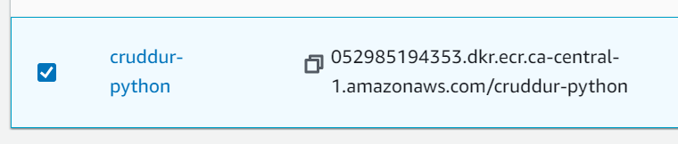

# Week 6/7 — Serverless Containers


## Week 6/7 instructors

- Andrew Brown [@andrewbrown](https://twitter.com/andrewbrown) (AWS Hero)
- Shala Warner [@GiftedLane](https://twitter.com/GiftedLane) (Student Advocate)

## Class Summary

- Deploy an ECS Cluster using ECS Service Connect
- Deploy serverless containers using Fargate for the Backend and Frontend Application
- Route traffic to the frontend and backend on different subdomains using Application Load Balancer
- Securing our flask container
- Creating several bash utility scripts to easily work with serverless containers.

## Todo Checklist

### Watch ECS Security by Ashish

https://www.youtube.com/watch?v=zz2FQAk1I28&list=PLBfufR7vyJJ7k25byhRXJldB5AiwgNnWv&index=57

### Watch Fargate Technical Questions with Maish


### Provision ECS Cluster

https://www.youtube.com/watch?v=QIZx2NhdCMI&list=PLBfufR7vyJJ7k25byhRXJldB5AiwgNnWv&index=58


#### Fargate pricing information

AWS Fargate pricing - https://aws.amazon.com/fargate/pricing/

ChatGPT query:

```
using the information below, calculate the cost of running two containers with the lowest memory and compute on ECS Fargate

per vCPU per hour	$0.013368
per GB per hour	$0.0014595

project the cost for 10 hours, 20 hours, 40 hours, 730 hours

format it on a table
```

Response

```
Using the information provided, I can estimate the cost of running two containers with the lowest memory and compute on ECS Fargate.

Assuming the lowest memory and compute for a container is 0.25GB and 0.25 vCPU respectively, the cost for running one container per hour would be:

CPU cost: 0.25 vCPU x $0.013368 per vCPU per hour = $0.003342 per hour
Memory cost: 0.25 GB x $0.0014595 per GB per hour = $0.000364875 per hour
Total cost: $0.003342 + $0.000364875 = $0.003706875 per hour
Therefore, the cost of running two containers with the lowest memory and compute on ECS Fargate for one hour would be:

Total cost: 2 x $0.003706875 = $0.00741375 per hour
Keep in mind that this is just an estimate, and other factors such as the region and duration of the containers could impact the final cost.

Here's a table with the projected costs for running two containers with the lowest memory and compute on ECS Fargate for different durations:

Duration (hours)	Cost ($)
10	0.0741375
20	0.148275
40	0.29655
730	5.4052875
Again, these are just estimates and the actual costs may vary depending on various factors.
```

We are going to run it and then shut it down, so we are not going to consume too much credit

#### Week 6 instructions

We are going to follow instructions from this page: https://github.com/omenking/aws-bootcamp-cruddur-2023/blob/week-6-fargate/journal/week6.md

#### Implement db test script

First, we are going to implement a bash script for testing db connection from the container

`backend-flask/bin/db/test`

```py
#!/usr/bin/env python3

import psycopg
import os
import sys

connection_url = os.getenv("CONNECTION_URL")

conn = None
try:
  print('attempting connection')
  conn = psycopg.connect(connection_url)
  print("Connection successful!")
except psycopg.Error as e:
  print("Unable to connect to the database:", e)
finally:
  conn.close()
```

> We need to set execute permissions on this script to be able to execute it

> Script uses CONNECTION_URL for local db, and it needs to be replaced with PROD_CONNECTION_URL for AWS RDS instance

Let's test it with the local DB container

```sh
./bin/db/test
```

```
attempting connection
Connection successful!
```

#### Implement health check endpoint

We are going to implement a health-check endpoint in flask app

`app.py`

```py
# Health-check endpoint
@app.route('/api/health-check')
def health_check():
  return {'success': True}, 200
```

#### Implement bash script for health check

We are going to create a new script in `bin/flask/health-check` (and set execute permissions on it)

```py
#!/usr/bin/env python3

import urllib.request

try:
  response = urllib.request.urlopen('http://localhost:4567/api/health-check')
  if response.getcode() == 200:
    print("[OK] Flask server is running")
    exit(0) # success
  else:
    print("[BAD] Flask server is not running")
    exit(1) # false
# This for some reason is not capturing the error....
#except ConnectionRefusedError as e:
# so we'll just catch on all even though this is a bad practice
except Exception as e:
  print(e)
  exit(1) # false
```

If we run it with backend container not running:


However, if we start backend container and run it again:


#### Create CloudWatch log group

We will need to create a new log group called cruddur

```sh
aws logs create-log-group --log-group-name "/cruddur/fargate-cluster"
aws logs put-retention-policy --log-group-name "/cruddur/fargate-cluster" --retention-in-days 1
```

We are going to create the log group using Cloud Shell


And now we can check it in AWS console


#### Create ECS cluster

> CloudScape Design System = https://cloudscape.design/

We will create the ECS (Elastic Container Service) using AWS CLI, but these are the options for creating an ECS cluster using the UI

- Cluster Name


- Networking


- Infrastructure (Fargate is always enabled)


- Monitoring


Creating an ECS cluster using the CLI is a lot easier

```sh
aws ecs create-cluster \
--cluster-name cruddur \
--service-connect-defaults namespace=cruddur
```

> https://docs.aws.amazon.com/cli/latest/reference/ecs/create-cluster.html

> --service-connect-defaults: Use this parameter to set a default Service Connect namespace. After you set a default Service Connect namespace, any new services with Service Connect turned on that are created in the cluster are added as client services in the namespace. This setting only applies to new services that set the enabled parameter to true in the ServiceConnectConfiguration . You can set the namespace of each service individually in the ServiceConnectConfiguration to override this default parameter.

> The created namespaces are included in AWS Cloud Map

Result
```json
{
    "cluster": {
        "clusterArn": "arn:aws:ecs:ca-central-1:052985194353:cluster/cruddur",
        "clusterName": "cruddur",
        "status": "PROVISIONING",
        "registeredContainerInstancesCount": 0,
        "runningTasksCount": 0,
        "pendingTasksCount": 0,
        "activeServicesCount": 0,
        "statistics": [],
        "tags": [],
        "settings": [
            {
                "name": "containerInsights",
                "value": "disabled"
            }
        ],
        "capacityProviders": [],
        "defaultCapacityProviderStrategy": [],
        "attachments": [
            {
                "id": "17d2afbd-9bf2-41a5-9072-de2ec6acecaf",
                "type": "sc",
                "status": "ATTACHING",
                "details": []
            }
        ],
        "attachmentsStatus": "UPDATE_IN_PROGRESS",
        "serviceConnectDefaults": {
            "namespace": "arn:aws:servicediscovery:ca-central-1:052985194353:namespace/ns-r6ttoc5oglocvdww"
        }
    }
}
```

Now we can inspect the created cluster in AWS console


> As there is no compute yet, it won't cost anything by now


### Create ECR repo and push image for backend-flask

https://www.youtube.com/watch?v=QIZx2NhdCMI&list=PLBfufR7vyJJ7k25byhRXJldB5AiwgNnWv&index=58


We will prepare our containers for deploying into AWS ECR (Elastic Container Registry)

https://ca-central-1.console.aws.amazon.com/ecr/home?region=ca-central-1

We can have public and private repos, but our repos should be private


> The prefix for the repository name is the Account ID plus the region in which the repository is hosted


> Tag immutability prevents images with the same tag to be overwritten in the repository if enabled (for our repositories we will leave it disabled)


> Scan on push allows scanning of each image on every repository push


> KMS encryption can be enabled for using AWS Key Management Service (KMS) instead of default encryption settings


We are not going to create the repos using AWS console. For this we are going to use AWS cli

First we are going to create the repo for python base image

If we check dockerfile for backend-flask, the referenced image is python:3.10-slim-buster

```dockerfile
FROM python:3.10-slim-buster
```

This image comes from Docker Hub, but we are going to create a copy from this image in ECR for having better availability

We are going to pull this image from Docker Hub and push it to ECR

This way Docker Hub won't be a point of failure

So first we are going to create the repository for hosting this new image

We will create this repository as MUTABLE for having more flexibility during development

```sh
aws ecr create-repository \
  --repository-name cruddur-python \
  --image-tag-mutability MUTABLE
```

Result

```
{
    "repository": {
        "repositoryArn": "arn:aws:ecr:ca-central-1:052985194353:repository/cruddur-python",
        "registryId": "052985194353",
        "repositoryName": "cruddur-python",
        "repositoryUri": "052985194353.dkr.ecr.ca-central-1.amazonaws.com/cruddur-python",
        "createdAt": "2023-04-12T00:23:35+00:00",
        "imageTagMutability": "MUTABLE",
        "imageScanningConfiguration": {
            "scanOnPush": false
        },
        "encryptionConfiguration": {
            "encryptionType": "AES256"
        }
    }
}
```

We can see the created repository in AWS console


By checking the repo and clicking on View push commands we can see the information for pushing images to it


The first thing to do before trying to push an image is executing docker login command

```sh
docker login --username AWS --password-stdin 052985194353.dkr.ecr.ca-central-1.amazonaws.com
```

We can use an improved version of this script for using environment variables for the account id and region

```sh
aws ecr get-login-password --region $AWS_DEFAULT_REGION | docker login --username AWS --password-stdin "$AWS_ACCOUNT_ID.dkr.ecr.$AWS_DEFAULT_REGION.amazonaws.com"
```

We already had AWS_DEFAULT_REGION environment variable already set, but we don't have AWS_ACCOUNT_ID, so we will need to set it

```sh
export AWS_ACCOUNT_ID="052985194353"
gp env AWS_ACCOUNT_ID="052985194353"
```

Now we can execute docker login command

```sh
aws ecr get-login-password --region $AWS_DEFAULT_REGION | docker login --username AWS --password-stdin "$AWS_ACCOUNT_ID.dkr.ecr.$AWS_DEFAULT_REGION.amazonaws.com"
```

Result

```
WARNING! Your password will be stored unencrypted in /home/gitpod/.docker/config.json.
Configure a credential helper to remove this warning. See
https://docs.docker.com/engine/reference/commandline/login/#credentials-store

Login Succeeded
```

Now we are ready for pushing the first image

But first we are going to set the url for the image to push, using the following script

```sh
export ECR_PYTHON_URL="$AWS_ACCOUNT_ID.dkr.ecr.$AWS_DEFAULT_REGION.amazonaws.com/cruddur-python"
echo $ECR_PYTHON_URL
```

Result

```
052985194353.dkr.ecr.ca-central-1.amazonaws.com/cruddur-python
```

This value should match the repository URI configured in AWS



Then we need to pull python base image, using this command

```sh
docker pull python:3.10-slim-buster
```

Result

```
3.10-slim-buster: Pulling from library/python
3689b8de819b: Pull complete 
af8cd5f36469: Pull complete 
74adefb035bf: Pull complete 
7d3f13b19e92: Pull complete 
ee5147252e65: Pull complete 
Digest: sha256:7d6283c08f546bb7f97f8660b272dbab02e1e9bffca4fa9bc96720b0efd29d8e
Status: Downloaded newer image for python:3.10-slim-buster
docker.io/library/python:3.10-slim-buster
```

> Check different in python versions (container image uses 3.10, but local environment uses 3.11.1, using python --version to check it)

By executing this command we can check what images are pulled

```sh
docker images
```

```
REPOSITORY   TAG                IMAGE ID       CREATED      SIZE
python       3.10-slim-buster   fed2d83e68b8   6 days ago   118MB
```

Now we are going to tag the local image

```sh
docker tag python:3.10-slim-buster $ECR_PYTHON_URL:3.10-slim-buster
```

Now, if we run docker images again, we can check the new image

```
REPOSITORY                                                       TAG                IMAGE ID       CREATED      SIZE
052985194353.dkr.ecr.ca-central-1.amazonaws.com/cruddur-python   3.10-slim-buster   fed2d83e68b8   6 days ago   118MB
python                                                           3.10-slim-buster   fed2d83e68b8   6 days ago   118MB
```

Finally, we can push it to our private repository

```sh
docker push $ECR_PYTHON_URL:3.10-slim-buster
```

```
The push refers to repository [052985194353.dkr.ecr.ca-central-1.amazonaws.com/cruddur-python]
22b724a51445: Pushed 
3f754cda2c06: Pushed 
bad0f387d7df: Pushed 
d1a969d0e2e5: Pushed 
c9182c130984: Pushed 
3.10-slim-buster: digest: sha256:771e8917f624cf7d17a11e2e12eadc6c20ad647f34536efd51cd29fb32e80609 size: 1370
```

We can inspect the pushed image in ECR 


Now, as the base image is already pushed, we can update flask docker file to reference the new image instead of the Docker Hub one

```dockerfile
FROM python:3.10-slim-buster
```

```dockerfile
FROM 052985194353.dkr.ecr.ca-central-1.amazonaws.com/cruddur-python:3.10-slim-buster
```

For testing the change we can execute a docker compose up so the image is built, pulling the new image from ECR if it works

```sh
docker compose  -f "docker-compose.yml" up -d --build backend-flask db xray-daemon 
```

```
 ✔ Network aws-bootcamp-cruddur-2023_default            Created                                                 0.1s 
 ✔ Volume "aws-bootcamp-cruddur-2023_db"                Created                                                 0.0s 
 ✔ Container aws-bootcamp-cruddur-2023-xray-daemon-1    Started                                                 0.7s 
 ✔ Container aws-bootcamp-cruddur-2023-backend-flask-1  Started                                                 0.7s 
 ✔ Container aws-bootcamp-cruddur-2023-db-1             Started 
 ```

 By browsing the health check url we can check if the backend is running


So the image is right and it's ready to be pushed

But first a change in docker file

```dockerfile
ENV FLASK_ENV=development
```

```
ENV FLASK_DEBUG=1
```

We need to create a new repo, now for hosting backend image

```sh
aws ecr create-repository \
  --repository-name backend-flask \
  --image-tag-mutability MUTABLE
```

```
{
    "repository": {
        "repositoryArn": "arn:aws:ecr:ca-central-1:052985194353:repository/backend-flask",
        "registryId": "052985194353",
        "repositoryName": "backend-flask",
        "repositoryUri": "052985194353.dkr.ecr.ca-central-1.amazonaws.com/backend-flask",
        "createdAt": "2023-04-12T01:03:10+00:00",
        "imageTagMutability": "MUTABLE",
        "imageScanningConfiguration": {
            "scanOnPush": false
        },
        "encryptionConfiguration": {
            "encryptionType": "AES256"
        }
    }
}
```

Then we need to set the URL

```sh
export ECR_BACKEND_FLASK_URL="$AWS_ACCOUNT_ID.dkr.ecr.$AWS_DEFAULT_REGION.amazonaws.com/backend-flask"
echo $ECR_BACKEND_FLASK_URL
```

```
052985194353.dkr.ecr.ca-central-1.amazonaws.com/backend-flask
```

Now we need to build the image (inside backend-flask folder)

```sh
docker build -t backend-flask .
```

```
DEPRECATED: The legacy builder is deprecated and will be removed in a future release.
            Install the buildx component to build images with BuildKit:
            https://docs.docker.com/go/buildx/

Sending build context to Docker daemon  176.6kB
Step 1/8 : FROM 052985194353.dkr.ecr.ca-central-1.amazonaws.com/cruddur-python:3.10-slim-buster
 ---> fed2d83e68b8
Step 2/8 : WORKDIR /backend-flask
 ---> Running in 9ce6f912bd86
Removing intermediate container 9ce6f912bd86
 ---> c1df10c713aa
Step 3/8 : COPY requirements.txt requirements.txt
 ---> 7e9cfc368c4d
Step 4/8 : RUN pip3 install -r requirements.txt
 ---> Running in 2bd0a360e5ce
Collecting flask
  Downloading Flask-2.2.3-py3-none-any.whl (101 kB)
     ━━━━━━━━━━━━━━━━━━━━━━━━━━━━━━━━━━━━━━━ 101.8/101.8 kB 5.2 MB/s eta 0:00:00
Collecting flask-cors
  Downloading Flask_Cors-3.0.10-py2.py3-none-any.whl (14 kB)
Collecting opentelemetry-api
  Downloading opentelemetry_api-1.17.0-py3-none-any.whl (57 kB)
     ━━━━━━━━━━━━━━━━━━━━━━━━━━━━━━━━━━━━━━━━ 57.3/57.3 kB 16.4 MB/s eta 0:00:00
Collecting opentelemetry-sdk
  Downloading opentelemetry_sdk-1.17.0-py3-none-any.whl (100 kB)
     ━━━━━━━━━━━━━━━━━━━━━━━━━━━━━━━━━━━━━━ 100.0/100.0 kB 35.8 MB/s eta 0:00:00
Collecting opentelemetry-exporter-otlp-proto-http
  Downloading opentelemetry_exporter_otlp_proto_http-1.17.0-py3-none-any.whl (21 kB)
Collecting opentelemetry-instrumentation-flask
  Downloading opentelemetry_instrumentation_flask-0.38b0-py3-none-any.whl (13 kB)
Collecting opentelemetry-instrumentation-requests
  Downloading opentelemetry_instrumentation_requests-0.38b0-py3-none-any.whl (11 kB)
Collecting aws-xray-sdk
  Downloading aws_xray_sdk-2.12.0-py2.py3-none-any.whl (102 kB)
     ━━━━━━━━━━━━━━━━━━━━━━━━━━━━━━━━━━━━━━ 102.5/102.5 kB 35.3 MB/s eta 0:00:00
Collecting watchtower
  Downloading watchtower-3.0.1-py3-none-any.whl (17 kB)
Collecting blinker
  Downloading blinker-1.6.1-py3-none-any.whl (13 kB)
Collecting rollbar
  Downloading rollbar-0.16.3-py3-none-any.whl (98 kB)
     ━━━━━━━━━━━━━━━━━━━━━━━━━━━━━━━━━━━━━━━━ 98.1/98.1 kB 38.1 MB/s eta 0:00:00
Collecting Flask-AWSCognito
  Downloading Flask_AWSCognito-1.3-py3-none-any.whl (12 kB)
Collecting psycopg[binary]
  Downloading psycopg-3.1.8-py3-none-any.whl (167 kB)
     ━━━━━━━━━━━━━━━━━━━━━━━━━━━━━━━━━━━━━━ 167.4/167.4 kB 31.6 MB/s eta 0:00:00
Collecting boto3
  Downloading boto3-1.26.111-py3-none-any.whl (135 kB)
     ━━━━━━━━━━━━━━━━━━━━━━━━━━━━━━━━━━━━━━ 135.6/135.6 kB 43.7 MB/s eta 0:00:00
Collecting Werkzeug>=2.2.2
  Downloading Werkzeug-2.2.3-py3-none-any.whl (233 kB)
     ━━━━━━━━━━━━━━━━━━━━━━━━━━━━━━━━━━━━━━ 233.6/233.6 kB 68.0 MB/s eta 0:00:00
Collecting itsdangerous>=2.0
  Downloading itsdangerous-2.1.2-py3-none-any.whl (15 kB)
Collecting click>=8.0
  Downloading click-8.1.3-py3-none-any.whl (96 kB)
     ━━━━━━━━━━━━━━━━━━━━━━━━━━━━━━━━━━━━━━━━ 96.6/96.6 kB 19.5 MB/s eta 0:00:00
Collecting Jinja2>=3.0
  Downloading Jinja2-3.1.2-py3-none-any.whl (133 kB)
     ━━━━━━━━━━━━━━━━━━━━━━━━━━━━━━━━━━━━━━ 133.1/133.1 kB 49.3 MB/s eta 0:00:00
Collecting Six
  Downloading six-1.16.0-py2.py3-none-any.whl (11 kB)
Collecting importlib-metadata~=6.0.0
  Downloading importlib_metadata-6.0.1-py3-none-any.whl (21 kB)
Collecting deprecated>=1.2.6
  Downloading Deprecated-1.2.13-py2.py3-none-any.whl (9.6 kB)
Requirement already satisfied: setuptools>=16.0 in /usr/local/lib/python3.10/site-packages (from opentelemetry-api->-r requirements.txt (line 4)) (65.5.1)
Collecting typing-extensions>=3.7.4
  Downloading typing_extensions-4.5.0-py3-none-any.whl (27 kB)
Collecting opentelemetry-semantic-conventions==0.38b0
  Downloading opentelemetry_semantic_conventions-0.38b0-py3-none-any.whl (26 kB)
Collecting googleapis-common-protos~=1.52
  Downloading googleapis_common_protos-1.59.0-py2.py3-none-any.whl (223 kB)
     ━━━━━━━━━━━━━━━━━━━━━━━━━━━━━━━━━━━━━━ 223.6/223.6 kB 66.5 MB/s eta 0:00:00
Collecting requests~=2.7
  Downloading requests-2.28.2-py3-none-any.whl (62 kB)
     ━━━━━━━━━━━━━━━━━━━━━━━━━━━━━━━━━━━━━━━━ 62.8/62.8 kB 10.4 MB/s eta 0:00:00
Collecting opentelemetry-proto==1.17.0
  Downloading opentelemetry_proto-1.17.0-py3-none-any.whl (52 kB)
     ━━━━━━━━━━━━━━━━━━━━━━━━━━━━━━━━━━━━━━━━ 52.6/52.6 kB 21.2 MB/s eta 0:00:00
Collecting backoff<3.0.0,>=1.10.0
  Downloading backoff-2.2.1-py3-none-any.whl (15 kB)
Collecting protobuf<5.0,>=3.19
  Downloading protobuf-4.22.1-cp37-abi3-manylinux2014_x86_64.whl (302 kB)
     ━━━━━━━━━━━━━━━━━━━━━━━━━━━━━━━━━━━━━━ 302.4/302.4 kB 74.3 MB/s eta 0:00:00
Collecting opentelemetry-instrumentation==0.38b0
  Downloading opentelemetry_instrumentation-0.38b0-py3-none-any.whl (24 kB)
Collecting opentelemetry-util-http==0.38b0
  Downloading opentelemetry_util_http-0.38b0-py3-none-any.whl (6.7 kB)
Collecting opentelemetry-instrumentation-wsgi==0.38b0
  Downloading opentelemetry_instrumentation_wsgi-0.38b0-py3-none-any.whl (12 kB)
Collecting wrapt<2.0.0,>=1.0.0
  Downloading wrapt-1.15.0-cp310-cp310-manylinux_2_5_x86_64.manylinux1_x86_64.manylinux_2_17_x86_64.manylinux2014_x86_64.whl (78 kB)
     ━━━━━━━━━━━━━━━━━━━━━━━━━━━━━━━━━━━━━━━━ 78.4/78.4 kB 16.2 MB/s eta 0:00:00
Collecting botocore>=1.11.3
  Downloading botocore-1.29.111-py3-none-any.whl (10.6 MB)
     ━━━━━━━━━━━━━━━━━━━━━━━━━━━━━━━━━━━━━━━ 10.6/10.6 MB 117.4 MB/s eta 0:00:00
Collecting python-jose
  Downloading python_jose-3.3.0-py2.py3-none-any.whl (33 kB)
Collecting psycopg-binary<=3.1.8,>=3.1.6
  Downloading psycopg_binary-3.1.8-cp310-cp310-manylinux_2_17_x86_64.manylinux2014_x86_64.whl (3.3 MB)
     ━━━━━━━━━━━━━━━━━━━━━━━━━━━━━━━━━━━━━━━━ 3.3/3.3 MB 129.5 MB/s eta 0:00:00
Collecting psycopg-pool
  Downloading psycopg_pool-3.1.7-py3-none-any.whl (30 kB)
Collecting s3transfer<0.7.0,>=0.6.0
  Downloading s3transfer-0.6.0-py3-none-any.whl (79 kB)
     ━━━━━━━━━━━━━━━━━━━━━━━━━━━━━━━━━━━━━━━━ 79.6/79.6 kB 33.6 MB/s eta 0:00:00
Collecting jmespath<2.0.0,>=0.7.1
  Downloading jmespath-1.0.1-py3-none-any.whl (20 kB)
Collecting urllib3<1.27,>=1.25.4
  Downloading urllib3-1.26.15-py2.py3-none-any.whl (140 kB)
     ━━━━━━━━━━━━━━━━━━━━━━━━━━━━━━━━━━━━━━ 140.9/140.9 kB 50.1 MB/s eta 0:00:00
Collecting python-dateutil<3.0.0,>=2.1
  Downloading python_dateutil-2.8.2-py2.py3-none-any.whl (247 kB)
     ━━━━━━━━━━━━━━━━━━━━━━━━━━━━━━━━━━━━━━ 247.7/247.7 kB 53.4 MB/s eta 0:00:00
Collecting zipp>=0.5
  Downloading zipp-3.15.0-py3-none-any.whl (6.8 kB)
Collecting MarkupSafe>=2.0
  Downloading MarkupSafe-2.1.2-cp310-cp310-manylinux_2_17_x86_64.manylinux2014_x86_64.whl (25 kB)
Collecting idna<4,>=2.5
  Downloading idna-3.4-py3-none-any.whl (61 kB)
     ━━━━━━━━━━━━━━━━━━━━━━━━━━━━━━━━━━━━━━━━ 61.5/61.5 kB 23.8 MB/s eta 0:00:00
Collecting certifi>=2017.4.17
  Downloading certifi-2022.12.7-py3-none-any.whl (155 kB)
     ━━━━━━━━━━━━━━━━━━━━━━━━━━━━━━━━━━━━━━ 155.3/155.3 kB 55.3 MB/s eta 0:00:00
Collecting charset-normalizer<4,>=2
  Downloading charset_normalizer-3.1.0-cp310-cp310-manylinux_2_17_x86_64.manylinux2014_x86_64.whl (199 kB)
     ━━━━━━━━━━━━━━━━━━━━━━━━━━━━━━━━━━━━━━ 199.3/199.3 kB 51.8 MB/s eta 0:00:00
Collecting pyasn1
  Downloading pyasn1-0.4.8-py2.py3-none-any.whl (77 kB)
     ━━━━━━━━━━━━━━━━━━━━━━━━━━━━━━━━━━━━━━━━ 77.1/77.1 kB 31.3 MB/s eta 0:00:00
Collecting ecdsa!=0.15
  Downloading ecdsa-0.18.0-py2.py3-none-any.whl (142 kB)
     ━━━━━━━━━━━━━━━━━━━━━━━━━━━━━━━━━━━━━━ 142.9/142.9 kB 56.3 MB/s eta 0:00:00
Collecting rsa
  Downloading rsa-4.9-py3-none-any.whl (34 kB)
Installing collected packages: pyasn1, zipp, wrapt, urllib3, typing-extensions, Six, rsa, psycopg-binary, protobuf, opentelemetry-util-http, opentelemetry-semantic-conventions, MarkupSafe, jmespath, itsdangerous, idna, click, charset-normalizer, certifi, backoff, Werkzeug, requests, python-dateutil, psycopg-pool, psycopg, opentelemetry-proto, Jinja2, importlib-metadata, googleapis-common-protos, ecdsa, deprecated, blinker, rollbar, python-jose, opentelemetry-api, flask, botocore, s3transfer, opentelemetry-sdk, opentelemetry-instrumentation, flask-cors, Flask-AWSCognito, aws-xray-sdk, opentelemetry-instrumentation-wsgi, opentelemetry-instrumentation-requests, opentelemetry-exporter-otlp-proto-http, boto3, watchtower, opentelemetry-instrumentation-flask
Successfully installed Flask-AWSCognito-1.3 Jinja2-3.1.2 MarkupSafe-2.1.2 Six-1.16.0 Werkzeug-2.2.3 aws-xray-sdk-2.12.0 backoff-2.2.1 blinker-1.6.1 boto3-1.26.111 botocore-1.29.111 certifi-2022.12.7 charset-normalizer-3.1.0 click-8.1.3 deprecated-1.2.13 ecdsa-0.18.0 flask-2.2.3 flask-cors-3.0.10 googleapis-common-protos-1.59.0 idna-3.4 importlib-metadata-6.0.1 itsdangerous-2.1.2 jmespath-1.0.1 opentelemetry-api-1.17.0 opentelemetry-exporter-otlp-proto-http-1.17.0 opentelemetry-instrumentation-0.38b0 opentelemetry-instrumentation-flask-0.38b0 opentelemetry-instrumentation-requests-0.38b0 opentelemetry-instrumentation-wsgi-0.38b0 opentelemetry-proto-1.17.0 opentelemetry-sdk-1.17.0 opentelemetry-semantic-conventions-0.38b0 opentelemetry-util-http-0.38b0 protobuf-4.22.1 psycopg-3.1.8 psycopg-binary-3.1.8 psycopg-pool-3.1.7 pyasn1-0.4.8 python-dateutil-2.8.2 python-jose-3.3.0 requests-2.28.2 rollbar-0.16.3 rsa-4.9 s3transfer-0.6.0 typing-extensions-4.5.0 urllib3-1.26.15 watchtower-3.0.1 wrapt-1.15.0 zipp-3.15.0
WARNING: Running pip as the 'root' user can result in broken permissions and conflicting behaviour with the system package manager. It is recommended to use a virtual environment instead: https://pip.pypa.io/warnings/venv
Removing intermediate container 2bd0a360e5ce
 ---> 35844597df04
Step 5/8 : COPY . .
 ---> 5beff4b55b69
Step 6/8 : ENV FLASK_DEBUG=1
 ---> Running in 3ae0d0ccd99d
Removing intermediate container 3ae0d0ccd99d
 ---> 38db8fa3d8c0
Step 7/8 : EXPOSE ${PORT}
 ---> Running in a329505c7d4e
Removing intermediate container a329505c7d4e
 ---> 5e0032d2244b
Step 8/8 : CMD [ "python3", "-m" , "flask", "run", "--host=0.0.0.0", "--port=4567"]
 ---> Running in 423486a9680c
Removing intermediate container 423486a9680c
 ---> 9daf6bd78ee8
Successfully built 9daf6bd78ee8
Successfully tagged backend-flask:latest
```

After building the image we are going to tag it

```sh
docker tag backend-flask:latest $ECR_BACKEND_FLASK_URL:latest
```

> For tag we are going to use latest, because Fargate always deploys latest tag from an image

And finally we are going to push it

```sh
docker push $ECR_BACKEND_FLASK_URL:latest
```

```
The push refers to repository [052985194353.dkr.ecr.ca-central-1.amazonaws.com/backend-flask]
2fcbbf745258: Pushed 
876301314843: Pushed 
88169bb6c485: Pushed 
4c3d4a197a91: Pushed 
22b724a51445: Pushed 
3f754cda2c06: Pushed 
bad0f387d7df: Pushed 
d1a969d0e2e5: Pushed 
c9182c130984: Pushed 
latest: digest: sha256:d5c008e16bc78c888a7d6b721e48c8583b3c4f3d3036354e8712df883c999beb size: 2205
```

Again, this image can be checked in ECR console


